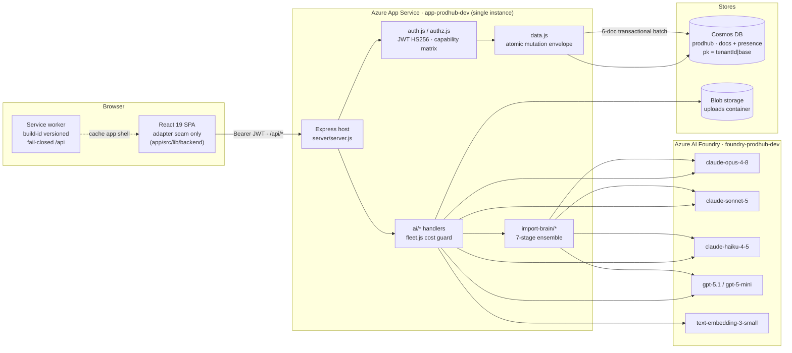
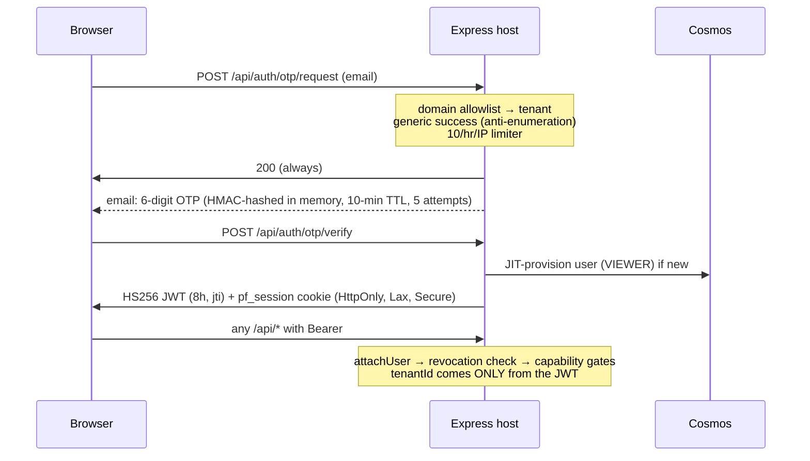
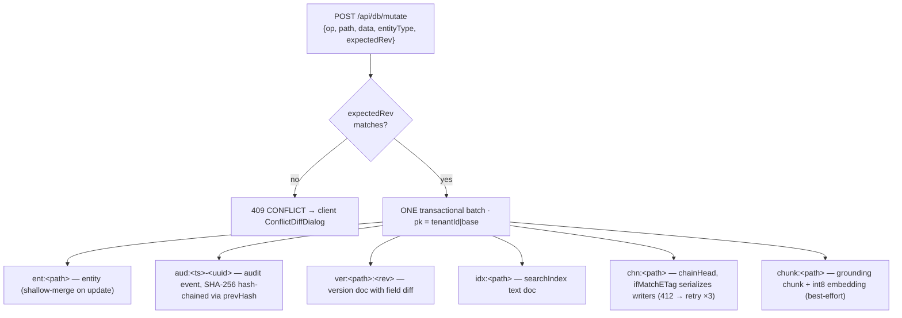
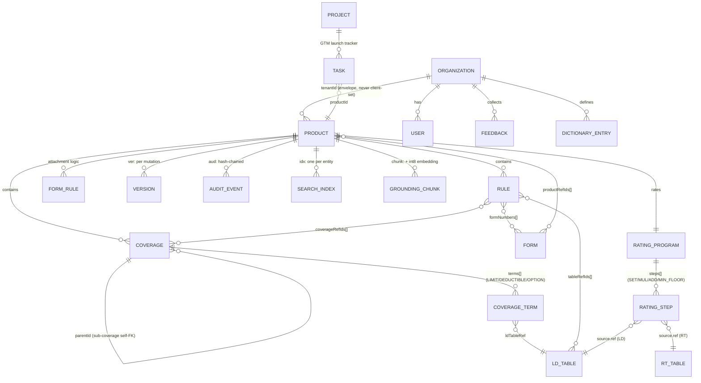
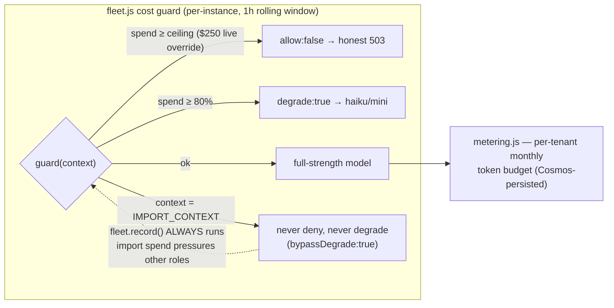
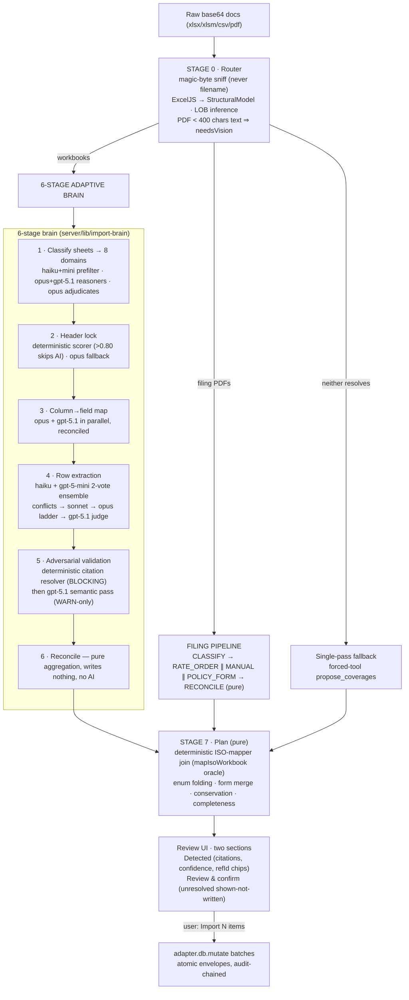

# Product Reinvention Hub — Full Platform Review

**Technical Dossier · 2026-07-15**

A complete extraction of the codebase, architecture, AI ensemble, data model, security posture, and UI/UX system — written for a coding agent with **zero prior context**. Every claim carries a `file:line` reference into the repo at `314358_InsurancePlatformsAI`.

| Metric | Value |
|---|---|
| Tracked files | 934 |
| Workspaces | 4 (`app/`, `server/`, `shared/`, `functions/`) |
| Foundry deployments | 9 |
| AI model roles | 6 |
| Insurance lines | 5 (PH/PA/GL/IM/PR) |
| HO-3 canary | $1,528 |
| Reclaimable bloat | ~120 MB |

---

## Table of contents

1. [Executive summary](#1--executive-summary)
2. [System architecture](#2--system-architecture)
3. [Environment & infrastructure](#3--environment--infrastructure)
4. [Backend & API surface](#4--backend--api-surface)
5. [Data architecture](#5--data-architecture)
6. [Rating engine & canaries](#6--rating-engine--canaries)
7. [AI fleet & Foundry models](#7--ai-fleet--foundry-models)
8. [The import brain — ingestion flow & architecture](#8--the-import-brain--ingestion-flow--architecture)
9. [Frontend & design system](#9--frontend--design-system)
10. [Twelve areas of improvement (each with three reasons)](#10--twelve-areas-of-improvement--each-with-three-reasons)
11. [Enhancing the intelligent import brain](#11--enhancing-the-intelligent-import-brain)
12. [Security review](#12--security-review)
13. [Performance & robustness](#13--performance--robustness)
14. [Ten UI/UX improvements](#14--ten-uiux-improvements)
15. [Data & solution architecture — and its improvements](#15--data--solution-architecture--and-its-improvements)
16. [Bloat inventory — starting clean](#16--bloat-inventory--starting-clean)
17. [Additional findings](#17--additional-findings)
18. [Notes for a coding agent picking this up cold](#18--notes-for-a-coding-agent-picking-this-up-cold)

---

## 1 · Executive summary

**What this is:** a multi-tenant insurance *product-definition platform* ("Product Reinvention Hub") for P&C carriers. Product managers define insurance products (coverages, forms, rules, rating algorithms) across 5 lines of business (Personal Home, Personal Auto, General Liability, Inland Marine, Commercial Property), rate policies through a deterministic evaluator, ingest carrier documents (Excel product specs, rate-filing PDFs) through a multi-model AI "import brain", generate regulatory (SERFF) filings, and run grounded AI copilots over the whole portfolio.

**Shape:** pnpm monorepo — `app/` (React 19 / Vite 8 SPA), `server/` (Express host on Azure App Service: Cosmos DB + Azure AI Foundry + Blob), `shared/` (pure TypeScript domain: types, rating engine, seed data, AI fleet registry — bundled into the server as committed `.cjs` bridges), `functions/` (retired Firebase implementation, reference-only, **not deployed** but still wired into the test gate).

**Overall health:** the architecture is unusually disciplined for its size — a single adapter seam in the client, atomic Cosmos transactional envelopes with a tamper-evident audit hash-chain, capability-based two-plane authorization, a fully deterministic rating engine locked by premium canaries, and a genuinely sophisticated cross-vendor AI ensemble with cost governance. The weak points are *operational*, not architectural: live credentials in plaintext working-tree files, plaintext password storage, no HTTP security headers, all rate-limit/spend state in per-process memory (hard single-instance ceiling), unbounded version/audit growth, a seed-vs-runtime dual-write drift in the RAG chunk store, and ~120 MB of accumulated campaign bloat.

> **Top 5 actions if you only do five things:** ① rotate + delete the plaintext key files (`tmp_keys.md`, `model_secrets.md`, `tmp.md`); ② stop storing plaintext passwords in Cosmos; ③ add helmet/CSP/HSTS; ④ converge the grounding-chunk + searchIndex dual schemes; ⑤ execute the bloat purge in §16 (~88 MB deletable outright).

---

## 2 · System architecture

One origin serves everything. The browser only ever talks to same-origin `/api/*`; it never holds a data-store or model credential. A push to `main` triggers the Azure DevOps pipeline (`azure-pipelines.yml`): build the Vite SPA, assemble the Express host, deploy to App Service `app-prodhub-dev`.

### Load-bearing invariants (from CLAUDE.md — break these and the PR is blocked)

| Invariant | Enforced where |
|---|---|
| **Adapter seam** — all app I/O via `adapter`; no platform SDK in components | `app/src/lib/backend/index.ts`; invariant tests in `app/src/__invariants__/` |
| **Atomic mutations** — every write is one Cosmos transactional batch (entity + audit + version + searchIndex + chainHead + chunk) | `server/lib/data.js:276-292` |
| **Role enforcement** — VIEWER read-only, server-side, always | `server/server.js:104-119` global write floor + `server/lib/authz.js` |
| **AI server-side only** — browser never calls a model API | All handlers under `server/lib/ai/` |
| **AI grounded + cited** — free invention is a bug | Citation verification `server/lib/ai/chat.js:81-94`; import grounding contract `server/lib/import-brain/prompts.js:5-9` |
| **refId / form-number chips never stripped** | `app/src/components/ui/RefChip.tsx` |
| **HO-3 $1,528 canary** (+ $1,002 PA, $2,635 GL, $1,281 filing-import) | `shared/src/rating/workedExample.canary.test.ts` |
| **Design tokens only** — no hex outside `app/src/index.css` | Tailwind v4 `@theme` tokens |
| **Model IDs pinned** — opus-4-8 / sonnet-5 / haiku-4-5; never `claude-fable-5` | `shared/src/ai/fleet.ts` + ADR-0001 |
| **Import no-cap** — import path never budget-denied/degraded; telemetry never bypassed | `server/lib/fleet.js:65-99` (`IMPORT_CONTEXT`) |

---

## 3 · Environment & infrastructure

### Local dev
- **OS:** Windows 11 Enterprise · **Node:** v24.12.0 installed (repo targets ≥20; Node-24 causes two known cosmetic test artifacts) · **pnpm:** 11.9.0
- **Gate:** `pnpm typecheck && pnpm lint && pnpm test && pnpm build`
- **Dev server:** `pnpm dev` (Vite) → points at an `/api` host via `VITE_API_BASE` or dev proxy `VITE_DEV_PROXY_TARGET`

### Azure resources (subscription: BoA-GenerativeAI-Sandbox)
- **Resource group:** rg-prodhub-dev
- **App Service:** app-prodhub-dev (SPA + API, auto-deploy from `main` via ADO)
- **Cosmos:** cosmos-prodhub-dev-1r99 · db `prodhub` · containers `docs` (pk `/pk`) + `presence` (pk `/pid`) · serverless
- **AI:** foundry-prodhub-dev (Cognitive Services) · **Blob:** `uploads` container · **Key Vault:** kv-prodhub-dev-1r99

### App Service configuration (live, names only)
Active settings: `COSMOS_ENDPOINT/KEY/DB`, `AUTH_JWT_SECRET`, `AZURE_FOUNDRY_ENDPOINT/KEY/DEPLOYMENT/API_VERSION`, `AZURE_BLOB_CONNECTION/CONTAINER`, `BOOTSTRAP_USERS_ENABLED` + `BOOTSTRAP_ADMIN_PASSWORD` / `BOOTSTRAP_SAL_PASSWORD`, `AI_SPEND_CEILING_USD` (set to **250**, 10× the code default of 25), `NODE_ENV`, Oryx/SCM build flags.

> ⚠️ **Stale legacy settings still deployed:** 12 `REACT_APP_*` settings (including `REACT_APP_COSMOS_KEY` and `REACT_APP_OPENAI_API_KEY` pointing at the *retired legacy* Cosmos account) remain in App Service configuration. Nothing in the current server reads any `REACT_APP_*` variable. They are dead credential surface — delete them and rotate anything they expose.

### CI/CD
- **Pipeline:** Azure DevOps `azure-pipelines.yml`; push to `main` → build + deploy. Merge workflow: merge to local `main`, push to ADO remote.
- **Secret gate:** gitleaks runs on a *shallow clone* (tip-tree only), config auto-discovered at `.gitleaks.toml` — fixes need only clean the current tree.
- **Build stamping:** `app/vite.config.ts:16-26` derives `__BUILD_ID__` from the git commit, writes `dist/version.json`, stamps `sw.js` — drives the PWA cache-eviction + VersionWatcher reload toast.

---

## 4 · Backend & API surface

Package `prodhub-azure-host` — Express + `@azure/cosmos` + `@azure/storage-blob` + exceljs + nodemailer. Deliberately minimal dependency tree; JWT is hand-rolled (correctly — HMAC recomputed, `alg` header ignored, timing-safe compare, `exp` enforced at `server/lib/auth.js:119-128`).

### Global middleware gauntlet (every `/api/*` request, in order)
1. `attachUser` — Bearer or `pf_session` cookie → `req.user`; JWT revocation check (jti denylist in Cosmos, 5-min cache).
2. Per-tenant AI token metering (AsyncLocalStorage-threaded).
3. **Auth + write floor** (`server.js:104-119`): non-public routes require a user (401); every non-GET requires `product:write` unless whitelisted. Default-deny.
4. **Per-tenant token bucket** (`server.js:126-144`): 120 burst / 2 rps sustained on AI, filing, and mutate paths → 429.
5. **Feature-flag enforcement**: path→flag map, 403 `feature_disabled`, fail-open; import deliberately not flag-gated.

### Authorization: two-plane capability model
`server/lib/authz.js:41-65` — capabilities, not ranks, are authoritative. **Tenant plane:** VIEWER and 5 inquiry personas (UNDERWRITING/COMPLIANCE/CLAIMS/ACTUARIAL/ANALYST) get `product:read + ai:invoke`; EDITOR adds `product:write, filing:generate, changeset:approve`; TENANT_ADMIN adds `member:manage, role:assign, audit:read`. **Consumer plane:** POLICYHOLDER holds only `portal:read/upload` — structurally cannot reach `/api/db`. **Platform plane:** SUPPORT (read + impersonate, no writes), SUPER_ADMIN (all, incl. cross-tenant `X-Tenant-Id` break-glass — correctly restricted at `auth.js:486-489`). Impersonation mints a 1-hour token carrying the *target's* tenant role with dual attribution in every audit actor; platform targets are refused.

### Identity flow

### Complete API surface (~60 routes)

| Area | Routes | Guard |
|---|---|---|
| Auth | `GET /api/health` · `POST /api/auth/otp/request\|otp/verify\|bootstrap\|logout\|change-password` · `GET /api/auth/tenants\|me` | public + per-IP limiters (login 10/hr, tenants 60/hr); me/change-password require auth |
| Data | `GET /api/db/get\|versions\|audit\|audit/verify` · `POST /api/db/list\|mutate\|mutateBatch\|vote\|setNewsPins\|presence/join\|presence/watch` | `product:read` / `product:write`; audit needs `audit:read` (+`PROBE_MODE=1` for raw) |
| AI | `POST /api/ai/:name` → chat, summarizeProduct, unifiedImport, unifiedImportResult, scaffoldProduct, draftRule, analyzeClaim, proposeMapping, shapeFeedback, refreshNews, taskSummary, formRiskReport, identifyBaseForm, reindexProduct | `ai:invoke` + tenant; monthly token budget (import exempt); unifiedImport/reindexProduct also need `product:write` |
| Platform admin | `/api/admin/*` — tenants CRUD/summary/export/telemetry/config/offboard, global config, users CRUD, audit search, impersonate, ops-copilot | `requirePlatform` + per-capability (`platform:tenants/users/audit/impersonate`) |
| Tenant admin | `/api/tenant-admin/*` — members CRUD, role change, disable, audit, flags | `member:manage` + same-tenant |
| Filing / SERFF | `POST /api/filing/generate`, `GET /api/filing[/:id]` · `POST /api/serff/v1/bundle`, `GET /api/serff/v1/states` | `filing:generate` / EDITOR |
| Storage | `POST /api/storage/upload` (EDITOR, 15 MB cap, content-type allowlist) · `GET /api/storage/url` · `GET /api/news/image/:hash` | EDITOR / auth |
| Portal | `/api/portal/me\|upload\|summary` — policyholder PDF → judged, sanitized HTML summary | `portal:*` caps only |
| HomeCheck | `/api/homecheck/v1/*` — guest consumer risk report + vision inventory (consent-gated, 24h TTL) | none — per-IP limited; **structurally zero portfolio access** (no cosmos/data/auth imports) |

### The atomic mutation envelope — the heart of the platform
Every entity write (`server/lib/data.js:222-292`) commits **six co-partitioned documents in one Cosmos transactional batch**. The client can never smuggle `tenantId`/`pk` — reserved envelope keys are stripped server-side and re-derived from the JWT.

The audit chain (`shared/src/audit/chain.ts`) is a per-entityPath hash chain: dependency-free pure-JS SHA-256 + canonical JSON so browser and server hash byte-identically; `GET /api/db/audit/verify` reconstructs chains and flags `hash_mismatch / link_broken / fork / orphaned / tail_missing`. Tail truncation is detectable because the `chainHead` anchor rides the same batch.

---

## 5 · Data architecture

### Entity-relationship model

**Governance mixins:** Every governed entity composes `GovernanceBlock` (status · lifecycle DRAFT→IN_REVIEW→APPROVED→LAUNCHED→RETIRED · reviewStatus · rev conflict guard) and `StateScope` (`allStates` + `states[]`). `Requirement.UNKNOWN` and `premiumGenerating: null` encode "source does not establish it" — the flag-not-invent doctrine baked into the type system (`shared/src/types.ts`).

**Partitioning:** `docs` pk = `${tenantId}|${base}` where base = productId for a product's subtree (enables the atomic batch), else first path segment. `presence` pk = `${tenantId}:${productId}`. Tenants are pooled today; `resolveTenantStore()` (`server/lib/cosmos.js:29-33`) is a SILO_READY seam — promoting an enterprise tenant to a dedicated container is a config change, not a refactor.

> ⚠️ **Known drift — dual chunk/searchIndex schemes.** The seed migration (`scripts/migrate-to-cosmos.ts:114,123,185`) writes grounding chunks as `ent:groundingChunks~…` in a *separate* partition, while runtime writes them as `chunk:<path>` co-partitioned with the entity (`server/lib/data.js:164-173`). Editing a seeded entity orphans its seeded chunk and accumulates duplicates (currently deduped by text at query time). The searchIndex has the same fork (rich seeded `SearchIndexEntry` vs lean runtime `idx:` docs). Single-scheme convergence is the top data-architecture fix.

**RAG / retrieval layer:** Per-entity semantic chunkers (`shared/src/retrieval/chunk.ts` — product, coverage, rule, formRule, ratingProgram, ldTable, rtTable, form, dictionary, baseFormText) repeat the refId inside the chunk text so dense *and* lexical retrieval both carry the anchor; FNV-1a contentHash enables incremental re-embed. Embeddings: `text-embedding-3-small` @ 512 dims, int8-quantized, attached inside the same transactional batch (best-effort — failure degrades to lexical). Query-time scoring is hybrid: `hybridScore(dense, lexical, α=0.72)` with a dense floor of 0.22, portfolio baseline + top-18 detail sections (`server/lib/ai/_shared.js:101-151`).

---

## 6 · Rating engine & canaries

The evaluator (`shared/src/rating/evaluator.ts`, 169 lines) is deliberately tiny and platform-free: ordered steps over an accumulator, ops `SET / MUL / ADD / MIN_FLOOR`, factor sources `CONST / INPUT / LD / RT / SPP`, injected table getters (Firestore/Cosmos-free, fully testable), a single rounding helper, and a full `TraceEntry` per step so the UI premium worksheet shows exactly how each dollar was produced.

**Credit-cap extension (Rule 92, ADR-0005):** real filings cap the *cumulative product* of named credit factors ("max total credit 50%") — inexpressible as independent MUL steps. `RatingStep.isCredit` + `RatingProgram.creditFloor` apply one corrective factor after the last credit step, emitting a distinct `__credit_cap__` trace row. Programs that don't opt in run byte-identically.

| Canary | Line / program | Locks |
|---|---|---|
| **$1,528** | Personal Home HO-3, PH.RAT.1, 14 steps (territory base → PC/construction → Cov A key factor → deductibles → Cov C/E/F → RC ×1.10 → device credit → tier → water backup → SPP → $500 floor) | The headline gate check; drives the pricing worksheet screen |
| **$1,002** | Personal Auto PA program | Seed + registry integrity |
| **$2,635** | General Liability GL program | Commercial-line parity |
| **$1,281** | Imported Lemonade NJ HO filing priced through the same evaluator (LCM ×1.727 → LCMF ×1.606 → tier → deductible → RC ×1.35 → 3 credits → $420 floor) | Proves the filing-import path produces evaluable programs; exercises the creditFloor machinery |

A registry-completeness test asserts every bespoke rating kit has a canary and vice-versa, and that the final premium equals the last trace row — no display/engine drift possible. Line behavior is centralized in `LOB_REGISTRY` (`shared/src/insurance/lobRegistry.ts`, 5 lines: PH/PA/GL/IM/PR) which owns refId grammar per line, section taxonomy, peril model, market segments, and the four portfolio facet axes (`personalOrCommercial` · vertical · family · marketSegment) — registering a new line auto-extends every facet in the UI.

---

## 7 · AI fleet & Foundry models

### Live deployments on foundry-prodhub-dev (queried via Azure CLI, 2026-07-15)

| Deployment | Vendor | Version | SKU / capacity | Used by platform? |
|---|---|---|---|---|
| `claude-opus-4-8` | Anthropic | 2 | GlobalStandard · 1,000 | ✅ **GROUNDED_CITED** — deep reasoning, cited generation, judge/adjudicator |
| `claude-sonnet-5` | Anthropic | 2 | GlobalStandard · 1,000 | ✅ **MID_REASONER** — escalation mid-rung, mapping proposer |
| `claude-haiku-4-5` | Anthropic | 2 | GlobalStandard · 2,000 | ✅ **BULK_VERIFY** — bulk extraction votes, cheap cascade entry |
| `gpt-5.1` | OpenAI | 2025-11-13 | GlobalStandard · 35,000 | ✅ **VISION** — decorrelated reasoner-B, adversarial validator, LLM judge |
| `gpt-5-mini` | OpenAI | 2025-08-07 | GlobalStandard · 14,666 | ✅ **CHEAP_GENERAL** — prefilter votes, degrade target |
| `text-embedding-3-small` | OpenAI | 1 | Standard · 120 | ✅ **EMBED** — 512-dim int8 RAG vectors |
| `gpt-5.6-sol` | OpenAI | 2026-07-09 | GlobalStandard · 7,500 | ⚠️ unused — deployed but not in the fleet registry — candidate for eval or removal |
| `grok-4-20-reasoning` | xAI | 1 | GlobalStandard · 2,500 | ⚠️ unused — not referenced anywhere in code — a third decorrelation family if ever wanted |
| `gpt-realtime-2.1` | OpenAI | 2026-07-07 | GlobalStandard · 15 | ⚠️ unused — voice/realtime — the parked voice workstream's likely target |

### Role registry, pricing, governance
Single source of truth: `shared/src/ai/fleet.ts` (bundled → `server/lib/fleet-shared.cjs`). No handler hardcodes a model string. Pricing table (USD per Mtok in/out): opus 15/75 · sonnet 3/15 · haiku 0.80/4 · gpt-5.1 3/12 · mini 0.30/1.60 · embed 0.02. Escalation ladder `haiku → sonnet → opus`; degrade map `opus/sonnet → haiku`, `gpt-5.1 → mini`. ADR-0001 pins the IDs and bans `claude-fable-5` (priced above the platform's budget envelope).

Three telemetry layers: global window spend (`fleet.record`), per-tenant monthly metering persisted to `tenantMeter` docs (survives restarts), and per-run SSE spend events (`brain:spend`/`import:spend`/`brain:escalation`) that drive the live AgentVisualizer in the import UI. The no-cap switch removes the *cap*, never the *telemetry* — enforced at every call seam (`server/lib/import-brain/ai-call.js:73-76`).

---

## 8 · The import brain — ingestion flow & architecture

Entry: `POST /api/ai/unifiedImport` (SSE, requires `product:write`) at `server/lib/ai/unified-import.js:200`. Raw base64 documents in; a reviewable, citation-carrying import plan out. **Nothing writes until the user clicks "Import N items"** — persistence goes through the same atomic mutation envelope as any hand edit.

### The ensemble: who does what, and why decorrelation matters
The design principle is **cross-vendor adversarial decorrelation**: wherever one model's output is checked, the checker comes from a different model family so shared failure modes can't self-confirm. Extraction is a two-vote consensus (haiku + gpt-5-mini); agreement boosts confidence ×1.05; disagreement enters a ladder (sonnet → opus) with weighted-majority voting; still-unresolved conflicts go to a gpt-5.1 judge that must ground its verdict in source cells or answer `"none"` — never invent. Entity-*kind* disagreement is itself a conflict (reserved field `__kind`).

| Seam | Primary | Check / escalation |
|---|---|---|
| Stage-0 LOB assist | haiku | → opus below confidence 0.6 |
| Stage-1 classify | opus + gpt-5.1 (parallel reasoners) | opus adjudicator on disagreement |
| Stage-4 extraction | haiku + gpt-5-mini (2 decorrelated votes) | sonnet→opus ladder, then gpt-5.1 judge |
| Stage-5 validation | deterministic citation resolver (BLOCKING) | gpt-5.1 semantic validator (deliberately non-Anthropic) |
| Filing vision ladder | haiku + opus read PDF pages *in parallel*, richer wins | sonnet only if both empty; heavyDoc drops haiku's retry (saves ~5-min re-reads); 300s doc timeout |
| Concept-linker AI overlay | sonnet proposer (batch) | opus for the residual → gpt-5.1 validator → adversarial opus fallback |

### Deterministic core: the concept linker
Before any AI runs, `mapIsoWorkbook` (`shared/src/insurance/isoImport.ts`) + `conceptMatch.ts` resolve what an analyst would: content-signature (never sheet-name) detection of framework/forms/rules/reference/rate grids; a form-token grammar (`AC 00 01 ≡ AC 0001`); ISO domain synonym folds (UM→Uninsured Motorists, CSL expands to both BI and PD); tiered coverage-name matching that returns `null` rather than guess; refId segment-nesting for sub-coverage hierarchy with orphan promotion (never dropped). The AI overlay (`proposeMapping`) is **fill-only**: it may extend the deterministic result (`linkBasis:'ai-proposed'`), every proposed refId must already exist in the deterministic model's id sets, and it can never overwrite a deterministic link. Ground truth: the reverse-engineered Hagerty Core workbook (`samples/iso/…_LINKED.xlsx`, 2,034 IDs).

### Grounding contract & prompt patterns
- **Citations are mandatory** — every field carries `Sheet!CellRef`; uncited items are discarded in code, not just in prompt (`unified-import.js:367`).
- **Flag-not-invent** — forced enums include `UNKNOWN` so abstention is an explicit choice; refIds byte-for-byte, never minted by a model.
- **Forced tool calls** with JSON schemas everywhere (Anthropic `tool_choice` / OpenAI functions); prompt-caching via ephemeral `cache_control` blocks on system prompts and data blocks.
- **Multi-product conservation** — extra products become BLOCKING unresolved items with evidence, never silent drops; forms merge on composite `(number, edition)` identity.

### Evaluation infrastructure
Golden-set eval (`scripts/import-eval.mts`: offline parse-stability, live SSE runs, rescore mode; targets F1≥0.95, numeric≥0.98, citations=1.0, extras≤0.02) · adversarial `import-judge.ts` (independent opus reads raw columns, never sees parser logic) · frozen holdout fixtures for generalization defects · a 34-entry hardening ledger (`docs/import-hardening/ledger.json`) with a defect taxonomy (SILENT_LOSS / GROUNDING / MULTIPLICITY / EVAL_GAP / PDF / PERF / ARCH_ESCALATION / GENERALIZATION), a two-fixture anti-overfit rule, and **zero open defects** ("IMPORT-CERTIFIED"). Latest offline eval: all four formats (GL/IM/PR/CORE) at F1 = 1.0 with zero fabrication; one live-visible gap remains (GL `ldTableRefResolutionRate: 0.8`).

---

## 9 · Frontend & design system

React 19.2 · React Router 7.6 (all routes `React.lazy` code-split) · Vite 8 · Tailwind CSS v4 · TypeScript. No global store — state is React Context + local `useState` + the adapter's subscribe layer. Domain logic and types come from `@pf/shared`.

### The adapter seam
`app/src/lib/backend/` defines `BackendAdapter` — the *only* interface app code may depend on. A single `adapter` export (Azure implementation; the Firebase adapter is fully retired). All reads go through `adapter.db.subscribe` / `useLiveCollection`; all writes through `adapter.db.mutate` with an optimistic-lock `expectedRev` → `MutationConflictError` → `ConflictDiffDialog`.

**Realtime = smart polling.** Cosmos has no browser change-feed, so `subscribe()` polls with: tab-hidden pause (Page Visibility API), geometric backoff 3.5s→30s snapping to fast on any change or post-mutation, in-flight dedupe, stale-while-revalidate cache for instant paint, and request coalescing for concurrent subscribers to the same path. A 401 triggers a full local sign-out that unmounts subscribers and stops the poll storm.

### Route map

| Zone | Routes |
|---|---|
| Public (no shell) | `/` Landing (marketing + sign-in) · `/pricing` · `/must-change-password` · `/home-check` (guest risk check) · `/portal` (policyholder PDF → summary) |
| Authenticated `/app` | Home (portfolio cockpit + copilot) · Products (Hierarchy default + Cards) · ProductWorkspace (overview/coverages/forms/pricing/states/rules tabs) · Builder · Explorer (Miller columns) · Tasks (GTM launch tracker) · News · Claims (coverage copilot) · Dictionary · Feedback · Admin (platform) · TenantAdmin (org) |

### Design system
**Tokens only** (`app/src/index.css`, Tailwind v4 `@theme`) — four elevation surfaces, three ink tiers (all WCAG-AA verified), an Accenture-violet accent (`#7A00E6`, shifting lighter to `#C29BFF` in dark), semantic status colors darkened to pass AA as body text, and domain palettes (state-map tiles, import-stage tints, GTM phase ramp). **Both themes fully cast** — a no-FOUC inline script sets `data-theme` before first paint; dark is a complete token re-cast, not an inversion. `prefers-reduced-motion` collapses all animation globally. A shared `components/ui/` barrel supplies Button/Card/Table/Drawer/Dialog/RefChip/etc. with `focus-visible` outlines everywhere.

- **RefChip discipline:** `RefChip` renders real ISO form numbers ("HO 04 90") as monospace chips but **renders nothing for internal refIds** (dot-separated) — those survive only in exports. This encodes the load-bearing display invariant directly in a component.
- **Feedback drawer:** A 1,085-line global `⌘.` quick-capture: single box → optional screenshot with a full canvas annotation toolkit → AI (`shapeFeedback`, haiku) turns it into a ship-ready user story with impact/effort/priority pills + acceptance criteria → near-duplicate detection → atomic submit. Auto-attaches the viewed entity + refId from `CaptureContext`.

### PWA · perf · a11y
Dependency-free service worker (`app/public/sw.js`), same-origin GET only, fail-closed on `/api` (only the public tenants list is cached), cache name versioned per build; VersionWatcher polls `version.json` and offers a one-tap reload on new deploys, plus a stale-chunk self-heal. Perf: manual React-runtime chunk, route prefetch on hover, RAF token-batching for streaming chat, virtualized 1,700-entity import lists. A11y: `vitest-axe` structural suite over the interactive-heavy components, roving-focus keyboard models, `aria-live` discipline on chat logs. (Two harmless credit easter eggs live in `reportWebVitals.ts` and the Landing footer.)

---

## 10 · Twelve areas of improvement — each with three reasons

Ranked by leverage. Each finding states the problem, the file evidence, and three independent reasons it matters.

### F1 — Live credentials in plaintext working-tree files · **CRITICAL**
`tmp_keys.md · model_secrets.md · tmp.md` hold the live Cosmos primary key, Storage key, both Foundry keys, and a NewsData key. Gitignored, never committed — but on disk in a repo that gets zipped, screenshotted, and review-packeted.
1. **Blast radius:** the Cosmos key alone grants read/write to every tenant's data in the pooled container — it single-handedly defeats the entire tenant-isolation model the rest of the codebase enforces so carefully.
2. **Exposure paths already exist:** the repo has a history of producing shareable bundles (hardening-corpus.zip, review-packet/, docs/review PNGs) — one careless glob away from exfiltration; the gitleaks gate only scans committed trees, not these files.
3. **The fix is already built:** every secret has a Key Vault URL quoted in the same file, and all code reads `process.env` — deleting the files costs nothing but the habit. Rotate first, then delete.

### F2 — Plaintext password storage in Cosmos · **HIGH**
User writes persist `password` unhashed (`server/lib/auth.js:452-462`, admin.js, tenant-admin.js). No bcrypt/scrypt/argon2 anywhere.
1. **It authenticates nothing:** OTP is the real login and bootstrap compares env values — this is a dormant credential store accruing risk with zero function.
2. **Compounds F1:** anyone holding the leaked Cosmos key harvests every user's chosen password — passwords users likely reuse elsewhere, turning a platform breach into a cross-service one.
3. **Cheap to fix decisively:** delete the field (preferred) or hash with argon2id; either is a ~50-line change confined to three files.

### F3 — No HTTP security headers on a host that renders AI-generated HTML · **HIGH**
No helmet, CSP, HSTS, X-Frame-Options, or nosniff anywhere in `server/server.js`; only `x-powered-by` is disabled.
1. **The portal renders model-generated HTML** (policyholder summaries) — sanitized twice, but with no CSP the sanitizer is a single point of failure for XSS with an 8-hour token sitting in localStorage.
2. **Clickjacking is currently free:** nothing prevents framing the authed app; a strict `frame-ancestors 'none'` is one line.
3. **It's the cheapest defense-in-depth available:** one dependency, one middleware call, immediate coverage across every current and future route.

### F4 — All rate-limit / spend / OTP / revocation state is per-process memory · **HIGH**
Token buckets, the AI cost breaker, OTP store, revocation cache, metering maps — all in-process `Map`s (`server.js:33-53,126-144 · fleet.js:78-80 · otp.js:23`).
1. **Scale-out breaks correctness, not just performance:** at 2 instances, every limit doubles, OTP verify fails ~50% (issued on another instance), and revoked tokens work on instances that haven't cached the revocation.
2. **Restart = amnesty:** a deploy resets brute-force counters and the global AI spend window to zero — an attacker or a runaway job just waits for the nightly deploy.
3. **The fix has a natural home:** Cosmos-with-TTL (already the platform's only store) can back all of it without introducing Redis; per-tenant metering already does exactly this.

### F5 — Dual chunk/searchIndex write schemes (seed vs runtime) · **MEDIUM**
Seed migration and runtime `mutate()` write grounding chunks and search-index docs under different ids, shapes, and partitions (§5).
1. **Silent quality decay:** every edit to a seeded entity orphans its seeded chunk — retrieval sees stale + fresh duplicates and relies on query-time text dedupe that masks, not fixes, the drift.
2. **Double RU + storage cost** on the hottest partitions, growing with every reseed.
3. **It blocks index evolution:** any future retrieval improvement (metadata filters, re-ranking) must handle two schemas forever until converged — converging now is one migration script.

### F6 — Unbounded version + audit growth per entity · **MEDIUM**
Every mutation writes a full `ver:` diff doc and an audit event with no retention, compaction, or snapshot policy (`data.js:280`).
1. **Imports are write-storms:** a single CORE import rewrites hundreds of coverages/rules — thousands of version docs land in one product partition per run, and re-imports multiply it.
2. **Cosmos partitions have a 20 GB hard ceiling** and the product partition already carries entities + audit + versions + searchIndex + chunks + embeddings — the hottest partition is also the fastest-growing.
3. **Filing point-in-time replay reads versions TOP 2000** (`filing.js:109-112`) — histories past 2000 silently truncate, so unbounded growth eventually corrupts a compliance feature, not just costs money.

### F7 — `functions/` is dead weight wired into the live gate · **MEDIUM**
The retired Firebase implementation (2.6 MB + its own node_modules) has no firebase.json, is never deployed, is imported by nothing in `app/src` — yet sits in `pnpm-workspace.yaml` and the test/typecheck/lint gate.
1. **It taxes every gate run** — typecheck, lint, and test all pay for code that can never ship.
2. **It's an active drift hazard:** two parallel import-brain implementations (JS live, TS reference) invite fixing the wrong one — the stale-bridge incident is already documented as a past failure.
3. **Removal is mechanical but must be ordered:** unwire from workspace + `test:unit`/`eval` scripts first, or the gate breaks — exactly the kind of trap a context-free agent falls into.

### F8 — Workbook decompression is unbounded (zip-bomb DoS) · **MEDIUM**
25 MB base64 bodies are fully materialized by ExcelJS with no decompressed-size or cell-count ceiling (`workbook.js:87-96`), on the one path that runs with a no-cap budget.
1. **Asymmetric cost:** a ~20 MB crafted OOXML zip inflates to gigabytes of XML in a single-instance process — one request can take down the whole host (SPA included, same process).
2. **The no-cap import context** means the most expensive AI pipeline sits behind the same unguarded parse.
3. **Mitigation is local:** pre-inspect the zip central directory for total uncompressed size and reject > N — one function in one file.

### F9 — Bootstrap dev-default backdoor is one env flag from production · **MEDIUM**
`BOOTSTRAP_USERS_ENABLED=true` enables `admin/admin` and `sal/scrudato` as SUPER_ADMIN (`auth.js:84-106`) — and the flag is currently set on the live dev App Service.
1. **SUPER_ADMIN is total:** cross-tenant break-glass, user CRUD, impersonation — the highest-value target guarded by the weakest secret.
2. **The guard is operator discipline, not code:** nothing refuses the flag when `NODE_ENV==='production'` — a single mis-set App Service value is platform takeover.
3. **The named `sal/scrudato` default is a personal credential in shipped code** — it should not exist at all; require an explicit env password for any bootstrap account.

### F10 — Pervasive fail-open on security-relevant reads · **MEDIUM**
JWT revocation, tenant-suspension, feature-flags, and quotas all resolve to "allow" on a Cosmos error (`auth.js:165-179,272-280 · server.js:162-174 · data.js:329-333`).
1. **Individually defensible, collectively a cliff:** one Cosmos blip simultaneously honors revoked tokens (for the full 8h TTL), lets suspended tenants log in, and stops quota enforcement.
2. **Revocation is the one that must not fail-open silently** — a logged-out or compromised token staying valid for 8 hours is a real, exploitable window with no alerting.
3. **The revocation cache is also per-instance and best-effort**, so F10 and F4 compound: a fresh instance simply hasn't learned the token is dead.

### F11 — No referential integrity across denormalized ref arrays · **MEDIUM**
`coverageRefIds`, `formNumbers`, `tableRefIds`, `productRefIds` can all dangle after a delete; only `parentId` is validated at write (`data.js:240-250`).
1. **User-visible breakage:** deleting a coverage/form/table leaves broken chips and empty joins across rules and pricing with no cascade or warning.
2. **The copilot cites these links** — dangling refs quietly degrade grounding accuracy, the platform's headline promise.
3. **A reconciler already exists but only on import** (`insurance/filing/reconcile.ts`); hand edits get nothing — the integrity logic just needs to run at the mutate seam.

### F12 — Doc/comment drift misleads a context-free agent · **LOW**
Stale Firebase-era comments describe anonymous sessions the Azure adapter never creates; `VITE_ALLOW_GUEST` is documented live (ADR-0004) but dead; a dev-only "run `pnpm seed`" hint leaks into a production empty state (`Explorer.tsx:114`).
1. **It is the single most likely cause of a wrong change here** — a no-context agent acts on a model of the system that no longer exists.
2. **Dead flags imply features that aren't there**, inviting bugs when someone "re-enables" a guest floor that has no code path.
3. **Dev instructions in user-facing copy** break the otherwise professional finish and confuse real users.

---

## 11 · Enhancing the intelligent import brain

The brain is already strong — cross-vendor decorrelated ensemble, deterministic-first with AI fill-only overlay, grounded+cited with in-code discard of uncited items, and a certified 34-defect hardening ledger. The enhancements below are ranked by return on the current architecture; each builds on a real, cited gap.

**E1 · Close the live grounding gap first (ldTableRef resolution).** The one live-visible defect is GL `ldTableRefResolutionRate: 0.8` — 3 rule table-references resolve to no extracted table (`docs/audit/import_eval_results.json:89-108`). It's report-only today. Promote it to a gated metric, verify the table-id string convention live, and extend `matchRuleReferenceToTables` to cover the three failing forms. Highest-confidence, lowest-risk win because the fixture and failure are already isolated.

**E2 · Page-range chunking for dense vision manuals.** Vision manuals still cost ~300s/rung because opus and haiku each read the *whole* PDF (`stage-filing.js:237-252`); page-range chunking for manuals >40 pages is flagged "consider" but unbuilt. Split into overlapping page windows, run windows concurrently, and reconcile — turning one 5-minute serial read into parallel sub-minute reads and unlocking manuals past the 180k-char text cap. Biggest latency lever on the whole pipeline (the CORE live run is ~110 min / ~$70).

**E3 · Persist a semantic extraction cache keyed by content hash.** Chunks already carry an FNV-1a `contentHash`. Extend it to the extraction layer: cache the per-sheet/per-region extraction result keyed by (contentHash + prompt version + model). Re-imports of a corrected workbook, eval re-runs, and the two-fixture regression suite would skip unchanged regions entirely — cutting both the $70/attempt eval economics and production re-import cost. The invalidation key is already computed; only the store is missing.

**E4 · Checkpoint / resume for long runs.** A mid-computation App Service restart still kills a ~110-min run; bundle persistence (F23) deliberately doesn't cover it, durable results have no TTL, and the browser doesn't yet mint a `runId`. Add per-stage checkpointing to Blob keyed by `runId` so a recycle resumes at the last completed stage. This also makes E2's parallel windows independently retryable.

**E5 · Single-pass multi-artifact ingestion.** Mixed workbook+PDF uploads currently extract only the workbook and skip the PDFs as named-unresolved (M1); two different-line manuals merge into one product (`splitProducts` is always empty). A true multi-artifact planner — routing each artifact through its parser then reconciling into one or several products with the conservation ledger already in place — removes the "re-upload separately" friction that a real carrier submission (spec workbook + rate filing + policy forms together) will hit immediately.

**E6 · Structural upgrades: converge implementations, add a third lens, widen columns.**
- **Kill the JS/TS fork (F9-area):** generate the server brain from the shared TS source or add a CI check that fails on bridge/source divergence — the stale-bridge incident is a documented past failure.
- **Third decorrelation family on demand:** `grok-4-20-reasoning` and `gpt-5.6-sol` are deployed but unused — a tie-break lens for the stage-4 judge when opus and gpt-5.1 disagree, gated to the genuinely-ambiguous tail so cost stays bounded.
- **Wide-matrix column recovery:** columns past `MAX_EMBED_COLS` are dropped with a warning (`stage0-router.js:289-292`); state-banded rate matrices lose columns. A horizontal continuation (mirror of the row-continuation F09 fix) recovers them.

---

## 12 · Security review

The **access-control architecture is genuinely strong** — a two-plane capability model, a server-side default-deny write gate, `tenantId` derived only from the signed JWT (never the client), a tamper-evident hash-chained audit trail, and partition-scoped isolation with defense-in-depth re-checks on every single-doc read. **No cross-tenant leak was found.** The serious issues are operational-secret hygiene and web-hardening; the table below is the consolidated register with severities and remediation.

| ID | Severity | Issue | Remediation |
|---|---|---|---|
| C1 | **Critical** | Live Cosmos/Storage/Foundry keys in plaintext `tmp_keys.md · model_secrets.md · tmp.md` | Rotate all → secure-delete → Key Vault refs → gitleaks patterns; delete stale `REACT_APP_*` App Service settings too |
| H1 | **High** | Plaintext passwords in Cosmos (no hashing; authenticates nothing) | Remove the field, or argon2id + salt + timing-safe compare |
| H2 | **High** | No helmet/CSP/HSTS/X-Frame-Options/nosniff; host renders AI HTML in portal | Add helmet with explicit CSP (default-src 'self', frame-ancestors 'none') + HSTS |
| M1 | **Medium** | Bootstrap dev-default → SUPER_ADMIN, gated only by an env flag | Refuse the flag under `NODE_ENV=production`; drop the named `scrudato` default |
| M2 | **Medium** | Zip-bomb / unbounded workbook decompression on the no-cap path | Bound decompressed size + cell count before/while parsing |
| M3 | **Medium** | Rate-limit + spend + OTP + revocation state per-process (scale-out breaks it) | Back with Cosmos-TTL/Redis; persist the spend breaker; document single-instance until then |
| M4 | **Medium** | Prompt-injection: import path lacks the portal's output-scrub discipline | Apply the portal's verbatim-verify + `scrubExtraction` to the import bundle before persist |
| M5 | **Medium** | Fail-open on revocation/suspension/flags/quota on Cosmos error | Fail-closed (or brief window + alert) on revocation specifically |
| L1 | **Low** | `/api/storage/url` skips the path sanitizer the upload route applies | Apply `sanitizeBlobPath` for consistency |
| L2 | **Low** | CSRF relies solely on `SameSite=Lax`; no `__Host-` prefix | Consider `SameSite=Strict` + `__Host-` prefix (already satisfies the constraints) |

### Verified strong — what the review confirmed is correct
- **JWT:** HMAC recomputed and the token's `alg` header ignored — no alg-confusion/`none` bypass; constant-time compare; `exp` enforced (`auth.js:119-128`).
- **Tenant isolation:** every query filters `c.tenantId=@tid` from the JWT; single-doc reads re-check `resource.tenantId`; offboard hard-delete is provably partition-scoped; SQL field names are allow-listed by regex and all values parameterized.
- **The "Scrudato check"** is *not* an authorization bypass — grep confirms no `if(name==='Scrudato')`; it is only the bootstrap dev-default (M1) and an email string.
- **HomeCheck guest surface** is structurally isolated (no cosmos/data/auth imports) — the zero-portfolio invariant is real, not asserted.
- **LLM injection** is well-mitigated on the portal/ops paths (untrusted-as-data delimiting, forced tools, output scrubbing, verbatim citation checks, independent judge + deterministic fallback).

---

## 13 · Performance & robustness

### Strong patterns
- Retry with backoff+jitter+Retry-After on all AI calls; 412 retry on audit-chain contention (bounded ×3).
- Timeouts on every upstream fetch (90s AI, 120s chat, 180s portal, 300s vision-doc, 20s embed) via `AbortSignal.timeout`.
- SSE compression bypass + 15s heartbeat to survive App Service's ~230s idle cutoff; runs continue headless after socket drop, result persisted to Blob (F23).
- Cursor pagination on `/db/list` and admin lists; bounded offboard/judge/scout loops.
- Global 4-arg error handler with no stack leak; honest 413/4xx passthrough.
- Client: poll backoff + tab-hidden pause, request coalescing, SWR cache, RAF token-batching, virtualized 1,700-row import list, route-level code-split + hover prefetch.

### Robustness gaps
- **Single-instance coupling** everywhere (F4/M3) — the dominant scaling ceiling.
- **Unbounded version/audit growth** in the hot product partition (F6); filing replay truncates past 2000 versions.
- **`mutateBatch` is not atomic across partitions** — reports `batch_partial` but doesn't roll back committed chunks; tenant-admin's two-write is likewise non-atomic (acknowledged).
- **Offboard/export can load up to 200,000 docs into memory** and return the whole bundle in one JSON response ("should stream to blob").
- **No `process.on('unhandledRejection'/'uncaughtException')`** — add a log-and-survive backstop.
- **Whole-collection subscriptions** (`MAX_LIST=6000`) load large catalogs into heap on every poll cycle.
- **Long import holds one socket ~110 min** — mitigated by headless-continue but a real dependency until checkpoint/resume (E4) lands.

---

## 14 · Ten UI/UX improvements

1. **Don't hijack ⌘F / Ctrl+F.** The command palette intercepts the OS find shortcut (`AppShell.tsx:29-38`) with no discoverable escape hatch — move to ⌘K only and surface a visible hint. Also document the undocumented ⌘. (feedback).
2. **Standardize load/error/empty states.** Many `subscribe` callers omit `onError` (`Explorer.tsx:66 · ProductWorkspace.tsx:52 · Home.tsx:135 · Claims.tsx:154`), so failures silently render as "empty" with no retry. Route everything through `useLiveCollection` or always pass `onError`; Builder/Claims can currently show an infinite skeleton on hard failure.
3. **Fix production copy that leaks dev guidance.** The Explorer empty state literally says "Run `pnpm seed` to populate the hub" (`Explorer.tsx:114`) — replace with user-appropriate onboarding copy.
4. **Resolve the bottom-right corner collision.** The feedback FAB, Sonner toasts, and the Home cockpit rail handle all compete at `bottom-right` (`FeedbackProvider.tsx:1003 · AppShell.tsx:100`). Reposition and de-duplicate feedback (it exists as both a FAB and a sidebar route).
5. **Make the annotation toolkit keyboard-operable.** The feedback screenshot annotator is pointer-only (`FeedbackProvider.tsx:330-405`) — a WCAG operability gap on a core feature. Add keyboard alternatives for draw/crop/label.
6. **Signal off-screen product tabs.** The tab strip scrolls with `scrollbar-none` (`ProductWorkspace.tsx:226`) — on touch there's no cue more tabs exist. Add a fade/chevron affordance.
7. **Warn before the desktop-only capture path.** `getDisplayMedia` (`FeedbackProvider.tsx:279`) is unsupported on most mobile/Safari; the CTA gives no upfront indication and the fallback is a paste toast — degrade gracefully with an explicit hint.
8. **Onboard the Home cockpit rail.** Priorities + Portfolio metrics are collapsed by default behind a 30px edge handle (`Home.tsx:109,395-411`) — first-time users may never find them. Add a first-run expand nudge.
9. **Give optimistic rollbacks inline feedback.** The Tasks done-toggle rolls back on failure via a generic toast (`Tasks.tsx:67`) with no indication on the specific card; add a "saving/saved/reverted" affordance, and one for poll-lagged writes outside import.
10. **Guarantee non-color status cues.** Rating-op badges and tool-chip states lean on hue (`ProductPricing.tsx:25 · Home.tsx:290-295`); pair every semantic color with an icon or label for colorblind users. (Import confidence already does this.)

---

## 15 · Data & solution architecture — and its improvements

### Solution architecture (as-is)
A clean layered monorepo: pure-TS domain (`shared/`) compiled into committed `.cjs` bridges consumed by a thin Express host, fronted by a single-adapter React SPA, all same-origin on one App Service, with Cosmos as the sole data store and Foundry as the sole model provider. The seams are deliberate and load-bearing — the client adapter, the mutation envelope, the fleet registry, the LOB registry, the tenant-store resolver. This is the codebase's biggest strength: **every cross-cutting concern has exactly one place it lives.**

### Improvements (ranked)

| # | Improvement | Why it matters |
|---|---|---|
| 1 | **Converge the chunk + searchIndex schemes** onto `buildChunkOp` (retire the seed-migration variant) | Kills duplicate accumulation + the two-model search fork in one migration (F5) |
| 2 | **Version retention / snapshot-and-truncate** with a compaction job | Removes the unbounded-growth ceiling on the hot partition (F6); fixes filing replay truncation |
| 3 | **Referential-integrity pass at the mutate seam** (extend the import reconciler) | Stops dangling refs, broken chips, degraded citations (F11) |
| 4 | **Move rate-limit + spend + OTP + revocation to a shared store** (Cosmos-TTL) | Unlocks horizontal scale and restart-durable enforcement (F4) |
| 5 | **Split chunks/embeddings off the entity partition** or into a dedicated container | Relieves the hottest partition of growth + write contention (co-locates with F6) |
| 6 | **Promote a schema-validated rate-table contract** (typed `RTTable.rows` + declarative lookup) | Removes per-line bespoke getter code (the +0.32 extrapolation is an algorithm literal) so new lines are data, not code |
| 7 | **Exercise the `DEDICATED_CONTAINERS` silo seam** for enterprise tenants | Per-tenant RU isolation; the hook exists, nothing uses it — noisy-neighbor risk today |
| 8 | **Generate the server brain from shared TS** or CI-check bridge parity | Ends the JS/TS drift hazard and the stale-bridge failure mode (F9-area) |
| 9 | **Stream large admin exports to Blob** instead of one in-memory JSON | Removes the 200k-doc memory spike on offboard/export |
| 10 | **Extract `sys-diag.js` from the base64 self-restore** in the migration script | Removes an opaque encoded-binary supply-chain smell from a data-migration file |

---

## 16 · Bloat inventory — starting clean

Working tree ~492 MB (excl. `node_modules`/`.git`). **~120–125 MB reclaimable**, of which **~88 MB is deletable outright** (untracked/gitignored). `samples/` (55 MB) is the largest *non-removable* item — live eval scripts reference it.

> ⚠️ **Do this first — secrets:** secure-delete `tmp_keys.md`, `tmp.md`, `model_secrets.md` (live keys in plaintext) *after rotating*. See §12 C1.

| Verdict | Items | Reclaim |
|---|---|---|
| **DELETE** | `hardening-corpus.zip` (26.8 MB) + `hardening-corpus/` (2.5 MB) + `docs/review/` heavy PNG/PDF/mjs (43 MB) + `firestore-debug.log` + `build/` stray mockups + `snowchat/` leftovers + `Sal_Scrudato Policy.pdf` + `.firebase/` cache + `test-results/` + `tools/orchestrate/run/` logs + `CHECKSUMS.md5`/`README_CORPUS.md` | **~73 MB** |
| **DELETE** | Regenerable eval artifacts: `docs/audit/import_eval_extracted-*.json` (~14.7 MB) + results JSON + duplicate `*.log` in `docs/build/` (byte-identical copies of `docs/import-hardening/RESULTS/`) | **~15 MB** |
| **ARCHIVE** | `review-packet/` (25 MB) + `functions/` (2.6 MB, **unwire from workspace/gate first**) + `claims_analysis/` + `docs/handoff/` + `docs/import-hardening/` + `docs/claims-cx-vision/` + `docs/design-review/` + `docs/prompts/` + `docs/AI_REVIEW.md` + `reference_tasks/` + `additional_samples/` (7.3 MB, keep local) | **~37 MB** |
| **DELETE (small)** | `docs/kurt-brief.md` (personal brief) + stale `.gitignore` entries pointing at files that no longer exist (`docs/review/*.md` allow-list, `tmp_key.md`, `apikeys.md`, firebase remnants) | trivial |
| **KEEP** | `samples/` (eval fixtures, 55 MB) + `CLAUDE.md` + `docs/adr/` + gate/config files + active `orchestration.md`/`product_first_principles.md` + `hardening/*.md` + `docs/ELEVATION_SCOREBOARD.md` *(last two only while `harden-*`/`score` skills live)* | — |

**Ordering trap:** before deleting `functions/`, remove it from `pnpm-workspace.yaml` and the `test:unit`/`eval` scripts or the gate breaks. Verify the `docs/export-templates/author-xml/` DuckCreek templates and the XML-export feature are truly retired before archiving them (DuckCreek export was removed in commit 8825cbd; `/api/duckcreek/*` should 404).

---

## 17 · Additional findings

- **Three deployed-but-unused Foundry models** (`gpt-5.6-sol`, `grok-4-20-reasoning`, `gpt-realtime-2.1`) are billing capacity with no code reference — either wire them (E6 tie-break lens; realtime for the parked voice workstream) or deprovision.
- **The AI spend ceiling is set to $250 live** (10× the code default of 25) via `AI_SPEND_CEILING_USD`, and resets to in-memory zero on every restart (F4) — the effective cap is "$250 since last recycle," not a true monthly ceiling.
- **The base64 `sys-diag.js` self-restore inside `migrate-to-cosmos.ts:245-307`** is an opaque encoded module written to disk on run — harmless in intent (artifact-packaging recovery) but an auditability smell that a security scanner will flag.
- **Two harmless credit easter eggs** exist (base64 in `reportWebVitals.ts` and the Landing footer) — credit-only, off in tests/SSR; noted so a scanner hit isn't mistaken for exfiltration.
- **`PROBE_MODE=1` exposes raw audit docs** via `/api/db/audit` — env-gated and "never shipped to prod," but confirm it's unset on the live App Service.
- **Node version drift** — repo targets 20, dev box runs 24; two cosmetic test artifacts (`resolveImageUrl`, isoFixture snapshot) are env noise, not regressions. Pin Node in CI.

---

## 18 · Notes for a coding agent picking this up cold

1. **Run the gate before and after any change:** `pnpm typecheck && pnpm lint && pnpm test && pnpm build` (or `/gate`). The **$1,528 HO-3 canary** is the headline check — if it moves, you broke rating.
2. **Edit `shared/src/**`, not the `.cjs` bridges.** The `server/lib/*-shared.cjs` files are compiled artifacts — regenerate with `pnpm build:fleet`/`build:filing`/`build:import-brain`. A hand-edited bridge is a documented past incident.
3. **The live import brain is `server/lib/import-brain/*.js`** — `functions/src/import/brain/*.ts` looks authoritative but is *reference-only, not deployed*.
4. **Never import a platform SDK in a component.** All app I/O goes through `adapter` (`app/src/lib/backend/`); all writes through `adapter.db.mutate`. Invariant tests enforce this.
5. **Model IDs are pinned** in `shared/src/ai/fleet.ts` — opus-4-8 / sonnet-5 / haiku-4-5, never `claude-fable-5`. Never hardcode a model string in a handler.
6. **Secrets are server-side `process.env` only** — never embed in code or the client bundle; the leaked doc files (§12 C1) are the exception to clean up, not a pattern to follow.
7. **Beware naming traps:** `filing-shared.cjs` is filing-*import* reconciliation, not regulatory filing (`filing.js`) or SERFF (`serff-shared.cjs`); `Requirement.UNKNOWN`/`premiumGenerating:null` mean "source didn't establish it," not "false."
8. **The four premium canaries** ($1,528 PH · $1,002 PA · $2,635 GL · $1,281 filing-import) are locked by tests that also assert final premium equals the last trace row — display and engine can't drift.

---

*Compiled 2026-07-15 from a six-agent parallel sweep of the repo plus live Azure CLI queries against `foundry-prodhub-dev` and `app-prodhub-dev`. Every file:line reference points into the repository at review time. Model deployment inventory reflected the live Foundry account when queried.*
