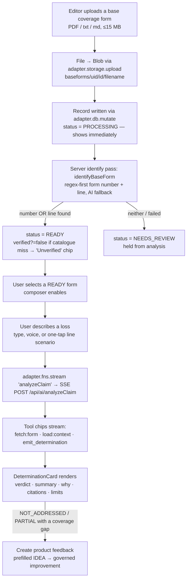

# Claims Analysis — Product & Feature Overview

**What this covers.** Claims Analysis is the platform's grounded, multi-turn "coverage copilot."
An analyst uploads (or selects) a base coverage form, describes a loss in plain English, and gets back
a structured, source-cited **coverage determination** — Covered / Not covered / Partially covered / Not
addressed — read like a verdict card. This document explains what the feature *is*, its value
proposition, the exact user journey, the two-pane UX, the roles that can use it, where it lives in the
platform, and the headline principles that make it trustworthy. It is a newcomer's map; the sibling docs
(architecture, backend pipeline, RAG, contracts) go deeper on each seam. Every claim below is grounded in
the actual source and cites `file:line`; where the code diverges from the feature's own comments, the code
wins and I say so.

---

## 1. What it is, in one breath

Claims Analysis is a **form-driven coverage-analysis aid** (explicitly *"not a claims decision"* —
`app/src/components/claims/DeterminationCard.tsx:338`). The user attaches a real P&C base coverage form
(Homeowners HO 00 03, CGL CG 00 01, Personal Auto PP 00 01, or any P&C form), then asks a natural-language
loss question like *"a pipe burst and flooded the kitchen."* The server:

1. fetches the **actual uploaded PDF** from Blob storage,
2. grounds the analysis in the **tenant's portfolio** (its products' structured coverage data via hybrid RAG),
3. asks Claude (via the Foundry seam) to emit **exactly one** structured determination through a forced tool call,
4. **rejects any verdict that cites nothing**, and
5. streams the result over SSE so the client can render a deterministic `DeterminationCard`.

The headline value: it turns an unstructured policy PDF plus a plain-English scenario into a **defensible,
cited, structured** coverage read — with every reasoning point traceable to a form section or an internal
`refId`, and a UI that can *never* silently invent coverage.

```js
// server/lib/ai/analyze-claim.js:52 — the analyst persona, verbatim
'You are a senior P&C claims coverage analyst. The attached base coverage form is the PRIMARY authority.',
'Determine the line FROM THE FORM, never assume a line the form does not state.',
// ...
'CITE EVERYTHING: every reasoning point must cite in [square brackets] ... A determination that cites nothing will be rejected.',
```

---

## 2. Where it sits in the platform

| Aspect | Value | Source |
|---|---|---|
| Route path | `/app/claims` | `app/src/App.tsx:75` (`<Route path="claims" element={<Claims />} />`) |
| Component | `app/src/routes/Claims.tsx`, **lazy-mounted** | `App.tsx:25` (`const Claims = lazy(() => import('./routes/Claims'))`) |
| Sidebar label | **"Claims Analysis"** in the **Intelligence** group | `app/src/components/shell/Sidebar.tsx:31` |
| Sidebar icon | `IconChart` | `Sidebar.tsx:31` |
| Feature flag | `page.claims` — hides the nav item *and* server-side denies the route | `Sidebar.tsx:31`, `server/server.js:158` |
| Topbar title | "Claims Analysis" | `app/src/components/shell/Topbar.tsx:15` |

The nav lives in `INTELLIGENCE_ITEMS` alongside Tasks, News, Data Dictionary and Feedback
(`Sidebar.tsx:28-34`) — the "intelligence" half of the app's author-vs-intelligence mental model
(`Sidebar.tsx:2`). The flag is **defense-in-depth**: the client hides the nav item when the tenant's
effective `page.claims` is `false`, and the server independently returns `403 feature_disabled` on
`/api/ai/analyzeClaim` for the same flag (`server/server.js:158,171`). The comment at `server.js:147`
is explicit that the client hide "declutters the nav" but the server flag check is "the authoritative deny."

---

## 3. Roles & access

Access is capability-gated server-side, not by role name. The relevant capability is `ai:invoke`
(`server/lib/authz.js`), enforced on every `/api/ai/*` route (`server/lib/ai/index.js:26`,
`requireCapability('ai:invoke')`).

| Persona | Can analyze (ask)? | Can upload forms? | Why |
|---|---|---|---|
| **EDITOR / TENANT_ADMIN / ADMIN** | Yes | **Yes** | hold `product:write` + `ai:invoke` (`authz.js:58,60`) |
| **VIEWER** (+ UNDERWRITING, COMPLIANCE, CLAIMS, ACTUARIAL, ANALYST) | **Yes — analyze only** | No | hold `product:read` + `ai:invoke`, **no** `product:write` (`authz.js:46-51`) |
| **POLICYHOLDER** | **No — fully excluded** | No | holds only `portal:read` + `portal:upload`; **no `ai:invoke`** → all `/api/ai/*` 403 (`authz.js:56`) |

Two nuances worth pinning down against the anchor:

- The anchor phrases the read tier as "VIEWER analyze-only." The code confirms VIEWER can analyze but not
  upload — **and so can a whole inquiry-persona set** (UNDERWRITING/COMPLIANCE/CLAIMS/ACTUARIAL/ANALYST),
  all of which share VIEWER's `[product:read, ai:invoke]` shape (`authz.js:46-51`). "VIEWER" is
  representative, not exhaustive.
- The **client** upload gate is `canEdit = canI(profile, 'product:write')` (`Claims.tsx:128`), passed into
  `BaseFormsLibrary` (`Claims.tsx:308`). A VIEWER sees no upload dropzone and instead an honest note:
  *"Viewer — analysis only. Editors upload forms."* (`BaseFormsLibrary.tsx:326-329`). POLICYHOLDERs never
  reach the route: the portal is a separate surface and they hold no `ai:invoke` (`server/lib/portal.js:7-8`).

---

## 4. The two-pane UX

`Claims.tsx` renders a responsive two-pane layout (`Claims.tsx:302-431`): a fixed `320px` left sidebar on
desktop, stacked on mobile.

```
┌──────────────────────┬──────────────────────────────────────────────┐
│  LEFT — Base forms    │  RIGHT — Coverage conversation                │
│  BaseFormsLibrary     │  (disabled until an analyzable form is chosen)│
│                       │                                               │
│  • upload dropzone    │  • context header (form title + refId chip)   │
│    (EDITOR/ADMIN only) │  • hero: "Describe a loss to check coverage"  │
│  • form cards:        │  • line-aware one-tap scenario starters       │
│    Processing / Ready  │  • streamed tool chips → DeterminationCard    │
│    / Needs review     │  • ChatComposer (voice or type)               │
└──────────────────────┴──────────────────────────────────────────────┘
```

**Left — `BaseFormsLibrary`** (`app/src/components/claims/BaseFormsLibrary.tsx`): a live-subscribed list of
`baseForms` (`Claims.tsx:152-157`), newest first. Editors get a drag-drop / picker dropzone
(`BaseFormsLibrary.tsx:214-242`); each card shows the form title, a `refId` form-number chip, a line chip
(HO/PA/GL), edition, and a live status pill — **Reading form…** (PROCESSING) / **Needs review**
(NEEDS_REVIEW) / **Ready** (`BaseFormsLibrary.tsx:298-304`).

**Right — the conversation** (`Claims.tsx:313-429`): the composer is **disabled until an analyzable form is
selected**. The gate is a single pure predicate, `composerReady = isFormAnalyzable(selectedForm)`
(`Claims.tsx:194`), which requires `status === 'READY' && storagePath` (`app/src/lib/claims/baseForm.ts:36`).
Before a form is chosen the placeholder reads *"Select a base form on the left to begin"*; a PROCESSING form
shows *"Reading the form…"*; a NEEDS_REVIEW form is held from analysis with an editor-facing hint
(`Claims.tsx:413-425`). Selecting a **new** form aborts any in-flight stream and resets the thread
(`Claims.tsx:174`) — a different policy is a fresh conversation.

---

## 5. The user journey, end to end



**Upload → PROCESSING → READY.** On upload, `BaseFormsLibrary` writes a lightweight record with
`status: 'PROCESSING'` so it appears instantly (`BaseFormsLibrary.tsx:105-114`), then calls the server
`identifyBaseForm` pass and updates the record with the read title / form number / edition / line and a
computed status (`BaseFormsLibrary.tsx:130-146`). `statusAfterIdentify` only returns `READY` when a printed
form number **or** a recognised line was found — otherwise `NEEDS_REVIEW`; there is never a silent
empty-metadata READY (`baseForm.ts:21-24`). A form whose number the catalogue couldn't confirm is still
READY and analyzable (the attached document is the authority) but carries `verified:false` → an
**"Unverified"** chip (`baseForm.ts:29-31`, `BaseFormsLibrary.tsx:287-295`).

**Describe a loss → streamed determination.** `ask()` (`Claims.tsx:196`) sends a payload of the wire history
plus `formNumber`, `formStoragePath`, `formStorageMediaType`, and (when known) `lob` (`Claims.tsx:210-216`).
The server streams `StreamEvent`s; the client shows **honest tool chips** ("Loading portfolio context",
"Forming the determination" — mapped by `TOOL_LABELS`, `Claims.tsx:49-59`), batches token events per
animation frame (`Claims.tsx:234-243`) to avoid a re-render per chunk, and on the `json`/`determination`
event renders a `DeterminationCard` — but only after the client-side `shouldRenderDetermination` guard passes
(`Claims.tsx:263`).

**Coverage gap → product feedback.** A `NOT_ADDRESSED` or `PARTIAL` card that carries a `coverageGap.note`
offers a **"Create product feedback"** button (`DeterminationCard.tsx:306-334`) that opens the feedback drawer
prefilled from the gap (`Claims.tsx:361-366`). This closes the loop: a coverage gap surfaced during analysis
becomes a governed product-improvement IDEA (`app/src/lib/claims/gapFeedback.ts`).

---

## 6. What a determination looks like

Once a READY form is selected and a loss is described, the answer renders as a `DeterminationCard`
(`app/src/components/claims/DeterminationCard.tsx`) — "read like a verdict, in one clean structured card"
(`DeterminationCard.tsx:2`). Its anatomy:

| Section | Content | Source |
|---|---|---|
| **Verdict emblem + headline** | custom SVG (check / cross / bang / dash) + plain-language headline, e.g. *"This policy covers this."* | `DeterminationCard.tsx:33-56, 25-30` |
| **Verdict label + accent** | Covered (good/green), Not covered (danger/red), Partially covered (warn/amber), Not addressed (neutral/dim) | `DeterminationCard.tsx:25-30` |
| **3-sentence summary** | brief coverage summary | `DeterminationCard.tsx:277` |
| **"Why it's <verdict>"** | exactly 3 cited reasoning points; `[bracketed]` tokens linkify to mono chips via `CitedText` | `DeterminationCard.tsx:207-213, 64-82` |
| **"Things to consider"** | up to 3 practical caveats / next steps | `DeterminationCard.tsx:215-221` |
| **"Document citations"** | accordion — click a coverage/exclusion to read the clause (`DocCitation`) | `DeterminationCard.tsx:223-236, 125-152` |
| **"Limits & deductibles"** | tabular `ValueRow`s; deductibles split off by `/deduct/i` | `DeterminationCard.tsx:238-247, 190-193` |
| **"Data citations"** | provenance trace of internal dotted `refId`s (`DataChip` shows what `RefChip` hides) | `DeterminationCard.tsx:249-257, 157-163` |
| **Coverage-gap callout** | NOT_ADDRESSED / PARTIAL only; note + sources + "Create product feedback" | `DeterminationCard.tsx:306-334` |
| **Footer** | *"Grounded in {formNumber} + product data. This is a coverage-analysis aid, not a claims decision."* | `DeterminationCard.tsx:337-339` |

All colour comes from design tokens (`var(--color-*)`, `color-mix`) — no hard hex (a binding invariant), and
`refId` / form chips are load-bearing display elements the card never strips (also a binding invariant).

---

## 7. Headline principles

Three principles make this a trustworthy feature rather than a chatbot:

**1. Form-driven and line-agnostic.** The attached form is the primary authority and the prompt derives the
line *from the form*: *"Determine the line FROM THE FORM, never assume a line the form does not state"*
(`analyze-claim.js:54`). The client is line-aware through the **claims line-profile registry**
(`shared/src/claims/lineProfiles.ts`) — HO / PA / GL profiles plus a GENERIC fallback
(`lineProfiles.ts:118-135`) — which drives the one-tap scenario starters and chip tooltips. This registry is
**deliberately separate** from the portfolio `LOB_REGISTRY`, so a claims form need not be a seeded product and
adding a line profile never ripples into Products/Explorer/segmentation (`lineProfiles.ts:9-11`).

> **Verified reverse-engineering finding (a real gap).** The anchor flags this and the code confirms it: the
> client *sends* `lob` in the payload (`Claims.tsx:215`) and uses the line profile for **UX only** (scenario
> starters `Claims.tsx:352`, chip tooltips `Claims.tsx:64-67`, `BaseFormsLibrary.tsx:38-41`). The **server**
> `analyze-claim.js` **never reads `body.lob`** and **never injects the per-line `briefing`** into the prompt —
> its system prompt is line-agnostic and relies on the model to derive the line from the form text. So the
> rich per-line briefings in `lineProfiles.ts` are currently **client/UX-only**, not wired into the
> determination prompt. This is an honest opportunity: passing the resolved `briefing` into `systemBlocks`
> would give the model line-specific coverage framing. Documented here so a recreator doesn't assume it's
> already wired.

**2. Grounded and cited — free invention is a bug.** The prompt demands `[bracket]` citations on every
reasoning point, and the server **enforces it**: if a substantive verdict (COVERED / NOT_COVERED / PARTIAL)
arrives with zero cited reasoning, it is **downgraded to NOT_ADDRESSED** and the summary is annotated
(`analyze-claim.js:103-107`). The client mirrors this with `shouldRenderDetermination` — a substantive verdict
renders only if it is cited and carries no unverified citations (`determination.ts:67-71`) — defense in depth
so a fabricated citation never reaches the card (`Claims.tsx:263-274`). The server additionally cross-checks
cited tokens against the loaded portfolio context and emits an `unverified` notice for any it can't find
(`analyze-claim.js:142-147`).

**3. The browser never calls the model.** All AI goes through the **adapter seam**
(`adapter.fns.stream('analyzeClaim', …)`, `Claims.tsx:230`) → SSE `POST /api/ai/analyzeClaim`. The server
router is guarded by `requireCapability('ai:invoke')` + `requireTenant` (`server/lib/ai/index.js:26`) and
dispatched by name to `analyzeClaim` (`index.js:48`). Secrets (Foundry, Cosmos, Blob) are server-side only;
the client holds no model credential. The determination is produced by a **forced tool call**
(`emit_determination`) so the model must return the structured schema exactly once (`analyze-claim.js:101`),
routed to the `GROUNDED_CITED` role → `claude-opus-4-8`, and fully cost-guarded (`analyze-claim.js:69-71`).

---

## 8. The screenshots

Two captured states live in `claims_analysis/screenshots/`:

- **`claims-analysis.light.png`** and **`claims-analysis.dark.png`** — the **pre-selection empty state**. They
  show the left base-forms library and the right-pane hero: an animated shield + voice-wave SVG
  (`Claims.tsx:443-478`) under the headline **"Describe a loss to check coverage"** and the subtext *"Speak or
  type in plain English — every determination cites the exact coverage, limit and exclusion it relied on"*
  (`Claims.tsx:481-484`). Because no form is selected in these captures, the composer is disabled and no
  one-tap scenario starters are shown (starters only appear once a READY form is selected — `Claims.tsx:352`).

Once a form is selected and a loss is entered, the right pane replaces the hero with: a **context header**
(form title + accent `refId` chip + line chip + optional "Unverified" chip, `Claims.tsx:315-345`), then a
streamed sequence of **tool chips** (fetch:form → load:context → emit_determination) that flip from spinner to
green check, and finally the **`DeterminationCard`** described in §6 — a verdict emblem, headline, cited
reasoning, document-citation accordion, limits table, and data-citation provenance trace.

---

## 9. Feature-capability table

| Capability | Behaviour | Anchored in |
|---|---|---|
| Multi-turn coverage chat | Wire history sent each turn; card turns serialised to text via `determinationToText` | `Claims.tsx:77-92, 209` |
| Upload base form | Drag-drop / picker; PDF / txt / md; 15 MB client pre-check | `BaseFormsLibrary.tsx:72-98` |
| Server identify pass | Regex-first form number + line; AI fallback (`BULK_VERIFY`/haiku); READY vs NEEDS_REVIEW | `BaseFormsLibrary.tsx:130-167`, `baseForm.ts:21-24` |
| Unverified-form handling | `verified:false` → analyzable + "Unverified" chip (document is authority) | `baseForm.ts:29-31`, `BaseFormsLibrary.tsx:287-295` |
| Duplicate-upload guard | Same normalized number + edition → "Use existing" / "Upload anyway" | `BaseFormsLibrary.tsx:148-158, 332-347` |
| Real-PDF grounding | Server fetches the actual Blob, extracts text or sends native document block | `analyze-claim.js:75-98` |
| Portfolio RAG grounding | Hybrid dense+lexical portfolio context injected as a system block | `analyze-claim.js:82-88` |
| Structured determination | Forced `emit_determination` tool; verdict + summary + 3 reasoning + 3 considerations + coverages/exclusions/limits | `analyze-claim.js:7-50` |
| Citation enforcement | Uncited substantive verdict → downgraded to NOT_ADDRESSED (server) + refused-to-render (client) | `analyze-claim.js:103-107`, `determination.ts:67-71` |
| No-blank-bubble invariant | `assistantBubbleContent` always resolves to something visible | `app/src/lib/claims/bubble.ts:19-25` |
| Line-aware starters | Scenario starters + tooltips from `lineProfiles` (UX-only; see §7 gap) | `lineProfiles.ts`, `Claims.tsx:170, 352` |
| Coverage-gap → feedback | NOT_ADDRESSED / PARTIAL gap → prefilled product IDEA | `gapFeedback.ts`, `DeterminationCard.tsx:306-334` |
| Cost + budget guarding | In-process cost breaker (`fleet.guard`) + per-tenant monthly budget; honest 503 at ceiling | `analyze-claim.js:69-71`, `index.js:32-37` |
| Voice + type input | `ChatComposer` supports speak-or-type with auto-submit | `Claims.tsx:409-410` |
| Accessibility | Single polite "Response ready" announcement; `role=log aria-live=off` suppresses per-token noise | `Claims.tsx:184-192, 348-350` |

---

## 10. Honest notes on stale references (code wins)

While verifying, two comments in the client point at the **legacy `functions/` reference tree**, which is
*not deployed* (CLAUDE.md invariant: `functions/` is reference-only):

- `Claims.tsx:26` calls the SSE source the "analyzeClaim Cloud Function" and the `StreamEvent` union a "mirror
  of `functions/src/runtime.ts`." The **deployed** producer is `server/lib/ai/analyze-claim.js` on the Azure
  App Service Express host; the SSE contract it emits is what the client actually consumes.
- `determination.ts:1-6` calls `functions/src/claims.ts` "the authoritative guard on the server." The
  **deployed** authoritative guard is the citation-downgrade in `analyze-claim.js:103-107`; the client
  `shouldRenderDetermination` mirrors that same rule. (Note also: the deployed server signals unverified
  citations via a separate `notice` SSE event, `analyze-claim.js:142-147`, rather than by populating
  `determination.unverifiedCitations` — so the client's `unverifiedCitations` branch is latent defense-in-depth
  today. See `07-DATA-MODEL-AND-CONTRACTS.md`.)

These are documentation drift, not behavioural bugs — the runtime contract is consistent between
`analyze-claim.js` and `Claims.tsx`.

---

## Related documents

- [`README.md`](./README.md) — dossier index and how to read this set
- [`01-OVERVIEW.md`](./01-OVERVIEW.md) — **this document**: product & feature overview
- [`02-ARCHITECTURE.md`](./02-ARCHITECTURE.md) — end-to-end architecture, adapter seam, request flow
- [`03-BACKEND-PIPELINE.md`](./03-BACKEND-PIPELINE.md) — the `analyzeClaim` handler, PDF extraction, SSE
- [`04-MULTI-MODEL-ORCHESTRATION.md`](./04-MULTI-MODEL-ORCHESTRATION.md) — fleet roles, cost guard, model IDs
- [`05-EMBEDDINGS-AND-RAG.md`](./05-EMBEDDINGS-AND-RAG.md) — hybrid dense+lexical portfolio grounding
- [`06-FRONTEND.md`](./06-FRONTEND.md) — `Claims.tsx`, `BaseFormsLibrary`, `DeterminationCard`, RAF batching
- [`07-DATA-MODEL-AND-CONTRACTS.md`](./07-DATA-MODEL-AND-CONTRACTS.md) — `BaseForm`, `Determination`, SSE `StreamEvent`
- [`08-DESIGN-PATTERNS.md`](./08-DESIGN-PATTERNS.md) — pure-lib guards, no-blank-bubble, citation defense-in-depth
- [`09-RECREATE-FROM-SCRATCH.md`](./09-RECREATE-FROM-SCRATCH.md) — step-by-step rebuild guide
- [`10-INVARIANTS-AND-TESTS.md`](./10-INVARIANTS-AND-TESTS.md) — binding invariants + test coverage
- [`code-inventory.md`](./code-inventory.md) — every file that makes up the feature
