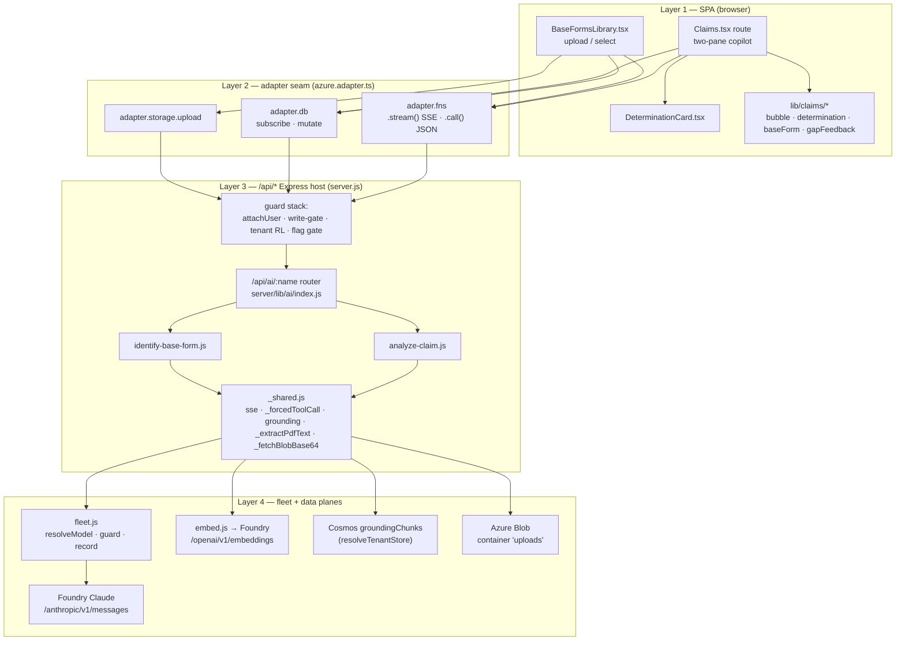
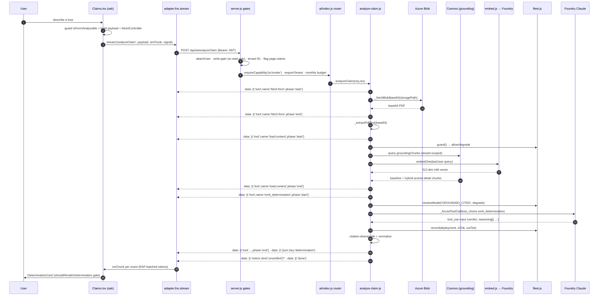
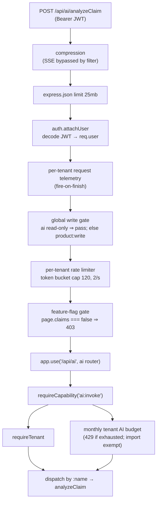
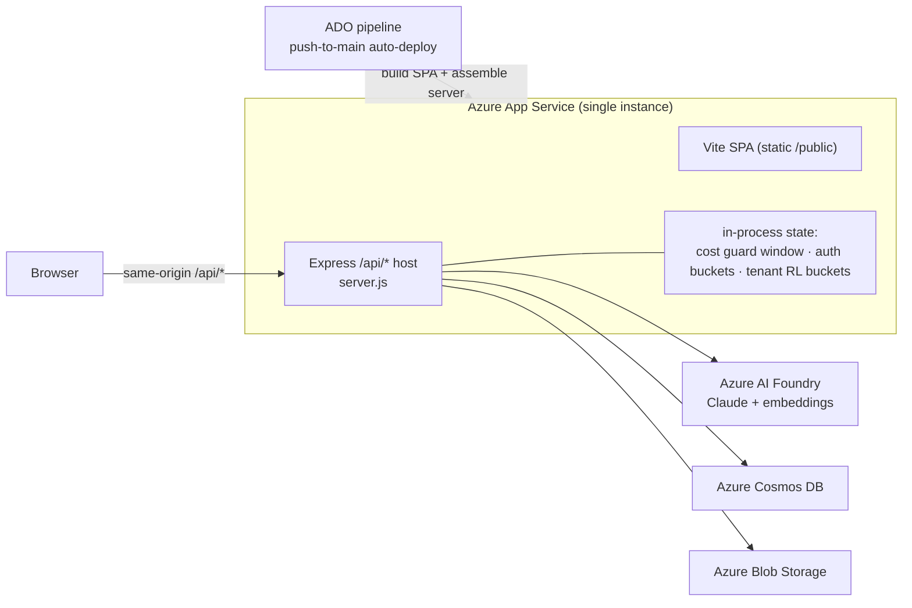
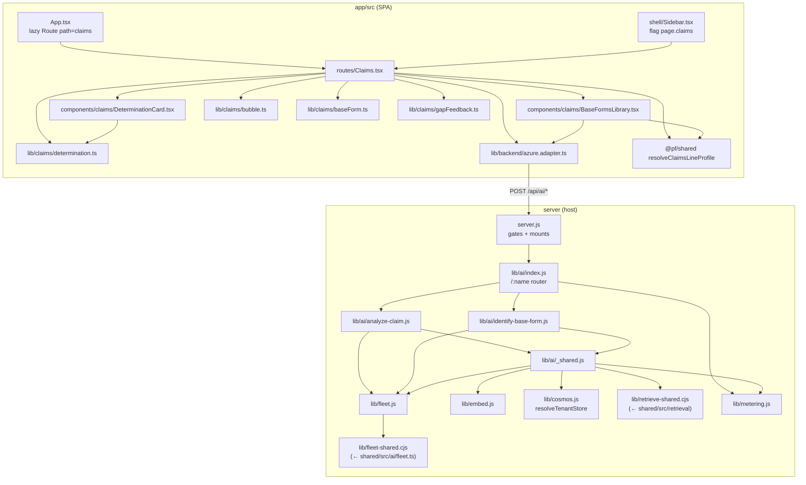

# Claims Analysis — System Architecture

**What this covers.** The end-to-end architecture of the Claims Analysis ("coverage
copilot") feature across all four layers — the React SPA, the `adapter` seam, the `/api/ai`
Express host, and the model `fleet` in front of Foundry Claude / Cosmos / Blob. It traces
the two request lifecycles the feature uses (the `analyzeClaim` SSE stream and the
`identifyBaseForm` JSON call), the server routing and guard stack every request passes
through (`requireCapability('ai:invoke')`, `requireTenant`, the `page.claims` feature flag,
per-IP + per-tenant rate limiting), tenant isolation (partition key + the `resolveTenantStore`
SILO_READY seam), the deployment topology (single-instance Azure App Service → the cost guard
is a per-instance rolling window), and the module dependency map. Every claim is cited to a
file and line; where the verified anchor and the code disagree, the **code wins** and the
discrepancy is called out. Three mermaid diagrams are embedded inline; standalone copies of
each source live in [`claims_analysis/diagrams/`](./diagrams/).

---

## 1. The four layers at a glance

| Layer | Where | Responsibility for claims |
|---|---|---|
| **1. SPA (React/Vite)** | `app/src/routes/Claims.tsx`, `app/src/components/claims/*`, `app/src/lib/claims/*` | Renders the two-pane UI, consumes the SSE stream, gates rendering of determinations. Never touches Anthropic or Cosmos directly. |
| **2. Adapter seam** | `app/src/lib/backend/azure.adapter.ts` (the `BackendAdapter` impl) | The *only* module that talks to the network. Claims uses `adapter.fns.stream(...)`, `adapter.fns.call(...)`, `adapter.db.*`, `adapter.storage.upload`. |
| **3. `/api/*` Express host** | `server/server.js` + `server/lib/ai/*` | Same-origin Azure App Service host. Auth, feature-flag + rate-limit gates, tenant scoping, AI dispatch, blob fetch, grounding/RAG, SSE emission. |
| **4. Fleet → Foundry / Cosmos / Blob** | `server/lib/fleet.js` (+ `fleet-shared.cjs`), `server/lib/embed.js`, `server/lib/cosmos.js`, `@azure/storage-blob` | Role→deployment resolution, in-process cost guard, Foundry Claude Messages API, embeddings, Cosmos grounding store, Blob document fetch. |

The **binding architectural rule** (CLAUDE.md "Adapter seam" invariant) is that the browser
never imports a platform SDK and never calls Anthropic. Claims honours this: the route
imports only `adapter` from `../lib/backend` (`Claims.tsx:10`) and every AI byte flows through
`adapter.fns` (`Claims.tsx:230`).



---

## 2. Layer 2 — the adapter seam, and why it exists

`azure.adapter.ts` is the Azure implementation of the `BackendAdapter` contract. Its header
states the design intent verbatim: it *"Talks ONLY to the same-origin Azure host API (`/api/*`):
JWT auth, Cosmos-backed data, and Foundry-Claude AI. No Firebase, no GCloud."*
(`azure.adapter.ts:2-6`). The React app depends only on this contract, so the whole backend can
be swapped without touching a component. That indirection is what makes the CLAUDE.md invariants
(adapter seam, AI server-side, atomic mutations) *structurally* enforceable rather than
convention.

Claims uses four slices of the adapter:

### 2a. `adapter.fns` — the AI transport

```ts
// azure.adapter.ts:331-359
fns: {
  async call<TIn, TOut>(name, data) {                         // JSON POST /api/ai/<name>
    return api<TOut>(`/ai/${name}`, { method: 'POST', body: JSON.stringify(data) })
  },
  async stream(name, data, onChunk, signal?) {                // SSE POST /api/ai/<name>
    const res = await fetch(`${API}/api/ai/${name}`, { method: 'POST', headers: {...Authorization}, body, signal })
    ...
    for (const line of lines) if (line.startsWith('data: ')) onChunk(line.slice(6))
  }
}
```

- **`fns.call('identifyBaseForm', payload)`** is a plain JSON POST; the Bearer JWT is attached
  by the shared `api()` helper (`azure.adapter.ts:38-67`).
- **`fns.stream('analyzeClaim', payload, onChunk, signal)`** issues a raw `fetch` (not `api()`
  — it needs the streaming body), reads the `ReadableStream`, splits on `\n`, and for each line
  beginning `data: ` passes the **JSON text after the 6-char prefix** to `onChunk`
  (`azure.adapter.ts:352-355`). This is the exact mirror of the server's
  `emit = (res, ev) => res.write(\`data: ${JSON.stringify(ev)}\n\n\`)` (`_shared.js:18`). The
  `signal` (an `AbortController.signal`) lets the route cancel a turn in-flight.

The stream helper decodes with `{ stream: true }` and carries a `buf` remainder across reads
(`azure.adapter.ts:351-353`), so an SSE event split across two network chunks is reassembled
before dispatch — a subtle correctness detail the frontend relies on.

### 2b. `adapter.db` / `adapter.storage`

`BaseFormsLibrary` writes the `baseForms/{id}` entity through `adapter.db.mutate` (the atomic
envelope) and uploads the PDF through `adapter.storage.upload`, which chunk-base64-encodes the
file to dodge the ~32k-arg spread limit and POSTs to `/api/storage/upload`
(`azure.adapter.ts:312-324`). `Claims.tsx` subscribes to the live `baseForms` collection via
`adapter.db.subscribe` (`Claims.tsx:153`), which is **smart polling** (Cosmos has no browser
`onSnapshot`) — visibility-paused, geometric backoff, in-flight-coalesced
(`azure.adapter.ts:93-272`).

---

## 3. Request lifecycle — `analyzeClaim` (SSE)

This is the feature's core turn. One user scenario → one streamed determination.

### 3a. Client side (`Claims.tsx` `ask()`)

1. Guard: the turn is refused unless there is a question, no stream is running, and the selected
   form is genuinely analyzable — `!question || streaming || !selectedForm || !isFormAnalyzable(selectedForm)`
   returns early (`Claims.tsx:201`). This mirrors the composer's `disabled` gate so a stray call
   can never send a payload for a selected-but-not-ready form.
2. Payload assembly (`Claims.tsx:209-216`):
   ```ts
   const wire = history.map(m => ({ role: m.role, content: m.historyText ?? m.text }))
   const payload = {
     messages: wire,
     formNumber:           selectedForm.formNumber,
     formStoragePath:      selectedForm.storagePath,
     formStorageMediaType: selectedForm.mediaType ?? 'application/pdf',
     ...(selectedForm.lob ? { lob: selectedForm.lob } : {}),
   }
   ```
   Card turns are serialized back to text via `determinationToText` and carried as `historyText`
   (`Claims.tsx:77-92, 264`) so multi-turn follow-ups keep context.
3. A fresh `AbortController` is created; the previous one is aborted (`Claims.tsx:226-228`). It is
   also aborted on new form selection (`Claims.tsx:174`) and unmount (`Claims.tsx:177`).
4. `adapter.fns.stream('analyzeClaim', payload, onChunk, controller.signal)` runs; `onChunk`
   `JSON.parse`s each event and switches on `ev.t` (`Claims.tsx:230-286`).

**RAF token batching:** `token` events append to `textBufferRef` and schedule at most one
`requestAnimationFrame` flush to React state (`Claims.tsx:234-243`), with a final flush in
`finally` (`Claims.tsx:291-297`) so no tokens drop. This keeps hundreds of token chunks from each
triggering a re-render.

### 3b. Server side (`analyze-claim.js`)

The handler is line-by-line:

| Step | Code | Notes |
|---|---|---|
| Open SSE | `sse(res)` (`analyze-claim.js:67`) | sets `text/event-stream`, `no-cache`, `keep-alive`, `flushHeaders()` (`_shared.js:12-17`) |
| Validate | filter `messages[]` to user/assistant with content (`:64-66`); empty → `error`+`done` (`:68`) | |
| Cost gate | `g = fleet.guard()`; `if (!g.allow)` → honest `error`+`done`, no dispatch (`:69-70`) | ceiling reached ⇒ 503-equivalent over SSE |
| Resolve model | `deployment = CHAT_OVERRIDE || fleet.resolveModel('GROUNDED_CITED', g.degrade)` (`:71`) | `GROUNDED_CITED`=`claude-opus-4-8`; degrades to `claude-haiku-4-5` past 80% |
| Fetch form | if `body.formStoragePath` → `tool fetch:form` → `_fetchBlobBase64(path)` (`:75-79`) | Blob container `AZURE_BLOB_CONTAINER` default `'uploads'` (`_shared.js:249`) |
| Fallback source | `if (!formB64 && body.formBase64) formB64 = body.formBase64` (`:80`) | |
| Extract text | `formText = formB64 ? _extractPdfText(formB64) : (body.formText || null)` (`:81`) | naive PDF scraper; may return `null` |
| Load context | `tool load:context` → `ctx = groundingFlat(lastUser, null, tenantId)` (`:82-84`) | `productId=null` ⇒ **portfolio-wide** baseline |
| System blocks | `[CLAIMS_SYSTEM (ephemeral cache), PORTFOLIO CONTEXT: ctx]` (`:85-88`) | |
| Content block | text (>100 chars, sliced 60 000) **or** native `{type:document,...base64}` **or** "(No form document)" (`:90-98`) | native-PDF fallback is the safety net for 0-char extracts |
| Forced tool call | `_forcedToolCall(deployment, systemBlocks, [_EMIT_DETERMINATION], 'emit_determination', [sandboxNote, contentBlock], userInstruction, 4096)` (`:101-102`) | returns the `tool_use.input` object |
| Citation downgrade | if verdict ∈ {COVERED,NOT_COVERED,PARTIAL} and **zero** reasoning entries contain `[` → force `NOT_ADDRESSED` + annotate summary (`:103-107`) | server-side correctness guard |
| Normalize | coverages/exclusions accept new object shape *and* legacy string/legacy-key shapes (`:108-129`) | |
| Emit determination | `emit(res,{t:'json',key:'determination',value:determination})` (`:141`) | |
| Unverified sweep | collect `citations[]` + `[bracket]` tokens; any not bracketed in `ctx` and not starting with a digit → `notice kind:'unverified' level:'warn'` (`:142-147`) | |
| Close | `emit(res,{t:'done'}); res.end()` (`:148`); error path emits `error`+`done` (`:149-152`) | |

`CHAT_OVERRIDE = process.env.AZURE_FOUNDRY_DEPLOYMENT || ''` (`analyze-claim.js:5`) — an ops
escape hatch that pins a single deployment. When empty (the norm) the fleet role resolves the
model, so **no model string is hardcoded** (Model-IDs invariant, CLAUDE.md).

### 3c. Sequence diagram — one `analyzeClaim` turn



---

## 4. Request lifecycle — `identifyBaseForm` (JSON)

Invoked by `BaseFormsLibrary` right after upload to label the form. It is a plain
`adapter.fns.call` (JSON, not SSE). Server flow (`identify-base-form.js`):

1. Require `formBase64` or `formText`, else `400 missing_form` (`:76-78`).
2. Extract text (`_extractPdfText` for base64) (`:81`).
3. **Regex-first, zero AI cost:** `regexExtract` runs `FORM_NUM_RE` (two-pair ISO pattern),
   `EDITION_RE`, and `LOB_BY_PREFIX` (`:29-51`). If a `formNumber` is found it returns
   immediately with `verified = LOB_BY_PREFIX.some(...)` — **no model call** (`:84-95`).
4. **AI fallback** only if regex found nothing: `fleet.guard()` (503 if `!allow`),
   `deployment = fleet.resolveModel('BULK_VERIFY', g.degrade)` (= `claude-haiku-4-5`),
   forced tool `identify_form`, `512` max tokens (`:104-123`).
5. AI-not-configured → returns an empty extract (regex still worked) rather than erroring
   (`:99-101`). This is why the router special-cases `identifyBaseForm` *before* the
   `fleet.isConfigured()` 503 (`ai/index.js:41-42`).

> **Cross-check with the anchor:** the anchor says the AI fallback uses `BULK_VERIFY`/haiku with a
> forced `identify_form` tool at 512 tokens and never invents from the filename — confirmed
> verbatim (`identify-base-form.js:68-71, 107, 123`). Note the LOB regex covers **more prefixes**
> than the anchor's short list (CG/GL→GL, HO/DP→HO, PP/PA/CA→PA, IM/FM→IM, CP/BPP/IL→PR) — see
> `LOB_BY_PREFIX` (`:11-24`).

---

## 5. Server routing + the guard stack

Every claims request passes the same ordered middleware in `server.js` before reaching a
handler. Order matters — the cheapest denials run first.



### 5a. The gates in detail

- **`auth.attachUser`** (`server.js:67`) decodes the JWT into `req.user` (uid, role, tenantId).
  The global floor then 401s any non-public `/api/*` without `req.user` (`server.js:104-108`).
- **Global default-deny write gate** (`server.js:104-119`): every non-GET `/api/*` needs
  `product:write` *unless* whitelisted. `/api/ai/<name>` is whitelisted for **read-only** AI
  names — `analyzeClaim` and `identifyBaseForm` are not in `AI_WRITE = {unifiedImport, reindexProduct}`,
  so they pass this gate and rely on the per-route `ai:invoke` check
  (`server.js:102, 111-113`). This is defense-in-depth: even if the router forgot its guard, a
  VIEWER still could not reach a *write* AI call.
- **Per-tenant rate limiter** (`server.js:126-144`): a token bucket keyed by `tenantId`,
  `TENANT_RL_CAP=120` burst, `TENANT_RL_PER_SEC=2` sustained, applied to `/api/ai/`, `/api/filing`,
  and the two mutate paths. Caps how fast one tenant can hit the expensive AI surface; layered on
  top of the per-IP auth limiter and the global cost breaker.
- **Feature-flag gate** (`server.js:153-174`): `FLAG_ROUTES` maps `'/api/ai/analyzeClaim' → 'page.claims'`.
  The tenant's *effective* flags are checked; `page.claims === false` ⇒ `403 feature_disabled`.
  Fail-**open** on infra error (flags are a management convenience, not the security boundary).
  This is the authoritative server-side deny behind the sidebar hide (`Sidebar.tsx:31` carries the
  same `flag: 'page.claims'`).
- **Router-level guards** (`ai/index.js:26`): `router.post('/:name', requireCapability('ai:invoke'),
  requireTenant, ...)`. **`POLICYHOLDER` holds no `ai:invoke` capability**, so it cannot reach any
  AI handler (confirmed by the anchor and by the portal comment in `server.js:254-261`).
- **Monthly per-tenant AI budget** (`ai/index.js:29-37`): `metering.checkTenantBudget(tid)` → `429
  tenant_ai_budget_exhausted` when over budget. Import is exempt; `analyzeClaim` is throttled. This
  is a *second, distinct* budget layer above `fleet.guard()`'s rolling window.
- **Tenant context threading** (`ai/index.js:38-53`): the dispatch runs inside
  `metering.withTenant(tid, () => ...)` so every `fleet.record()` also meters per-tenant via the
  ambient ALS store (`_shared.js:73-74` calls `metering.meterCurrent`).

> **Nuance vs. the anchor.** The anchor says analyzeClaim is "guarded by `requireCapability('ai:invoke')`
> + `requireTenant`" and "gated behind feature flag `page.claims` and rate-limits `/api/ai/`" — all
> confirmed. Two additions the code reveals that the anchor omits: (1) a **monthly per-tenant AI
> budget** throttle in the router (`ai/index.js:32-37`), and (2) a **global default-deny write gate**
> that analyzeClaim passes only because it is classified read-only (`server.js:111-113`). Both are
> load-bearing for a faithful recreation.

---

## 6. Layer 4 — fleet, cost guard, and Foundry

### 6a. Role → deployment

`fleet.js` is the sole router of model choice, single-sourced from `shared/src/ai/fleet.ts` and
bundled to `server/lib/fleet-shared.cjs` (`pnpm build:fleet`). The registry
(`shared/src/ai/fleet.ts:39-76`):

| Role | Deployment | SDK surface | Claims usage |
|---|---|---|---|
| `GROUNDED_CITED` | `claude-opus-4-8` | anthropic | **analyzeClaim determination** (and portfolio chat) |
| `MID_REASONER` | `claude-sonnet-5` | anthropic | import escalation only |
| `BULK_VERIFY` | `claude-haiku-4-5` | anthropic | **identifyBaseForm AI fallback**; degrade target for GROUNDED_CITED |
| `VISION` | `gpt-5.1` | openai | not used by claims |
| `CHEAP_GENERAL` | `gpt-5-mini` | openai | degrade target for VISION |
| `EMBED` | `text-embedding-3-small` | openai | grounding query + chunk vectors |

`resolveModel(role, degradeOrOpts)` (`fleet.js:56-63`): the second arg is a boolean `degrade` or
`{degrade, bypassDegrade}`. `degrade=true` routes to `bridge.degradedRole(role)` — for
`GROUNDED_CITED` that is `BULK_VERIFY` (`fleet.ts:135-142`). `opts.bypassDegrade` is the **named,
import-only** no-downgrade switch; **claims never passes it**, so a claims turn under budget
pressure *does* degrade opus→haiku (`fleet.js:60`, and `analyze-claim.js:71` passes the raw
`g.degrade` boolean).

### 6b. The in-process cost guard (per-instance)

```js
// fleet.js:74-99
const WINDOW_MS = 60*60*1000        // 1h fixed window (AI_SPEND_WINDOW_MS)
const CEILING_USD = 25              // AI_SPEND_CEILING_USD
const SOFT_FRACTION = 0.8
function guard(context) {
  rollWindow()
  if (context === IMPORT_CONTEXT) return { allow: true, degrade: false, reason: 'import_no_cap' }
  if (windowSpendUsd >= CEILING_USD) return { allow: false, degrade: false, reason: 'ai_budget_ceiling' }
  const degrade = windowSpendUsd >= CEILING_USD * SOFT_FRACTION
  return { allow: true, degrade, reason: degrade ? 'ai_budget_soft' : 'ok' }
}
```

- `allow=false` at/over the ceiling ⇒ analyzeClaim emits an honest error, **no model dispatch**
  (`analyze-claim.js:69-70`).
- `degrade=true` past 80% ⇒ opus routes to haiku for this turn.
- `record(deployment, inTok, outTok)` accrues `bridge.estimateCostUsd` after **every** call
  (`fleet.js:102-106`), invoked inside `_forcedToolCall` (`_shared.js:72`). Claims is **fully
  cost-guarded** — it never uses `IMPORT_CONTEXT`.
- `snapshot()` (`fleet.js:108-116`) exposes window spend/ceiling for telemetry.

**Deployment-topology consequence.** `fleet.js:12-15` states the guard "State is per host instance
(App Service is single-instance here)." The window (`windowStart`, `windowSpendUsd`, `callCount`)
lives in module-level `let`s (`fleet.js:78-80`) — process memory, not Cosmos. So the $25/1h
ceiling, the per-IP auth buckets (`server.js:33`), and the per-tenant rate buckets
(`server.js:126`) are all **per-instance**. If the App Service ever scaled out horizontally, each
instance would enforce its own window independently; the design deliberately assumes a single
instance. The *monthly tenant AI budget* (`metering.checkTenantBudget`) is the durable,
cross-instance-safe layer.

### 6c. `_forcedToolCall` → Foundry

```js
// _shared.js:46-77 (salient lines)
const body = {
  model: deployment, max_tokens: maxTokens,
  system: systemBlocks, tools,
  tool_choice: { type: 'tool', name: toolName },
  messages: [{ role: 'user', content: [...blocks, { type: 'text', text: instruction }] }],
}
// temperature deliberately OMITTED → deterministic default on opus/haiku
const upstream = await fetchWithRetry(fleet.anthropicMessagesUrl(), { method:'POST', headers, body }, { timeoutMs: 90_000 })
fleet.record(deployment, json.usage?.input_tokens, json.usage?.output_tokens)
return (tu && tu.input) || {}
```

- Endpoint: `anthropicMessagesUrl() = SVC/anthropic/v1/messages` with headers `x-api-key` +
  `anthropic-version` (`fleet.js:25, 30`). `SVC` is `AZURE_FOUNDRY_ENDPOINT`; `KEY` is
  `AZURE_FOUNDRY_KEY` — server-env only (`fleet.js:20-21`).
- `tool_choice:{type:'tool', name:'emit_determination'}` *forces* the structured output; the
  handler reads `tool_use.input`.
- `fetchWithRetry` (`_shared.js:21-41`): 3 attempts, exp backoff + jitter on 408/429/5xx, 90 s
  timeout, honors `Retry-After`.
- Optional extended thinking via the `interleaved-thinking-2025-05-14` beta header
  (`_shared.js:48-49`); claims does not enable it.

### 6d. Grounding / hybrid RAG

`groundingFlat(lastUser, null, tenantId)` → `grounding()` (`_shared.js:96-151`):

- `resolveTenantStore(tenantId)` (the **SILO_READY seam**, `_shared.js:98`) yields the tenant's
  Cosmos `groundingChunks`.
- `productId=null` ⇒ **baseline = ALL `data.type='product'` chunk texts** — the authoritative,
  exhaustive portfolio (`_shared.js:103-110`).
- Candidate query: `SELECT TOP ${GROUNDING_CAP=400}` chunks (`_shared.js:80, 113-115`).
- Per candidate: `dense = cosineSim(qVec, chunk.embedding.q)`, `lexical = keywordOverlapScore(...)`,
  `score = hybridScore(dense, lexical, HYBRID_ALPHA=0.72)`; relevant if `dense>=DENSE_FLOOR(0.22)`
  or `lexical>0`; take top `DETAIL_CAP=18` (`_shared.js:81-83, 133-144`).
- Returns `{baseline, detail}`; `groundingFlat` concatenates them (`_shared.js:148-151`). **On any
  failure it returns empty** — grounding is never a correctness dependency (`_shared.js:145`).
- `qVec` comes from `embed.embedOne(query)` — `text-embedding-3-small`, 512-dim, int8-quantized,
  via Foundry `openai/v1/embeddings`.

---

## 7. Tenant isolation

Isolation is enforced **server-side, on every read and write**, and the browser never sees another
tenant's data.

- **JWT-derived tenant.** `req.user.tenantId` is decoded by `attachUser`; `resolveTenantForPrincipal(req.user)`
  yields the effective tenant (`ai/index.js:27`). The claims handler scopes grounding with
  `req.user.tenantId` (`analyze-claim.js:83`).
- **Partition key + query filter.** Per CLAUDE.md, every read/write is scoped to
  `${tenantId}|${base}` partition key **and** a `c.tenantId` filter on every query. The grounding
  SQL shows the filter literally: `... AND c.tenantId=@tid ...` with `@tid = tenantId`
  (`_shared.js:104, 113, and parameters :106, 115`).
- **SILO_READY seam.** `resolveTenantStore(tenantId)` (`_shared.js:98`) is the indirection that
  would let a tenant be moved to a dedicated store without touching handler code; today it returns
  the shared multi-tenant Cosmos `docs` client.
- **SUPER_ADMIN override.** The adapter can send `X-Tenant-Id` only for a `SUPER_ADMIN` session
  (`azure.adapter.ts:40-42, 84-89`); tenant-plane users are always pinned to their own tenant. A
  POLICYHOLDER never reaches `/api/ai` at all (no `ai:invoke`).

---

## 8. Deployment topology



- **Prod = Azure App Service**, built and deployed by the ADO pipeline on push to `main`
  (CLAUDE.md "Environment safety"). The same host serves the static SPA *and* `/api/*`
  (`server.js:287-314`).
- **Same-origin.** The browser talks only to `${VITE_API_BASE || ''}/api/*` (`azure.adapter.ts:17,
  43`) and never holds a Foundry/Cosmos/Blob credential — all secrets are read from `process.env`
  in `server/lib/*` (`fleet.js:20-21`, `_shared.js:245-249`).
- **Single instance ⇒ per-instance guards.** As §6b explains, the cost guard and both rate-limit
  buckets are process-memory. This is the acknowledged topology assumption; horizontal scale-out
  would require moving these to a shared store.
- **SSE + compression.** The host explicitly *disables* compression for `text/event-stream`
  (`server.js:61-65`) so the analyzeClaim stream flushes progressively instead of buffering to
  end.

---

## 9. Module dependency map



**Notable seams in this graph**

- `Claims.tsx` and `BaseFormsLibrary.tsx` both import the shared `resolveClaimsLineProfile`
  (`Claims.tsx:9`, and per the anchor `BaseFormsLibrary.tsx`) — the client uses line profiles for
  scenario starters (`Claims.tsx:170, 352`) and the line chip tooltip (`Claims.tsx:64-67, 328`).
- `_shared.js` is the hub every AI handler depends on: SSE (`sse`/`emit`), the Foundry call
  (`_forcedToolCall`), grounding, PDF extraction, and blob fetch all live here (`_shared.js:275-280`).
- `fleet.js` depends only on the bundled `fleet-shared.cjs`, keeping deployment names
  single-sourced from `shared/src/ai/fleet.ts`.

> **Reverse-engineering finding (confirmed — a real gap).** The `analyzeClaim` **payload carries
> `lob`** (`Claims.tsx:215`), and the client uses the line profile heavily for UX. But the **server
> `analyze-claim.js` never reads `body.lob`** and never injects a per-line briefing — the system
> prompt is line-agnostic and instructs the model to *"Determine the line FROM THE FORM"*
> (`analyze-claim.js:54`). Grep confirms `lob` does not appear in `analyze-claim.js`. So the
> per-line `briefing` in `shared/src/claims/lineProfiles.ts` is **client/UX-only today, not wired
> into the determination prompt** — an accurate, actionable opportunity for a future change, not a
> bug.

---

## 10. The SSE `StreamEvent` contract (the layer-2↔3 handshake)

The server `emit()` union and the client `StreamEvent` type must stay in lockstep — this is the
literal contract that crosses the adapter seam.

| Event | Server emit site | Client handling (`Claims.tsx`) |
|---|---|---|
| `{t:'token', v}` | (analyzeClaim streams the determination as one tool call, so tokens are chiefly used by other handlers; claims mainly emits `tool`/`json`) | append to `textBufferRef`, RAF-flush (`:234-243`) |
| `{t:'tool', name, phase, summary?}` | `fetch:form`, `load:context`, `emit_determination` (`analyze-claim.js:76-140`) | tool chips with `TOOL_LABELS` (`:244-257`) |
| `{t:'json', key:'determination', value}` | `analyze-claim.js:141` | `shouldRenderDetermination` gate → `DeterminationCard` (`:258-276`) |
| `{t:'notice', level, message, refs?, kind?}` | unverified-citation sweep (`analyze-claim.js:146`) | stored in its own `notice` field (`:277-280`) |
| `{t:'error', message}` | validate/guard/catch (`analyze-claim.js:68,70,150`) | append `⚠️` to text (`:281-282`) |
| `{t:'done'}` | terminal on every path (`analyze-claim.js:148,151`) | no-op; `finally` flushes + clears streaming (`:283, 290-299`) |

Both sides guard against a blank bubble: the client's `assistantBubbleContent` decision (priority
determination > text > notice > thinking > fallback) guarantees every terminal SSE path renders
something (`Claims.tsx:101-124`, backed by `app/src/lib/claims/bubble.ts`).

---

## Related documents

- [README.md](./README.md) — dossier index and how to read it
- [01-OVERVIEW.md](./01-OVERVIEW.md) — what Claims Analysis is, at a product level
- **02-ARCHITECTURE.md** — this document
- [03-BACKEND-PIPELINE.md](./03-BACKEND-PIPELINE.md) — the `analyzeClaim` handler in depth
- [04-MULTI-MODEL-ORCHESTRATION.md](./04-MULTI-MODEL-ORCHESTRATION.md) — fleet roles, cost guard, degrade
- [05-EMBEDDINGS-AND-RAG.md](./05-EMBEDDINGS-AND-RAG.md) — grounding, embeddings, hybrid retrieval
- [06-FRONTEND.md](./06-FRONTEND.md) — Claims.tsx, cards, stream consumption
- [07-DATA-MODEL-AND-CONTRACTS.md](./07-DATA-MODEL-AND-CONTRACTS.md) — BaseForm, Determination, SSE union
- [08-DESIGN-PATTERNS.md](./08-DESIGN-PATTERNS.md) — adapter seam, no-blank-bubble, citation downgrade
- [09-RECREATE-FROM-SCRATCH.md](./09-RECREATE-FROM-SCRATCH.md) — build order
- [10-INVARIANTS-AND-TESTS.md](./10-INVARIANTS-AND-TESTS.md) — binding invariants + test coverage
- [code-inventory.md](./code-inventory.md) — every claims file, one line each
- Diagram sources: [`claims_analysis/diagrams/`](./diagrams/)
