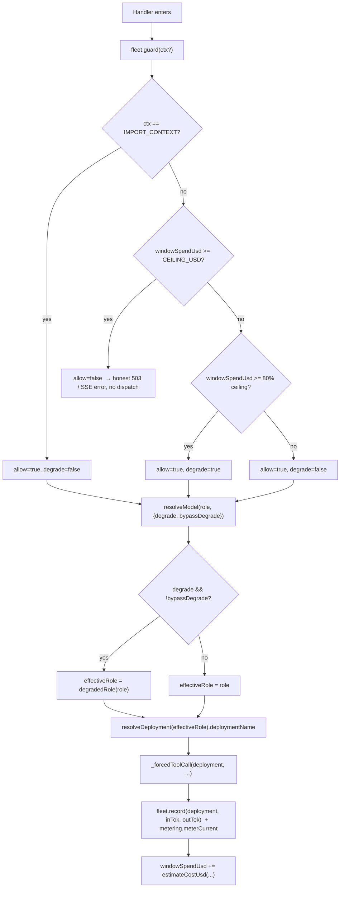

# 04 · Multi-Model Orchestration & Cost Governance

**What this covers.** The Claims Analysis feature never names a model. Every AI call it makes —
the Opus determination, the Haiku form-identify fallback, the embeddings that feed grounding —
resolves its concrete Foundry deployment through a small, reusable **fleet** abstraction and is
metered by an **in-process cost guard** before and after dispatch. This document reverse-engineers
that fleet as a reusable multi-model-orchestration pattern: the `role → deployment` indirection,
the single-source-of-truth bundling (`shared/src/ai/fleet.ts` → `server/lib/fleet-shared.cjs`),
every role and why its model fits, the degrade/escalation ladder, the rolling-window spend guard,
the Foundry transport surface (Anthropic vs OpenAI, headers, o-series token quirks, temperature
omission), and exactly how Claims uses all of it. Every claim below is grounded in the code with
file:line citations; where the anchor and the code diverged, the code wins and I say so.

---

## 1. The core abstraction: roles, not model strings

No handler ever writes `"claude-opus-4-8"`. A handler declares a **role** and asks the fleet to
resolve the current deployment:

```js
// server/lib/ai/analyze-claim.js:71
const deployment = CHAT_OVERRIDE || fleet.resolveModel('GROUNDED_CITED', g.degrade)
```

The role → deployment map is a static registry (`shared/src/ai/fleet.ts:39`), typed by a
`ModelRole` union (`fleet.ts:14`). Six roles across two SDK families:

| Role | Deployment | SDK family | `roleLabel` |
|---|---|---|---|
| `GROUNDED_CITED` | `claude-opus-4-8` | anthropic | Grounded cited reasoning — Opus 4.8 |
| `MID_REASONER` | `claude-sonnet-5` | anthropic | Mid-tier escalation reasoning — Sonnet 5 |
| `BULK_VERIFY` | `claude-haiku-4-5` | anthropic | Bulk verification — Haiku 4.5 |
| `VISION` | `gpt-5.1` | openai | General reasoning / vision — GPT-5.1 |
| `CHEAP_GENERAL` | `gpt-5-mini` | openai | Cheap fast general — GPT-5-mini |
| `EMBED` | `text-embedding-3-small` | openai | Dense retrieval embeddings |

Source of truth: `FLEET_REGISTRY` in `shared/src/ai/fleet.ts:39-76`. Deployment names are
identifiers in the `foundry-prodhub-dev` project — **not** secrets; the secret (`AZURE_FOUNDRY_KEY`)
and endpoint base (`AZURE_FOUNDRY_ENDPOINT`) live only in server `process.env` (`fleet.ts:9-10`,
`fleet.js:20-21`).

### Why each model fits its task

- **`GROUNDED_CITED` = Opus 4.8** — the strongest reasoning tier. Used for anything where a wrong,
  ungrounded answer is a correctness bug: the **claims determination** and the portfolio homepage
  chat. Deep reasoning + grounded, cited generation (`fleet.ts:15`). Priced highest
  (`$15 / $75` per Mtok, `fleet.ts:115`), which is exactly why the cost guard exists.
- **`BULK_VERIFY` = Haiku 4.5** — cheap, fast, good at *structured extraction*. Used as the
  form-identify AI fallback (only after the free regex path misses) and bulk verification passes.
  `$0.80 / $4.00` per Mtok (`fleet.ts:117`).
- **`MID_REASONER` = Sonnet 5** — mid-tier escalation between Haiku and Opus (`fleet.ts:16`). It is
  the middle rung of the import escalation ladder; **Claims does not use it** (see §7).
- **`EMBED` = text-embedding-3-small** — dense retrieval vectors for RAG grounding (`fleet.ts:20`).
  Claims uses it transitively: `groundingFlat` → `embed.embedOne` (`_shared.js:117`) embeds the
  user's query so grounding can score portfolio chunks. Input-only billing (`$0.02 / $0`,
  `fleet.ts:121`).
- **`VISION` = GPT-5.1** — vision-heavy extraction (`fleet.ts:18`). Not on the claims path.
- **`CHEAP_GENERAL` = GPT-5-mini** — cheapest general model; the **degrade target** for the OpenAI
  family (`fleet.js:10`, `fleet.ts:19`).

---

## 2. Single source of truth: `fleet.ts` → `fleet-shared.cjs`

The Azure Express host is plain CommonJS with no TypeScript build step, yet it must consume the
*same* registry, deployment names, and pricing as the rest of the monorepo. The bridge pattern:

```
shared/src/ai/fleet.ts        (authoritative TS registry, pure — no I/O, no env)
        │  export * from './fleet'
shared/src/ai/api-server.ts   (server-facing entry — api-server.ts:9)
        │  esbuild bundle  (pnpm build:fleet)
server/lib/fleet-shared.cjs   (generated CJS bridge — DO NOT edit by hand)
        │  require('./fleet-shared.cjs')
server/lib/fleet.js           (runtime: config + resolveModel + cost guard)
```

- Build command (`package.json:12`):
  `esbuild shared/src/ai/api-server.ts --bundle --format=cjs --platform=node --target=node20 --outfile=server/lib/fleet-shared.cjs`
- `api-server.ts` is a one-line re-export: `export * from './fleet'` (`api-server.ts:9`). This
  mirrors the **serff** and **retrieve** bridges (`package.json:11,14`), a repeated convention in
  this repo (`build:serff`, `build:retrieve`, `build:chunk`, `build:import-brain`, …).

  > **Anchor nuance (code wins):** the anchor said "`fleet.ts` → `fleet-shared.cjs`". The esbuild
  > *entrypoint* is actually `api-server.ts`, which re-exports `./fleet`. Net effect is identical —
  > `fleet.ts` stays the single source of truth — but the literal bundle input is `api-server.ts`.

- `server/lib/fleet.js` requires the bundle (`fleet.js:17`) and re-exports the deployment-name
  constants and helpers (`fleet.js:125-132`). Confirmed present in the generated bundle:
  `resolveDeployment`, `degradedRole`, `estimateCostUsd`, `ESCALATION_LADDER` all exist in
  `server/lib/fleet-shared.cjs`.

**Consequence:** a model swap is a *one-file* edit (see §8). Because nothing downstream hardcodes a
string, the change propagates through the bridge to every handler.

---

## 3. `resolveModel` — role + degrade → deployment name

```js
// server/lib/fleet.js:56-63
function resolveModel(role, degradeOrOpts = false) {
  const opts = (degradeOrOpts && typeof degradeOrOpts === 'object')
    ? degradeOrOpts
    : { degrade: Boolean(degradeOrOpts) }
  const degrade = Boolean(opts.degrade) && !opts.bypassDegrade
  const effectiveRole = degrade ? bridge.degradedRole(role) : role
  return bridge.resolveDeployment(effectiveRole).deploymentName
}
```

Two calling conventions, both live in the codebase:

1. **Legacy boolean** — `resolveModel('GROUNDED_CITED', g.degrade)` (claims path,
   `analyze-claim.js:71`; identify path, `identify-base-form.js:107`).
2. **Options object** — `resolveModel(role, { degrade, bypassDegrade })`. `bypassDegrade: true` is
   the explicit, named no-downgrade switch reserved for the import pipeline (`fleet.js:52-55`). It
   forces the full-strength deployment even under budget pressure. **Claims never passes it** — a
   claim under soft budget pressure *does* downgrade Opus → Haiku.

`degradedRole` maps a role to the cheaper deployment of the **same SDK family** so a degrade never
switches transport (`fleet.ts:135-142`):

```ts
GROUNDED_CITED → BULK_VERIFY   // Opus → Haiku (anthropic)
MID_REASONER   → BULK_VERIFY   // Sonnet → Haiku (anthropic)
VISION         → CHEAP_GENERAL // GPT-5.1 → GPT-5-mini (openai)
default        → role          // cheap tiers have no cheaper rung
```

---

## 4. The in-process cost guard

State is three module-level counters in `server/lib/fleet.js`, reset when the rolling window rolls:

```js
// server/lib/fleet.js:74-85
const WINDOW_MS     = Number(process.env.AI_SPEND_WINDOW_MS) || 60 * 60 * 1000  // 1h
const CEILING_USD   = Number(process.env.AI_SPEND_CEILING_USD) || 25            // per-window hard cap
const SOFT_FRACTION = 0.8                                                        // degrade past 80%
let windowStart, windowSpendUsd, callCount
function rollWindow() { /* if now-start >= WINDOW_MS: zero everything */ }
```

**Pre-call gate** (`fleet.js:93-99`):

```js
function guard(context) {
  rollWindow()
  if (context === IMPORT_CONTEXT) return { allow: true, degrade: false, reason: 'import_no_cap' }
  if (windowSpendUsd >= CEILING_USD) return { allow: false, degrade: false, reason: 'ai_budget_ceiling' }
  const degrade = windowSpendUsd >= CEILING_USD * SOFT_FRACTION
  return { allow: true, degrade, reason: degrade ? 'ai_budget_soft' : 'ok' }
}
```

- **`allow === false`** at/over the ceiling → the caller must return an honest error, never a
  fabricated answer. Claims does exactly this: `if (!g.allow) { emit error + done; res.end() }`
  (`analyze-claim.js:70`). Identify returns a real `503 ai_budget_ceiling`
  (`identify-base-form.js:105`).
- **`degrade === true`** past 80% → caller routes to the cheaper same-family model via
  `resolveModel(role, g.degrade)`.

**Post-call accrual** (`fleet.js:102-106`): every call records actual token usage.
`record(deployment, inTok, outTok)` accrues `bridge.estimateCostUsd(...)` into `windowSpendUsd` and
bumps `callCount`. `estimateCostUsd` looks up `FLEET_PRICING` and **fails safe** — an unknown
deployment name is priced at the Opus tier so the ceiling trips *sooner*, not later
(`fleet.ts:126-129`).

`snapshot()` (`fleet.js:108-116`) returns `{ windowSpendUsd, ceilingUsd, callCount,
windowRemainingMs }` for telemetry.

### The import exemption — and its hard limit

`IMPORT_CONTEXT = 'import-no-cap'` (`fleet.js:71`). Passing it to `guard()` exempts a call from
**both** the hard ceiling and the soft degrade signal (`fleet.js:95`). But it is scoped to import
only, and — critically — **telemetry is never bypassed**: `record()` still runs after every import
call, so `windowSpendUsd` reflects true spend and every *other* role sees (and pays the degrade cost
of) the pressure import creates (`fleet.js:66-70`). **Claims stays fully cost-guarded** — it calls
`fleet.guard()` with no context argument (`analyze-claim.js:69`, `identify-base-form.js:104`).

### Single-instance assumption

The guard is **per host instance**. `windowStart / windowSpendUsd / callCount` are module globals;
App Service runs single-instance here, and the file documents this explicitly (`fleet.js:13-14`).
Scale out to N instances and each keeps its own window — the effective ceiling becomes ~N × 25 USD.
A per-tenant monthly budget layered on top (`server/lib/metering.js`) carries the same
single-instance caveat but persists monthly totals to a `tenantMeter` doc to survive restarts.
`_forcedToolCall` records to **both** the global guard (`fleet.record`) and the per-tenant meter
(`metering.meterCurrent`) after each call (`_shared.js:72-74`).

---

## 5. resolveModel + guard flow



---

## 6. The Foundry transport surface

Two endpoint families, two auth schemes, built from `AZURE_FOUNDRY_ENDPOINT` / `AZURE_FOUNDRY_KEY`
(`fleet.js:20-31`):

| | Anthropic surface | OpenAI surface |
|---|---|---|
| Messages URL | `SVC/anthropic/v1/messages` (`fleet.js:25`) | `SVC/openai/v1/chat/completions` (`:26`) |
| Embeddings URL | — | `SVC/openai/v1/embeddings` (`:27`) |
| Headers | `x-api-key: KEY` + `anthropic-version` (default `2023-06-01`) (`:30, :22`) | `Authorization: Bearer KEY` + `api-key: KEY` (`:31`) |
| Max-tokens field | `max_tokens` | `max_completion_tokens` (`:35`) |

**o-series quirk (verbatim in code):** *"gpt-5.1 and gpt-5-mini are o-series reasoning models: they
reject `max_tokens` with HTTP 400. Use `max_completion_tokens` for all OpenAI deployments routed
through this fleet."* (`fleet.js:33-35`). `openaiChatBody` maps the budget to
`max_completion_tokens` (`fleet.js:43-45`). Claims uses only the Anthropic surface, so it passes
`max_tokens` directly (`_shared.js:55`).

**Temperature omission.** `_forcedToolCall` deliberately sets **no** `temperature`:

```js
// server/lib/ai/_shared.js:61-62
// temperature is deprecated on claude-opus-4-8 and claude-haiku-4-5.
// Do not include it — omitting it gives deterministic behavior by default.
```

This is a correctness property for claims: same form + same portfolio context → the model defaults
to deterministic behavior rather than sampling a different verdict each run.

**Retry / usage recording.** `fetchWithRetry` (`_shared.js:21-41`): 3 attempts, exponential backoff
(`min(1000·2^(n-1), 8000)` ms) + up to 500 ms jitter, retries only 408/429/5xx, 90 s timeout via
`AbortSignal.timeout`, and honors `Retry-After` (capped 30 s). After a successful call
`_forcedToolCall` records `json.usage.input_tokens / output_tokens` into the guard and the meter
(`_shared.js:71-74`) and returns the `tool_use.input` object (`:75-76`).

---

## 7. How Claims uses the fleet (three touch points)

### 7a. The determination — Opus, forced tool, fully guarded

`analyze-claim.js` is the only claims determination path. It:

1. Validates messages, then `g = fleet.guard()` — **no** import context, so fully cost-guarded
   (`:69`). Deny → SSE `error` + `done`, no dispatch (`:70`).
2. Resolves the model: `CHAT_OVERRIDE || fleet.resolveModel('GROUNDED_CITED', g.degrade)` (`:71`).
   `CHAT_OVERRIDE = process.env.AZURE_FOUNDRY_DEPLOYMENT` (`:5`) is an escape hatch for pinning one
   deployment; empty in normal operation, so the role resolves to Opus (or Haiku under degrade).
3. Builds cached system blocks + sandbox note + the form content block, then makes **one** forced
   tool call:

   ```js
   // server/lib/ai/analyze-claim.js:101-102
   const raw = await _forcedToolCall(deployment, systemBlocks, [_EMIT_DETERMINATION],
     'emit_determination', [sandboxNote, contentBlock], userInstruction, 4096)
   ```

   `tool_choice: { type: 'tool', name: 'emit_determination' }` (`_shared.js:58`) forces the model to
   return a structured determination — no free-text verdicts. Output budget 4096 tokens.

### 7b. Form identify — free regex first, Haiku only as fallback

`identify-base-form.js` is the fleet's cost discipline in miniature:

- **Fast path, zero AI cost:** regex-extract the ISO form number; if found, return immediately with
  `verified = LOB_BY_PREFIX matches` — no model call at all (`:84-96`).
- **Fallback only if regex misses:** `guard()` (`:104`), then
  `fleet.resolveModel('BULK_VERIFY', g.degrade)` → Haiku (`:107`), a forced `identify_form` tool
  call with a 512-token budget (`:120-123`). Haiku is chosen precisely because this is cheap
  structured extraction, not reasoning.
- **AI-not-configured:** `fleet.isConfigured()` false → return empty extract; regex still worked
  (`:99-102`).

### 7c. Embeddings for grounding

`groundingFlat(lastUser, null, tenantId)` (`analyze-claim.js:83`) → `grounding()` embeds the query
via `embed.embedOne` (`_shared.js:117`), the `EMBED` role's `text-embedding-3-small`. Grounding
fails safe: any error returns empty context (`_shared.js:145`) — never a correctness dependency for
the determination. (Details in `05-EMBEDDINGS-AND-RAG.md`.)

### Role → model → claims usage — the summary table

| Role | Model | Where in Claims | Why this model |
|---|---|---|---|
| `GROUNDED_CITED` | `claude-opus-4-8` | `analyze-claim.js:71` — the determination forced-tool call | Strongest reasoning; a mis-graded coverage verdict is a correctness bug. Deterministic (no temp), cited. |
| `BULK_VERIFY` | `claude-haiku-4-5` | `identify-base-form.js:107` — AI fallback after free regex; **and** the Opus degrade target | Cheap, fast structured extraction; safe cheap tier when the guard degrades. |
| `EMBED` | `text-embedding-3-small` | `_shared.js:117` via `groundingFlat` | Dense retrieval vectors to rank portfolio chunks; input-only billing, negligible cost. |
| `MID_REASONER` | `claude-sonnet-5` | **Not used by Claims** (import escalation ladder only) | Mid-tier escalation; claims derives the line "from the form", no mid-rung needed. |
| `VISION` / `CHEAP_GENERAL` | `gpt-5.1` / `gpt-5-mini` | **Not used by Claims** | Vision / cheap-general + OpenAI-family degrade target. |

> **Reverse-engineering finding (matches anchor):** the *escalation ladder*
> `['BULK_VERIFY','MID_REASONER','GROUNDED_CITED']` (`fleet.ts:148`) is an **import-only** consensus
> mechanism (haiku → sonnet → opus). Claims does **not** walk it: it starts at Opus and only ever
> *degrades* to Haiku under budget pressure. The two mechanisms are different directions on the same
> ladder — escalation (cheap→strong, import) vs degrade (strong→cheap, everyone else).

---

## 8. How to change or add a model — correctly

The bridge makes this a disciplined, one-place edit. **Never** hardcode a deployment string in
`server/lib/`.

**Swap a model** (e.g. Opus 4.8 → a newer Opus):
1. Edit `deploymentName` for the role in `FLEET_REGISTRY` (`shared/src/ai/fleet.ts:42`).
2. Update `FLEET_PRICING` for the new name if the price changed (`fleet.ts:114-122`) so the guard's
   `estimateCostUsd` stays honest.
3. Rebuild the bridge: `pnpm build:fleet` (regenerates `server/lib/fleet-shared.cjs`). This runs
   automatically as part of `pnpm build` (`package.json:20`).
4. No handler edits — `resolveModel('GROUNDED_CITED', …)` now resolves to the new name everywhere.

**Add a new role:**
1. Extend the `ModelRole` union (`fleet.ts:14`) and add a `FLEET_REGISTRY` entry (`:39`).
2. Add a `FLEET_PRICING` row (`:114`) and, if it should degrade, a `degradedRole` case (`:135`).
3. Optionally add a `DEPLOY_*` convenience constant (`:98-103`) and export it from `fleet.js`
   (`:125-127`).
4. `pnpm build:fleet`, then have the handler call `fleet.resolveModel('NEW_ROLE', g.degrade)`.

**Guard-rails that enforce this:** the CLAUDE.md *Model IDs* binding invariant pins the legal names
(`claude-opus-4-8`, `claude-sonnet-5`, `claude-haiku-4-5`; never `claude-fable-5`) and requires the
shared/bundled path. `functions/` is reference-only and not deployed. `estimateCostUsd`'s unknown-
name fail-safe (price at Opus tier, `fleet.ts:127`) means even a typo'd deployment trips the ceiling
early rather than running unbounded.

---

## 9. Discrepancies & nuances found vs. the anchor

- **Bundle entrypoint.** Anchor: "`fleet.ts` → `fleet-shared.cjs` via `build:fleet`." Code: the
  esbuild input is `shared/src/ai/api-server.ts` (`package.json:12`), which is a one-line
  `export * from './fleet'` (`api-server.ts:9`). Same net effect; `fleet.ts` remains the source of
  truth. Bridge convention explicitly "mirrors `shared/src/serff/api-server.ts`" (`api-server.ts:8`).
- **`CHAT_OVERRIDE`.** The claims deployment is `CHAT_OVERRIDE || resolveModel(...)`, where
  `CHAT_OVERRIDE = process.env.AZURE_FOUNDRY_DEPLOYMENT` (`analyze-claim.js:5,71`). Verified present;
  it's an env pin that bypasses role routing when set (normally empty).
- **Per-tenant meter alongside the global guard.** Beyond the global guard the anchor describes,
  `_forcedToolCall` also calls `metering.meterCurrent` (`_shared.js:74`) — a second, per-tenant
  monthly budget layered on top (`server/lib/metering.js`), threaded via AsyncLocalStorage. Same
  single-instance caveat; monthly totals persist to a `tenantMeter` doc.
- **Degrade actually bites claims.** Under soft budget pressure a claims determination downgrades
  Opus → Haiku (`resolveModel('GROUNDED_CITED', g.degrade)` → `degradedRole` → `BULK_VERIFY`). This
  is correct-by-design but worth stating: a claim answered near the ceiling is answered by a weaker
  model, still cited, still guarded, never denied unless fully over ceiling.

Everything else in the anchor (roles, model IDs, pricing tiers, WINDOW_MS/CEILING_USD/SOFT_FRACTION,
IMPORT_CONTEXT semantics, Foundry URLs/headers, o-series `max_completion_tokens`, temperature
omission, retry policy) verified exactly against the code.

---

## Related documents

- [README.md](./README.md) — dossier index
- [01-OVERVIEW.md](./01-OVERVIEW.md) — feature overview
- [02-ARCHITECTURE.md](./02-ARCHITECTURE.md) — end-to-end architecture
- [03-BACKEND-PIPELINE.md](./03-BACKEND-PIPELINE.md) — analyze-claim handler flow
- [04-MULTI-MODEL-ORCHESTRATION.md](./04-MULTI-MODEL-ORCHESTRATION.md) — this document
- [05-EMBEDDINGS-AND-RAG.md](./05-EMBEDDINGS-AND-RAG.md) — grounding / hybrid RAG
- [06-FRONTEND.md](./06-FRONTEND.md) — Claims.tsx + components
- [07-DATA-MODEL-AND-CONTRACTS.md](./07-DATA-MODEL-AND-CONTRACTS.md) — entities + SSE protocol
- [08-DESIGN-PATTERNS.md](./08-DESIGN-PATTERNS.md) — reusable patterns
- [09-RECREATE-FROM-SCRATCH.md](./09-RECREATE-FROM-SCRATCH.md) — rebuild guide
- [10-INVARIANTS-AND-TESTS.md](./10-INVARIANTS-AND-TESTS.md) — invariants + test coverage
- [code-inventory.md](./code-inventory.md) — file inventory
