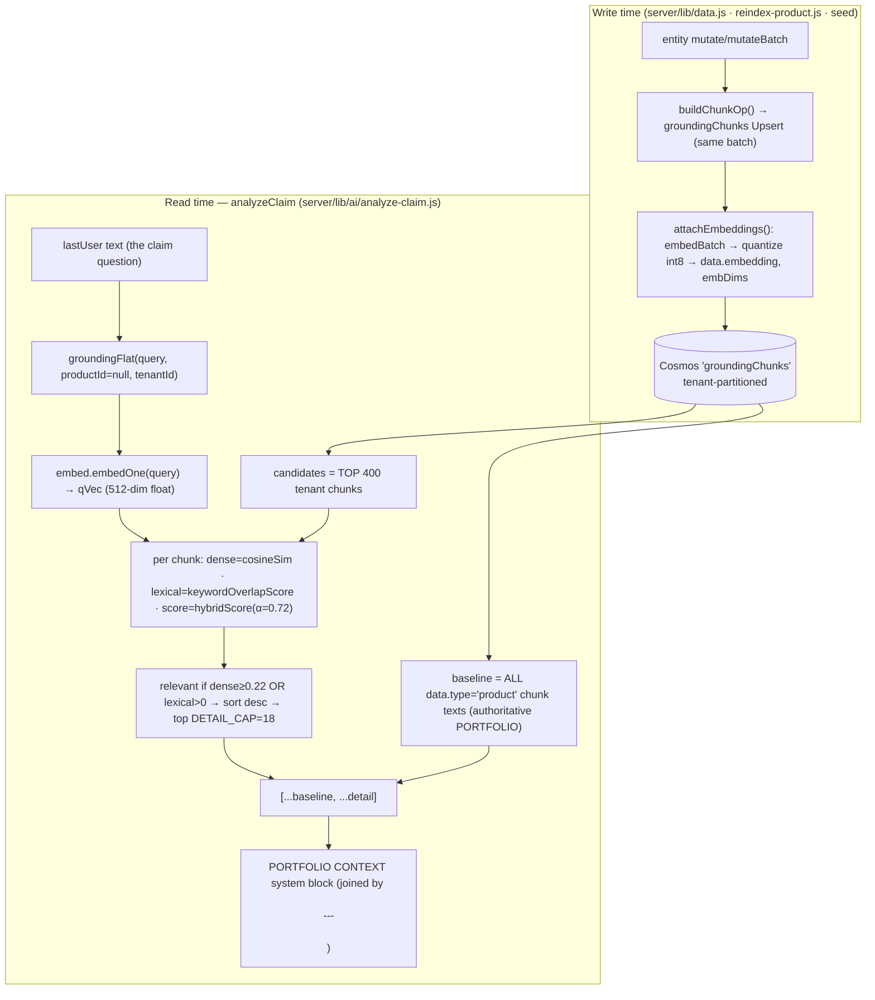

# 05 · Embeddings & Retrieval (Grounding)

**What this covers.** How the Claims Analysis feature grounds every determination in *real*
portfolio data instead of letting the model invent facts. This document traces the full
retrieval-augmented-generation (RAG) path: what a **grounding chunk** is and how chunks are produced
and embedded **at write time**; the `embed.js` dense-embedding client (`text-embedding-3-small`, 512
dims, int8 quantization); the pure scoring primitives in `shared/src/retrieval/retrieve.ts` and how
they are bundled into `server/lib/retrieve-shared.cjs`; the hybrid `grounding()` ranker in
`server/lib/ai/_shared.js`; and exactly how `analyzeClaim` consumes it via `groundingFlat`. The
governing design intent throughout: **retrieval is an augmentation, never a correctness dependency**
— every failure path degrades to lexical or empty, and the *attached base form* remains the primary
authority. Every claim below is anchored to a file + line; where the code disagrees with the
handoff anchor, the code wins and the discrepancy is called out.

---

## 1. The big picture



The Claims path calls `groundingFlat(lastUser, null, req.user.tenantId)`
(`server/lib/ai/analyze-claim.js:83`). Because `productId` is `null`, the **entire tenant portfolio**
is in scope: the always-included product baseline plus up to 18 of the most relevant detail chunks
(coverages, rules, forms, dictionary terms, tables) become the `PORTFOLIO CONTEXT` the model may
cite. The attached form is passed separately as the primary authority (see
`03-BACKEND-PIPELINE.md`).

---

## 2. What a grounding chunk is

A **`GroundingChunk`** (`shared/src/retrieval/types.ts:33`) is one semantically coherent, citable
unit of the corpus:

```ts
export interface GroundingChunk {
  id:          string       // deterministic, e.g. "coverage:PH.COV.001.001"
  text:        string       // the body that is embedded / lexically ranked
  contentHash: string       // FNV-1a hash → re-embed only what changed
  metadata:    ChunkMetadata
}
```

`ChunkMetadata` (`types.ts:21`) carries the **load-bearing citation anchors** `refId` and
`formNumber` (plus `type`, `productId`, `path`, `title`, optional `section`). These are the same
ids the UI renders as chips and the same ids `analyzeClaim` verifies citations against — a chunk
"NEVER carries a fabricated id" (`types.ts:18-20`).

### 2.1 Semantic chunking (`shared/src/retrieval/chunk.ts`)

Chunking is **semantic, one idea per chunk** (`chunk.ts:3-7`), never a fixed byte window.
`buildBundleChunks(b)` (`chunk.ts:225`) walks a product bundle and emits one chunk per entity via
type-specific builders:

| Builder | Chunk id | Source | Notes |
|---|---|---|---|
| `chunkProduct` | `product:<refId>` | product doc | line of business, segment, base form |
| `chunkCoverage` | `coverage:<refId>` | coverage | requirement, claims basis, terms table |
| `chunkRule` | `rule:<refId>` | rule | `IF … THEN …` |
| `chunkFormRule` | `formRule:<refId>` | form-attachment rule | mandatory/optional |
| `chunkForm` | `form:<normalizeFormNumber>` | ISO form | edition, category |
| `chunkDictionary` | `dictionary:<refId|slug>` | dictionary term | aliases, allowed values |
| `chunkRatingProgram` | `ratingProgram:<refId>` | rating program | min premium, steps |
| `chunkLdTable` / `chunkRtTable` | `ldTable:` / `rtTable:` | limit/rate tables | rows |
| `chunkBaseFormText` | `baseForm:<norm>:<n>` | extracted base-form prose | paragraph split, heading-aware |

Two properties make the corpus incrementally buildable and citation-safe:

1. **Every chunk text repeats its `refId` / form number** as a prefix, e.g. `chunkCoverage`
   emits `Coverage: ${c.name} [${refId}]` (`chunk.ts:64`). This carries the citation anchor into
   *both* the dense embedding and the lexical fallback, so an id/name query weights the right chunk.
2. **Deterministic id + `contentHash`** (`chunk.ts:23`, FNV-1a 32-bit) means "the same entity always
   yields the same id + contentHash, so the indexer can diff by hash and re-embed only what changed"
   (`chunk.ts:9-11`). `shared` stays platform-free — the hash is dependency-free (no `node:crypto`).

`chunk.ts` is bundled to `server/lib/chunk-shared.cjs` by `pnpm build:chunk` (esbuild of
`shared/src/retrieval/chunk.ts`, see root `package.json`). The server loads it lazily
(`data.js:140` `getChunker()`, `_shared.js:258` `_getChunker`).

---

## 3. Producing & embedding chunks AT WRITE TIME

Chunks are not indexed by a background job — they ride the **same atomic Cosmos transactional
batch** as the entity write, so there is no eventual-consistency gap between an entity and its
grounding chunk. Three producers all converge on the identical chunk shape.

### 3.1 `data.js` mutate / mutateBatch (the live write path)

Inside `envelope()`, after building the entity/audit/version/searchIndex ops, a chunk op is
appended for every non-delete write (`server/lib/data.js:287-291`):

```js
// grounding chunk (non-delete only; same pk → same Cosmos partition → atomic)
if (op !== 'delete') {
  const chunkOp = buildChunkOp(entityType, path, mergedData, pk, tid, now)
  if (chunkOp) ops.push(chunkOp)
}
```

`buildChunkOp` (`data.js:147`) dispatches to the right `chunk-shared.cjs` builder and wraps the
result as a `groundingChunks` Upsert whose `data` is
`{ id, text, contentHash, metadata, type: entityType, productId, updatedAt }` (`data.js:164-172`).

Embeddings are attached **in place, in the same batch** by `attachEmbeddings` (`data.js:191-207`),
called from `commitEnvelope` immediately before `items.batch` (`data.js:305`):

```js
async function attachEmbeddings(opsBatches) {
  const chunkOps = []
  for (const ops of opsBatches) for (const o of ops)
    if (o?.operationType === 'Upsert' && o.resourceBody?.coll === 'groundingChunks' && o.resourceBody.data?.text) chunkOps.push(o)
  if (chunkOps.length === 0) return
  const em = getEmbed()
  const vecs = await em.embedBatch(chunkOps.map((o) => o.resourceBody.data.text))
  if (!vecs) return
  chunkOps.forEach((o, i) => {
    const q = em.quantize?.(vecs[i])
    if (q) { o.resourceBody.data.embedding = q; o.resourceBody.data.embDims = em.EMBED_DIMS }
  })
}
```

Two deliberate properties (`data.js:177-206`, `355-356`): (a) **one batched embeddings call across
every chunk op in the whole request**, so a bulk import/seed is a single embeddings round-trip, not
one per entity; (b) **best-effort** — any failure is swallowed, chunks are stored *without* a vector,
and the query-time retriever falls back to lexical ranking. "Embeddings are a retrieval-quality
enhancement, never a write dependency, so an embeddings outage can never fail (or slow to a crawl) a
mutation."

### 3.2 `reindexProduct` (in-Azure re-embed route)

`server/lib/ai/reindex-product.js` exposes `POST /api/ai/reindexProduct` (guarded by
`product:write` + `requireTenant`). It re-chunks a product and all its subcollections
(coverages/rules/formRules/ratingPrograms), embeds each chunk one-at-a-time via `embed.embedOne`
+ `embed.quantize` (`reindex-product.js:43-45`), and upserts. This is the reseed-without-full-migrate
path (Cosmos dev is IP-firewalled, so local writes are impossible; reindex runs *in* Azure).

### 3.3 Seed (`scripts/migrate-to-cosmos.ts`)

The canonical PH/PA/GL seed builds chunks with the same `buildBundleChunks` + `dedupeChunks`
(`migrate-to-cosmos.ts:118-123`) and embeds them best-effort in `embedSeedChunks` (batches of 96,
`dimensions: 512`, `quantizeInt8`, `migrate-to-cosmos.ts:137-170`) so seeded chunks are immediately
dense-retrievable with no reindex pass.

### 3.4 ⚠️ Write-time vs runtime chunk-scheme drift (verified caveat)

The three producers agree on chunk **content** but **disagree on the Cosmos id + partition key**:

| Producer | Doc `id` | Partition key `pk` | Path root |
|---|---|---|---|
| Seed (`migrate-to-cosmos.ts:123,185`) | `ent:<san(groundingChunks/…)>` | `${tenant}\|groundingChunks` | `groundingChunks/<chunkId>` |
| Runtime `data.js` / `reindex` (`data.js:167`, `reindex-product.js:47`) | `chunk:products~<…>` (`idFor('chunk', entityPath)`) | `${tenant}\|<productId>` | the product **entity** path |

The same logical chunk can therefore exist as **two distinct Cosmos documents** — one seeded, one
written by a later `reindexProduct`/mutate. `grounding()` runs a **cross-partition** query
(no pk pin) so it sees both, and **dedups by text** (`_shared.js:109,122,127`). The duplication is
invisible to retrieval quality but wastes storage; a single-scheme corpus migration is a known open
follow-up (matches the project memory note). This is a real drift, not a bug in the read path — the
dedup is what makes it safe.

---

## 4. The embedding client — `server/lib/embed.js`

`embed.js` is the dense-vector client, backed by **Azure AI Foundry's OpenAI-native embeddings
surface** (the `EMBED` fleet role, `text-embedding-3-small`). Constants (`embed.js:25-28`):

```js
const EMBED_DEPLOYMENT = process.env.AZURE_FOUNDRY_EMBED_DEPLOYMENT || fleet.DEPLOY_EMBED || 'text-embedding-3-small'
const EMBED_DIMS       = Number(process.env.AZURE_FOUNDRY_EMBED_DIMS) || 512
const MAX_BATCH        = 96    // texts per request (latency/robustness cap)
const MAX_CHARS        = 8000  // truncate long chunk text before embedding
```

### 4.1 512 dims + int8 quantization — the rationale

- **512 dims** are requested via the `dimensions` param (`embed.js:47`). `text-embedding-3-small`
  supports **Matryoshka truncation**, so a 512-dim vector is a valid, cheaper embedding than the
  native 1536 (`embed.js:4-6`).
- **int8 quantization** (`quantize` → `retrieve().quantizeInt8`, `embed.js:74-80`) stores each
  vector as `{ q: number[], s: number }` (quantized values + scale). A chunk vector costs **~0.5 KB
  in Cosmos instead of ~8 KB** of float64 JSON (`embed.js:6-8`). The correctness argument is the key
  insight: **cosine similarity is scale-invariant**, so int8 values rank *identically* to the float
  originals; `s` is retained only so a vector can be dequantized for exact cosine if ever needed
  (`retrieve.ts:64-72`, `embed.js:70-73`).

### 4.2 Best-effort, all-or-nothing batching

`embedBatch` (`embed.js:34`) is defensive on every axis:

1. `if (!fleet.isConfigured()) return null` — AI unconfigured → lexical fallback.
2. `const g = fleet.guard(); if (!g.allow) return null` — **budget ceiling reached → skip embeds**,
   lexical fallback still answers (`embed.js:38-39`). Note: claims stays fully cost-guarded here even
   though `analyzeClaim` already passed its own top-level `fleet.guard()` check — the embed within
   grounding re-checks independently.
3. Splits into `≤ MAX_BATCH` requests; **all-or-nothing** — if any sub-batch fails the *whole* call
   returns `null` (`embed.js:60`). The comment explains why: a partially-embedded corpus would make
   hybrid scores "incomparable across chunks" (`embed.js:31-33`).
4. Records cost: `fleet.record(EMBED_DEPLOYMENT, total_tokens, 0)` — embeddings bill input tokens
   only (`embed.js:52-53`).

`embedOne` (`embed.js:65`) is a thin single-text wrapper over `embedBatch`.

---

## 5. The scoring primitives — `shared/src/retrieval/retrieve.ts`

The math that ranks chunks lives in `retrieve.ts` as **pure, platform-free functions**, bundled to
`server/lib/retrieve-shared.cjs` by `pnpm build:retrieve`. Keeping them here means the ranker is
**unit-tested in the offline gate** rather than hidden behind a live embeddings call, and it
"guarantees the query and document tokenization always match" (`retrieve.ts:81-83`) — a classic
source of silent lexical-recall bugs.

| Function | Line | Role |
|---|---|---|
| `cosineSim(a, b)` | 54 | dot / (‖a‖·‖b‖); returns 0 if either is a zero vector |
| `quantizeInt8(vec)` | 67 | symmetric int8, `scale = max/127`, values clamped to ±127 |
| `dequantizeInt8(q)` | 74 | `values.map(v => v * scale)` |
| `retrievalTerms(s)` | 87 | **single source of truth** tokenizer: lowercase, split non-alnum, keep terms ≥2 chars |
| `keywordOverlapScore(query, text)` | 104 | lexical relevance in [0,1] |
| `hybridScore(dense, lexical, alpha)` | 124 | blend dense + lexical into one ranking score |
| `lexicalRetrieve(...)` | 29 | TF-IDF cosine — the **offline eval / functions fallback**, *not* the server claims path |

### 5.1 `keywordOverlapScore` — coverage + capped density

```js
const coverage = present / terms.length          // fraction of DISTINCT query terms matched
const density  = hits / (terms.length * 3)        // capped repetition bonus (≤3 hits/term)
return 0.8 * coverage + 0.2 * density             // retrieve.ts:113-115
```

Deterministic and corpus-free — a cheap complement to dense cosine that keeps exact refIds, form
numbers and rare domain terms "pulling their chunk up even when the embedding is lukewarm"
(`retrieve.ts:99-103`). Returns 0 for an empty query, so the dense score then stands alone.

### 5.2 `hybridScore` — graceful degradation

```js
export function hybridScore(dense: number | null, lexical: number, alpha = 0.7): number {
  if (dense === null || Number.isNaN(dense)) return lexical   // no vector → lexical unchanged
  const d = Math.max(0, Math.min(1, dense))                    // clamp negative cosines to 0
  return alpha * d + (1 - alpha) * lexical
}
```

When a chunk has no stored vector (embeddings API down, or the chunk predates embeddings),
`dense === null` and the lexical score is returned *unchanged*, so lexical-only fallback ranking
"degrades gracefully rather than collapsing to zero" (`retrieve.ts:118-123`). **Note the default
`alpha = 0.7` here is overridden at the call site** — the server passes `HYBRID_ALPHA = 0.72`
explicitly (§6).

> **Discrepancy note (code wins).** The `retrieve.ts` header comment (lines 1-13) describes a
> "Voyage embeddings + a vector store + a reranker" dense retriever "behind a provider seam" in
> `functions/src/retrieval`, and `retrieve.ts:79-80` names `server/lib/ai.js` as the caller. Both are
> **stale references**: `functions/` is legacy reference-only and NOT deployed, the real embeddings
> provider is Foundry `text-embedding-3-small` (`embed.js`), and the caller is now the split module
> `server/lib/ai/_shared.js` (`ai.js` no longer exists). `lexicalRetrieve` (the TF-IDF path via
> `search/rank`) is the *offline eval* fallback and is **not** what the deployed Claims path runs —
> `grounding()` uses `cosineSim` + `keywordOverlapScore` + `hybridScore` directly.

---

## 6. The `grounding()` algorithm — `server/lib/ai/_shared.js`

The deployed retriever. Constants (`_shared.js:80-83`, quoted verbatim):

```js
const GROUNDING_CAP = Number(process.env.AI_GROUNDING_CAP) || 400
const DETAIL_CAP    = Number(process.env.AI_DETAIL_CAP)    || 18
const HYBRID_ALPHA  = 0.72
const DENSE_FLOOR   = 0.22
```

`grounding(query, productId, tenantId)` (`_shared.js:96`) runs in six steps:

1. **Tenant-scoped store.** `resolveTenantStore(tenantId)` (the `SILO_READY` isolation seam,
   `_shared.js:98`) yields the tenant's Cosmos `docs` container. Every query filters
   `c.tenantId=@tid`.

2. **Authoritative PORTFOLIO baseline** (`_shared.js:103-110`). When there is **no `productId`**
   (the claims case), it pulls the text of **every** `data.type='product'` chunk — the exhaustive,
   always-present portfolio spine — and dedups by text:
   ```js
   const bSql = `SELECT c.data FROM c WHERE c.kind='entity' AND c.coll='groundingChunks'
                 AND c.tenantId=@tid AND c.data.type=@etype`   // @etype = 'product', maxItemCount 200
   baseline = [...new Set(bRes.map((r) => String(r.data?.text || '')).filter(Boolean))]
   ```
   The baseline is included **unconditionally**, regardless of any relevance score.

3. **Candidate pull** (`_shared.js:112-115`): `SELECT TOP 400` tenant chunks
   (`+ AND c.data.productId=@pid` when a `productId` is supplied; claims omits it, so all chunk
   types are candidates).

4. **Query embedding** (`_shared.js:117`): `qVec = query.trim() ? await embed.embedOne(query) : null`.
   An empty query → `qVec = null` → dense is `null` for every candidate (lexical stands alone), yet
   the baseline is still returned in full. This is the "augmentation, never a dependency" guarantee
   in action.

5. **Dedup + per-chunk hybrid scoring** (`_shared.js:122-142`). Candidates already in the baseline
   are skipped (`baselineSet.has(text)`); remaining duplicates are deduped **preferring the embedded
   copy** (`hasEmb && !prev.hasEmb`, `_shared.js:130`). Then each surviving candidate is scored:
   ```js
   const dense    = (qVec && cvec && cos) ? cos(qVec, cvec) : null
   const lexical  = kw ? kw(query || '', lexicalTargetOf(data)) : 0
   const score    = hyb ? hyb(dense, lexical, HYBRID_ALPHA) : lexical
   const relevant = (dense !== null && dense >= DENSE_FLOOR) || lexical > 0   // DENSE_FLOOR = 0.22
   if (relevant) scored.push({ text, score })
   ```
   `lexicalTargetOf(data)` (`_shared.js:91-94`) is `${refId} ${refId} ${formNumber} ${title} ${text}`
   — **refId doubled**, mirroring the ×2 anchor weighting in `lexicalRetrieve`/`chunk.ts` so an
   id/form-number query surfaces the right chunk.

6. **Top-K detail** (`_shared.js:143`): sort by `score` desc, take **top `DETAIL_CAP = 18`**, return
   `{ baseline, detail }`. Any failure in the whole function is caught and returns
   `{ baseline: [], detail: [] }` (`_shared.js:145`) — never a throw into the caller.

`groundingFlat` (`_shared.js:148`) simply concatenates: `return [...baseline, ...detail]`.

**Relevance gate semantics.** A candidate reaches `detail` if **either** its dense cosine ≥ 0.22
**or** it has any lexical overlap (>0). So a chunk with a strong embedding match survives even with
zero keyword overlap, and an exact-id keyword match survives even with a lukewarm embedding — the two
signals are complementary, and `hybridScore(α=0.72)` weights dense 72% / lexical 28% for the final
ordering.

---

## 7. How CLAIMS consumes grounding

In `analyzeClaim` (`server/lib/ai/analyze-claim.js:82-88`):

```js
emit(res, { t: 'tool', name: 'load:context', phase: 'start', summary: 'Loading portfolio context' })
const ctx = await groundingFlat(lastUser, null, req.user.tenantId)   // productId = null → whole portfolio
emit(res, { t: 'tool', name: 'load:context', phase: 'end', summary: `${ctx.length} context chunk(s)` })
const systemBlocks = [
  { type: 'text', text: CLAIMS_SYSTEM, cache_control: { type: 'ephemeral' } },
  { type: 'text', text: `\n\nPORTFOLIO CONTEXT:\n${ctx.length ? ctx.join('\n\n---\n\n') : '(no matching context found)'}` },
]
```

Key facts:

- **Query = the last user message** (`lastUser`, `analyze-claim.js:73`) — the claim question/scenario,
  not the form text. The form document is attached *separately* as the primary authority; grounding
  supplies the *portfolio* side.
- **`productId` is `null`** → the entire tenant portfolio (product baseline + up to 18 detail chunks)
  is in scope. A claim form need not correspond to a seeded product, so scoping to one product would
  be wrong.
- **The array is joined with `\n\n---\n\n`** into one `PORTFOLIO CONTEXT` system block. If grounding
  returns empty, the block reads `(no matching context found)` and the determination proceeds
  form-only — the model still answers, honestly, from the attached form.
- **Citations are verified against this context.** After the model emits its determination,
  `analyzeClaim` collects every `[bracket]` token from `citations` + `reasoning`, checks each against
  the bracket tokens actually present in `ctx`, and emits an `unverified` notice for any that are not
  found and don't start with a digit (`analyze-claim.js:142-147`). This closes the loop: retrieval
  provides the citable material, and a citation the retrieval *didn't* supply is flagged. (The
  separate citation-*downgrade* rule at `analyze-claim.js:103-107` — no bracketed reasoning →
  verdict forced to `NOT_ADDRESSED` — is documented in `03-BACKEND-PIPELINE.md`.)

---

## 8. Design intent — retrieval is augmentation, never a correctness dependency

Every layer fails **open to a weaker-but-honest** signal, never to a wrong answer:

| Failure | Behavior | Where |
|---|---|---|
| Foundry embeddings unconfigured / over budget / timeout | `embedBatch` → `null` → lexical ranking only | `embed.js:38-61` |
| A chunk has no stored vector | `dense === null` → `hybridScore` returns lexical unchanged | `retrieve.ts:124-127` |
| `retrieve-shared.cjs` bundle absent | `getRetrieve()` → `{}`; `hyb`/`cos`/`kw` undefined → `score = lexical`, no crash | `_shared.js:86-89,139` |
| Cosmos query / any error in `grounding()` | caught → `{ baseline: [], detail: [] }` | `_shared.js:145` |
| Grounding returns empty for claims | `PORTFOLIO CONTEXT` = `(no matching context found)`; determination proceeds form-only | `analyze-claim.js:87` |
| Embeddings fail at **write** time | chunk stored vector-less; lexical fallback still ranks it | `data.js:206` |

The **attached base form is always the primary authority** (`CLAIMS_SYSTEM`, `analyze-claim.js:52-53`).
Grounding enriches the determination with portfolio refIds/clauses the model can cite, but a
grounding outage degrades the answer's *richness*, never its *correctness* — and the citation
verification + downgrade rules ensure an ungrounded verdict cannot masquerade as a cited one.

---

## 9. Verified constants & identifiers (quick reference)

| Constant / id | Value | Source |
|---|---|---|
| `GROUNDING_CAP` | `env AI_GROUNDING_CAP` \|\| **400** | `_shared.js:80` |
| `DETAIL_CAP` | `env AI_DETAIL_CAP` \|\| **18** | `_shared.js:81` |
| `HYBRID_ALPHA` | **0.72** | `_shared.js:82` |
| `DENSE_FLOOR` | **0.22** | `_shared.js:83` |
| baseline `maxItemCount` | **200** | `_shared.js:107` |
| `EMBED_DIMS` | `env` \|\| **512** | `embed.js:26`, `migrate-to-cosmos.ts:136` |
| `MAX_BATCH` (embeds/request) | **96** | `embed.js:27`, seed `BATCH` `migrate-to-cosmos.ts:146` |
| `MAX_CHARS` (truncate before embed) | **8000** | `embed.js:28` |
| embed deployment (`EMBED` role) | `text-embedding-3-small` | `embed.js:25` |
| int8 scale | `max / 127`, values ±127 | `retrieve.ts:67-71` |
| lexical blend | `0.8·coverage + 0.2·density` | `retrieve.ts:115` |
| chunk stored shape | `{ id, text, contentHash, metadata, type, productId, embedding?{q,s}, embDims?, updatedAt }` | `data.js:170`, `reindex-product.js:44-45` |

**Bundles** (esbuild → CJS, root `package.json`): `pnpm build:chunk` →
`server/lib/chunk-shared.cjs`; `pnpm build:retrieve` → `server/lib/retrieve-shared.cjs`. Both are
part of the top-level `pnpm build` chain and must be rebuilt when `shared/src/retrieval/*` changes.

---

## Related documents

- [README.md](./README.md) — dossier index
- [01-OVERVIEW.md](./01-OVERVIEW.md) — what Claims Analysis is
- [02-ARCHITECTURE.md](./02-ARCHITECTURE.md) — component & data-flow map
- [03-BACKEND-PIPELINE.md](./03-BACKEND-PIPELINE.md) — `analyzeClaim` handler, tool schema, citation downgrade
- [04-MULTI-MODEL-ORCHESTRATION.md](./04-MULTI-MODEL-ORCHESTRATION.md) — fleet roles, cost guard, `resolveModel`
- **05-EMBEDDINGS-AND-RAG.md** — this document
- [06-FRONTEND.md](./06-FRONTEND.md) — `Claims.tsx`, SSE consumption, DeterminationCard
- [07-DATA-MODEL-AND-CONTRACTS.md](./07-DATA-MODEL-AND-CONTRACTS.md) — entities, StreamEvent protocol
- [08-DESIGN-PATTERNS.md](./08-DESIGN-PATTERNS.md) — cross-cutting patterns & invariants
- [09-RECREATE-FROM-SCRATCH.md](./09-RECREATE-FROM-SCRATCH.md) — rebuild guide
- [10-INVARIANTS-AND-TESTS.md](./10-INVARIANTS-AND-TESTS.md) — binding invariants & test coverage
- [code-inventory.md](./code-inventory.md) — file-by-file index
