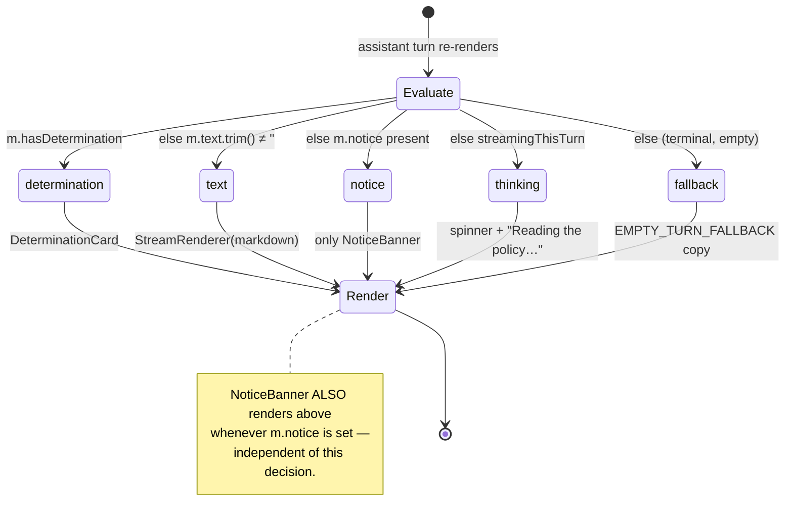

# Claims Analysis — Frontend (React) Layer

**What this covers.** The complete React implementation of the Claims Analysis "coverage
copilot": the `Claims.tsx` route as a state machine (live base-forms subscription, `selectedForm`,
the multi-turn `messages` model with `historyText` serialization of card turns, the `ask()` streaming
flow, `patchAssistant`, and the per-turn `AbortController` lifecycle); the SSE consumption switch and
its RAF token-batching optimisation; the composer gate; the `DeterminationCard` anatomy and its
design-token discipline; the four pure, unit-tested client libraries (`determination.ts`, `bubble.ts`,
`baseForm.ts`, `gapFeedback.ts`); the `BaseFormsLibrary` upload→identify→status flow with its duplicate
guard and VIEWER read-only floor; the shared `StreamRenderer`; accessibility discipline; and how the
shared claims line-profile registry drives scenario starters and chip labels client-side. Every claim
is grounded in the code with `repo-relative:line` citations; where the code diverges from the anchor,
the code wins and the divergence is called out.

All paths below are relative to the repo root
`c:/Users/salvatore.scrudato/Desktop/314358_InsurancePlatformsAI`.

---

## 1. Where the feature lives

| Concern | Location |
|---|---|
| Route component | `app/src/routes/Claims.tsx` (default export `Claims`) |
| Route mount | `app/src/App.tsx:75` — `<Route path="claims" element={<Claims />} />` (→ `/app/claims`) |
| Lazy import | `app/src/App.tsx:25` — `const Claims = lazy(() => import('./routes/Claims'))` |
| Sidebar entry | `app/src/components/shell/Sidebar.tsx:31` — INTELLIGENCE group, label **"Claims Analysis"**, `icon: IconChart`, `flag: 'page.claims'` |
| Topbar title | `app/src/components/shell/Topbar.tsx:15` — `claims: 'Claims Analysis'` |

The sidebar item carries `flag: 'page.claims'`, so the nav link is **feature-flag gated client-side** in
addition to the server gating `/api/ai/analyzeClaim` behind the same `page.claims` flag (per the backend
docs). The route is code-split (React `lazy`), so the Claims bundle only loads when navigated to.

Two-pane layout (`Claims.tsx:302-431`): a fixed 320px left `<aside>` hosting `BaseFormsLibrary`, and a
right `<section>` (max-width `3xl`) hosting the context header, the scroll log, and the composer. On
mobile the panes stack (`flex-col lg:flex-row`).

---

## 2. The adapter seam (the browser never calls Anthropic)

All AI traffic flows through `adapter.fns` (`app/src/lib/backend/azure.adapter.ts`). Claims uses two
methods:

- **`fns.stream('analyzeClaim', payload, onChunk, signal)`** — `azure.adapter.ts:336-359`. POSTs to
  `${API}/api/ai/analyzeClaim` with the JWT, reads the response body as a stream, and for every line
  beginning `data: ` invokes `onChunk(line.slice(6))`:

  ```ts
  const lines = buf.split('\n')
  buf = lines.pop() ?? ''
  for (const line of lines) if (line.startsWith('data: ')) onChunk(line.slice(6))
  ```

  It throws `Stream analyzeClaim failed: <status>` on a non-OK / bodyless response
  (`azure.adapter.ts:343`), and always `reader.cancel()`s in `finally`. The `AbortSignal` is passed
  straight to `fetch`, so aborting the controller tears down the socket.

- **`fns.call('identifyBaseForm', payload)`** — `azure.adapter.ts:332-334`. A plain JSON POST to
  `/api/ai/identifyBaseForm`, used by `BaseFormsLibrary`, not by `Claims.tsx`.

`onChunk` receives the raw JSON *after* the `data: ` prefix; the caller (`Claims.tsx:232`)
`JSON.parse`s it into a `StreamEvent`. There is no Anthropic SDK, no model key, and no `/anthropic`
URL anywhere in the app bundle — the seam is the binding invariant.

---

## 3. `Claims.tsx` as a state machine

### 3.1 State

`Claims.tsx:126-149` declares the full machine:

| State | Type | Purpose |
|---|---|---|
| `forms` | `BaseForm[]` | live library, from the subscription |
| `loading` | `boolean` | library skeleton gate |
| `selectedId` | `string \| null` | the chosen form |
| `messages` | `ChatMessage[]` | the conversation transcript |
| `input` | `string` | composer text |
| `streaming` | `boolean` | a turn is in flight |
| `linkedMsgs` | `Set<number>` | message indices whose coverage gap became linked feedback |
| `srAnnounce` | `string` | the single polite screen-reader announcement |

Refs (not state, to avoid re-renders): `scrollRef` (auto-scroll target), `abortRef`
(`AbortController | null`), `textBufferRef` (RAF token buffer), `rafRef` (pending
`requestAnimationFrame` handle).

The `ChatMessage` model (`Claims.tsx:36-46`) is the heart of the transcript:

```ts
interface ChatMessage {
  role: 'user' | 'assistant'
  text: string
  tools: ToolChip[]
  determination?: Determination
  notice?: NoticeEvent      // kept separate so a token flush can't wipe it
  historyText?: string      // what we send back as history (card turns serialise their determination)
}
```

`ToolChip` is `{ name; done; summary? }` (`Claims.tsx:35`).

### 3.2 Live forms subscription, sorting, selection

- **Subscription** (`Claims.tsx:152-157`): `adapter.db.subscribe<BaseForm>('baseForms', …)` — the Azure
  adapter degrades Cosmos to smart polling under the hood (`azure.adapter.ts:213-272`), but the
  component sees Firestore-style live delivery: it sets `forms` and clears `loading` on each array
  payload. The returned unsubscribe is the effect cleanup.
- **Sorting** (`Claims.tsx:159-162`): `sortedForms` sorts newest-first via `toMillis`, which maps a
  pending `serverTimestamp` to `Number.MAX_SAFE_INTEGER` so a just-uploaded form sorts to the top
  (`Claims.tsx:69-74`).
- **`selectedForm`** (`Claims.tsx:163-166`): resolved from `sortedForms` by `selectedId`, or `null`.
- **`lineProfile`** (`Claims.tsx:170`): `resolveClaimsLineProfile(selectedForm?.lob)` — the shared,
  case-insensitive registry lookup (unknown → GENERIC). Drives the one-tap starters and chip tooltips
  (§11).

### 3.3 AbortController lifecycle (selection change + unmount)

Two effects and the `ask()` body cooperate so a stream can never bleed across forms or leak past
unmount:

```ts
// New selection = a different policy → abort the running stream and reset the thread.
useEffect(() => { abortRef.current?.abort(); setMessages([]); setInput(''); setLinkedMsgs(new Set()) }, [selectedId])   // :174
// Unmount → abort any in-flight analysis so it stops consuming tokens/network.
useEffect(() => () => abortRef.current?.abort(), [])   // :177
```

Inside `ask()` (`Claims.tsx:226-228`) a fresh `AbortController` is created per turn, the previous one
aborted first, and `abortRef` repointed. The `finally` clause (`Claims.tsx:298`) only clears
`streaming` **if `abortRef.current === controller`** — so a superseded turn does not switch off the
spinner for the turn that replaced it. In the `catch`, an `AbortError` is swallowed silently
(`Claims.tsx:288`).

### 3.4 Auto-scroll and the completion announcement

- Auto-scroll (`Claims.tsx:179-181`): every `messages` change smooth-scrolls the log to the bottom.
- Completion announcement (`Claims.tsx:184-192`): a `[streaming]`-keyed effect fires once when
  `streaming` flips false and the last message is a non-empty assistant turn, setting
  `srAnnounce = 'Response ready'` for 1.5 s then clearing it. This is the *single* polite announcement
  that replaces per-token live-region noise (§10).

### 3.5 The composer gate

`composerReady = isFormAnalyzable(selectedForm)` (`Claims.tsx:194`) is the one gate: `true` only when
the form is `READY` **and** has a `storagePath` (`baseForm.ts:36-38`). It drives `disabled` on the
`ChatComposer` and the visibility of the starter chips.

### 3.6 The `ask()` flow

`ask(text)` (`Claims.tsx:196-300`) is the turn engine:

1. **Guard** (`:201`): bail if empty, already `streaming`, no `selectedForm`, or
   `!isFormAnalyzable(selectedForm)`. This re-checks the composer gate so a stray voice/auto-submit can
   never send a payload for a selected-but-not-ready form.
2. **Optimistic transcript** (`:204-207`): append the user turn plus an *empty* assistant turn, set
   `streaming`, clear the token buffer.
3. **Wire history** (`:209`): `history.map(m => ({ role: m.role, content: m.historyText ?? m.text }))`.
   A prior card turn serialises through `historyText` (see `determinationToText`, §3.7) so multi-turn
   follow-ups keep the determination's context rather than an empty string.
4. **Payload** (`:210-216`):

   ```ts
   const payload = {
     messages: wire,
     formNumber: selectedForm.formNumber,
     formStoragePath: selectedForm.storagePath,
     formStorageMediaType: selectedForm.mediaType ?? 'application/pdf',
     ...(selectedForm.lob ? { lob: selectedForm.lob } : {}),
   }
   ```

   The server fetches the *actual* PDF from `formStoragePath` (Blob), so the browser never re-uploads
   it here. `lob` is sent when present — but note the server currently does **not** consume it (§11).
5. **`patchAssistant`** (`:218-224`): a setter that immutably replaces the *last* message iff it is the
   assistant turn. Every SSE handler mutates through it, so a race with a stale closure can only ever
   touch the current assistant bubble.
6. **AbortController per turn** (`:226-228`), then `await adapter.fns.stream('analyzeClaim', payload,
   onChunk, controller.signal)`.
7. **`finally`** (`:290-299`): cancel any pending RAF and do one final buffer flush so no trailing
   tokens are dropped, then clear `streaming` (guarded by the identity check above).

### 3.7 `determinationToText` — faithful card serialization

`determinationToText(d)` (`Claims.tsx:77-92`) linearises a `Determination` into plain text that
survives as `historyText`: verdict + summary, then `Coverages that apply`, `What's not covered`,
`Limits & deductibles`, `Reasoning`, `Things to consider`, `Not determined by the form`, and
`Coverage gap`, each with its bracketed `[refId]` / `[formNumber]` citations preserved. Empty sections
are filtered out. This is what keeps a follow-up question ("what about the deductible?") grounded in the
prior verdict.

---

## 4. The SSE consumption switch

`onChunk` (`Claims.tsx:230-286`) parses each chunk and switches on `ev.t`. The client union
(`Claims.tsx:27-33`) is a hand-maintained mirror of the server `emit()` protocol (the comment points at
`functions/src/runtime.ts`, which is legacy-reference; the live contract is the server AI router):

| `ev.t` | Handler (`Claims.tsx`) | Effect |
|---|---|---|
| `token` | `:234-243` | append `ev.v` to `textBufferRef`; schedule a RAF flush if none pending |
| `tool` | `:244-257` | flush + cancel RAF; on `start` push a `{name, done:false}` chip **and reset `text:''`** (drop pre-tool thinking); on `end` mark the most-recent matching chip `done` + attach `summary` |
| `json` | `:258-276` | only `key==='determination'`: guarantee footer `formNumber`, then `shouldRenderDetermination` gate |
| `notice` | `:277-280` | store `{ level, message, kind, refs }` in `m.notice` (its own field) |
| `error` | `:281-282` | append `\n\n⚠️ ${ev.message}` to `text` |
| `done` | `:283` | no-op (the stream's natural end) |
| *default* | `:284` | ignored — forward-compat for an unknown event type; the bubble fallback still applies |

Tool chips render with honest human labels from `TOOL_LABELS` (`Claims.tsx:49-59`, e.g.
`emit_determination` → "Forming the determination", `get_coverage` → "Reading coverage"); an unmapped
name falls back to the raw tool name (`Claims.tsx:391`). A `done` chip optionally shows its `summary`.

### 4.1 The determination gate (defense in depth)

`json`/`determination` (`Claims.tsx:258-275`):

```ts
const withForm = { ...d, formNumber: d.formNumber || selectedForm.formNumber || undefined }
if (shouldRenderDetermination(withForm)) {
  patchAssistant(m => ({ ...m, determination: withForm, historyText: determinationToText(withForm) }))
} else {
  patchAssistant(m => ({ ...m,
    text: m.text || "I couldn't ground that determination in the form — please rephrase the scenario.",
    historyText: undefined }))
}
```

The footer form-number chip is *guaranteed* even if the model omits it, by falling back to
`selectedForm.formNumber`. The gate mirrors the server's resolve-or-downgrade rule so a fabricated or
uncited substantive verdict that ever slipped past the server is refused rendering and asks for a
rephrase (§7.1).

### 4.2 RAF token batching (the render optimisation)

**Why:** a streamed determination emits hundreds of tiny token chunks. Calling `setMessages` per token
would trigger a React re-render per token and drop frames. Instead (`Claims.tsx:234-243`), each token
appends to `textBufferRef.current` (a mutable ref, no render), and a single
`requestAnimationFrame` is scheduled that flushes the *whole* accumulated buffer to state once per
frame:

```ts
case 'token':
  textBufferRef.current += ev.v
  if (rafRef.current === null) {
    rafRef.current = requestAnimationFrame(() => {
      rafRef.current = null
      const txt = textBufferRef.current
      patchAssistant(m => ({ ...m, text: txt }))
    })
  }
  break
```

Coordination points:
- **Tool boundary** (`:246`): a starting/ending tool cancels any pending RAF and flushes immediately so
  chips and text stay in sync; a `start` also resets `text:''` to drop pre-tool "thinking" prose.
- **Final flush in `finally`** (`:291-297`): cancels the pending RAF and does one last flush so the
  last frame's tokens are never lost when the stream ends between animation frames.

This pattern is the frontend twin of the server's per-token emit — bounded to ≤1 React commit per
frame regardless of token rate.

### 4.3 Placeholder / hint state machine

The composer's `placeholder` and `hint` are derived purely from `selectedForm`
(`Claims.tsx:413-425`):

| Condition | placeholder | hint |
|---|---|---|
| no form | "Select a base form on the left to begin" | "Select a base form to start a coverage conversation" |
| `PROCESSING` | "Reading the form…" | *(default grounded hint)* |
| `NEEDS_REVIEW` | "This form couldn't be identified — an editor needs to review it before analysis" | "We couldn't read this form's number or line, so analysis is disabled…" |
| `READY` but no `storagePath` | "This form has no stored document — please remove and re-upload it" | "The PDF for this form is missing — remove the card and upload the form again" |
| analyzable | "Describe a loss — e.g. \"a pipe burst and flooded the kitchen\"…" | "Grounded in the selected form — every answer cites its source" |

---

## 5. The assistant bubble — the no-blank-bubble invariant

`AssistantContent` (`Claims.tsx:97-124`) renders every assistant turn through a single pure decision so
the bubble is **never empty**. It calls `assistantBubbleContent` (`bubble.ts:19-25`):

```ts
export function assistantBubbleContent(m, streamingThisTurn): BubbleContent {
  if (m.hasDetermination) return 'determination'
  if (m.text.trim())      return 'text'
  if (m.notice)           return 'notice'
  if (streamingThisTurn)  return 'thinking'
  return 'fallback'
}
```

`BubbleContent` is `'determination' | 'text' | 'notice' | 'thinking' | 'fallback'` (`bubble.ts:6`).
The fallback copy is a named constant (`bubble.ts:29-30`):

```ts
export const EMPTY_TURN_FALLBACK =
  "I couldn't produce a response for that. Please try again in a moment, or rephrase the scenario."
```

**Nuance the anchor abstracts over:** the `NoticeBanner` renders *unconditionally* whenever `m.notice`
is present, *above* the content switch (`Claims.tsx:107`). So a determination or text turn that also
carried a `notice` (e.g. a degrade advisory) shows the banner **and** the card/text. The
`content === 'notice'` branch is therefore the specific case where the banner is the *only* thing to
show — the switch's four content branches (`determination`/`text`/`thinking`/`fallback`) do not include
`'notice'`, so when the decision returns `'notice'` none of them render and only the banner appears
(`Claims.tsx:105-123`). The `thinking` state shows a spinner + "Reading the policy…"
(`Claims.tsx:116-120`).

Purity + tests: `bubble.ts` is platform-free and unit-tested (`app/src/lib/claims/bubble.test.ts`), so
the "every terminal SSE path shows something" invariant is proven without a live stream.

### 5.1 Bubble content decision (mermaid)



---

## 6. `DeterminationCard` anatomy

`app/src/components/claims/DeterminationCard.tsx` is the centerpiece: a grounded verdict read as a
structured card. All colour derives from design tokens and `color-mix` — no hard hex (binding
invariant).

### 6.1 Verdict presentation

The `VERDICT` map (`DeterminationCard.tsx:25-30`) is the single source for each verdict's label,
plain-language headline, and driving token:

| Verdict | label | headline | token |
|---|---|---|---|
| `COVERED` | "Covered" | "This policy covers this." | `var(--color-good)` |
| `NOT_COVERED` | "Not covered" | "This policy does not cover this." | `var(--color-danger)` |
| `PARTIAL` | "Partially covered" | "This policy may cover this — it depends." | `var(--color-warn)` |
| `NOT_ADDRESSED` | "Not addressed" | "This policy doesn't address this." | `var(--color-dim)` |

The one token drives the emblem, the slim top accent bar (`:266`), the header wash
(`color-mix(in srgb, ${token} 8%, var(--color-surface))`, `:175`), and the verdict pill. `NOT_ADDRESSED`
is deliberately neutral slate — never a coverage-implying colour.

### 6.2 The verdict emblem

`VerdictMark` / `VerdictEmblem` (`DeterminationCard.tsx:33-56`) hand-roll a custom SVG per verdict — a
check `M23 34 L30 41 L44 23` for COVERED, an X for NOT_COVERED, a bang (line + dot) for PARTIAL, and a
neutral dash `M24 33 L42 33` for NOT_ADDRESSED — over two concentric token-tinted circles with a
`drop-shadow` derived from the token via `color-mix`.

### 6.3 Sections (in render order)

Sections are assembled into an array (`DeterminationCard.tsx:205-257`) and each rendered in a
divided block:

1. **Why it's `<label>`** (`:207-213`) — the `reasoning[]` (capped at 3) as cited `Point`s; the marker
   dot is the verdict token.
2. **Things to consider** (`:215-221`) — `considerations` (prefer the dedicated field, else fall back
   to `openItems`; capped at 3, `:184`); marker dot `var(--color-info)`.
3. **Document citations** (`:223-236`) — coverages + exclusions as `DocCitation` accordions
   (`<details>`), each a click-to-expand clause reader showing the coverage `definition` / exclusion
   `note`, its `RefChip` form number, and a `DataChip` internal refId. Coverage dots use the verdict
   token; exclusion dots use `var(--color-danger)`.
4. **Limits & deductibles** (`:238-247`) — `ValueRow`s; the list is split by `isDeductible =
   /deduct/i.test(label)` (`:190-193`) so deductibles render after limits, each with a mono value and a
   `RefChip` source.
5. **Data citations** (`:249-257`) — the provenance trace. `dataCitations` (`:197-203`) dedupes every
   internal `refId`/`formNumber`/limit-source/gap-source/citation in reading order and renders each as a
   `DataChip`.

Below the sections: a **"Not determined by the form"** callout (only when `considerations` came from a
*distinct* source so `openItems` isn't shown twice — `showOpenItemsCallout`, `:187`, `:293-303`), the
**coverage-gap callout** (`:306-334`, NOT_ADDRESSED/PARTIAL only, with `gap.note` + `gap.sources` chips
and the **"Create product feedback"** button / "Linked feedback" chip), and a footer
(`:337-339`) that always reads *"Grounded in `<formNumber>` + product data. This is a coverage-analysis
aid, not a claims decision."*

### 6.4 Citation chips (`CitedText`, `RefChip`, `DataChip`)

- `CitedText` (`DeterminationCard.tsx:61-82`) linkifies any `[bracketed]` token in free text into a
  crisp mono accent chip. Used in `Point`, `DocCitation` bodies, open-items, and the gap note.
- `RefChip` (`app/src/components/ui/RefChip.tsx`) renders **only user-meaningful ISO form numbers**
  (spaces, no dots). It returns `null` for an *internal* dotted refId (`isInternalRefId`,
  `RefChip.tsx:9`) — those are hidden everywhere except the Data-citations section.
- `DataChip` (`DeterminationCard.tsx:157-163`) deliberately shows *any* token including internal dotted
  refIds (`PA.COV.004.002`), because the Data-citations section *is* the provenance trace and those
  refIds are exactly what a reviewer wants.

The refId/form chip distinction is a binding invariant — the card never strips them.

---

## 7. Pure client libraries (`app/src/lib/claims/`)

All four are platform-free, unit-tested in the gate, and shared by the route + library so both sides
agree on the rules.

### 7.1 `determination.ts` — shape + the citation guard

Defines the `Verdict` union and the `Determination` interface (`determination.ts:8-40`): `verdict`,
`summary`, `coverages`, `exclusions?`, `limits`, `reasoning`, `considerations?`, `openItems?`,
`citations?`, `formNumber?`, `coverageGap?{note, sources?}`, `unverifiedCitations?`.

- `SUBSTANTIVE_VERDICTS = ['COVERED', 'NOT_COVERED', 'PARTIAL']` (`:45`) — the verdicts that assert
  coverage and therefore *must* be grounded. `NOT_ADDRESSED` is excluded (an absence has nothing to
  cite).
- `isDeterminationCited(d)` (`:54-61`) — true if any explicit `citation`, a coverage `refId|formNumber`,
  an exclusion `refId|formNumber`, a limit `source`, or a `[bracket]` in reasoning is present. The
  always-present footer `formNumber` **does not count on its own** — counting it would make every
  determination trivially "cited" and defeat the guard.
- `shouldRenderDetermination(d)` (`:67-71`) — the exact gate the UI applies at `Claims.tsx:263`:
  non-substantive always renders; a substantive verdict renders **only if** it is cited **and** carries
  no `unverifiedCitations`. This mirrors the server's resolve-or-downgrade rule, so a fabricated refId
  never reaches the card even if the server missed it (defense in depth). The header comment references
  `functions/src/claims.ts` as the authoritative server twin.

### 7.2 `baseForm.ts` — the form lifecycle

- `BaseFormStatus = 'PROCESSING' | 'READY' | 'NEEDS_REVIEW'` (`:10`).
- `statusAfterIdentify(meta)` (`:21-24`) → `READY` iff a printed `formNumber` **or** a recognised `lob`
  was read, else `NEEDS_REVIEW` — never a silent empty-metadata READY. `verified` does *not* gate the
  status.
- `isUnverified(form)` (`:29-31`) → `form.verified === false`: the form is READY + analyzable (the
  attached document is authority) but the forms catalogue couldn't confirm the number → the UI shows an
  "Unverified" chip.
- `isFormAnalyzable(form)` (`:36-38`) → `status === 'READY' && !!storagePath.trim()`. The single composer
  gate, used by `Claims.tsx:194,201`.

### 7.3 `gapFeedback.ts` — coverage gap → product feedback

- `matchedProductId(d)` (`:23-36`) — scans the determination's cited *internal* refIds
  (`INTERNAL_REFID = /^[A-Za-z]{2,4}\.[A-Za-z0-9]/`, `:18`; a form number has a space and never matches)
  and resolves the first whose prefix is a registered line to `${lob.prefix}.PROD.001` via the shared
  `resolveLobByRefId`.
- `buildGapFeedbackPrefill(d, opts)` (`:39-79`) — composes a prefilled **IDEA**: title from the gap note
  (truncated at 100 chars), a `note` body carrying the scenario + verdict + summary + coverage-gap +
  cited clauses + a "Suggested: close this gap" line, and a `context` of
  `{ label: 'Claims · Coverage gap', route: '/app/claims', baseFormNumber?, matchedProductId? }`.

Wiring in the route (`Claims.tsx:356-366`): a card whose verdict is `NOT_ADDRESSED`/`PARTIAL` with a
non-empty `coverageGap.note` gets an `onCreateFeedback` that calls `launch.openFeedback({
...buildGapFeedbackPrefill(det, { scenario, baseFormNumber }), onSubmitted: … })`. `launch` comes from
`useFeedbackLaunch()` (`app/src/context/useFeedbackLaunch.ts`), which returns `null` when no
`FeedbackProvider` is mounted — so the action only appears when the drawer is actually available. On
submission the message index is added to `linkedMsgs`, swapping the button for a "Linked feedback"
chip (`DeterminationCard.tsx:317-330`).

---

## 8. `BaseFormsLibrary` — the left pane

`app/src/components/claims/BaseFormsLibrary.tsx`. Every role sees the list and can select; only
EDITOR/ADMIN (`canEdit`) see the upload affordance.

### 8.1 The `BaseForm` entity

`BaseFormsLibrary.tsx:16-33`: `id, title, formNumber, edition, lob?, fileName, storagePath, url,
mediaType, status, verified?, uploadedBy, uploadedByName, createdAt?`.

### 8.2 Upload → identify → status flow

`upload(file)` (`BaseFormsLibrary.tsx:86-182`):

1. **Client pre-checks** — `isSupported` (PDF/txt/md, `:73-75`) and a 15 MB size cap (`:91-94`); the
   server independently enforces the decoded cap.
2. **File → Storage** (`:100-102`): `adapter.storage.upload('baseforms/${uid}/${id}/${filename}', file)`.
3. **Optimistic record** (`:105-113`): `adapter.db.mutate({ op:'create', path:'baseForms/${id}', data:{
   …, status:'PROCESSING' }, entityType:'baseForm', actor })`, then `onSelect(id)` — the card appears
   immediately as "Reading form…".
4. **Server identify** (`:126-130`): `adapter.fns.call('identifyBaseForm', payload)` where `payload` is
   `{ formBase64, mediaType, fileName }` for a PDF or `{ formText, fileName }` for text.
5. **Enrich + finalise** (`:136-146`): a second `mutate({ op:'update', … })`. **Critical detail
   (`:117-124`, `:139`): `op:'update'` is a FULL-replace Upsert, not a partial patch**, so every field
   that must survive — `storagePath, url, mediaType, fileName, uploadedBy, uploadedByName` (bundled as
   `baseFields`) — is re-sent alongside the new `title/formNumber/edition/lob`, `status =
   statusAfterIdentify(meta)`, and `verified:false` only when the catalogue couldn't confirm.
6. **Identify failure** (`:159-168`): the `catch` re-sends `baseFields` with `status:'NEEDS_REVIEW'` —
   an unidentified form is surfaced but held from analysis (never silently READY).

### 8.3 Duplicate-upload guard

`:148-158`: after a *verified* identify with a real normalised number, it searches `forms` for another
card with the same `normalizeFormNumber(formNumber)` **and** trimmed `edition`; a match sets `dup`,
which opens a `Dialog` (`:333-347`) offering **"Use existing"** (`switchToExisting` deletes the new copy
and selects the existing, `:195-204`) or **"Upload anyway"** (dismiss). The guard is skipped when the
number is unverified (nothing reliable to dedupe on).

### 8.4 Status, chips, and VIEWER read-only

Each card (`:260-321`) shows the title, a `RefChip` form number, the `lob` chip (tooltip from
`lineTitle` → the line profile display name, `:38-41`), the edition, an **"Unverified"** chip when
`status==='READY' && isUnverified(f)` (`:287-295`), and a status line: "Reading form…" (PROCESSING) /
"Needs review" (NEEDS_REVIEW) / "Ready" + relative time. The trash/remove control is EDITOR-only
(`:310-318`). For a VIEWER, the upload dropzone is absent and a footer note explains it:
*"Viewer — analysis only. Editors upload forms."* (`:326-330`). `canEdit` is computed in the route as
`canI(profile, 'product:write')` (`Claims.tsx:128`) — VIEWER and the inquiry personas hold
`product:read` + `ai:invoke` but not `product:write` (`app/src/lib/canI.ts:12-25`).

---

## 9. `StreamRenderer` — the markdown/streaming renderer

`app/src/components/ai/StreamRenderer.tsx` renders the `content === 'text'` branch (`Claims.tsx:113`).
It is the rich shared renderer for both the portfolio Home assistant and the claims copilot: a
Markdown block renderer (`parseBlocks`) with per-block `para-in` fade-in for newly-appearing blocks
(tracked via `prevCountRef`, `:505-511`), collapsible reasoning/consideration sections
(`COLLAPSIBLE_RE`, `:21`), coverage-comparison table headers (`COVERAGE_TABLE_RE`, `:268`), hand-rolled
SVG `Sparkline`s for lists/rows with ≥2 dollar amounts (`:68-112`), and citation chips.

**Nuance for Claims:** the route renders `<StreamRenderer text={m.text} streaming={streamingThisTurn} />`
(`Claims.tsx:113`) and passes **neither `onCite` nor `citationIndex`**. Consequently, in Claims the
`CitationChipWithCard` (`StreamRenderer.tsx:129-192`) renders as a non-interactive `<span>` chip (no
`onCite` → no navigation) with no hover card (no `index` → `lookupEntry` returns null). Interactive
citation hover cards are a Home-assistant capability; in Claims the structured `DeterminationCard` is the
primary citation surface and free-text streaming is a fallback. `StreamRenderer` is `memo`-wrapped
(`:541`).

---

## 10. Accessibility

- **Single polite announcement.** A dedicated `role="status" aria-live="polite" aria-atomic="true"
  sr-only` region (`Claims.tsx:348`) carries only `srAnnounce` ("Response ready"), set once per
  completed turn (`:184-192`). This is the sole spoken update per turn.
- **Silenced token log.** The scroll container is `role="log" aria-live="off"` (`Claims.tsx:350`) — the
  `aria-live="off"` explicitly overrides the implicit `polite` that `role="log"` would otherwise carry,
  so the hundreds of per-token DOM mutations are *not* announced. The inline comment states this intent
  (`:349`).
- **Decorative SVG.** The hero shield/voice-wave (`Starters`, `:439-507`) and the verdict emblem are
  `aria-hidden`. Tool chips' spinner/check icons are `aria-hidden`.
- **Card semantics.** `DeterminationCard` is an `<article aria-label="Coverage determination: <label>">`
  (`:263`); `DocCitation` uses native `<details>`/`<summary>` with `aria-controls`; the composer
  textarea has `aria-label="Message"` and the send/mic buttons have labels
  (`ChatComposer.tsx:133,149,172`).
- **Focus states.** Every interactive element carries `focus-visible:outline-2` accent rings (starters,
  form cards, accordions, feedback button).

---

## 11. Line profiles: scenario starters + chip labels (client) — and the honest gap

The shared registry `shared/src/claims/lineProfiles.ts` provides per-line `displayName`, `briefing`, and
`scenarios` for `HO` / `PA` / `GL`, with a `GENERIC` fallback (`resolveClaimsLineProfile`, `:133-136`).

**Client usage (verified):**
- **Scenario starters.** `Starters` receives `composerReady ? lineProfile.scenarios : []`
  (`Claims.tsx:352`); each is a one-tap `onPick(s)` → `ask(s)` button (`:492-501`). A GL form offers GL
  losses, an HO form offers HO losses — never a hard-coded list. GENERIC has no scenarios, so the
  starter row is hidden.
- **Chip tooltips/labels.** `lineTitle(code)` (`Claims.tsx:64-67`, `BaseFormsLibrary.tsx:38-41`) resolves
  the compact `lob` chip's `title` to the profile display name (or the raw code if GENERIC/unknown).
- **Payload.** `ask()` sends `lob` when present (`Claims.tsx:215`).

**The honest gap (verified against the anchor, confirmed by absence in the client contract):** the
client *sends* `lob` and *uses* the profile for UX, but per the backend docs the server
`analyze-claim.js` does **not** read `body.lob` nor inject `profile.briefing` — the server prompt is
line-agnostic and derives the line "from the form". So the rich per-line `briefing` in
`lineProfiles.ts` is currently **client/UX-only** (starters + labels), *not* wired into the
determination prompt. This is a real opportunity: injecting the detected line's `briefing` server-side
(gated on `body.lob`) would sharpen determinations without weakening the form-is-authority stance. See
`03-BACKEND-PIPELINE.md` for the server side.

---

## 12. Design-token discipline (binding invariant)

Every browser-rendered colour in the claims frontend is a `var(--color-*)` token or a `color-mix`
derived from one — there is no hard hex. Examples: the verdict wash and emblem shadow
(`DeterminationCard.tsx:45,51,175,270`), the tool chips' good/accent soft/line tokens
(`Claims.tsx:381-386`), the gap callout `var(--color-warn-*)` (`DeterminationCard.tsx:307-326`), the
Unverified chip `var(--color-warn-soft)/(--color-warn)` (`Claims.tsx:335-336`), and the composer's
`var(--gradient-accent)` send button (`ChatComposer.tsx:174`). The only hex-like literals are inside SVG
`fill/stroke` attributes that themselves reference `var(--color-accent)` (`Starters`,
`Claims.tsx:448-477`). This satisfies the CLAUDE.md "no hard-coded hex outside `app/src/index.css`" rule.

---

## 13. Findings & discrepancies vs the anchor

1. **Sidebar is also flag-gated.** Beyond the server gating `/api/ai/analyzeClaim` behind `page.claims`,
   the sidebar nav item itself carries `flag: 'page.claims'` (`Sidebar.tsx:31`) — the route is hidden
   client-side when the flag is off. (Anchor only mentioned the server gate.)
2. **`StreamEvent` comment points at legacy `functions/`.** `Claims.tsx:26` calls the client union a
   "mirror of `functions/src/runtime.ts` StreamEvent". `functions/` is legacy-reference/not-deployed; the
   live producer is the server AI router. The *shape* matches the server `emit()` protocol regardless —
   the comment is a stale pointer, not a behavioural bug.
3. **NoticeBanner renders independently of the bubble decision.** The banner shows whenever `m.notice` is
   set, above the content switch (`Claims.tsx:107`), so a determination/text turn that *also* carries a
   notice shows both. The `'notice'` `BubbleContent` value specifically means "banner is the only
   content." (Anchor's "notice → stored in its own field" is correct; this adds the render nuance.)
4. **`streaming` clear is identity-guarded.** `finally` only clears `streaming` when
   `abortRef.current === controller` (`Claims.tsx:298`), so a superseded turn cannot switch off the
   spinner for the turn that replaced it — a subtle but important correctness detail beyond "AbortController
   per turn."
5. **Line-profile briefing is client-only (confirmed gap).** Verified the client sends `lob` and uses
   the profile for starters/labels; the server does not inject the briefing. Documented in §11 as the
   anchor requested.
6. **StreamRenderer citation interactivity is inert in Claims.** Because Claims passes no `onCite` /
   `citationIndex`, the rich hover-card citation chips degrade to plain mono spans; the
   `DeterminationCard` is the real citation surface. (Not a defect — a scoping nuance worth recording.)

---

## Related documents

- `claims_analysis/README.md` — index / reading order
- `claims_analysis/01-OVERVIEW.md` — the feature at a glance
- `claims_analysis/02-ARCHITECTURE.md` — end-to-end architecture
- `claims_analysis/03-BACKEND-PIPELINE.md` — `analyzeClaim` handler, prompt, tool schema, citation downgrade
- `claims_analysis/04-MULTI-MODEL-ORCHESTRATION.md` — fleet routing, cost guard, model IDs
- `claims_analysis/05-EMBEDDINGS-AND-RAG.md` — grounding / hybrid RAG
- `claims_analysis/06-FRONTEND.md` — **this document**
- `claims_analysis/07-DATA-MODEL-AND-CONTRACTS.md` — entities, SSE protocol, wire contracts
- `claims_analysis/08-DESIGN-PATTERNS.md` — cross-cutting patterns
- `claims_analysis/09-RECREATE-FROM-SCRATCH.md` — build-it-yourself guide
- `claims_analysis/10-INVARIANTS-AND-TESTS.md` — invariants, test coverage, the gate
- `claims_analysis/code-inventory.md` — file-by-file inventory
