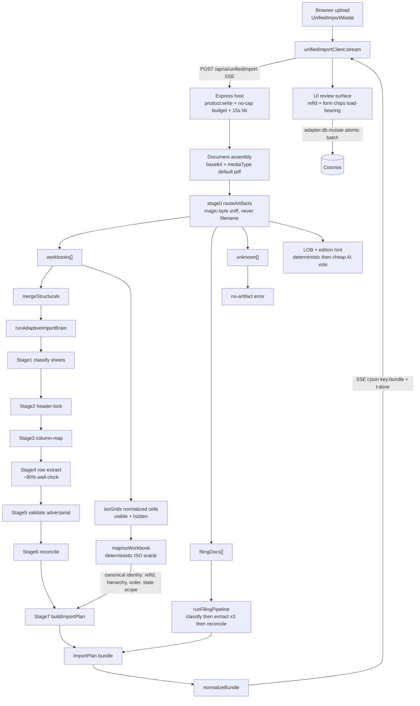
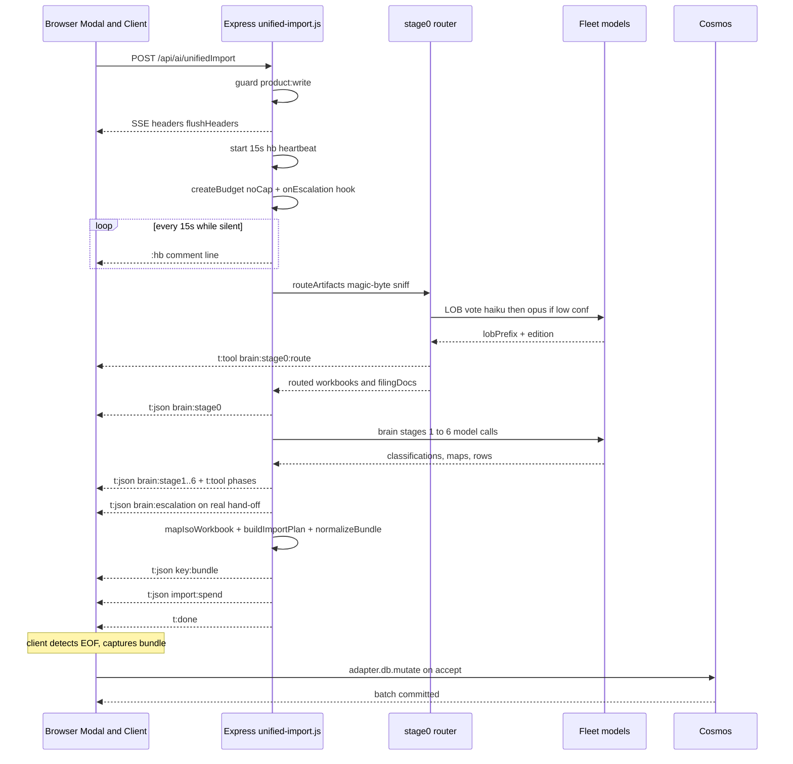
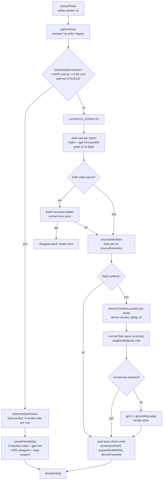
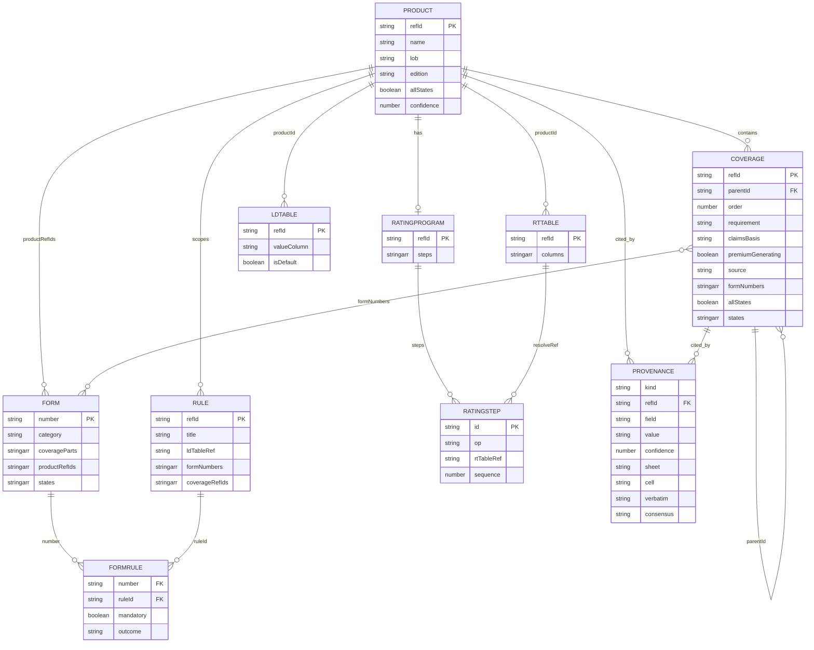

# Import Mechanism — Technical Assessment

> Reverse-engineered map of the Product Hub import mechanism, for external technical review. Generated from HEAD `2b1f893` (2026-07-14).

**This packet has three companion files:**
- **`IMPORT_MECHANISM_ASSESSMENT.md`** (this file) — narrative, architecture diagrams, subsystem deep-dives, and the verified top-10 improvement areas.
- **`IMPORT_PROMPTS.md`** — every AI prompt the mechanism issues, verbatim (20 prompts across the stages + filing path).
- **`IMPORT_CODE_APPENDIX.md`** — the complete source (49 files, ~12,000 lines) bundled with a table of contents.

_Method note: this assessment was produced by a multi-agent reverse-engineering pass — one reader per subsystem, a prompt extractor, a diagram builder, and an **adversarial verification pass that checked every proposed improvement against the current code**. Two candidate findings were rejected as already-fixed or not-real (listed at the end). Every claim cites `path:line`._


---

## 1. Executive summary

The import mechanism turns heterogeneous carrier artifacts — ISO-family product workbooks (`.xlsx`/`.xlsm`) and rate-filing PDFs — into a governed, fully-cited **ImportPlan** (product · coverages · forms · rules · form-rules · loss-development tables · rate tables), which the app then persists through its atomic-mutation adapter. Everything runs behind a single server-side, streaming endpoint: **`POST /api/ai/unifiedImport`** (Server-Sent Events, `product:write`-gated). The browser never holds a model or data-store credential.

**Two ingestion paths, one front door.** A deterministic stage-0 router sniffs each upload by magic bytes (never filename) and dispatches it:

1. **Workbook path** → a 6-stage adaptive "import brain" (classify → header-lock → column-map → extract → validate → reconcile), whose output is then joined in stage 7 with a **deterministic ISO-family mapper** that acts as the *canonical-identity oracle* (registry refIds, hierarchy, sibling order, state scopes, cross-sheet form-number joins). The brain supplies cited field *values*; the mapper supplies canonical *identity*.

2. **Filing path** → a PDF pipeline (classify → parallel rate-order / manual-rules / policy-form extraction via a text-or-vision model ladder → reconcile into a product shell).

**Design philosophy: deterministic-first, AI-where-needed, always decorrelated.** Deterministic fast paths handle confident cases (header scoring, code-based extraction, the ISO mapper). AI is invoked only where structure is ambiguous, and when it is, the second vote is always a **different model family** (Anthropic Claude vs OpenAI GPT) so correlated errors can't pass consensus. Disagreements climb an escalation ladder (haiku → sonnet → opus) and, when still unresolved, go to an LLM-as-judge; a final adversarial validator (a decorrelated GPT family) re-checks the assembled entities. **Two binding invariants hold throughout:** every extracted field carries a source-cell citation (`Sheet!Cell` + verbatim), and refIds are preserved byte-for-byte — never invented.

**Cost & telemetry.** Import runs under an `IMPORT_CONTEXT` no-cap budget exemption (never budget-denied or model-degraded mid-run), but spend telemetry (`fleet.record`, per-run `brain:spend`) is never bypassed.

### Current state (measured)

| Signal | Value |
|---|---|
| CORE reference workbook (25 sheets) — live golden F1 | **0.967** (target ≥ 0.95); numeric-exact 1.000; citation coverage 100% |
| GL / IM / PR golden formats | passing |
| CORE full run | ~95 min · ~$70 · 647 model calls |
| Forms-library GL run | ~38 min · ~$28 · 166 calls; **stage-4 extraction = ~90% of wall-clock** |
| Foundry capacity vs peak brain concurrency | ~10× headroom (peak ~12 in-flight calls) |

The headline performance fact — **stage-4 row extraction dominates wall-clock and spend** — drives most of the performance findings in §5. Two correctness/perf fixes shipped the day this assessment was written (a cell-normalization fix that restored rule state-scopes, and pooled stage-4 conflict re-extraction); both are reflected as current and excluded from the improvement list.


---

## 2. Architecture


### End-to-end import: upload to persisted plan

_The full POST /api/ai/unifiedImport path. Stage-0 magic-byte routing forks the upload into the 6-stage workbook brain (with the deterministic mapIsoWorkbook feeding stage-7 as the canonical-identity oracle) or the filing PDF pipeline; both converge on one normalized ImportPlan bundle streamed over SSE to the review UI and persisted through adapter.db.mutate._




### SSE request lifecycle

_Timeline of one streamed import between the browser client, the Express host, the fleet models and Cosmos. Shows the flushed SSE headers, the 15s :hb heartbeat that survives Azure's ~230s idle close during long silent stage-4 runs, the typed t:tool / t:notice / t:json event stream, the terminal bundle/done, and the client-driven persist._




### Stage-4 row extraction internals

_Why stage-4 dominates wall-clock. A confident map takes the zero-model deterministic fast path (byte-perfect cells + a 2-batch map cross-check); ambiguous/stacked/legacy sheets fall to the 20-row dual-vote ensemble, whose field conflicts are resolved once per sheet up a pooled sonnet to opus ladder plus a gpt-5.1 grounding judge, before a sequential post-pass synthesizes refIds and derives parent linkage._




### ImportPlan data model

_The FilingImportPlan entity graph produced by stage-7 and the ISO join. refId is the canonical linkage key (adopted from the ISO oracle, SYNTH when novel); coverages self-nest via parentId, forms/rules cross-link through formNumbers and formRules, rating steps reference RT tables, and every field of every accepted entity is mirrored into a cited provenance row._




---

## 3. Subsystem deep-dives

Ten subsystems, in pipeline order. Each section is reference-grade: how data moves, the concrete shapes it takes, and where it can go wrong.


### 3.1 Ingestion & artifact routing

This subsystem is the deterministic "front door" of POST /api/ai/unifiedImport. Given a bag of uploaded documents (base64 + optional declared mediaType), it decides WHAT each artifact is from its magic bytes (never its filename), reads XLSX/XLSM workbooks into normalized cell grids with ExcelJS, and splits the upload into three buckets — workbooks, filingDocs (PDFs), and unknown — so the correct downstream engine runs (6-stage adaptive brain for workbooks, filing pipeline for PDFs). It also derives a single content-grounded line-of-business hint and form edition (deterministic refId/name inference first, a cheap→escalated model vote only when inconclusive), merges multiple workbooks into one citable structural model, and carries the raw normalized grids forward as the input to the deterministic ISO-family mapper (the stage-7 canonical-identity oracle).

**Key files**

| File | Role |
|---|---|
| `server/lib/import-brain/workbook.js` | Magic-byte container sniffing (sniffContainer) + ExcelJS→StructuralModel reader (readWorkbookToStructural): true-extent scan, hidden-sheet handling, per-cell normalizeCellValue, merged-range extraction, isoGrids assembly. |
| `server/lib/import-brain/stage0-router.js` | Stage-0 artifact router (routeArtifacts): per-document sniff→dispatch into workbooks/filingDocs/unknown, PDF text-vs-vision decision, deterministic LOB inference then AI routing assist, warning collection, SSE brain:stage0 emit. |
| `server/lib/ai/unified-import.js` | SSE endpoint orchestration (unifiedImport): builds the docs array (incl. mediaType default + disk fixture resolve), calls routeArtifacts, mergeStructurals over the workbook bucket, dispatches to runBrainToBundle / runFilingPipeline / single-pass fallback, and normalizeBundle shaping. |
| `server/lib/import-brain/prompts.js` | System prompts — STAGE0_ROUTER_SYSTEM (the only routing-stage AI prompt) plus FIRST_PRINCIPLES prepended to it. |
| `server/lib/import-brain/constants.js` | REFID_TOKEN regex + extractJson used by the router's deterministic signal gathering and assist parsing. |
| `server/lib/import-brain/ai-call.js` | callAnthropic / resolveAnthropic used by the routing assist; no-cap guard resolution (IMPORT_CONTEXT) and escalateAnthropic ladder. |
| `server/lib/ai/_shared.js` | _extractPdfText (naive PDF stream text extractor), _findSampleFile (disk fixture resolver), sse/emit, getImportBrain/getStageFiling lazy loaders. |
| `shared/src/import/structure/sentinels.ts` | normalizeCellValue: flattens ExcelJS complex shapes (formula {result}, richText, hyperlink, Date/9999-12-31→NO_EXPIRY) and sentinel strings to typed scalars — the IsoCell contract enforcer. |
| `shared/src/import/structure/modelBuilder.ts` | buildStructuralModel / fingerprintGrid: grid→SheetFingerprint with true-extent detection, header scoring, layout shape, column profiles, and the MAX_EMBED_ROWS(2000)/MAX_EMBED_COLS(128) embed cap + cellsTruncated flag. |
| `shared/src/insurance/lobRegistry.ts` | LOB_REGISTRY (PH/PA/GL/IM/PR), inferLob (majority-refId-prefix then nameSignals), refId schemes/synthesizer — the source of truth for the router's lobRefIdHint. |
| `shared/src/import/canonicalMap.ts` | CANONICAL_MAP field dictionary + SURFACED_COLUMNS (grounding data referenced by downstream stages; defines the entity/field shapes the router's structural model targets). |
| `shared/src/insurance/isoImport.ts` | mapIsoWorkbook + IsoGrid/IsoCell contract — consumer of the isoGrids produced here; explains why per-cell normalization is mandatory before this subsystem hands off. |

**Flow**

##### End-to-end path

###### 1. Endpoint entry — `unifiedImport(req,res)` (`server/lib/ai/unified-import.js:186`)
- Guards `product:write` capability (403 otherwise) (`:187`).
- Opens SSE (`sse(res)`, `:192`) and starts a **15s heartbeat** writing `:hb\n\n` comment lines to survive Azure App Service's ~230s idle-close during long silent stage-4 runs (`:197`, cleared on `res` close `:198`).
- Creates the **no-cap budget** via `brainMod.createBudget({ noCap: true })` (`:203`) and installs an `onEscalation` hook that re-emits real haiku→sonnet→opus hand-offs as `brain:escalation` (`:209`).
- **Legacy back-compat**: if `body.structural` is present, skips routing entirely and calls `runBrainToBundle` directly (`:215-222`).

###### 2. Document assembly (`:224-241`)
- `rawDocs` = `body.documents` filtered to those with a `name` (`:224`).
- Each doc is normalized (`:229-236`): base64 comes from `d.base64 || d.dataBase64`; if empty, `_findSampleFile(name)` (`_shared.js:228`) walks `samples/` on disk and reads it (harness convenience). **`mediaType` defaults to `'application/pdf'`** when the client sends no `type`/`mediaType` (`:235`) — load-bearing for the sniff fallback (see Failure modes). Docs with neither base64 nor text are dropped (`:236`).

###### 3. Router — `routeArtifacts(opts)` (`stage0-router.js:120`)
Builds the `out` accumulator `{ workbooks[], filingDocs[], unknown[], lobRefIdHint, lobSource, edition, warnings[] }` (`:124-132`) and emits `brain:stage0:route` start (`:134`). Then **per document** (`:141`):
- `buf = base64 ? Buffer.from(base64,'base64') : null`; `sniff = sniffContainer(buf, mediaType)` (or `TEXT`/`UNKNOWN` if there is only `text`) (`:142-143`).

###### 3a. `sniffContainer(buf, mediaType)` (`workbook.js:26`)
- `< 4` bytes → `UNKNOWN` (`:27`).
- `50 4B 03 04` (`PK\x03\x04`) → `ZIP`; **XLSM vs XLSX** decided by stringifying the **whole buffer** to latin1 and testing `head.includes('vbaProject.bin') || head.includes('macroEnabled')` (`:29-33`).
- `%PDF-` in first 5 bytes → `PDF` (`:35`).
- Printable-byte heuristic over first ≤512 bytes: `printable/n >= 0.9` → `TEXT` (`:37-43`).
- Fallback: `mediaType === 'application/pdf'` → `PDF` (`:44`); else `UNKNOWN` (`:45`).

###### 3b. ZIP + workbookKind → `readWorkbookToStructural(buf, name, kind)` (`workbook.js:87`, called at `stage0-router.js:147`)
- Lazy `require('exceljs')` with a clear throw if absent (`:91`); `await wb.xlsx.load(buf)` (`:96`).
- **Per worksheet** (`:102`): `hidden = ws.state === 'hidden' || 'veryHidden'` (`:103`).
- **True-extent scan**: `ws.eachRow({includeEmpty:false})` × `row.eachCell({includeEmpty:false})` finds `lastRow`/`lastCol` from cells with real values — `ws.rowCount` is never trusted (whole-column formatting reports 1,048,576 phantom rows) (`:107-114`).
- **Grid build**: for `r=1..lastRow`, `c=1..lastCol`, each cell is passed through `brainShared.normalizeCellValue(rowObj.getCell(c).value)` (`:117-127`). This is the shipped-today fix: isoGrids feed `mapIsoWorkbook` directly and raw ExcelJS objects (formula `{result}`, richText) violate the `IsoCell = string|number|boolean|null` contract (`isoImport.ts:25`), which previously flipped 137 CORE rules to `allStates:false`.
- Hidden sheets → `skippedHiddenSheets` + `hiddenGrids` and `continue` (excluded from AI extraction) (`:129-136`); visible sheets → `grids.push({ sheet, cells, mergedCells: getMergedRanges(ws) })` (`:137`).
- `getMergedRanges(ws)` reads ExcelJS private `ws['_merges']`, tolerates string-or-model entries, parses `A1:B2` ranges to 0-based `{top,left,bottom,right}` (`:56-76`).
- `structural = brainShared.buildStructuralModel(grids, sourceName, kind)` (`:140`) — see §3c.
- **isoGrids** = visible ∪ hidden grids mapped to `{ sheet, file: sourceName, cells }` (`:143-146`) — **uncapped** (full `lastRow×lastCol`), unlike the structural fingerprint which is capped.
- Returns `{ structural, skippedHiddenSheets, isoGrids }` (`:147`).

###### 3c. `buildStructuralModel` / `fingerprintGrid` (`modelBuilder.ts:120` / `:35`)
- Re-normalizes every cell (`normalizeCellValue`, `:40`) — idempotent on the already-normalized workbook.js cells — then finds the true extent again (`:44-53`).
- Applies embed caps `MAX_EMBED_ROWS=2000`, `MAX_EMBED_COLS=128`; sets `cellsTruncated` when exceeded and copies a capped `cells` grid (`:71-81`).
- Runs `scoreHeaderCandidates`/`pickBestHeaderRow` (`:83-84`), `detectLayoutShape` (`:85`), `profileColumns` (`:86`), optional `segmentStackedTables`/`foldWideMatrix`/`parseDefinitionsSheet` (`:88-98`), returning a `SheetFingerprint` with the real `cells` embedded (`:100-116`).

###### 3d. Post-workbook bookkeeping (`stage0-router.js:148-164`)
- `out.workbooks.push({ name, kind, structural, skippedHiddenSheets, isoGrids })` (`:148`).
- Warnings: `hidden-sheets-skipped` (`:149-151`), `grid-truncated` per `fp.cellsTruncated` referencing `brainShared.MAX_EMBED_ROWS` (`:152-156`).
- `collectWorkbookSignals(structural)` (`:46-63`) scans string cells for `REFID_TOKEN` (`constants.js:40`, `/[A-Z]{1,4}(?:\.[A-Z0-9]+){2,}/i`), collecting up to 500 refIds + all sheet names; pushed into `allRefIds`/`allSheetNames` (`:158-159`).
- A content-derived `docSummary` (kind, sheet names, sample refIds) is appended (`:160-164`).

###### 3e. PDF branch (`stage0-router.js:172`)
- `pdfText = extractPdfText(base64)` (`_shared.js:_extractPdfText`, naive Flate/stream text scraper). `textOk` iff extracted text OR `doc.text` ≥ `PDF_TEXT_MIN_CHARS=400` (`:174`); `needsVision = !textOk` (`:175`).
- `out.filingDocs.push({ name, base64, text, pdfText, needsVision })` (`:176`); `pdf-vision-route` warning when non-extractable (`:177-179`).
- First 1500 chars of head accumulated into `pdfTextHead` for LOB inference (`:180-181`); a PDF `docSummary` is appended (`:182-185`).

###### 3f. TEXT branch (`stage0-router.js:189`)
- CSV/plain text is split on newlines then commas into `rows`, wrapped in a single-sheet `buildStructuralModel([...], name, 'CSV')`, and pushed into `out.workbooks` **with kind `'CSV'` and no `isoGrids`** (`:192-194`) — so CSV never gets the deterministic ISO oracle.

###### 3g. UNKNOWN (`:199-201`)
- `out.unknown.push({ name, reason })` + `unknown-container` warning.

###### 3h. LOB + edition detection (`stage0-router.js:205-226`)
- **Deterministic first**: `inferLob({ refIds: allRefIds, sheetNames: allSheetNames, productName: pdfTextHead.slice(0,2000) })` (`:205`). `inferLob` (`lobRegistry.ts:489`) tallies the **majority registry prefix** across refIds (ignoring TBD/N/A/blank), then falls back to `nameSignals` regexes over product/LOB/sheet names. On hit: `lobRefIdHint = lob.refId`, `lobSource = 'deterministic'` (`:206-209`).
- **AI assist** runs when `(!lobRefIdHint || workbooks+filingDocs > 0) && docSummaries.length > 0` (`:212`) — i.e. essentially always when there is any importable artifact. `aiRoutingAssist(docSummaries, budget)` (`:87`) calls `callAnthropic` with `BULK_VERIFY` (haiku) `maxTokens:300` (`:91`), parses `{lobPrefix, edition, confidence, rationale}` (`parseAssist`, `:74`), and **escalates to `GROUNDED_CITED` (opus)** when `confidence < ESCALATE_CONFIDENCE(0.6)` (`:96-106`).
- The model can only vote a **prefix**, never mint a refId: `prefixToLobRefId(assist.lobPrefix)` (`:35-42`) resolves against `LOB_REGISTRY[*].refIdPrefix/code`; unmatched prefixes produce a `lob-prefix-unknown` warning and no hint (`:215-221`). `edition` (if any) is stored (`:224`).
- Emits `brain:stage0:route` end summary + a `brain:stage0` json event (compact workbook/filingDoc/unknown/LOB/warning view) (`:228-241`), returns `out` (`:243`).

###### 4. Dispatch on the router output (`unified-import.js:253-297`)
- **Workbook path** (`:253`): if any filingDocs also present → `mixed-upload` warning + notice and the PDFs are **dropped** (`:254-257`). `structural = mergeStructurals(routed.workbooks)` (`:258`); `isoGrids = routed.workbooks.flatMap(w => w.isoGrids ?? [])` (`:259`) — CSV workbooks contribute none. `runBrainToBundle({ structural, lobRefIdHint: body.lobRefIdHint || routed.lobRefIdHint, edition, routerWarnings: routed.warnings, isoGrids })` (`:260-266`).
- **`mergeStructurals(workbooks)`** (`:111`): single workbook → its structural verbatim (`:112`). Multiple → concatenate all `sheets`, keeping each `sheetName` verbatim when unique across workbooks, appending ` (workbook name)` on collision so citations stay unambiguous (`:116-125`); rebuilds `definitionsBySheet` from each fingerprint's `.definitions` (`:123`); `sourceName` = names joined ` + `, `sourceType` from `workbooks[0]` (`:126-131`).
- **`runBrainToBundle`** (`:136`): runs `brain.runAdaptiveImportBrain` (`:141`); if isoGrids present, runs `brainShared.mapIsoWorkbook(isoGrids)` as the deterministic oracle and emits `brain:stage7:isoJoin` (`:152-163`); `buildImportPlan(brainOutput, { …, isoPlan })` (`:166`) joins registry identities with cited extraction; `normalizeBundle` shapes the full client surface (`:180`); emits `bundle` + `token` (`:181-182`).
- **Filing path** (`:271-292`): `filingState`/`productName` derived from body (`:272-273`); `stageFiling.runFilingPipeline({ documents: filingDocs.map(...), productNameHint, filingStateHint, budget, extractPdfText, emit })` (`:277`); `normalizeBundle` + emit.
- **No importable artifacts** (`:294`): emits an error listing each unknown reason.
- **Single-pass fallback** (`:299-391`): only when a filing pipeline is unavailable; builds one text/`document` content block from `docs[0]` and issues a forced `propose_coverages` tool call (`_forcedToolCall`, `:314`), synthesizing a minimal PH product bundle.
- `emitSpend(res, budget)` logs and emits `import:spend` for non-brain paths (`:401`).

###### Emit contract
Every SSE event is `emit(res, ev)` → `data: ${JSON.stringify(ev)}\n\n` (`_shared.js:18`). Router events: `{t:'tool', name:'brain:stage0:route', phase}`, `{t:'json', key:'brain:stage0', value}`; dispatch adds `{t:'notice'}`, `{t:'json', key:'bundle'|'brain:escalation'|'import:spend'}`, `{t:'token'}`, `{t:'error'}`, `{t:'done'}`.

**Data shapes**

##### Sniff + read outputs

**`sniffContainer` → `{ container, workbookKind }`** (`workbook.js:24`)
- `container: 'ZIP' | 'PDF' | 'TEXT' | 'UNKNOWN'`
- `workbookKind: 'XLSX' | 'XLSM' | null`

**`readWorkbookToStructural` → `{ structural, skippedHiddenSheets, isoGrids }`** (`workbook.js:85-147`)
- `structural: StructuralModel`
- `skippedHiddenSheets: string[]` (hidden/veryHidden sheet names)
- `isoGrids: { sheet: string; file: string; cells: NormalizedCell[][] }[]` (visible ∪ hidden, uncapped)

##### Router accumulator — `RouterOutput` (`out`, `stage0-router.js:124-132`)
- `workbooks: { name: string; kind: 'XLSX'|'XLSM'|'CSV'; structural: StructuralModel; skippedHiddenSheets: string[]; isoGrids?: IsoGrid[] }[]` (CSV entries omit `isoGrids`)
- `filingDocs: { name: string; base64: string; text: string; pdfText: string|null; needsVision: boolean }[]`
- `unknown: { name: string; reason: string }[]`
- `lobRefIdHint: string | null` (a registry refId e.g. `'GL.LOB.001'`)
- `lobSource: 'deterministic' | 'ai-assist' | null`
- `edition: string | null`
- `warnings: { kind: string; doc?: string; detail: string }[]` — kinds observed: `hidden-sheets-skipped`, `grid-truncated`, `unparseable-workbook`, `pdf-vision-route`, `unknown-container`, `lob-prefix-unknown`, `mixed-upload`

##### Assist result — `parseAssist` (`stage0-router.js:74-85`)
- `{ lobPrefix: string|null; edition: string|null; confidence: number; rationale: string }` (from STAGE0_ROUTER_SYSTEM JSON)

##### Input doc (assembled `unified-import.js:229-236`)
- `{ name: string; base64: string; text: string; mediaType: string }` (mediaType defaults `'application/pdf'`)

##### `StructuralModel` (`shared/src/import/structure/types.ts:102`)
- `sourceName: string; sourceType: 'XLSX'|'XLSM'|'CSV'|'PDF'; sheets: SheetFingerprint[]; definitionsBySheet: Record<string, DefinitionsEntry[]>`

##### `SheetFingerprint` (`types.ts:68`)
- `sheetName; rawRowCount; rawColCount` (raw = ExcelJS, may be 1,048,576); `dataRowCount; dataColCount` (true extent); `mergedCells: MergedCellRange[]`; `headerCandidates: HeaderCandidate[]`; `bestHeaderRow: number` (−1 if none); `layoutShape: 'FLAT_TABLE'|'INDENTED_HIERARCHY'|'STACKED_TABLES'|'WIDE_MATRIX'`; `columnProfiles`; optional `subTables`/`wideMatrix`/`definitions`; `isDefinitionsSheet`; `cells?: NormalizedCell[][]` (capped 2000×128); `cellsTruncated?: boolean`

##### `NormalizedCell` (`types.ts:17`)
- `string | number | boolean | null | 'NO_EXPIRY'` — sentinels mapped by `normalizeCellValue` (`sentinels.ts:24`): null-strings (`n/a`,`tbd`,`(none)`,`-`,…)→null; `9999-12-31`/Date≥9999→`'NO_EXPIRY'`; richText joined; formula→`result`; hyperlink→text; `error`→null

##### `IsoGrid` / `IsoCell` (consumer contract, `isoImport.ts:25-32`)
- `IsoCell = string | number | boolean | null`
- `IsoGrid = { sheet: string; file?: string; cells: IsoCell[][] }` — raw ExcelJS objects violate this; per-cell `normalizeCellValue` in workbook.js is what satisfies it

##### `MergedCellRange` (`types.ts:44`)
- `{ top; left; bottom; right }` all 0-based inclusive

##### `LineInferenceSignals` (input to `inferLob`, `lobRegistry.ts:469`)
- `{ refIds?: (string|null)[]; productName?: string|null; lobName?: string|null; sheetNames?: string[] }`

##### `LobDefinition` (registry, `lobRegistry.ts:180`) — router reads `.refId`, `.refIdPrefix`/`.code`, `.refIdScheme.nameSignals`

##### Merged structural (`mergeStructurals`, `unified-import.js:126-131`)
- `{ sourceName: string (names joined ' + '); sourceType; sheets: SheetFingerprint[]; definitionsBySheet }`

**Failure modes**

- Legacy .xls (OLE2, magic D0 CF 11 E0) and other unrecognized binaries are MISROUTED to the PDF vision path, not to unknown: when a client omits mediaType, unified-import.js:235 defaults it to 'application/pdf', and sniffContainer's final fallback (workbook.js:44) returns PDF for anything with that mediaType. The file then lands in filingDocs with needsVision=true and is sent to vision extraction as a 'scanned PDF' that isn't one.
- Any OOXML zip is assumed to be a spreadsheet: sniffContainer returns workbookKind for ANY PK\x03\x04 file (workbook.js:29-33), so a .docx/.pptx is handed to ExcelJS and only fails at wb.xlsx.load, surfacing a generic 'workbook parse failed' unknown (stage0-router.js:165-167) instead of a precise 'unsupported document type' message.
- Substantive content on a HIDDEN sheet is invisible to the AI brain: hidden/veryHidden sheets are excluded from grids/structural (workbook.js:129-136) so no brain stage classifies or extracts them; they are only recovered if the deterministic mapIsoWorkbook recognizes the sheet by a known template name. A carrier that hides its framework/coverage sheet loses all AI extraction for it.
- Mixed workbook+PDF uploads silently drop the PDFs: unified-import.js:254-257 produces only the workbook plan and tells the user to re-upload PDFs separately — a single filing genuinely split across a framework workbook + a rate-manual PDF cannot be imported in one pass.
- Pure-PDF uploads get a WEAKER deterministic LOB: only workbook refIds are collected into allRefIds (stage0-router.js:157-159); refId/form tokens that appear inside PDF text (e.g. 'CG 00 01', 'HO 00 03') are never tallied by inferLob — deterministic LOB for a PDF relies solely on nameSignals regexes over pdfTextHead, and otherwise defers to the model.
- CSV/text imports skip the deterministic ISO oracle entirely: the TEXT branch pushes a workbook with no isoGrids (stage0-router.js:194), so mapIsoWorkbook never runs (unified-import.js:259) and no registry-derived canonical identities are joined for CSV content.
- Non-ASCII / UTF-16 text files misclassified as UNKNOWN and skipped: the printable heuristic counts only bytes 9/10/13/32-126 over the first 512 bytes (workbook.js:37-43); a UTF-16LE CSV (interleaved null bytes) or a UTF-8 CSV heavy in accented chars/em-dashes drops below 90% printable and is discarded.
- XLSM detection is partially unreliable and O(filesize): sniffContainer stringifies the ENTIRE buffer to latin1 (workbook.js:31); 'macroEnabled' lives in the deflated [Content_Types].xml so that half of the test usually fails to match, and the whole-buffer materialization is wasteful for large workbooks (kind mislabels XLSM as XLSX — harmless downstream but the label and docSummary are wrong).
- Merged-range detection rides a private ExcelJS field: getMergedRanges reads ws['_merges'] (workbook.js:57); an ExcelJS internal change silently yields [], degrading detectLayoutShape's STACKED_TABLES/WIDE_MATRIX classification with no warning.
- REFID_TOKEN over-matches ordinary dotted text: /[A-Z]{1,4}(?:\.[A-Z0-9]+){2,}/i (constants.js:40) matches 'U.S.A', 'P.O.BOX', etc.; these pollute the 'Sample refIds' in docSummaries (they don't affect the LOB tally since no registry prefix claims them, but they can mislead the AI routing assist).
- LOB inference tie-break is order-dependent: inferLob picks the majority refId prefix but breaks ties by Map insertion order (first-seen prefix wins, lobRegistry.ts:496-499); a workbook with an equal split of two lines' refIds gets whichever prefix appeared first, not a flagged ambiguity.
- Content >2000 rows / >128 cols is truncated for the brain: fingerprintGrid caps embedded cells at MAX_EMBED_ROWS×MAX_EMBED_COLS (modelBuilder.ts:71-81); a grid-truncated warning is emitted (good), but rows past the cap are only seen by the uncapped isoGrids path — if the deterministic mapper doesn't recognize the sheet, the tail is effectively unextracted.


### 3.2 Structural model builder (shared core)

This subsystem is the deterministic, LLM-free substrate the import brain reasons over. It turns raw, source-agnostic cell grids (ExcelJS server-side, ExcelJS/CSV browser-side) into a uniform StructuralModel: it normalizes every cell (sentinels, ExcelJS complex shapes), finds the true data extent (ignoring phantom 1,048,576-row used-ranges), scores which row is the header, classifies the sheet's layout shape, profiles each column, and segments stacked tables / folds 50-state wide matrices / parses Definitions sheets. It embeds the REAL normalized grid on each fingerprint (capped and flagged) so downstream extraction reads actual rows instead of lossy reconstructed samples. It is platform-free by contract so esbuild can bundle it into server/lib/import-brain-shared.cjs and the same code runs on both server and (mirrored) app.

**Key files**

| File | Role |
|---|---|
| `shared/src/import/structure/modelBuilder.ts` | Orchestrator: fingerprintGrid (one sheet) + buildStructuralModel (whole file); true-extent scan, embed caps, cellsTruncated flag, wires all sub-modules |
| `shared/src/import/structure/sentinels.ts` | normalizeCellValue: sentinel strings/date-extremes -> null|'NO_EXPIRY', flattens ExcelJS richText/formula-result/hyperlink shapes |
| `shared/src/import/structure/headerScore.ts` | scoreHeaderCandidates + pickBestHeaderRow: rank rows by header-likeness (text density, distinctness, caps, data-below) |
| `shared/src/import/structure/layoutDetector.ts` | detectLayoutShape + state-code/all-states sets + stacked-marker regexes; STACKED_TABLES > WIDE_MATRIX > INDENTED_HIERARCHY > FLAT_TABLE |
| `shared/src/import/structure/columnProfiler.ts` | profileColumns: per-column typeMix, distinct sample, enum-like/date/dollar flags over the data rows |
| `shared/src/import/structure/stackedSegmenter.ts` | segmentStackedTables: split a STACKED_TABLES sheet into named SubTables with metaBlock, refId, sub-header, cells, profiles |
| `shared/src/import/structure/wideMatrixFolder.ts` | foldWideMatrix: record which header columns are US state codes / the ALL-STATES column |
| `shared/src/import/structure/definitionsParser.ts` | isDefinitionsSheetName + parseDefinitionsSheet: Definitions/Glossary sheet -> term/description/example entries |
| `shared/src/import/structure/types.ts` | The concrete shapes: NormalizedCell, ColumnProfile, HeaderCandidate, SubTable, WideMatrixInfo, DefinitionsEntry, SheetFingerprint, StructuralModel, LayoutShape |
| `shared/src/import/structure/index.ts` | Barrel re-export of the whole structure/ tree |
| `shared/src/import/brain-server-entry.ts` | esbuild CJS bundle entry -> server/lib/import-brain-shared.cjs; exports buildStructuralModel, fingerprintGrid, normalizeCellValue, MAX_EMBED_ROWS/COLS |
| `shared/src/import/types.ts` | Outer ingestion-service types (StructuralModel is NOT here); FormatFingerprint, ExtractionPlan, UnifiedProposalBundle, etc. — the brain's downstream contract |
| `server/lib/import-brain/workbook.js` | Server upstream: ExcelJS load -> true-extent scan -> pre-normalize cells with brainShared.normalizeCellValue -> SourceGrid[] -> buildStructuralModel |
| `server/lib/import-brain/stage0-router.js` | First downstream consumer: routes artifacts, reads fp.cells for refId signals, turns cellsTruncated into a 'grid-truncated' importWarning |
| `shared/src/import/structure/modelBuilder.test.ts` | Golden behavior for r5-header, header-on-row-1, phantom-extent clamp, sentinel normalization, truncation-flag |
| `app/src/lib/import/structure/fingerprinter.ts` | Mirrored browser path (readStructure) that produces the SAME StructuralModel from magic-byte-selected readers |

**Flow**

#### Structural model builder — end-to-end flow

Two public entry points, both in `modelBuilder.ts` and both re-exported to the server bundle via `brain-server-entry.ts:14`:
- `fingerprintGrid(grid)` — one sheet -> one `SheetFingerprint` (`modelBuilder.ts:35`).
- `buildStructuralModel(grids, sourceName, sourceType)` — a whole file -> one `StructuralModel` (`modelBuilder.ts:120`).

The module has **zero platform imports** by contract (`modelBuilder.ts:8`, `index.ts:2`) so esbuild can bundle it clean into `server/lib/import-brain-shared.cjs` (`package.json:16`).

##### 0. Upstream — ExcelJS grid -> flattened `SourceGrid[]` (server side)
`server/lib/import-brain/workbook.js:87 readWorkbookToStructural` loads the buffer with ExcelJS, then per worksheet performs a **true-extent scan** via `ws.eachRow({includeEmpty:false})` / `row.eachCell({includeEmpty:false})` to compute `lastRow`/`lastCol` (`workbook.js:107-114`). `ws.rowCount` is deliberately never trusted — whole-column formatting reports 1,048,576 phantom rows (`workbook.js:11-12`). It builds a dense `lastRow x lastCol` array and, critically, **pre-normalizes every cell with `brainShared.normalizeCellValue`** at `workbook.js:125`. This double-normalization (also done inside `fingerprintGrid`) is load-bearing: the `isoGrids` handed to the deterministic ISO mapper are the SAME flattened scalars, and the MEMORY/audit record shows that feeding raw ExcelJS objects (formula `{result}`, richText) to `mapIsoWorkbook` produced 137 CORE rules regressing to `allStates:false` server-side. Hidden/veryHidden sheets are split out (`workbook.js:103,129-136`): reported in `skippedHiddenSheets`, excluded from AI extraction, but still fed to the ISO mapper. Visible grids get `mergedCells` from `getMergedRanges` (`workbook.js:56-76`, which parses ExcelJS `_merges` A1:B2 strings into 0-based `{top,left,bottom,right}`). The resulting `{sheet, cells, mergedCells}[]` is the `SourceGrid[]` (shape at `modelBuilder.ts:28-32`; note `cells: unknown[][]` — raw is fine because `fingerprintGrid` normalizes idempotently). The CSV/TEXT path builds `SourceGrid` differently: `stage0-router.js:191-194` splits text on newlines and commas (naive `l.split(',')` — no quote handling) and calls `buildStructuralModel([...], name, 'CSV')`.

##### 1. `buildStructuralModel` (modelBuilder.ts:120-137)
Loops the grids, calls `fingerprintGrid` per grid (`:129`), pushes each `SheetFingerprint` into `sheets`, and indexes any non-empty `fp.definitions` into `definitionsBySheet[fp.sheetName]` (`:131-134`). Returns `{sourceName, sourceType, sheets, definitionsBySheet}` (`:136`). `sourceType` is passed in by the caller ('XLSX'|'XLSM'|'CSV'|'PDF'), not sniffed here.

##### 2. `fingerprintGrid` (modelBuilder.ts:35-117) — the core pipeline
1. **Raw extent** captured first: `rawRowCount = grid.cells.length`, `rawColCount = max row length` (`:36-37`). These are the pre-truncation, pre-clamp numbers ExcelJS reported.
2. **Normalize** every cell -> `NormalizedCell[][]` via `normalizeCellValue` (`:40-42`).
3. **True-extent detection** (`:43-53`): double loop finds the max row index and max col index that hold a non-null value -> `lastRow`/`lastCol`. Trailing all-null rows AND columns are thereby dropped. This is what clamps the 5,000 phantom trailing rows in the test (`modelBuilder.test.ts:40-51`).
4. **All-empty short-circuit** (`:55-69`): if `lastRow < 0`, returns an empty fingerprint — `dataRowCount/dataColCount = 0`, `bestHeaderRow = -1`, `layoutShape = 'FLAT_TABLE'`, `cells = []`, `cellsTruncated = false`, all optional sub-structures absent.
5. **Embed cap** (`:71-73`): `cellsTruncated = (lastRow+1) > MAX_EMBED_ROWS || (lastCol+1) > MAX_EMBED_COLS` where `MAX_EMBED_ROWS = 2000`, `MAX_EMBED_COLS = 128` (`modelBuilder.ts:25-26`). `rowLimit`/`colLimit` = `min(trueExtent, cap)`.
6. **Dense rebuild** (`:75-81`): produces a rectangular `cells` grid of exactly `rowLimit x colLimit`, filling holes with `null`. Every row is guaranteed the same width — downstream `row[c]` is always safe.
7. **Header scoring** (`:83-84`): `scoreHeaderCandidates(cells)` then `pickBestHeaderRow(...)` -> `bhr`.
8. **Layout classification** (`:85`): `detectLayoutShape(cells, bhr)`.
9. **Column profiling** (`:86`): `profileColumns(cells, bhr)`.
10. **Layout-specific enrichment**: if `STACKED_TABLES` -> `subTables = segmentStackedTables(cells)` (`:88-89`); if `WIDE_MATRIX` -> `wideMatrix = foldWideMatrix(cells[bhr] ?? [])` (`:91-95`). Note `foldWideMatrix` receives the ALREADY col-capped header row.
11. **Definitions** (`:97-98`): gated ONLY on `isDefinitionsSheetName(grid.sheet)` (sheet-name regex), then `parseDefinitionsSheet(cells)`.
12. **Assemble** the `SheetFingerprint` (`:100-116`). `dataRowCount = lastRow+1` / `dataColCount = lastCol+1` are the TRUE extent and can EXCEED the capped `cells` dimensions (the test asserts `dataRowCount = MAX_EMBED_ROWS+6` while `cells.length = MAX_EMBED_ROWS`, `modelBuilder.test.ts:69-73`). `headerCandidates` is sliced to the top 5 (`:106`).

##### 3. `normalizeCellValue` (sentinels.ts:24-57)
Central, idempotent normalizer called by every source reader. Order of checks:
- `null`/`undefined` -> `null` (`:25`).
- `Date` -> if `getFullYear() >= 9999` -> `'NO_EXPIRY'`, else ISO `YYYY-MM-DD` via `toISOString().slice(0,10)` (`:28-31`). (UTC slice — see failure modes for the TZ edge.)
- `string`: trim; exact `'9999-12-31'` -> `'NO_EXPIRY'` (`:36`); lowercase membership in `NULL_STRINGS` (`<placeholder>`, `<intentionally left blank>`, `n/a`, `na`, `tbd`, `(none)`, `none`, `-`, `--`, `''`; `:8-19`) -> `null`; otherwise `trimmed || null` (`:38`).
- `number`/`boolean` -> passed through unchanged (`:41`).
- `object`: ExcelJS complex shapes flattened recursively — `richText[]` joined (`:46-48`), formula `result` (`:50`), `text` (`:51`), `hyperlink` (`:52`), and `{error}` -> `null` (`:53`).
- Anything else -> `null` (`:56`).
`isSentinelValue` (`:60-62`) is the type-guard for `null | 'NO_EXPIRY'`.

##### 4. `scoreHeaderCandidates` / `pickBestHeaderRow` (headerScore.ts)
`scoreHeaderCandidates` (`:13-71`) scans only the first `MAX_CANDIDATE_ROWS = 15` rows (`:9,20`) — headers are assumed near the top. For each row it collects trimmed non-empty string cells (`:26-32`; a row with zero text cells is skipped) and computes: `textDensity = textCells/colCount` (`:34`), `distinctRatio = distinct(UPPER)/textCells` (`:37-38`), `capsRatio` (all-caps OR Title-case-short regex `/^[A-Z][A-Za-z0-9\s/()#.-]+$/`, `:41-44`), an `isTitleLike` penalty when there is exactly ONE text cell longer than 25 chars (`:47`), and `followedByData` from `hasDataBelow` (`:50`). Weighted score: `textDensity*0.45 + distinctRatio*0.30 + capsRatio*0.05 + (followedByData?0.20:0) - (isTitleLike?0.30:0)`, clamped to [0,1] (`:52-59`). Candidates are returned **sorted by score desc** (`:70`). `hasDataBelow` (`:82-99`) checks the next up-to-3 rows and returns true when their mean fill fraction is `>= 0.25`. `pickBestHeaderRow` (`:75-78`) returns `candidates[0].rowIndex` only if its score `> 0.25`, else `-1`.

##### 5. `detectLayoutShape` (layoutDetector.ts:95-104)
Strict priority: `STACKED_TABLES > WIDE_MATRIX > INDENTED_HIERARCHY > FLAT_TABLE`.
- **STACKED_TABLES** via `hasStackedTableMarkers` (`:48-56`): true when `>= 2` rows match a marker. `rowMatchesStackedMarker` (`:37-45`) tests the first 3 cells against `STACKED_MARKER_PATTERNS` (`:29-34`): `RATE TABLE ID:`, `^RTTable.\d+$`, `LD TABLE ID:`, `^LDTable.\d+$`. `TABLE NAME` is deliberately NOT a start-marker (it is intra-block metadata, `:26-28`).
- **WIDE_MATRIX** via `hasWideStateColumns(headerRow)` (`:61-71`): true when the BEST HEADER ROW ONLY contains `>= 3` cells whose uppercased value is in `US_STATE_CODES` (all 50 + DC, `:9-14`) or `ALL_STATES_LABELS` (`ALL ACTIVE STATES`, `ALL STATES`, `STATE APPLICABILITY`, `ALL`; `:17-22`). Threshold 3 avoids a lone `STATE OF DOMICILE` false positive.
- **INDENTED_HIERARCHY** via `hasIndentedHierarchy` (`:75-91`): among non-empty data rows below the header, `>= 20%` have col0 empty AND col1 a non-empty string (child indented under parent), requiring `>= 4` total data rows.
- else **FLAT_TABLE**.

##### 6. `profileColumns` (columnProfiler.ts:23-105)
Profiles the DATA region only: `dataStart = bhr>=0 ? bhr+1 : 0`, `dataRows = cells.slice(dataStart)` (`:29-31`); returns `[]` when there are no data rows (`:32`). `colCount` is the max row width (`:34`). For each column it walks every data row (`:49-75`) building `typeMix` (text/number/date/boolean/empty/sentinel), a distinct `Set`, and a `sample` capped at `MAX_DISTINCT_SAMPLE = 20`. Empty (`null/undefined/''`) increments `empty`; literal `'NO_EXPIRY'` increments `sentinel` (`:53-60`); strings matching `DATE_PATTERN` (`:9-10`: ISO, MM/DD/YYYY, `MM YY` edition form, MM-DD-YYYY) count as `date`, else `text` (`:66-69`). Derived flags: `isEnumLike` (`:80-83`) = `distinct <= 20 && nonEmpty>0 && (distinct <= 5 || distinct/nonEmpty <= 0.35)`; `hasDatePattern` (`:85-86`); `hasDollarPattern` (`:88-90`) = a sample string matching `DOLLAR_PATTERN` OR (any number present AND a sample number `>= 100` and integer). `headerLabel` is the trimmed header-row cell for that column, or null (`:38-40`).

##### 7. `segmentStackedTables` (stackedSegmenter.ts:80-162)
(1) Collect all marker row indices via `rowMatchesStackedMarker` (`:81-86`); empty -> `[]`. (2) For each marker i, the block spans `[markerRow_i, nextMarker-1 | lastRow]` (`:91-93`). It extracts `refId` from the marker row via `REF_ID_PATTERNS` (`:12-17`, e.g. `RATE TABLE ID: (RTTable.\d+)`), then walks subsequent rows collecting META rows: a `TABLE NAME:` value (`extractTableName`, `:37-44`) or a first cell matching `META_KEY_VALUE_PATTERN = /^([^:]{1,60}):\s*(.*)$/` (`:20,119-124`); the first non-meta, non-empty row sets `dataStart` and breaks (`:126-128`). (3) `parseMetaBlock` (`:47-77`) builds an UPPERCASED key->value map two ways: single-cell `KEY: value` (only when value non-empty, `:53-59`) AND split across adjacent cells `cell[c]='KEY:'`, `cell[c+1]=value` (handles the GL `TABLE NAME:` | `Occurrence Limits` split, `:62-74`). (4) Name resolves to inline name, then `metaBlock['TABLE NAME'|'RATE TABLE NAME'|'LD TABLE NAME']`, then refId, then `Table N` (`:134-137,150`). (5) The sub-header row is found by running `scoreHeaderCandidates`/`pickBestHeaderRow` on the data slice (`:140-143`), and `cells` (from sub-header to block end) is profiled with `profileColumns(subCells, 0)` (`:146-147`). Result `SubTable` carries `{name, refId, startRow, endRow, headerRowIndex, cells, columnProfiles, metaBlock}` (`:149-158`).

##### 8. `foldWideMatrix` (wideMatrixFolder.ts:11-30)
Given the (col-capped) header row, walks each cell: `ALL_STATES_LABELS` -> `allStatesColIndex = c`; `US_STATE_CODES` -> `stateColIndices[UPPER] = c`; any other non-empty string -> `nonStateColCount++` (`:16-27`). Non-string cells also bump `nonStateColCount` (`:18`). Returns `{allStatesColIndex, stateColIndices, nonStateColCount}`. It records POSITIONS only; it never duplicates the grid.

##### 9. `parseDefinitionsSheet` (definitionsParser.ts:38-109)
Gated by `isDefinitionsSheetName` = `/definition|glossary/i` on the sheet NAME (`:9-11`). Scans the first 10 rows (`:47`) for a row that has both a TERM column (label in `TERM_LABELS`, `:14-17`) and a DESC column (`DESC_LABELS`, `:20-23`), optionally an EXAMPLE column (`:26-28`). Positional fallback (`:64-68`): if TERM + EXAMPLE found but no DESC, the first other column becomes description (handles the GL blank-header case). From `headerRow+1` down, each row with a non-empty string term AND desc becomes a `DefinitionsEntry {columnName, description, example?}` (`:83-105`); example accepts string or stringified number. Returns `[]` if no header row matched.

##### 10. Downstream consumption (why the shapes matter)
`stage0-router.js` is the first consumer: `readWorkbookToStructural` -> `out.workbooks[]` (`:147-148`); `collectWorkbookSignals` (`:46-63`) iterates `fp.cells` to harvest refId tokens (capped 500) for LOB inference; and each `fp.cellsTruncated` becomes a `grid-truncated` importWarning quoting `MAX_EMBED_ROWS` (`:152-156`) — this is the non-silent-truncation contract from `types.ts:97-99`. `stage2-header-lock.js` reads `fp.layoutShape`, `fp.bestHeaderRow`, `fp.subTables`, and (legacy fallback) reconstructs cells from `columnProfiles.distinctSample` (`stage2-header-lock.js:46-163`). `stage4-extract.js` prefers the REAL embedded `fp.cells` sliced below the locked header (`stage4-extract.js:584-601`), falling back to lossy `distinctSample` only when `cells` is absent — the entire reason `SheetFingerprint.cells` exists (`types.ts:91-96`). The browser mirror (`app/src/lib/import/structure/fingerprinter.ts`) produces the identical `StructuralModel` from magic-byte-selected readers.

**Data shapes**

All defined in `shared/src/import/structure/types.ts` unless noted. The OUTER ingestion types (FormatFingerprint, ExtractionPlan, UnifiedProposalBundle) live in `shared/src/import/types.ts` and are the brain's downstream contract, NOT part of this core.

##### Cell primitives
- `LayoutShape` (`types.ts:5-9`): `'FLAT_TABLE' | 'INDENTED_HIERARCHY' | 'STACKED_TABLES' | 'WIDE_MATRIX'`.
- `CellType` (`types.ts:11`): `'text' | 'number' | 'date' | 'boolean' | 'empty' | 'sentinel'`.
- `SentinelValue` (`types.ts:14`): `null | 'NO_EXPIRY'`.
- `NormalizedCell` (`types.ts:17`): `string | number | boolean | SentinelValue` — the post-normalization scalar. Note `'NO_EXPIRY'` is the ONLY non-null sentinel; all other placeholders collapse to `null`.

##### `SourceGrid` (modelBuilder.ts:28-32) — builder INPUT
```
{ sheet: string; cells: unknown[][]; mergedCells?: MergedCellRange[] }
```
`cells` is RAW (pre-normalization) row-major; the builder normalizes.

##### `ColumnProfile` (types.ts:19-28)
```
{ colIndex: number; headerLabel: string | null;
  typeMix: Record<CellType, number>;   // occurrence count per type
  totalDataCells: number;              // = count of data rows scanned (incl. empties)
  distinctSample: unknown[];           // <= 20 distinct non-null values, insertion order
  isEnumLike: boolean; hasDatePattern: boolean; hasDollarPattern: boolean }
```

##### `HeaderCandidate` (types.ts:30-36)
```
{ rowIndex: number;    // 0-based
  score: number;        // 0..1, higher = more header-like
  labels: string[];     // trimmed non-empty string cells in the row
  distinctCount: number;
  followedByData: boolean }
```
Fingerprint keeps only the top 5 sorted desc (`modelBuilder.ts:106`).

##### `DefinitionsEntry` (types.ts:38-42)
```
{ columnName: string; description: string; example?: string }
```

##### `MergedCellRange` (types.ts:44-49)
```
{ top: number; left: number; bottom: number; right: number }  // all 0-based, inclusive
```
Populated server-side by `workbook.js:getMergedRanges`; produced but NOT consumed by the core algorithms (carried for downstream/UI).

##### `SubTable` (types.ts:51-60)
```
{ name: string; refId?: string;
  startRow: number;       // first marker row (0-based in parent grid)
  endRow: number;         // inclusive, last row before next marker / sheet end
  headerRowIndex: number; // parent-grid index of the sub-table column headers
  cells: NormalizedCell[][];         // headerRowIndex..endRow inclusive
  columnProfiles: ColumnProfile[];
  metaBlock: Record<string,string> } // UPPERCASE key -> value from the meta block
```

##### `WideMatrixInfo` (types.ts:62-66)
```
{ allStatesColIndex: number | null;
  stateColIndices: Record<string, number>;  // 'AZ' -> 0-based col index
  nonStateColCount: number }
```

##### `SheetFingerprint` (types.ts:68-100) — per-sheet OUTPUT
```
{ sheetName: string;
  rawRowCount: number; rawColCount: number;   // ExcelJS-reported extent (may be 1,048,576)
  dataRowCount: number; dataColCount: number; // TRUE extent (lastRow+1 / lastCol+1) — may EXCEED cells dims when truncated
  mergedCells: MergedCellRange[];
  headerCandidates: HeaderCandidate[];        // top 5
  bestHeaderRow: number;                       // 0-based, -1 if none scores > 0.25
  layoutShape: LayoutShape;
  columnProfiles: ColumnProfile[];
  subTables?: SubTable[];        // only when layoutShape === 'STACKED_TABLES'
  wideMatrix?: WideMatrixInfo;   // only when layoutShape === 'WIDE_MATRIX'
  definitions?: DefinitionsEntry[]; // only when isDefinitionsSheet
  isDefinitionsSheet: boolean;
  cells?: NormalizedCell[][];    // REAL normalized grid, capped MAX_EMBED_ROWS(2000) x MAX_EMBED_COLS(128); optional for old clients
  cellsTruncated?: boolean }     // true when the grid hit an embed cap; downstream MUST emit importWarning
```

##### `StructuralModel` (types.ts:102-108) — file OUTPUT
```
{ sourceName: string;
  sourceType: 'XLSX' | 'XLSM' | 'CSV' | 'PDF';
  sheets: SheetFingerprint[];
  definitionsBySheet: Record<string, DefinitionsEntry[]> }  // sheetName -> entries, only non-empty
```

##### Embed-cap constants (modelBuilder.ts:25-26)
`MAX_EMBED_ROWS = 2000`, `MAX_EMBED_COLS = 128`. Both are exported through the server bundle (`brain-server-entry.ts:14`).

**Failure modes**

- WIDE_MATRIX depends entirely on the single best header row: hasWideStateColumns (layoutDetector.ts:99, 61-71) only inspects cells[bestHeaderRow]. If the header scorer locks onto a super-header/title/banner row (merged super-headers score low per headerScore.ts:5-6) or the state codes sit on a different row than the picked header, the sheet is misclassified FLAT_TABLE and wideMatrix folding never runs — the 50-state-per-row structure is silently lost. This is exactly the CORE allStates class of bug the MEMORY notes track.
- Column truncation loses states even though the flag is set. When dataColCount > 128, cells rows are capped at colLimit=128 (modelBuilder.ts:72-81) and foldWideMatrix receives the already-capped header row (modelBuilder.ts:93-94), so any state column at index >= 128 is dropped from stateColIndices with no per-state record — cellsTruncated=true warns generically but the wideMatrix descriptor is quietly incomplete.
- Row truncation at MAX_EMBED_ROWS=2000 caps profiling and extraction to the first 2000 data rows. profileColumns/segmentStackedTables/collectWorkbookSignals all operate on the capped cells, so enum detection, distinct samples, refId harvest (also hard-capped at 500 in stage0-router.js:57-59) and any sub-table whose marker is below row 2000 are missed. dataRowCount still reports the true count, but the tail is only surfaced as a manual-review warning.
- Definitions parsing is gated on sheet NAME only: isDefinitionsSheetName = /definition|glossary/i (definitionsParser.ts:9-11). A glossary sheet named 'Data Dictionary', 'Legend', 'Field Reference', or 'Notes' is never parsed, so definitionsBySheet is empty and the grounding asset for that sheet is missing — even though the content is a perfect term/description table.
- Stacked-table segmentation is hard-wired to ISO/DuckCreek marker vocabulary: STACKED_MARKER_PATTERNS and REF_ID_PATTERNS only match RATE TABLE ID / RTTable.N / LD TABLE ID / LDTable.N (layoutDetector.ts:29-34, stackedSegmenter.ts:12-17). Any other carrier's stacked-table convention (e.g. 'Table 1 of N', 'Rate Set:', bold-row separators) yields < 2 markers, so detectLayoutShape returns FLAT_TABLE and the multiple physical tables are flattened into one mis-profiled column set.
- META_KEY_VALUE_PATTERN (/^([^:]{1,60}):\s*(.*)$/, stackedSegmenter.ts:20) can swallow real data rows as metadata. A legitimate first data cell like 'Deductible: See schedule' or 'Note: applies statewide' matches, so parseMetaBlock consumes it and dataStart advances past the true first data row (stackedSegmenter.ts:119-124), truncating the sub-table.
- hasDollarPattern false-positives on any integer >= 100 (columnProfiler.ts:88-90). A column of form edition years, counts, ISO territory codes, or limits-in-thousands is flagged as a dollar column, which can mislead any downstream heuristic keying off that flag. Symmetrically, DATE_PATTERN's 'MM YY' branch (/^\d{2}\s+\d{2}$/, columnProfiler.ts:10) tags non-date pairs like '10 20' as dates.
- Header scoring can pick the wrong row on real spec sheets. capsRatio carries only weight 0.05 and the title penalty only fires for a SINGLE long cell (headerScore.ts:47, 52-57), so a 2-3 cell banner/title row escapes the penalty and can outscore the true header; conversely a genuinely dense data row of short caps tokens (e.g. all-state header) can beat a sparse label header. Because pickBestHeaderRow's cutoff is a flat 0.25 (headerScore.ts:77), a legitimately sparse header (few labeled columns) drops to bestHeaderRow=-1, collapsing profiling and extraction to dataStart=0.
- Header scan is limited to the first 15 rows (MAX_CANDIDATE_ROWS, headerScore.ts:9,20). A sheet with a tall preamble (cover notes, revision history, > 15 rows of front matter before the real header) will never have its header considered, forcing bestHeaderRow=-1 and column profiling over the wrong region.
- normalizeCellValue converts Dates with toISOString().slice(0,10) in UTC (sentinels.ts:30). A date stored at local midnight in a negative-UTC-offset environment shifts back one calendar day, so edition/effective dates can be off by one after normalization — deterministic but wrong, and it differs by host timezone.
- Aggressive sentinel nulling erases meaningful content. NULL_STRINGS maps 'none', '(none)', '-', 'na' to null (sentinels.ts:8-19). A coverage whose deductible is literally 'None' or an exclusion row valued '-' loses that value; the cell becomes indistinguishable from a truly blank cell, and both typeMix.empty and downstream extraction treat it as absent.
- True-extent detection removes only TRAILING all-null rows/cols, not interior blank rows/cols (modelBuilder.ts:43-53). An interior spacer/blank column between two data blocks inflates colCount and shows up as an all-empty ColumnProfile; a blank separator row inside the data region is profiled as an empty-heavy row and (if it precedes a second header) can confuse header scoring and indentation ratios.
- hasIndentedHierarchy keys strictly on col0-empty + col1-filled (layoutDetector.ts:85-88). A hierarchy that indents via leading spaces in col0 (rather than shifting into col1), or that uses a merged parent cell, is not detected; conversely a flat table whose first column is legitimately often blank (optional code) with a filled second column can be mislabeled INDENTED_HIERARCHY once >= 20% of rows fit the shape.
- The CSV/TEXT path uses naive delimiter splitting: stage0-router.js:191-194 does l.split(',') with no quoted-field or embedded-comma/newline handling and forces sourceType 'CSV'. Any CSV with quoted commas, embedded newlines, or a non-comma delimiter (tab/semicolon) is mis-tokenized into the grid before it ever reaches the (otherwise robust) builder.
- Silent divergence risk between the two builders. The server pre-normalizes in workbook.js AND fingerprintGrid normalizes again; the browser mirror (app/src/lib/import/structure/*) is a separate implementation of the same contract. Any drift between the server flattening (which also feeds isoGrids/mapIsoWorkbook) and the shared normalizer re-introduces the exact IsoCell-contract class of bug (raw ExcelJS objects reaching a consumer that expects scalars) that caused 137 CORE rules to regress to allStates:false.
- cellsTruncated is only a flag, not a fix: the guarantee is that downstream 'must emit an importWarning' (types.ts:97-99, honored in stage0-router.js:152-156). If any future consumer reads fp.cells without checking cellsTruncated (or a legacy client omits cells entirely), extraction proceeds on a partial grid or falls back to lossy distinctSample reconstruction (stage4-extract.js:596-601) with no visible signal that data was dropped.


### 3.3 Stages 1-3: classify, header-lock, column-map

The middle of the 6-stage adaptive "import brain": given a StructuralModel of SheetFingerprints (already normalized + fingerprinted by stage 0 / the shared bundle), these three stages decide (1) what each sheet IS (a content domain vs 'ignore'), (2) WHERE its header row is, and (3) WHICH canonical field each column maps to. They are the semantic front-half that turns an opaque carrier workbook into a locked, domain-scoped column map that stage 4 then extracts rows against. Every non-trivial decision is made by a decorrelated two-family model ensemble (Claude opus/haiku + OpenAI gpt-5.1/gpt-5-mini) with deterministic fast paths, confidence reconciliation, and a review queue; nothing here writes to Cosmos.

**Key files**

| File | Role |
|---|---|
| `server/lib/import-brain/stage1-classify.js` | Stage 1: per-sheet classification into 8 domains via BULK prefilter pair → REASONER pair → adjudication; pMap(4) across sheets. |
| `server/lib/import-brain/stage2-header-lock.js` | Stage 2: header-row lock; deterministic fast path (shared scoreHeaderCandidates) with an opus AI fallback for the ambiguous minority; sequential per content sheet. |
| `server/lib/import-brain/stage3-column-map.js` | Stage 3: column→canonicalField mapping; deterministic state-column extraction, MAP_BATCH_COLS batching (sequential per sheet), opus+gpt-5.1 dual votes per batch, per-column reconcile; pMap(3) across sheets. |
| `server/lib/import-brain/constants.js` | Shared brain constants/helpers: SHEET_DOMAINS, DOMAIN_ENTITY_KINDS, CONFIDENCE_* thresholds, extractJson, colLetter, pMap bounded-parallel. |
| `server/lib/import-brain/prompts.js` | System prompts for every stage (FIRST_PRINCIPLES prelude + STAGE1_PREFILTER/CLASSIFY/ADJUDICATE, STAGE2_HEADER, STAGE3_MAP). |
| `server/lib/import-brain/ai-call.js` | callAnthropic/callOpenAI (Foundry), resolveAnthropic/resolveOpenAI cost-guard resolvers, retry+cache-control, per-run spend telemetry. |
| `server/lib/import-brain/index.js` | Pipeline orchestrator: threads structural→budget→review through classifySheets→lockHeaders→mapColumns, streams SSE stage events, holds the shared review[] queue. |
| `shared/src/import/structure/types.ts` | Platform-free type contracts: SheetFingerprint, ColumnProfile, HeaderCandidate, WideMatrixInfo, SubTable, DefinitionsEntry, StructuralModel. |
| `shared/src/import/structure/headerScore.ts` | Deterministic scoreHeaderCandidates + pickBestHeaderRow used by stage 2's fast path and re-score. |
| `shared/src/import/canonicalMap.ts` | CANONICAL_MAP (per-entity field dictionary w/ aliases/enums/examples) + SURFACED_COLUMNS allow-list, compiled into import-brain-shared.cjs. |

**Flow**

##### Entry & shared state (index.js)
`runAdaptiveImportBrain(opts)` (index.js:55) builds `fpMap = buildFpMap(structural)` (sheetName→SheetFingerprint, index.js:39), a `budget` (from `createBudget`, default `noCap:false`; the live import path passes a `noCap:true` budget), and a single mutable `review = []` array threaded by reference into all three stages. It calls `classifySheets` (index.js:73), `lockHeaders` (index.js:83), `mapColumns` (index.js:91) in series, emitting `brain:stageN` SSE events between each.

##### Stage 1 — classifySheets (stage1-classify.js:96)
Resolvers are called ONCE before the loop (stage1-classify.js:98-101): `deployBulk`=BULK_VERIFY(haiku), `deployOpus`=GROUNDED_CITED(opus), `deployGptMini`=`fleet.DEPLOY_GPT_MINI`(gpt-5-mini), `deployGpt`=`fleet.DEPLOY_GPT`(gpt-5.1). Each resolver (`resolveAnthropic`/`resolveOpenAI`, ai-call.js:19/32) rolls the cost window; under `noCap` it never denies/degrades but still records spend. `pMap(sheets, classifyOne, 4)` (stage1-classify.js:235) runs up to 4 sheets concurrently, order-preserving.

`classifyOne(fp)`:
1. **Definitions short-circuit** (stage1-classify.js:106): if `fp.isDefinitionsSheet`, return `{domain:'definitions', confidence:1.0}` with no AI call.
2. `meta = serialiseSheet(fp)` (stage1-classify.js:26) — a compact grounding-safe string: per-column `Col i: "label" [enum|$|date|text]` for every column with a `headerLabel`, up to-8-column `distinctSample` slices (3 each), and up to 5 `definitions` entries.
3. **Prefilter pair (parallel)** (stage1-classify.js:120): `Promise.all` of `callAnthropic(deployBulk, STAGE1_PREFILTER_SYSTEM, meta, maxTokens:128)` and `callOpenAI(deployGptMini, …)`, each `.catch(()=>({raw:''}))`. `parsePrefilter` (stage1-classify.js:57) requires a boolean `prefilter`. `bothIgnore` is true only when BOTH return `prefilter===true` (stage1-classify.js:127); then return `{domain:'ignore', confidence:1.0}` — a hard skip with no review flag. Any parse failure ⇒ `bothIgnore=false` ⇒ proceed (conservative).
4. **Reasoner pair (parallel)** (stage1-classify.js:141): `Promise.all` of `callAnthropic(deployOpus, STAGE1_CLASSIFY_SYSTEM, meta, maxTokens:256)` [REASONER_A] and `callOpenAI(deployGpt, …)` [REASONER_B]. `parseClassify` (stage1-classify.js:65) validates `domain ∈ SHEET_DOMAINS`.
   - Both unparseable (stage1-classify.js:150): push `review{kind:'disagreement'}`, return `{domain:'ignore', confidence:0, disagreed:true, humanFlagNeeded:true}`.
   - Exactly one parsed (stage1-classify.js:163): use the winner at `confidence*0.8`, `disagreed:false`, NO review push.
   - **Agreement** `rA.domain===rB.domain` (stage1-classify.js:178): auto-accept at `(cA+cB)/2` — accepted at ANY confidence; `CONFIDENCE_ACCEPT` is never consulted.
   - **Disagreement** (stage1-classify.js:191): build `adjUser` = meta + both A/B domain+rationale strings, call `callAnthropic(deployOpus, STAGE1_ADJUDICATE_SYSTEM, maxTokens:256)` — the adjudicator is opus AGAIN (same family as A). `parseAdjudicate` adds a `humanFlag` bool.
     - Adjudicator null or `humanFlag` (stage1-classify.js:205): push `review{kind:'disagreement'}`, return `{domain:'ignore', confidence:0, humanFlagNeeded:true}`.
     - Else return `{domain:adj.domain, confidence:adj.confidence, disagreed:true, humanFlagNeeded:false}`.
Output: `ClassifiedSheet[]` carrying `sheetName, domain, confidence, rationale, reasonerADomain?, reasonerBDomain?, disagreed, humanFlagNeeded`.

##### Stage 2 — lockHeaders (stage2-header-lock.js:62)
`contentSheets = classified.filter(domain!=='ignore')` (stage2-header-lock.js:64). `deployOpus` resolved once. Loop is a **sequential `for…of`** (stage2-header-lock.js:67) — no pMap.
1. **STACKED_TABLES** (stage2-header-lock.js:72): if `layoutShape==='STACKED_TABLES'` with `subTables`, push one lock per sub-table keyed `sheetName::subName` with `headerRowIndex=sub.headerRowIndex`, `isConfirmed:true`; `continue`. (These `::` pseudo-names are later skipped by stage 3, stage3-column-map.js:188.)
2. **Deterministic fast path** (stage2-header-lock.js:94): `topCandidate = fp.headerCandidates[0]`; if `topCandidate.score > 0.80 (CONFIDENCE_FAST)` and `fp.bestHeaderRow >= 0`, lock `headerRowIndex = fp.bestHeaderRow` (NOT topCandidate.rowIndex — equal in practice since bestHeaderRow=pickBestHeaderRow(candidates), modelBuilder.ts:83-84), `isConfirmed:true`; `continue`. No AI.
3. **Re-score path** (stage2-header-lock.js:108): when `headerCandidates` is empty or `topCandidate.score <= 0.80`, reconstruct a SYNTHETIC grid from `columnProfiles` — row 0 = `headerLabel`s, rows 1..≤10 = `distinctSample[r]` values (stage2-header-lock.js:116-120) — then `scoreHeaderCandidates(cells)` + `pickBestHeaderRow` → `bestRow`. If the re-scored top score > 0.80, lock `headerRowIndex = bestRow` and `continue`. NOTE: `bestRow` is an index into the SYNTHETIC grid, not the real sheet; it is written as an absolute sheet row (see failure modes).
4. **AI fallback** (stage2-header-lock.js:138): `callAnthropic(deployOpus, STAGE2_HEADER_SYSTEM, buildHeaderUser(fp), maxTokens:256)`. `buildHeaderUser` (stage2-header-lock.js:39) lists up-to-5 scored candidate rows with their first-10 labels. `parseHeaderResponse` yields `{headerRowIndex, isConfirmed, rationale}`.
   - Parse fail or `headerRowIndex<0` (stage2-header-lock.js:148): lock `headerRowIndex = bestRow>=0?bestRow:-1`, `isConfirmed:false`, push `review{kind:'ungrounded'}`.
   - Else lock the AI's row; if `!isConfirmed`, push `review{kind:'ungrounded'}`.
Output: `HeaderLock[]` = `{sheetName, headerRowIndex, layoutShape, columnCount, isConfirmed}`.

##### Stage 3 — mapColumns (stage3-column-map.js:171)
`lockMap` built from locks; `deployOpus`/`deployGpt` resolved once (stage3-column-map.js:178-179). `contentSheets = classified.filter(domain!=='ignore' && domain!=='definitions')` (stage3-column-map.js:181). `pMap(contentSheets, mapOne, 3)` (stage3-column-map.js:274) — up to 3 sheets concurrent, then `.filter(Boolean)`.

`mapOne(sheet)`:
1. Resolve `lock`+`fp`; return null if missing or sheetName contains `::` (stacked pseudo-name).
2. `entityKinds = DOMAIN_ENTITY_KINDS[domain]` → `dictionary = buildDomainDictionary(entityKinds)` (stage3-column-map.js:25): flatMap over kinds' `CANONICAL_MAP[kind].fields`, DROPPING `role==='system'|'derived'`, emitting `{entityKind, field, type, description, aliases, enumValues, ambiguous, examples(≤2)}` as pretty JSON. Domain gates which schema the model can see.
3. **Deterministic state-column extraction** (stage3-column-map.js:197-227): from `fp.wideMatrix.stateColIndices`/`allStatesColIndex`; then a regex fallback for an `ALL ACTIVE STATES` header (stage3-column-map.js:211); then, only if no state cols found, a 2-letter-code fallback requiring `US_STATE_CODES` membership AND cells all in {'', 'X', 'N/A'} (stage3-column-map.js:216). These `colIndex`es go into `stateIdxSet` and are EXCLUDED from mapping (`mappableCols`, stage3-column-map.js:229); they surface as `stateColumns`/`allStatesColIndex` for stage 4.
4. `defNames` (stage3-column-map.js:231): `Object.entries(fp.definitions ?? [])` → in practice always `(none)` on a mapped sheet (definitions only populated on isDefinitionsSheet, which is filtered out).
5. **Batched dual-vote mapping** (stage3-column-map.js:241): sequential `for start += MAP_BATCH_COLS(24)`. Per batch: `serialiseColumns` (stage3-column-map.js:48 — per column: header cell ref via `colLetter(colIndex)+(headerRow+1)`, `typeMix` JSON, ≤5 samples, enum-like note), build `userPrompt` (domain, defNames, dictionary, columns + "respond ONLY for columns you can map … omit the rest"), then `Promise.all` of `callAnthropic(deployOpus, STAGE3_MAP_SYSTEM, maxTokens:8192)` [A] and `callOpenAI(deployGpt, …)` [B]. `parseMappings` (stage3-column-map.js:65) expects a JSON ARRAY of `{colIndex, canonicalField, entityKind, confidence, citation{sheet,cell,verbatim}, needsReview}`. Results accumulate into `aAll`/`bAll` by colIndex; `parseFailures++` ONLY when BOTH fail a batch (stage3-column-map.js:259).
6. If `parseFailures>0`, push one `review{kind:'low-confidence-map'}` (stage3-column-map.js:264).
7. **Reconcile** `reconcileMappings(mappableCols, aAll||null, bAll||null, …)` (stage3-column-map.js:87): builds aMap/bMap by colIndex; per column:
   - neither mapped (stage3-column-map.js:98): if header ∈ `SURFACED_COLUMNS`, push `review{kind:'unmapped-column'}`; return null-field entry `needsReview:true`.
   - one mapped (stage3-column-map.js:106): `toEntry(winner)`; if `confidence<CONFIDENCE_REVIEW(0.60)` push `review{kind:'low-confidence-map'}` + `needsReview`.
   - both agree on field (stage3-column-map.js:116): accept at `(cA+cB)/2`, record `reasonerAField/BField`; low-avg agreement still pushes review.
   - disagree (stage3-column-map.js:129): pick higher-confidence field, `confidence=avg*0.7`, push `review{kind:'disagreement'}`, `disagreed:true, needsReview:true`.
Output per sheet: `SheetColumnMap` = `{sheetName, mappings[], unmappedIndices[], stateColumns[], allStatesColIndex}`. index.js:93-95 tallies mapped/unmapped for the SSE `brain:stage3` event.

##### Cross-cutting
Every AI call flows through `callAnthropic`/`callOpenAI` (ai-call.js:103/154): opus/haiku omit `temperature`; the system prompt is sent as an ephemeral `cache_control` block (ai-call.js:118) so the long FIRST_PRINCIPLES prelude is cached across batches; `fetchWithRetry` (ai-call.js:47) retries 408/429/5xx with backoff+jitter; `recordSpend` (ai-call.js:76) accrues `budget.spendUsd/calls/byDeployment`. `MISSING_DEPLOYMENTS` (ai-call.js:101) caches 404s so a missing rung is not re-hit.

**Data shapes**

##### Inputs (shared/src/import/structure/types.ts)
- **SheetFingerprint** (types.ts:68): `sheetName; rawRow/ColCount; dataRow/ColCount; mergedCells; headerCandidates:HeaderCandidate[]; bestHeaderRow:number(-1 if none); layoutShape:'FLAT_TABLE'|'INDENTED_HIERARCHY'|'STACKED_TABLES'|'WIDE_MATRIX'; columnProfiles:ColumnProfile[]; subTables?:SubTable[]; wideMatrix?:WideMatrixInfo; definitions?:DefinitionsEntry[]; isDefinitionsSheet:boolean; cells?:NormalizedCell[][] (the REAL normalized grid, embedded by modelBuilder.ts:114, capped MAX_EMBED_ROWS×COLS); cellsTruncated?:boolean`.
- **ColumnProfile** (types.ts:19): `colIndex; headerLabel:string|null; typeMix:Record<CellType,number>; totalDataCells; distinctSample:unknown[] (≤20 DISTINCT values — NOT row-aligned); isEnumLike; hasDatePattern; hasDollarPattern`.
- **HeaderCandidate** (types.ts:30): `rowIndex; score(0-1); labels:string[]; distinctCount; followedByData`.
- **WideMatrixInfo** (types.ts:62): `allStatesColIndex:number|null; stateColIndices:Record<stateCode,colIndex>; nonStateColCount`.
- **SubTable** (types.ts:51): `name; refId?; startRow; endRow; headerRowIndex; cells; columnProfiles; metaBlock`.
- **DefinitionsEntry** (types.ts:38): `{columnName; description; example?}`.
- **StructuralModel** (types.ts:102): `{sourceName; sourceType; sheets:SheetFingerprint[]; definitionsBySheet:Record<sheet,DefinitionsEntry[]>}` — note `definitionsBySheet` is NOT threaded into stage 3.

##### Stage outputs
- **ClassifiedSheet** (constructed stage1-classify.js:107/130/…): `{sheetName; domain∈SHEET_DOMAINS; confidence:number; rationale; reasonerADomain?; reasonerBDomain?; disagreed:boolean; humanFlagNeeded:boolean}`.
- **HeaderLock** (stage2-header-lock.js:74/95/…): `{sheetName; headerRowIndex:number; layoutShape; columnCount; isConfirmed:boolean}`.
- **SheetColumnMap** (stage3-column-map.js:271): `{sheetName; mappings:ColumnMapEntry[]; unmappedIndices:number[]; stateColumns:{colIndex,stateCode}[]; allStatesColIndex:number|null}`.
- **ColumnMapEntry** (toEntry stage3-column-map.js:148 / disagreement branch :133): `{colIndex; headerLabel; canonicalField:string|null; entityKind:string|null; confidence:number; citation:{sheet,cell,verbatim}|null; reasonerAField?; reasonerBField?; disagreed:boolean; needsReview:boolean}`.
- **ReviewItem** (ad-hoc, pushed into shared review[]): `{kind:'disagreement'|'ungrounded'|'unmapped-column'|'low-confidence-map'; sheetName; colIndex?; colLabel?; detail}`.

##### Constants (constants.js)
- **SHEET_DOMAINS** (constants.js:8): 8 values — product-framework, forms, rating-roc, rules, limits-deductibles, rate-tables, definitions, ignore.
- **DOMAIN_ENTITY_KINDS** (constants.js:15): domain→canonical entity kinds gating the stage-3 dictionary (e.g. forms→[form,dynamicField,formRule]; definitions/ignore→[]).
- Thresholds (constants.js:28-30): CONFIDENCE_ACCEPT 0.85 (exported, UNUSED in this subsystem), CONFIDENCE_REVIEW 0.60 (stage3 gate), CONFIDENCE_DISCARD 0.40 (used only in stage7).
- **pMap** (constants.js:74): bounded-parallel worker pool, order-preserving, concurrency clamped to `min(n, items.length)`.

##### Dictionary (shared/src/import/canonicalMap.ts, via import-brain-shared.cjs)
- **CANONICAL_MAP** (canonicalMap.ts:124): `Record<CanonicalEntityKind, {entity; idField?; fields:CanonicalFieldDef[]}>` over 10 kinds.
- **CanonicalFieldDef** (canonicalMap.ts:35): `{field; role:'stored'|'source'|'derived'|'system'; type; description; examples; aliases; enumValues?; mapsTo?; ambiguous?}` — stage 3 drops system+derived.
- **SURFACED_COLUMNS** (canonicalMap.ts:691): `{column; note}[]` allow-list of known-unmapped columns worth surfacing (COVERAGE SCOPE, RULE EFFECTIVE DATE, MARKET SEGMENT, …).

##### Budget (ai-call.js:224)
`{degraded:boolean; noCap:boolean; spendUsd; calls; byDeployment:Record<dep,{calls,inputTokens,outputTokens,usd}>}`.

**Failure modes**

- Stage 2 synthetic re-score locks a WRONG absolute header row. When fp.headerCandidates[0].score ≤ 0.80, stage2 rebuilds a synthetic grid from columnProfiles (row 0 = headerLabels, rows 1+ = distinctSample) and locks headerRowIndex = pickBestHeaderRow(synthetic) (stage2-header-lock.js:121-131). That returns an index into the SYNTHETIC grid (typically 0, since the header-label row wins), not the real sheet row. For any content sheet with a title/preamble above the true header (fp.bestHeaderRow>0), it locks headerRowIndex≈0 with isConfirmed:true and no review flag; stage4 gatherRows then slices data from fp.cells.slice(headerRowIndex+1) (stage4-extract.js:592-594) starting at the wrong row → title/preamble rows become 'data' and every downstream row is misaligned.
- Stage 3 never sees the workbook glossary. defNames reads fp.definitions (stage3-column-map.js:231), which is only populated on isDefinitionsSheet fingerprints — and those are filtered out of contentSheets (stage3-column-map.js:181) — so defNames is effectively always '(none)'. structural.definitionsBySheet is not threaded into mapColumns, so columns a definitions sheet would disambiguate (e.g. an ambiguous 'COVERAGE FORM(S)') are mapped blind.
- Low-confidence AGREEMENT is auto-accepted with no floor. Stage 1 accepts rA.domain===rB.domain at any averaged confidence (stage1-classify.js:178-189); CONFIDENCE_ACCEPT (0.85) is exported but never consulted here. Two models that confidently-but-wrongly agree (e.g. both label a form-attachment-rules sheet 'forms' instead of 'rules') propagate the wrong domain with no review flag.
- Domain misclassification silently empties the column map. DOMAIN_ENTITY_KINDS gates the dictionary (stage3-column-map.js:190-191) and STAGE3_MAP grounding rule 4 forbids mapping to a field not in the given dictionary. A sheet routed to the wrong domain gets the wrong entity kinds, so its real columns have no valid target and reconcile returns canonicalField=null for them — a cascading, hard-to-notice loss.
- 'Omit the rest' collapses decorrelation to single-model with no signal. Reconcile only cross-checks columns BOTH reasoners emitted; a column only A (or only B) emitted takes the single-model path (stage3-column-map.js:106-114) with no disagreement check. A valid-but-empty [] from one model parses fine and contributes nothing, so aAll can be passed as null (stage3-column-map.js:268) and the ENTIRE sheet silently degrades to single-model mapping with no telemetry.
- One-sided batch parse failure is invisible. parseFailures only increments when BOTH reasoners fail a batch (stage3-column-map.js:259). A truncated/unparseable opus batch alone degrades just those columns to single-model gpt mapping and is surfaced only if a column's confidence < 0.60 — otherwise no review item, no notice.
- Stage 2 AI-fallback default can leak the synthetic index. If the re-score set bestRow to a synthetic value but did not lock (score ≤ 0.80), and the AI fallback then fails to parse, line 151 locks headerRowIndex=bestRow (the synthetic index) with isConfirmed:false.
- Stage 1 prefilter can drop a whole content sheet. If both bulk models wrongly agree prefilter=true (stage1-classify.js:127-138), the sheet is returned as domain:'ignore', confidence:1.0 with NO review flag and is excluded from every later stage — a silent whole-sheet loss (mitigated only by the two-family agreement requirement).
- Non-surfaced unmapped columns are dropped without a human-facing flag. reconcile pushes an 'unmapped-column' review item only when the header is in SURFACED_COLUMNS (stage3-column-map.js:99-102). A novel, genuinely important column both models miss yields a null-field entry (needsReview:true) but no review-queue item, so it is easy to lose in the plan.


### 3.4 Stage 4: row extraction (the hot path)

Stage 4 turns each content sheet's locked column map into governed BrainEntity rows. It has two paths: a zero-model DETERMINISTIC fast path (code reads the embedded grid byte-perfectly when the map is confident) with a sampled AI cross-check of the MAP, and an AI ENSEMBLE path for ambiguous/stacked/legacy sheets that runs two decorrelated votes per 20-row batch (haiku-4-5 + gpt-5-mini), reconciles them field-by-field, and resolves disagreements up a pooled sonnet→opus ladder plus a gpt-5.1 grounding judge. It is the only per-ROW stage, so its call count scales with row count and it consumes ~90% of end-to-end wall-clock. Nothing is silently dropped: unresolved fields keep their best candidate flagged, blanks are synthesized as SYNTH placeholders, and sub-coverages get parentIds derived from row order.

**Key files**

| File | Role |
|---|---|
| `server/lib/import-brain/stage4-extract.js` | The stage itself: extractRows orchestrator, deterministic/ensemble paths, reconcileEntities, weightedMajority, pooled resolveConflicts ladder, judge, synthesis/refId/parent post-pass. |
| `server/lib/import-brain/ai-call.js` | Foundry call wrappers (callAnthropic/callOpenAI) with cost guard, no-cap import exemption, retry/backoff, cached-system-prompt block, MISSING_DEPLOYMENTS 404 cache, recordSpend telemetry, escalateAnthropic (NOT used by stage 4). |
| `server/lib/import-brain/constants.js` | BATCH-adjacent helpers: pMap bounded-concurrency map, extractJson (fence-tolerant), colLetter, splitMultiRefId/REFID_TOKEN, BLANK_REFID, CONFIDENCE_REVIEW=0.60. |
| `server/lib/import-brain/prompts.js` | STAGE4_EXTRACT_SYSTEM (row extractor, grounding contract) and STAGE4_JUDGE_SYSTEM (consensus critic), both prefixed with FIRST_PRINCIPLES PCM methodology. |
| `server/lib/import-brain/index.js` | Brain orchestrator; calls extractRows at :101 between stage 3 (column map) and stage 5 (validate), wires the progress → SSE emitStage(4,...) callback. |
| `server/lib/fleet-shared.cjs` | Role→deployment registry (GROUNDED_CITED=opus-4-8, MID_REASONER=sonnet-5, BULK_VERIFY=haiku-4-5, VISION=gpt-5.1, CHEAP_GENERAL=gpt-5-mini), FLEET_PRICING, estimateCostUsd, ESCALATION_LADDER=[BULK_VERIFY,MID_REASONER,GROUNDED_CITED]. |
| `shared/src/import/structure/types.ts` | SheetFingerprint / ColumnProfile / SubTable / WideMatrixInfo shapes consumed by gatherRows and the deterministic path (fp.cells, layoutShape, bestHeaderRow, cellsTruncated, MAX_EMBED_ROWS=2000). |

**Flow**

##### Entry and setup
`extractRows(classified, locks, colMaps, fpByName, budget, review, lobRefIdHint, onProgress)` (stage4-extract.js:618) is invoked from index.js:101. It indexes locks/colMaps by sheet name (:621-624), resolves three deployments ONCE (:626-628): `deployBulk`=BULK_VERIFY (haiku-4-5), `deployGptMini`=DEPLOY_GPT_MINI (gpt-5-mini, the BULK_ALT vote), `deployJudge`=DEPLOY_GPT (gpt-5.1). Content sheets = everything not `ignore`/`definitions` (:630). A per-run `synthCounter` Map keeps SYNTH numbering deterministic (:631).

##### Per-sheet concurrency
`pMap(contentSheets, extractSheet, 2)` (:728) runs 2 sheets concurrently. Inside `extractSheet` (:636): skip synthetic `::` sheet names (:637); require fp+lock+colMap (:641); `gatherRows(fp, lock.headerRowIndex)` (:643); a zero-mapped-column sheet is skipped with an `unmapped-sheet` review item rather than asking the model to extract from nothing (:649-653).

###### gatherRows (:588)
Priority: (1) STACKED_TABLES → flatten every subTable's `cells.slice(1)` dropping each sub-header (:589-591); (2) real embedded grid `fp.cells.slice(start)` where `start = (headerRowIndex ?? bestHeaderRow ?? -1)+1`, filtering all-null rows (:592-595); (3) legacy fallback — reconstruct row-major synthetic rows from column-major `columnProfiles[].distinctSample` (lossy, only for old clients with no cells) (:597-603). Note the grid is already capped at MAX_EMBED_ROWS=2000 by the model builder; the truncation WARNING is emitted upstream in stage0-router.js:153, not here.

##### Path A — Deterministic fast path (no per-row model)
`sheetIsDeterministic(fp, colMap)` (:459) returns true only when `fp.cells` is a non-empty array, layout is NOT STACKED_TABLES, and the fraction of mapped columns clearing DET_MAP_CONFIDENCE=0.80 is ≥ DET_SHEET_FRACTION=0.60. On a hit (:656): `deterministicExtract` (:468) walks each row, emits a field per confident mapped column with a constructed byte-perfect citation `${colLetter}${i+headerRow+2}` and `deterministic:true` (:480-487); derives state applicability from X-marked columns — `allStates` boolean from `colMap.allStatesColIndex` (:492-499) and `states[]` from `colMap.stateColumns` when not all-marked (:500-512); assigns entity kind via `rowKind(refIdValue, dominantEntityKind(colMap))` where a `.PROD.` refId → product and a `.LOB.` refId → null/skip (registry-owned) (:440-446), else the sheet's dominant mapped kind. Blank/BLANK_REFID refIds set `needsRefIdSynthesis` (:521-524). Then `sampleVerifyMap` (:540) sends only DET_SAMPLE_BATCHES=2 batches (row 0 and the midpoint, :542-543) through the haiku+gpt-mini pair in parallel; because deterministic VALUES are ground truth by construction, any field where AI disagrees on >30% of sampled rows indicts the MAP: it pushes a `map-suspect` review item and caps that field's confidence to 0.6 with reviewFlag (:572-580). The sheet returns `{ fp, entities: [detEntities] }` (:660) — a single batch group.

##### Path B — AI ensemble (ambiguous/stacked/legacy)
Rows are cut into contiguous `BATCH_ROWS=20` batches (:665-666). `pMap(batchStarts, ..., 3)` runs 3 batches per sheet in flight (:668,:710). Peak stage concurrency = 2 sheets × 3 batches × 2 models = **12 in-flight Foundry calls** (matches the observed ~12 concurrency; Foundry quota has ~10x headroom, so wall-clock is latency-bound, not throughput-bound at the endpoint).

Per batch (:668): `buildExtractionPrompt(fp, colMap, headerRow, batch, batchStart)` (:412) renders a legend of mapped columns and one line per row addressing it by both 1-based sheet row and 0-based data index, emitting only mapped cells as `A="..."` (:418-426). Two decorrelated votes fire via `Promise.all` (:673-676): `callAnthropic(deployBulk, STAGE4_EXTRACT_SYSTEM, ..., maxTokens:8192)` and `callOpenAI(deployGptMini, STAGE4_EXTRACT_SYSTEM, ..., maxTokens:8192)`, each `.catch(()=>({raw:''}))` so one provider failing never sinks the batch. The batch blocks on the SLOWER of the two.

`parseExtraction` (:45) runs each raw through `extractJson` (fence-tolerant) and returns `{entities}` or null. **Double-parse-failure escalation** (:682-699): if BOTH votes are unparseable, the batch (not a field) climbs the ladder — for role in [MID_REASONER, GROUNDED_CITED], resolve the deployment (skip on 404), `callAnthropic(..., maxTokens:8192)`, break on first parse. If nothing recovers → `dropped-batch` review item and empty result (:693-698); otherwise the recovered entities are reconciled against `[]` (single-vote, :697).

###### reconcileEntities (:106)
Joins the two votes by MODEL-RETURNED `sourceRowIndex` into `aByRow`/`bByRow` (:109-110). For each row (:116): `primary = ea ?? eb` supplies `kind`, `reviewFlag`, `needsRefIdSynthesis` (:119,:173). Fields are normalized via `toEntityFields` (:91). For each A field: single-vote (no B match) accepted at ×0.9 penalty (:132); agreement (strict byte-equal for refId/number/parentId via `isStrictField` :85, else `valuesAgree` numeric/case canonicalization :70) boosts confidence to `max×1.05` capped at 1 (:139); disagreement keeps the higher-confidence candidate marked `conflicted:true` and pushes a conflict record carrying BOTH candidates `{key:'a',source:'BULK'}` / `{key:'b',source:'BULK_ALT'}` (:141-151). B-only fields accepted at ×0.9 (:154-155). Blank/TBD refId → `needsRefIdSynthesis`+reviewFlag (:163-166); min-field-confidence < CONFIDENCE_REVIEW(0.60) → reviewFlag + `low-confidence-map` review item (:168-171). Returns `{entities, conflicts}`.

###### Pooled conflict resolution (the shipped optimization)
After all batches, conflicts and entities are flatMapped across the sheet (:714-715) and, if any conflicts exist, `resolveConflicts` runs ONCE per sheet (:718) — previously per-batch (each conflicted 20-row batch paid its own sonnet+opus re-extraction). `resolveConflicts` (:218): dedupes conflict row indices, rebuilds `rowSlice` from the whole sheet `rows` addressed by global 0-based index (:221-224), regroups conflicts into DENSE chunks of ≤BATCH_ROWS conflicted rows (non-contiguous is fine because prompts address rows by explicit index) (:228-234), and `pMap(chunks, ..., 3)` climbs each chunk 3-wide (:235). Per chunk, for role in [MID_REASONER, GROUNDED_CITED] (:237): stop once every conflict has consensus (:239-240); resolve the deployment (skip missing rung, :242); build an escalation prompt re-extracting the FULL target rows via `buildExtractionPrompt(... rowIdxOverride)` + "extractors disagreed, re-extract with exact citations" (:245-248); `callAnthropic(..., maxTokens:4096)` (:251). Each unresolved conflict appends the tier's field value as candidate key `'c'` (sonnet) or `'d'` (opus) (:260), then `weightedMajority` (:183) groups candidates by canonical value: ≥2 votes wins outright, else a single group with confidence≥0.9 wins, else no consensus (:196-200). Consensus stamps `conflict.resolved` with `method: majority@ROLE` (:264-266).

A final majority pass catches conflicts that gained late votes (:272-276). Still-unresolved conflicts go to the **judge** — `pMap(..., 4)` at 4-wide (:282): builds a field-scoped prompt of the source cells + up to 3 candidate values (:283-291) and calls `callOpenAI(deployJudge=gpt-5.1, STAGE4_JUDGE_SYSTEM, maxTokens:400)` (:295). A verdict of 'a'|'b'|'c' picks `candidates['abc'.indexOf(verdict)]` and stamps `method:'judge'` (:299-304); `verdict:'none'` (or no grounding) pushes a `consensus-failure` review item and keeps the best candidate flagged (:306-310). Finally resolved values are written back into the entities, confidence maxed with the resolved value and `conflicted` deleted (:313-330); unresolved fields are capped at 0.5 and the entity reviewFlagged (:326-329); each entity's `overallConfidence` is recomputed as the min field confidence (:331-334).

##### Sequential post-pass (sheet order)
`extractSheet` returns `{fp, entities: batchResults.map(r=>r.entities)}` (:725) — PRE-synthesis, batch-ordered. After `pMap` collects all sheets (:728), a sequential loop in sheet order (:732) runs: `synthesizeRefId` for blanks (prefix from lobRefIdHint's first segment, kind suffix map, `${prefix}.${suffix}.SYNTH###` never a real-looking id) + `refid-synthesis-needed` review item (:738-741); reviewFlag on sub-threshold overall confidence (:742); `expandMultiRefIds` splits multi-refId cells into one entity per refId (:385-406, :744); then `deriveParentIds` links sub-coverages (rows with a non-empty `subCoverageName`) to the most recent top-level coverage refId (:359-381,:747). All entities accumulate into `allEntities` (:748) and return.

##### Why Stage 4 is ~90% of wall-clock (2059s of a 2292s forms-library GL run)
1. It is the ONLY per-ROW stage. Stages 0-3 issue O(sheets) calls; stage 4 issues ceil(rows/20)×2 batch calls PLUS ladder+judge calls, so call count and output-token volume scale with the data.
2. Latency is OUTPUT-token bound. STAGE4_EXTRACT_SYSTEM requires a full `{fieldName,value,confidence,citation{sheet,cell,verbatim}}` object per field. A 20-row batch of a 12-15 mapped-column sheet emits ~250-300 field objects (~45 tok each) ≈ 11-14k output tokens — near or past the 8192 cap. Generating long structured JSON is the dominant cost, and the batch waits on the slower of haiku/gpt-mini.
3. The ladder uses the SLOWEST models. Every unresolved chunk climbs sonnet(maxTokens 4096) THEN opus SEQUENTIALLY, and each re-extracts ALL fields of the conflicted rows (not just the conflicted cells), followed by a gpt-5.1 judge per still-unresolved field.
4. Concurrency is capped low (2×3) relative to the ~10x Foundry headroom, so a row-heavy sheet is latency-serialized: a single large sheet only ever runs 3 batches at a time even while the second sheet-slot sits idle.
5. The deterministic path collapses cost to 4 calls/sheet (2 cross-check batches × 2 models) regardless of row count — so the 2059s figure reflects sheets that FAILED the 0.80/0.60 deterministic bar (stacked layout, ambiguous stage-3 map, or legacy fingerprints) and fell to the full ensemble.

**Data shapes**

##### BrainEntity (produced per row; stage4-extract.js:173, :525)
`{ kind: string, fields: BrainEntityField[], overallConfidence: number (min of field confidences), sourceSheet: string, sourceRowIndex: number (0-based data index, MODEL-produced in ensemble path / loop index in deterministic path), reviewFlag: boolean, needsRefIdSynthesis: boolean, deterministic?: true }`

##### BrainEntityField (:91, :480)
`{ fieldName: string, value: string|number|boolean|string[]|null, confidence: number, citation: { sheet: string, cell: string (e.g. "A3"), verbatim: string }, conflicted?: true (transient during reconcile), consensus?: 'majority'|'majority@MID_REASONER'|'majority@GROUNDED_CITED'|'judge', deterministic?: true }`. Special fields: `refId`/`number` (strict, byte-exact), `parentId`/`parentRefId`, `subCoverageName`, `allStates` (boolean), `states` (string[] of 2-letter codes).

##### Conflict record (:145-151) with candidates
`{ rowIdx: number, fieldName: string, candidates: Candidate[], resolved?: {value,confidence,citation,method} }` where `Candidate = { key: 'a'|'b'|'c'|'d', value, confidence, citation, source: 'BULK'|'BULK_ALT'|'MID_REASONER'|'GROUNDED_CITED' }`. Keys: a=haiku, b=gpt-mini, c=sonnet, d=opus (:147-149,:260).

##### SheetFingerprint (consumed; shared/src/import/structure/types.ts:68)
Relevant fields: `sheetName`, `layoutShape: 'FLAT_TABLE'|'INDENTED_HIERARCHY'|'STACKED_TABLES'|'WIDE_MATRIX'`, `bestHeaderRow`, `cells?: NormalizedCell[][]` (row-major, ≤MAX_EMBED_ROWS=2000 × MAX_EMBED_COLS=128), `cellsTruncated?: boolean`, `subTables?: SubTable[]`, `columnProfiles: ColumnProfile[]` (each with `distinctSample`, used only by the legacy fallback), `wideMatrix?`, `dataRowCount`. `NormalizedCell = string|number|boolean|null|'NO_EXPIRY'`.

##### SheetColumnMap (from stage 3; stage3-column-map.js:271)
`{ sheetName, mappings: ColumnMapping[], unmappedIndices: number[], stateColumns: {colIndex,stateCode}[], allStatesColIndex: number|null }` where `ColumnMapping = { colIndex, canonicalField: string|null, entityKind: string|null, confidence: number, citation, needsReview }`. Stage 4 reads `mappings` (filter canonicalField!==null), `stateColumns`, `allStatesColIndex`.

##### ReviewItem kinds pushed by this stage (mutated `review[]`)
`unmapped-sheet`, `low-confidence-map`, `map-suspect`, `dropped-batch`, `consensus-failure`, `refid-synthesis-needed` — each `{ kind, sheetName, rowIndex?, fieldPath?, detail }`.

##### budget (ai-call.js:224)
`{ degraded, noCap: true (import), spendUsd, calls, byDeployment: {[deployment]: {calls,inputTokens,outputTokens,usd}}, onEscalation?(info) }`. Import runs with noCap=true so `resolveAnthropic`/`resolveOpenAI` call `fleet.guard(IMPORT_CONTEXT)` (never deny/degrade) but still `fleet.record` telemetry.

**Failure modes**

- Output truncation on wide 20-row batches: STAGE4_EXTRACT_SYSTEM emits a full citation object per field, so ~12-15 mapped columns × 20 rows can exceed the 8192-token cap. callAnthropic/callOpenAI never inspect stop_reason (ai-call.js:139-146), so a truncated-but-valid response is JSON.parse-failed by parseExtraction (:45-51) and treated identically to garbage — triggering an expensive sonnet+opus batch re-extraction (:682) or, if that also fails, a dropped-batch review item with the tail rows lost.
- Opus candidate ('d') is invisible to the judge: after the ladder, conflict.candidates can be [a,b,c,d] but the judge is shown only slice(0,3) (:285) and verdict is limited to 'a'|'b'|'c' via 'abc'.indexOf (:300; enum in prompts.js:288). If opus produced the only correct value and it disagrees with haiku/gpt-mini/sonnet, the judge cannot select it → consensus-failure → the correct value is dropped and the field flagged.
- Entity-KIND disagreement resolves silently: reconcileEntities takes kind from primary = ea ?? eb (:119,:173) and never compares ea.kind vs eb.kind. If haiku classifies a row as 'coverage' and gpt-mini as 'form', haiku's kind wins with no conflict, no ladder, no reviewFlag — a wrong entity type flows downstream even though field VALUES were reconciled.
- sourceRowIndex misalignment: the two votes are joined solely on model-returned sourceRowIndex (:109-110). If either model renumbers, drops, or off-by-ones the index (the prompt states it but nothing validates it is within-batch or unique), rows fail to pair → both counted as single-vote entities at different indices → duplicated or unreconciled output.
- Confidently-wrong deterministic map: the fast path trusts stage-3 map confidence ≥0.80 and extracts byte-perfect values into whatever field the map named. sampleVerifyMap only checks 2 fixed batches (head + midpoint, :542-543 ≈ 8% of a 500-row sheet) and only warns above 30% disagreement (:573), so a systematic mis-map affecting the tail, or a subtle map error under the 30% bar, passes as high-confidence data.
- Grid truncation past 2000 rows: gatherRows silently returns ≤MAX_EMBED_ROWS rows (fp.cells is pre-capped). The only warning (grid-truncated) is emitted upstream in stage0-router.js:154, not in stage 4 — if a consumer ignores that notice, the row tail is never extracted and stage 4 reports success.
- Whole-batch loss on both-fail + missing rungs: if both extractors are unparseable AND sonnet/opus are unprovisioned (cached in MISSING_DEPLOYMENTS, ai-call.js:101/:104), the recovery loop finds no rung and emits dropped-batch (:693-698) — 20 rows require manual review with zero entities produced.
- False conflicts from canonicalValue percent handling: '50%' canonicalizes to '50%' while the number 50 → '50' and 0.5 → '0.5' (:56-68), so equivalent percent representations never agree, manufacturing conflicts that pay the sonnet→opus→judge cost and can end in a spurious consensus-failure flag.
- deriveParentIds only models one nesting level: it tracks a single lastTopLevelRefId (:364-378), so a sub-coverage nested under another sub-coverage (2-level hierarchy) is linked to the nearest top-level coverage, mis-parenting deep trees; and it keys sub-ness purely on a non-empty subCoverageName field, missing indentation/id-based nesting.
- expandMultiRefId over/under-split: splitMultiRefId uses REFID_TOKEN /[A-Z]{1,4}(?:\.[A-Z0-9]+){2,}/ (constants.js:40). A refId cell containing prose or an unusual single-segment scheme can be split into multiple entities or left unsplit, and expansion runs before parent derivation so a split parent row breaks downstream linkage.


### 3.5 Stages 5-7: validate, reconcile, plan assembly + ISO join

This is the tail of the workbook import path. Stage 5 (`validateEntities`) runs an adversarial cross-family validator (gpt-5.1, OpenAI) over the stage-4 `BrainEntity[]` to emit discrepancies without re-extracting. Stage 6 (`reconcileOutput`) is a pure, AI-free aggregation of every prior stage into a single `BrainOutput`. Stage 7 (`buildImportPlan`) is a pure, deterministic transform that filters placeholders, synthesizes product/program stubs, stamps workflow defaults, and — crucially — joins the brain's cited, confidence-scored entities against a deterministic ISO-family mapper (`mapIsoWorkbook`) that acts as the canonical-identity oracle, producing a `FilingImportPlan`-shaped bundle that persists through the app's standard `adapter.db.mutate` path.

**Key files**

| File | Role |
|---|---|
| `server/lib/import-brain/stage5-validate.js` | Adversarial validator (gpt-5.1/OpenAI, decorrelated from stage-4 haiku/Anthropic). Emits ValidationDiscrepancy[], mutates review[] + entity.reviewFlag; never re-extracts. |
| `server/lib/import-brain/stage6-reconcile.js` | Pure synchronous aggregation of stages 1-5 into BrainOutput (summaryCounts + importWarnings). No AI, no writes. |
| `server/lib/import-brain/stage7-plan.js` | Pure deterministic BrainOutput → FilingImportPlan bundle: placeholder filtering, confidence gating, product/program synthesis, stampDefaults, the joinGroupWithIso canonical-identity oracle, provenance, plan-integrity checks, completeness intelligence. |
| `server/lib/import-brain/prompts.js` | System prompts for every stage. STAGE5_VALIDATE_SYSTEM (lines 191-228) is the only prompt this subsystem issues. |
| `server/lib/import-brain/ai-call.js` | callOpenAI/resolveOpenAI (fleet cost-guard + no-cap import exemption + telemetry) used by stage 5; recordSpend keeps telemetry truthful even under noCap. |
| `server/lib/import-brain/constants.js` | CONFIDENCE_DISCARD=0.40, CONFIDENCE_REVIEW=0.60, extractJson, pMap (bounded parallel map) consumed by stages 5/7. |
| `server/lib/ai/unified-import.js` | Orchestrator: runBrainToBundle() runs the brain, calls mapIsoWorkbook(isoGrids) to build isoPlan, then buildImportPlan(brainOutput,{isoPlan,...}); emits SSE + normalizeBundle. |
| `shared/src/insurance/isoImport.ts` | The deterministic ISO-family mapper (compiled to import-brain-shared.cjs). mapIsoWorkbook(grids) → ImportPlan (the isoPlan the join consumes): registry refIds, coverage hierarchy, order, cross-sheet form/rule/table joins, state scope. |
| `shared/src/insurance/lobRegistry.ts` | LOB_REGISTRY (PH/PA/GL/IM/PR) — source of refId prefixes used by stage-7 SYNTH synthesis and product.lob attachment; refIdScheme.synthesize mints line-shaped ids. |
| `server/lib/import-brain/workbook.js` | Builds isoGrids by normalizing every cell via normalizeCellValue (the fix shipped today) so mapIsoWorkbook's X-marker state tests see IsoCell scalars, not raw ExcelJS objects. |

**Flow**

##### Entry & sequencing

`runAdaptiveImportBrain` (server/lib/import-brain/index.js:55) drives stages 1-6, then the orchestrator (server/lib/ai/unified-import.js:136 `runBrainToBundle`) runs stage 7. Sequence for this subsystem:

1. Stage 4 produces `entities` (BrainEntity[]) and the accumulated `review` (ReviewItem[]).
2. `validateEntities(entities, classifiedSheets, budget, review)` → `discrepancies` (index.js:115).
3. `reconcileOutput(entities, classifiedSheets, headerLocks, columnMaps, review, discrepancies)` → `output` (BrainOutput) (index.js:123).
4. Back in the orchestrator: `mapIsoWorkbook(isoGrids)` builds `isoPlan` (unified-import.js:152-157), then `buildImportPlan(brainOutput, {lobRefIdHint, sourceName, edition, routerWarnings, isoPlan})` (unified-import.js:165-172).

##### Stage 5 — `validateEntities` (stage5-validate.js:82)

- Resolves the validator deployment `deployGpt = resolveOpenAI(fleet.DEPLOY_GPT, budget)` (line 87). `DEPLOY_GPT` is gpt-5.1 (fleet.js:9,126) — an OpenAI-family model deliberately decorrelated from the stage-4 primary (haiku, Anthropic) so extraction errors don't correlate with validation errors.
- Groups entities by `e.sourceSheet` into `bySheet` (lines 90-94).
- Builds `rowCounts` = `Map(contentSheet → 0)` from `classified.filter(domain!=='ignore')` (lines 97-99). **This map is initialized to 0 and never updated** — see failure modes.
- `pMap([...bySheet.entries()], fn, 3)` — 3 sheet groups validated concurrently, batches serial within a sheet (line 102, pMap at constants.js:74).
- Per sheet, partitions `aiEntities = !e.deterministic` vs `detEntities = e.deterministic`; deterministic entities are only SAMPLED (first 50 + last 50 when `detEntities.length > 100`, else all) because their values are copied from cells by code and are grounded by construction; AI entities are validated in full (lines 107-112).
- Batches of `MAX_ENTITIES_PER_CALL=50` (line 114). `buildValidatorPrompt(sheetName, batch, sourceRows)` (line 117, builder at 50-69) serializes each entity's fields as `fieldName: value | confidence X.XX | cited "verbatim" at sheet!cell`, plus a roll-up of all refId/number values.
- `callOpenAI({deployment, systemPrompt: STAGE5_VALIDATE_SYSTEM, userPrompt, maxTokens:4096, budget}).catch(()=>({raw:''}))` (lines 119-125) — a validator outage is swallowed to an empty response, never blocks import.
- `parseValidatorResponse(raw)` (line 36) `extractJson`s and filters `discrepancies` to `VALID_KINDS` (`ungrounded-field, refId-mismatch, enum-out-of-range, orphan-coverage, dropped-row, form-number-mismatch`; set at lines 29-32). Unparseable → null → one `{kind:'validator-discrepancy', detail:'unparseable…'}` review item, continue (lines 128-130).
- For each discrepancy: appends a compact `d` to `allDiscrepancies` (lines 133-142); pushes a human-readable `review` item mapping `disc.entityIndex → batch[entityIndex].sourceRowIndex` (lines 144-150); and sets `batch[disc.entityIndex].reviewFlag = true` (lines 152-154).
- Returns `allDiscrepancies`. **The validator only annotates — it never edits a value or removes an entity.** (stage5-validate.js:17)

##### Stage 6 — `reconcileOutput` (stage6-reconcile.js:19)

Pure, synchronous, no AI, writes nothing. Computes:
- `perEntityConfidence = entities.map(e => e.overallConfidence)` (line 20).
- `summaryCounts`: sheetsClassified/Ignored, columnsTotal/Mapped/Unmapped (from `columnMaps[].mappings`), `rowsExtracted = entities.length`, `rowsInReview = entities.filter(reviewFlag).length`, `validatorDiscrepancies`, `entitiesProduced` (lines 22-43).
- `importWarnings`: one entry per `reviewQueue` item (kind/sheet/row/field/detail) plus one per validation discrepancy (`kind:'validator:<kind>'`) — **nothing the pipeline flagged is dropped; everything surfaces** (lines 45-63).
- Returns `BrainOutput = {entities, perEntityConfidence, reviewQueue, summaryCounts, classifiedSheets, headerLocks, columnMaps, validationDiscrepancies, importWarnings}` (lines 65-75).

##### Stage 7 — `buildImportPlan` (stage7-plan.js:229)

Pure, deterministic, no AI, writes nothing. `lob = LOB_REGISTRY[lobRefIdHint]` (line 231).

###### 1. Placeholder filter + confidence gate (lines 235-265)
`PLACEHOLDER_RE` matches template filler (`<…>`, `[…]`, `insert…`, `enter…`, `tbd`, `n/a`, `xxx+`, `…`). `isPlaceholderEntity(e)` (236-239): true iff every non-empty, non-`(synthesized)` STRING field matches PLACEHOLDER_RE. Placeholder entities → `unresolved` (reason 'placeholder-only row'). Then entities with `overallConfidence < CONFIDENCE_DISCARD (0.40)` → `unresolved` (reason 'confidence … below discard floor'). Everything else → `accepted`. This preserves the conservation invariant `proposed = accepted + unresolved` (nothing silently dropped).

###### 2. Product & rating-program synthesis (lines 267-329)
`byKind(kind)` filters accepted. Product = `toPlanned(productEntities[0])` if present; else if there is non-product content, synthesize `${prefix}.PROD.SYNTH001` where `prefix` comes from the LOB registry (`lob.refIdPrefix||lob.code||…`, or `'XX'` when no lob) with confidence 0.5 and a `product-synthesized` warning (lines 278-295). Product gets `data.lob = {refId,name}` and `data.edition` attached (296-301). Rating program: `programs[0]` or a synthesized `${prefix}.PROG.SYNTH001` when steps exist without a program (303-316); `ratingProgram.data.steps` folded from `ratingStep` entities (316). `stampDefaults(p)` (321-329) fills status=ACTIVE, lifecycle=DRAFT, reviewStatus=NOT_STARTED, reviewer='', allStates (derived from states), formNumbers=[] — these are importer-stamped review metadata carrying no citation, matching the ISO mapper's conventions.

###### 3. Group planning (lines 332-361)
`coverages/forms/rules/formRules/ldTables/rtTables = byKind(...).map(toPlanned)`. Forms/tables get `productRefIds:[productRefId]` / `productId` injected. `toPlanned` (98-125): copies each field's value into `data`, sets `data.refId` for non-forms, chooses the most-specific name (`subCoverageName ?? coverageName ?? name`), runs `foldEnums`, then writes `data.confidence = overallConfidence` and `data.citation` (from the refId field's citation, else field[0]). `foldEnums` (62-95): folds requirement/source/status/claimsBasis synonyms to canonical tokens; preserves non-canonical workflow status under `sourceStatus`; coerces yes/no/x on BOOLEANISH_FIELDS; folds proprietaryFlag/bureauFlag → `source`; splits string `formNumbers` into an array. Coverages sorted parent-last-key (`parentId?1:0`) to minimize forward-reference flushes (341-345); all groups `stampDefaults`'d (349-351); coverages get positional `order` 1..n among siblings keyed by parentId (352-361).

###### 4. THE ISO JOIN — `joinGroupWithIso` (lines 144-216, invoked 366-414)
Runs only when `opts.isoPlan` is a recognizable deterministic parse. The join treats `isoPlan` as the CANONICAL-IDENTITY ORACLE and the brain as the PROVENANCE source.
- `ISO_IDENTITY_FIELDS = [refId, parentId, order, formNumbers, allStates, states, status, lifecycle, reviewStatus, reviewer, terms]` (line 138).
- `adoptIdentity(brainP, isoP)` (151-168): overwrites `brainP.data[f]` with `isoP.data[f]` for every ISO_IDENTITY_FIELD present; GAP-FILLS every other iso field the brain lacks (`brainP.data[k]===undefined`, skipping confidence/citation) — **the brain's cited value wins on value fields, iso wins on identity**; sets refId/docId/data.refId/label; stamps `data.consensus='iso-join'`; records `refIdRemap.set('${kind}|${oldRefId}', isoP.refId)` when the id changes.
- **Pass 1** (171-180): exact refId correspondence (`isoByRefId.get(brainP.refId)`), consuming each iso entity once. Handles sources that ship real ids.
- **Pass 2** (182-203): for remaining iso entities, `nameKey(isoP.name) === nameKey(brainP.name)` (exact normalized-string equality, `nameKey` at 140-142) against the unmatched-brain queue; matched → adoptIdentity; unmatched iso → APPENDED as a mapper-only entity cited `'(deterministic ISO-family parse)'` at confidence 0.95. This is the path for synthesized/blank refIds (the whole reason the join exists).
- **Brain-only leftovers** (205-213): kept with `data.needsReview=true` and a `not-in-deterministic-map` warning — never dropped.
- Product identity (376-398): iso product refId beats a SYNTH stub; on change, `refIdRemap` recorded, iso product name preferred over filename stub, and `forms.productRefIds` / tables.`productId` re-stamped. Rating program (401-413): adopt iso's when brain produced none; else remap refId + fold iso steps when brain had none.

###### 5. Provenance, cleanup, integrity, completeness (lines 416-565)
- `provenance` (417-433): one row per field of every ACCEPTED brain entity (kind, refId, field, value, confidence, sheet, cell, verbatim, consensus).
- Empty-plan cleanup (435-446): if no group has content, SYNTH product/program stubs are removed → a blank template yields an EMPTY plan.
- `refIdRemap` applied to provenance rows only (448-454) so citations stay addressable after identity adoption.
- `importWarnings` assembled from routerWarnings + planWarnings + joinWarnings + brainOutput.importWarnings (456-461); dynamic-field surfacing warning (463-466).
- Plan integrity (468-526): (1) duplicate refIds within a group → keep first, flag rest needsReview+duplicateOf; (2) orphan sub-coverage (parentId not in covIds) → parentId=null, promoted, needsReview; (3) dangling formNumbers (referenced form not in this upload) → warning; (4) exclusion-as-coverage smell (name matches /exclusion|excluded/) → needsReview.
- Completeness intelligence (528-565): derives the four PCM pillars (framework/forms/rules/rating) from the assembled plan and emits `assessment` (EMPTY|COMPLETE|PARTIAL|PARTIAL_NO_BACKBONE), `attachStrategy`, `missing[]`, and human `guidance`; adds an `incomplete-product` warning when partial.

###### 6. Bundle assembly (lines 567-638)
Returns the `FilingImportPlan`-shaped bundle: `plan{productId, product, products, coverages, forms, rules, formRules, ratingProgram, ldTables, rtTables, summary{...counts, warnings, unmappedColumns, sheetsRecognized/Skipped, defects, notices}}`, `review{product/coverages/tables/rules/rating: {items}}`, `unresolved`, `counts{proposed,accepted,unresolved}`, `fingerprint`, `extractionPlan`, `completeness`, `importWarnings`, `provenance`, and a compact top-level `coverages` summary. The orchestrator then `normalizeBundle`s it (unified-import.js:180) to guarantee the full UnifiedProposalBundle surface and streams it over SSE.

##### What the join contributes vs the brain
- **Brain contributes**: per-field VALUES with citations (sheet!cell + verbatim), per-field confidence, ensemble consensus method, review flags. It is the source-of-truth for what each cell says and how sure the pipeline is. It is also the ONLY output for novel/non-ISO workbooks (isoPlan null) — where refIds are SYNTH placeholders, parentIds are row-context-derived (stage4-extract.js:359 deriveParentIds), and order is positional.
- **ISO mapper (join) contributes**: registry-shaped canonical refIds (e.g. `GL.COV.001` replacing the brain's `GL.COV.SYNTH001`), coverage hierarchy/parentId (via resolveCoverageHierarchy), sibling `order`, cross-sheet joins the brain can't see row-by-row (multi-row form applicability merges, dynamicFields attached to forms, LD/RT table stacking, rule→coverage refs), state scope (allStates/states from X-marker columns — the exact thing today's normalizeCellValue fix repaired), and seed-matching workflow defaults. On overlap: iso wins identity/structure, brain wins values, iso-only entities are appended, brain-only entities are kept+flagged. The join thus upgrades a per-cell extraction into a structurally-coherent, canonically-identified plan without losing a single citation.

**Data shapes**

##### BrainEntity (stage-4 output; consumed by 5/6/7)
Constructed at stage4-extract.js:173 / 526. Shape:
```
{ kind: 'product'|'coverage'|'form'|'rule'|'formRule'|'ratingProgram'|'ratingStep'|'ldTable'|'rtTable'|'dynamicField',
  fields: Array<{ fieldName: string, value: any, confidence: number,
                  citation: { sheet: string, cell: string, verbatim: string },
                  consensus?: 'majority'|'judge'|..., conflicted?: bool }>,
  overallConfidence: number,   // min of field confidences (stage4-extract.js:333)
  sourceSheet: string, sourceRowIndex: number,
  reviewFlag: boolean, needsRefIdSynthesis: boolean,
  deterministic?: boolean }   // true for code-copied rows (stage4-extract.js:485,529)
```

##### ValidationDiscrepancy (stage-5 output)
stage5-validate.js:134-141: `{ kind: <VALID_KINDS>, entityIndex: number (batch-relative!), fieldName: string|null, expected: any, found: any, detail: string }`. VALID_KINDS at 29-32.

##### ReviewItem (accumulated across stages, mutated in place)
`{ kind, sheetName?, rowIndex?, fieldPath?, colLabel?, detail }` — stage 5 pushes `kind:'validator-discrepancy'` (stage5-validate.js:144-150); stage 6 maps `r.fieldPath ?? r.colLabel` into importWarnings.

##### BrainOutput (stage-6 output)
stage6-reconcile.js:65-75: `{ entities, perEntityConfidence:number[], reviewQueue, summaryCounts:{sheetsTotal,sheetsClassified,sheetsIgnored,columnsTotal,columnsMapped,columnsUnmapped,rowsExtracted,rowsInReview,validatorDiscrepancies,entitiesProduced}, classifiedSheets, headerLocks, columnMaps, validationDiscrepancies, importWarnings:Array<{kind,sheet,row,field,detail}> }`.

##### PlannedEntity (stage-7 unit; also the ISO mapper's unit)
Defined shared/src/import (PlannedEntity) and produced by `toPlanned` (stage7-plan.js:98): `{ docId: string, refId: string|null, label: string, data: Record<string,unknown> }`. `data` carries the extracted/folded fields plus `confidence`, `citation`, and (post-join) `consensus:'iso-join'`, `needsReview`, `duplicateOf`.

##### isoPlan / ImportPlan (mapIsoWorkbook output — the join's right side)
shared/src/insurance/isoImport.ts:94-108 & 1383-1401: `{ productId, product: PlannedEntity|null, products: PlannedEntity[], coverages, forms, rules, formRules, ratingProgram: PlannedEntity|null, ldTables, rtTables, summary: ImportSummary }`. Coverage `data` includes `{refId,name,parentId,order,requirement,claimsBasis,premiumGenerating,source,formNumbers,terms,allStates,states,status,lifecycle,reviewStatus,reviewer}` (isoImport.ts:532-548). ImportSummary carries `{productName,productRefId,lobName,counts,warnings,unmappedColumns,sheetsRecognized,sheetsSkipped,defects: ReviewDefect[], notices: ImportNotice[]}`.

##### IsoGrid (join input)
isoImport.ts:28-32: `{ sheet: string, file?: string, cells: IsoCell[][] }` where `IsoCell = string|number|boolean|null`. Built in workbook.js:143-146 from normalizeCellValue-flattened cells (visible + hidden sheets).

##### Bundle (stage-7 output / FilingImportPlan)
stage7-plan.js:580-636: `{ plan:{productId,product,products,coverages,forms,rules,formRules,ratingProgram,ldTables,rtTables,summary}, filingState, baseFormNumber, baseFormEdition, review:{product,coverages,tables,rules,rating:{items[]}}, unresolved:Array<{section,label,refId,reason,citation}>, counts:{proposed,accepted,unresolved}, fingerprint, extractionPlan, completeness:{assessment,attachStrategy,pillars,missing,guidance}, importWarnings, provenance:Array<{kind,refId,field,value,confidence,sheet,cell,verbatim,consensus}>, coverages:[{refId,name,formNumbers}] }`.

##### LOB registry (synthesis prefixes)
LOB_REGISTRY keyed by refId (lobRegistry.ts:430); each LobDefinition exposes `refIdPrefix`/`code`/`name` used by stage-7 SYNTH synthesis and `lob:{refId,name}` attachment.

**Failure modes**

- Stage 5 dropped-row check is dead: rowCounts is initialized to 0 for every content sheet (stage5-validate.js:97-99) and never updated; `rowCounts.get(sheetName) ?? batch.length` returns 0 (not nullish, so `?? batch.length` never fires), so the validator prompt always reports 'Source rows available: 0' (buildValidatorPrompt line 64) and can never detect a dropped-row discrepancy — an entire adversarial check silently no-ops.
- Validator findings are advisory only: stage 5 sets entity.reviewFlag (stage5-validate.js:152-154) but stage 7 accepts entities purely on isPlaceholderEntity + overallConfidence>=0.40 (stage7-plan.js:243-265) and NEVER consults reviewFlag. A confirmed refId-mismatch or ungrounded-field on a high-confidence entity produces a warning yet the wrong value still ships in plan.coverages/forms/etc.
- joinGroupWithIso Pass 2 matches on EXACT normalized-name equality (nameKey, stage7-plan.js:186-188). When the brain's extracted name differs even slightly from the ISO mapper's (e.g. 'Coverage A - BI' vs 'Coverage A — Bodily Injury'), the iso entity is appended as a separate coverage (its own refId, conf 0.95) AND the brain entity is kept flagged — producing a near-duplicate coverage pair with two different refIds. This is most likely exactly where the join was supposed to help: synthesized/blank refIds that must be paired by name.
- ISO_IDENTITY_FIELDS (stage7-plan.js:138) includes status, lifecycle, reviewStatus, reviewer, terms — extracted VALUES, not structural identity. adoptIdentity overwrites the brain's cited value with the deterministic mapper's default (mapStatus→'ACTIVE', lifecycle→'DRAFT', mapReview→'NOT_STARTED') for every matched entity (stage7-plan.js:153-155), so a correctly-cited status like 'FUTURE'/'INACTIVE' can be clobbered by the mapper's default.
- refIdRemap is applied ONLY to provenance rows (stage7-plan.js:448-454). When the join changes an entity's refId (e.g. SYNTH→GL.COV.001), sibling entities that referenced the old id in value fields (rule.coverageRefIds, coverage/rule.formNumbers) are NOT rewritten, so those cross-references silently dangle. The dangling-reference integrity check (stage7-plan.js:502-515) only covers formNumbers, not coverageRefIds, so a rule pointing at a remapped coverage escapes detection.
- Product prefix fallback is 'XX' when there is no lobRefIdHint AND no iso product (stage7-plan.js:281): the plan gets product `XX.PROD.SYNTH001` while its children keep their real prefixes (e.g. GL.COV.*), yielding a prefix-mismatched product/coverage set with no warning about the mismatch.
- Deterministic-entity validation only samples head-50 + tail-50 when a sheet has >100 deterministic entities (stage5-validate.js:109-111); a map/normalization corruption affecting only middle rows is never adversarially checked by stage 5 (only stage-4's map cross-check guards it).
- A total validator outage is swallowed (`.catch(()=>({raw:''}))`, stage5-validate.js:125) → parseValidatorResponse returns null → one generic 'validator returned an unparseable response' review item per batch and zero real discrepancies; the adversarial decorrelation quietly degrades to nothing with no error surfaced.
- duplicateOf is set to the duplicate's OWN refId (`p.data.duplicateOf = p.refId`, stage7-plan.js:480) rather than the authoritative/first entity — the field is a useless self-reference for reviewers deciding which row is canonical.
- isPlaceholderEntity ignores numeric/boolean fields (stage7-plan.js:236-238): an entity whose only non-empty string field is a placeholder-looking name (e.g. 'TBD') but which carries real numeric/limit data is routed to unresolved and dropped from the plan.
- ValidationDiscrepancy.entityIndex stored in allDiscrepancies is batch-relative (0-49, stage5-validate.js:135) but is returned to the caller as if it were a global index; any future consumer of validationDiscrepancies[].entityIndex (stage 6 currently ignores it) would dereference the wrong entity.


### 3.6 Deterministic ISO mapper + canonical dictionary (shared)

The platform-free CORE of the workbook import path. `mapIsoWorkbook` (shared/src/insurance/isoImport.ts) is a pure, LLM-free parser that recognizes ISO-family template workbooks by sheet name + header content, and derives the *canonical identities* — registry-shaped refIds, coverage/rule/form entities, parent linkage, sibling order, per-state X-marker scope, and cross-sheet formNumber joins — that stage 7 (server/lib/import-brain/stage7-plan.js) treats as authoritative identity while the AI brain supplies cited field values. `canonicalMap.ts` is the human-authored field dictionary (schema + synonyms + examples) that grounds the model-driven path and backs the enum-conformance check. `validateAgainstExpected.ts` is the deterministic offline judge (precision/recall/F1, refId-exactness, parentId integrity, enum conformance, silent drops) that the golden extraction loop optimizes against. The LOB registry (lobRegistry.ts) owns each line's refId shape + synthesizer, and the structure module (modelBuilder/sentinels/headerScore) normalizes raw ExcelJS grids into the typed cells the mapper and brain consume.

**Key files**

| File | Role |
|---|---|
| `shared/src/insurance/isoImport.ts` | The deterministic ISO-workbook → ImportPlan mapper. `mapIsoWorkbook` (l.1297) orchestrates sheet resolution + per-sheet parsers (parseFramework, parseForms, parseRules, parseFormRules, parseLdTables, parseRtTables, parseRating). Content-driven header detection, enum normalization, state-scope X-markers, refId-verbatim preservation. |
| `shared/src/import/canonicalMap.ts` | CANONICAL_MAP (l.124): per-entity field dictionary (canonical name, role, type/enum, ≥2 examples, observed source aliases). Grounding data for the model path + enum source for the scorer. Helpers candidateFields/aliasesFor/fieldsOf (l.715-734). SURFACED_COLUMNS (l.691) lists never-persisted-but-surfaced columns. |
| `shared/src/import/validateAgainstExpected.ts` | Pure offline judge `validateAgainstExpected` (l.80): key-aligned precision/recall/F1, refId-exactness, parentId orphans, enum conformance (via CANONICAL_MAP enumValues), silent drops. Zero LLM calls. |
| `shared/src/insurance/lobRegistry.ts` | LOB registry (l.430): each line owns its RefIdScheme (shape + synthesize for TBD/blank ids), nameSignals, sections, peril. resolveLobByRefId (l.459), inferLob (l.489, content-only, filename-free), synthesizeRefId (l.514). |
| `shared/src/insurance/coverageHierarchy.ts` | First-principles parent resolver `resolveCoverageHierarchy` (l.85): 3 signals (explicit sub column, refId segment-nesting, group-name), precedence-ordered, orphan-promoted (never drops), source-row ordering. |
| `shared/src/import/structure/sentinels.ts` | `normalizeCellValue` (l.24): flattens ExcelJS richText/formula-result/hyperlink shapes and maps placeholder strings + 9999-12-31 date to null / 'NO_EXPIRY'. The exact fix wired into workbook.js today. |
| `shared/src/import/structure/modelBuilder.ts` | `buildStructuralModel` (l.120) / `fingerprintGrid` (l.35): grid → StructuralModel with real normalized cells embedded (capped MAX_EMBED_ROWS=2000 × MAX_EMBED_COLS=128). |
| `shared/src/import/structure/headerScore.ts` | `scoreHeaderCandidates`/`pickBestHeaderRow`: header-likeness scoring (text density, distinctness, caps, data-below, title penalty) for the structural fingerprint (brain path, NOT the ISO mapper — which has its own findHeaderRow). |
| `shared/src/import/brain-server-entry.ts` | CJS bundle entry (built to server/lib/import-brain-shared.cjs): re-exports mapIsoWorkbook, normalizeCellValue, buildStructuralModel, CANONICAL_MAP, LOB_REGISTRY, headerScore helpers to the server stages. |
| `server/lib/import-brain/stage7-plan.js` | Consumer/join: `joinGroupWithIso` (l.144) adopts ISO_IDENTITY_FIELDS (refId/parentId/order/formNumbers/scope/workflow, l.138) from the mapper onto the brain's cited entities via refId then name-sequence alignment; mapper-only entities appended, brain-only flagged. |
| `server/lib/import-brain/workbook.js` | Producer of isoGrids: reads ExcelJS, normalizes EVERY cell via brainShared.normalizeCellValue (l.125) before feeding mapIsoWorkbook, includes hidden sheets in isoGrids (l.143-146). |

**Flow**

##### End-to-end: how the mapper is invoked and joined

**1. Grid production (server/lib/import-brain/workbook.js).** `readWorkbookToStructural` loads the XLSX/XLSM with ExcelJS, does a true-extent scan via `eachRow({includeEmpty:false})` (never trusts `ws.rowCount` — whole-column formatting reports 1,048,576 phantom rows, l.107-114), then builds a dense `cells` array where **every cell is run through `brainShared.normalizeCellValue`** (workbook.js:125). This is the shipped-today fix: previously raw ExcelJS `{result}`/`richText` objects reached `mapIsoWorkbook`, and `isX()`/`text()` failed the state-scope X-marker tests, so 137 CORE rules came back `allStates:false` on the server while parsing `allStates:true` locally. `isoGrids` includes **both visible and hidden sheets** (workbook.js:143-146) — hidden sheets feed the deterministic mapper even though the AI brain skips them, because legacy parity requires the mapper to see archive tabs.

**2. Orchestration (server/lib/ai/unified-import.js).** `runBrainToBundle` (l.136) runs the AI brain, then — if `isoGrids` is non-empty — calls `brainShared.mapIsoWorkbook(isoGrids)` (l.156) inside a try/catch (a mapper throw degrades to `isoPlan=null` with an info notice, l.159-162; the brain result still ships). `isoPlan` is passed into `buildImportPlan(brainOutput, { …, isoPlan })` (l.171). `isoGrids` is assembled at l.259 by flattening `w.isoGrids` across routed workbooks.

##### Inside mapIsoWorkbook (shared/src/insurance/isoImport.ts:1297)

**3. Sheet resolution (l.1300-1310), line-agnostic by name.** `selectFrameworkSheet` (l.404) matches `/framework|product component model|component model/i`, excludes decoys (`/arch|before 50|scratch|question|review$/i`, l.386) and version-suffix copies (`/\s*\(\d+\)\s*$/`, l.387), and when several candidates remain scores them by `countRefIdRows` (l.392, rows containing a `^[A-Z][A-Z0-9]*\.[A-Z]{2,6}\.\d` token) — most-refIds wins, ties warn `ambiguous_sheet`. `findSheet` (l.426) resolves the other sheets by regex with the same decoy/ignore guards, tolerating template-name variants: `forms specifications?|forms library`, `rules specifications?|rules repository`, `rating specifications?|property roc|^roc$`, `limits and deductibles`, etc.

**4. Framework parse (parseFramework, l.606) — the identity backbone.** Header row is found by `findHeaderRow` (l.294): squishes each row's cells (`squishStr`: uppercase, strip all non-alphanumerics, l.123) and counts how many of the FW_FIELDS alias GROUPS (l.466) have an exact squished match in that row; the row with the most matches wins, **requiring bestScore ≥ 3** (l.303) or it returns -1 (sheet skipped). Columns are bound by `mapColumns` (l.311): Pass 1 exact squished-alias match (l.316-320), Pass 2 a "fuzzy word-overlap" fallback for unmapped keys (l.329-345). `stateColumns` (l.351) finds two-letter US_STATES headers (l.150) + the `ALL( ACTIVE)? STATES` column.

Pass 1 over data rows (l.636-673): rows whose `id` matches `/\.(PROD|PRD|PRODUCT)\b|…/` (l.645) collect into `productRows` (first-seen per refId); `.LOB` rows set the LOB refId/name; rows with neither coverage nor sub name are skipped (name hints captured); otherwise a `CoverageDraft` (l.504) is pushed with `scope: stateScope(cells, sc)` and `productHint` = PRODUCT column. Duplicate coverage ids with different names warn `dupcovid`. **Product list determination (l.683-703):** explicit PROD rows win (grouped by refId prefix via `refIdPrefix` l.274, keeping FIRST per prefix); otherwise ONE product is synthesized `${prefix}.PROD.001` from the first coverage's prefix (`product_synthesized` warning). Note the explicit comment (l.676-682) that distinct PRODUCT-column *values* are deliberately NOT used for product splitting (carrier names live there).

Pass 2 (l.706-729): drafts are assigned to products (`assignDraftsByProduct` l.582: by refId prefix, then PRODUCT-name match, then residual→first product) — single-product path skips assignment. Per product, `resolveCoverageHierarchy` (coverageHierarchy.ts) resolves the tree, then `finalizeCoverages` (l.517) maps each resolved coverage to a `PlannedEntity` (requirement/claimsBasis/premiumGenerating/source/formNumbers/scope/status/review), does belt-and-braces orphan repair (dangling parentId → null + warn, l.551-558), and stable depth-sorts parent-before-child (l.560-572). Product-level scope is the union of coverage scopes (all-states if ANY row is all-states, l.722-725).

**5. Coverage hierarchy (coverageHierarchy.ts:85).** Deterministic, source-row order, dedup first-occurrence. For each row it fills-forward a blank COVERAGE cell from the last coverage (merged-cell reconstruction, l.108-109), computes SIGNAL 2 refId segment-nesting (`isSegmentPrefix`, segment-wise so `PR.COV001.1` is NOT a prefix of `PR.COV001.10`, l.75-79), and decides `isSub = explicitSub || nestParent` (a sub name equal to the coverage name is NOT a sub, l.143). Parent precedence: (1) refid-nesting, (2) group-name match on the COVERAGE column, (3) nearest-preceding top-level ONLY when the COVERAGE cell is blank (l.169-178). A sub that resolves to no parent is **promoted to top-level** with signal `orphan-promoted` (l.185-192) — never dropped. There's a CORE-specific safety net (l.110-127): a row with blank coverage AND sub names but a refId that segment-nests under a known ≥3-segment coverage uses its last refId segment as the display name.

**6. Forms parse (parseForms, l.805).** Header via findHeaderRow(FORM_FIELDS l.738); requires a `number` column or skips. Reads the super-header band one row ABOVE the header (`fillForward` l.365 reconstructs merged group labels) to find `COVERAGE PART` and `TRANSACTION` grouped X-columns (`groupColumns` l.374). Forms are keyed by `number.replace(/\s+/g,'-')`; duplicate rows UNION coverageParts/transactions/state-scope (l.843-859, `forms_applicability_merged` notice). Category via `mapFormCategory` (l.241): AI-overlay > FORM_CATEGORY_CANONICAL crosswalk (l.205) > FORM_CATEGORY_OUTLIERS (→ null + `unmapped_enum` defect, l.231) > empty→ENDORSEMENT(exact) > unknown carrier label→ENDORSEMENT(inexact, warns). `dynamicFields` are joined from parseDynamicFields (l.774) by normalized form number.

**7. Rules/formRules (parseRules l.943, parseFormRules l.1013).** parseRules requires a RULE ID column, but SYNTHESIZES a stable id `${fwBase}.RULE.${seq}` for content-bearing rows that leave RULE ID blank (Hagerty CORE pattern, l.958-971). `ldTableRef` is pulled from free-text via `extractTableRef` (`\b((?:LD|RT)Table\.\w+)`, l.282). Duplicate ids merge formNumbers. formRules derive `mandatory` from `/mandat/i.test(outcome)` (l.1042).

**8. LD/RT tables (parseLdTables l.1065, parseRtTables l.1133).** Stacked-block parsers. LD auto-detects marker column (GL `LDTable.001` at col 0 vs IM `LD001` at col 1, l.1073-1077), anchors the value column to a header label `^AVAILABLE|^LIMITS?$|^DEDUCTIBLES?$|^TYPE$` (l.1097) so a table NAME containing "LIMIT" isn't mistaken for the value column, detects default via a "Default" comment. RT parses `RATE TABLE NAME:` / `RATE TABLE ID:` markers, takes the next ≥2-cell row as column headers, coerces numeric cells.

**9. Rating (parseRating l.1219).** Builds ordered RatingStep[]; program refId is collapsed from the first `*.RAT.N` step id (`GL.RAT.1.05`→`GL.RAT.1`, l.1248-1251). `mapOp` (l.1212): `+`/`-`→ADD, `=`→SET, else MUL. `resolveRef` (l.1231) resolves a free-text rate reference onto a parsed RT table refId by fuzzy name containment.

**10. LOB resolution (l.1315-1321).** Driven by the first product's refId prefix: `resolveLobByRefId(productRefId) ?? resolveLobByRefId(firstCoverage.refId) ?? DEFAULT_LOB`. LOB refId/name default to `${lob.prefix}.LOB.001` / `lob.name`. `marketSegment` on the product is `${lob.vertical} / ${lob.family}`.

**11. Assembly (l.1333-1401).** One PlannedEntity per detected product; `coverages` is the flat union across products (ordered product-then-depth). Returns `ImportPlan { productId, product, products, coverages, forms, rules, formRules, ratingProgram, ldTables, rtTables, summary }`. The summary carries counts, de-duplicated warnings (`Ctx.warnOnce`, l.446), unmappedColumns (`Ctx.recordUnmapped` l.450 — surfaces every header not `handled`, excluding state columns), sheetsRecognized/Skipped, structured defects and notices.

##### The join (server/lib/import-brain/stage7-plan.js:144)

`joinGroupWithIso` runs per entity group. **Pass 1** (l.171-180): brain entities whose refId exactly matches an ISO refId `adoptIdentity` (l.151) — overwrite ISO_IDENTITY_FIELDS (refId, parentId, order, formNumbers, allStates, states, status, lifecycle, reviewStatus, reviewer, terms, l.138), gap-fill any template field the brain didn't extract, but **the brain's cited value wins when both carry a field** (l.159-161); refId remapped, `consensus:'iso-join'`. **Pass 2** (l.183-203): remaining ISO entities align to unmatched brain entities by normalized name sequence; unmatched-ISO entities are appended cited `(deterministic ISO-family parse)` at confidence 0.95; leftover brain-only entities are kept with `needsReview:true` and a `not-in-deterministic-map` warning. Product/rating-program identity is likewise adopted from the mapper (l.376-414), re-stamping form.productRefIds and table.productId. So: **mapper = identity oracle, brain = provenance**, and nothing is silently dropped.

##### The offline judge (validateAgainstExpected.ts:80)

Indexes produced + expected by `${entityType}::${key}` (natural key, author-assigned, independent of refId — first wins on collision, l.86-89). Per-entity set precision/recall/F1 by key membership (l.99-110). refId-exactness only over key-aligned pairs whose expected refId ≠ null (a miss is captured by recall, not exactness, l.116-123). parentId integrity: produced coverages whose parentRefId resolves to no produced coverage → orphan (l.126-133). Enum conformance: for every produced field that CANONICAL_MAP declares `enumValues` for, `String(value)` must be in the set (l.136-149) — this is the single coupling point where the canonical dictionary drives the golden metric. Silent drops: expected `sourceRowKeys` (default = expected entity ids) with no produced entity (l.151-154).

**Data shapes**

##### ISO mapper I/O (shared/src/insurance/isoImport.ts)
- **IsoCell** (l.25) = `string | number | boolean | null`. **IsoGrid** (l.28) = `{ sheet, file?, cells: IsoCell[][] }` (row-major, 0-indexed).
- **PlannedEntity** (l.36) = `{ docId, refId: string|null, label, data: Record<string,unknown> }`. `data` carries NO timestamps/rev (mutate() stamps those); `docId` = dots→dashes of refId (`dashId`, l.280).
- **ImportPlan** (l.94) = `{ productId, product: PlannedEntity|null, products[], coverages[], forms[], rules[], formRules[], ratingProgram: PlannedEntity|null, ldTables[], rtTables[], summary }`.
- **ImportSummary** (l.79) = `{ productName, productRefId, lobName, counts: Record<string,number>, warnings[], unmappedColumns: {sheet,columns[]}[], sheetsRecognized[], sheetsSkipped[], defects: ReviewDefect[], notices: ImportNotice[] }`.
- **ReviewDefect** (l.47) = `{ code:'unmapped_enum'|'forms_applicability_merged', field?, rawValue?, rowRef?, mergedForms?, rowsCollapsed? }`. **ImportNotice** (l.57) = `{ code, message, data? }`.
- **AliasOverlay** (l.66) = `{ columnAliases?: Record<string,string[]>, enumOverrides?: Record<string,FormCategory>, sheetRoleHints?, confidences?, citations? }` — additive AI-proposed overlay fed back through `mapIsoWorkbook(grids, overlay)`.
- Internal: **CoverageDraft** (l.504) = `{ refId, coverageName, subCoverageName, rowIndex, cells, scope:{allStates,states}, productHint }`. **FrameworkResult** (l.495) = `{ productRefId, productName, lobRefId, lobName, coverages[], productScope }`.
- Coverage `data` fields: refId, name, parentId, order, requirement('MANDATORY'|'OPTIONAL'), claimsBasis('Occurrence'|'Claims-made'|''), premiumGenerating(bool), source('BUREAU'|'PROPRIETARY'), formNumbers[], terms[], allStates, states[], status, lifecycle('DRAFT'), reviewStatus, reviewer.

##### Canonical dictionary (shared/src/import/canonicalMap.ts)
- **CanonicalFieldDef** (l.35) = `{ field, role:'stored'|'source'|'derived'|'system', type, description, examples[], aliases[], enumValues?, mapsTo?, ambiguous? }`.
- **CanonicalEntityDef** (l.47) = `{ entity: CanonicalEntityKind, description, idField?, fields[] }`. **CanonicalEntityKind** (l.23) = product|coverage|form|dynamicField|ratingProgram|ratingStep|rtTable|ldTable|rule|formRule.
- **CANONICAL_MAP** (l.124) = `Record<CanonicalEntityKind, CanonicalEntityDef>`. **SURFACED_COLUMNS** (l.691) = `{ column, note }[]`.

##### Offline judge (shared/src/import/validateAgainstExpected.ts)
- **HarnessEntity** (l.21) = `{ entityType, key (natural id, NOT refId), refId: string|null, parentRefId?, fields?: Record<string,unknown> }`.
- **ExpectedSnapshot** (l.30) = `{ line, entities: HarnessEntity[], sourceRowKeys? }`.
- **ImportValidationReport** (l.49) = `{ line, perEntity: EntityScore[], overall:{tp,fp,fn,precision,recall,f1}, refIdExact, refIdChecked, refIdExactnessPct, parentIdOrphans, orphanKeys[], enumChecked, enumConformancePct, enumViolations: EnumViolation[], silentDrops, silentDropKeys[] }`. **EntityScore** (l.38), **EnumViolation** (l.44).

##### LOB registry (shared/src/insurance/lobRegistry.ts)
- **RefIdScheme** (l.64) = `{ shapes: Record<RefIdEntityKind,string>, pattern: RegExp, nameSignals: RegExp[], synthesize(kind,seq,parentSeq?) }`. Lines: PH/PA/GL dotted (l.83), IM concatenated 2-digit tail (l.118), PR one-digit tail + ROC token (l.148).
- **LobDefinition** (l.180): dual-named fields (prefix/code, name/displayName, sections/sectionTaxonomy, peril/perilModel) + refIdScheme + marketSegments.

##### Structure module (shared/src/import/structure/types.ts)
- **NormalizedCell** (l.17) = `string|number|boolean|null|'NO_EXPIRY'`. **StructuralModel** (l.102), **SheetFingerprint** (l.68) with embedded `cells?: NormalizedCell[][]` + `cellsTruncated?`.

##### Join layer (server/lib/import-brain/stage7-plan.js)
- BrainEntity (external) = `{ kind, fields:[{fieldName,value,confidence,citation:{sheet,cell,verbatim},consensus}], overallConfidence, sourceRowIndex }`. ISO_IDENTITY_FIELDS (l.138) is the fixed set the mapper overwrites onto the brain entity's `data`.

**Failure modes**

- State-scope collapse to all-states: stateScope (isoImport.ts:357-361) returns {allStates:true} whenever NO per-state column is X-marked AND no ALL-STATES column matched. A row genuinely applicable in ZERO states (e.g. an unfiled/withdrawn coverage, or per-state columns present but all blank) is silently recorded as applicable EVERYWHERE — the opposite of intent. This is the exact class of allStates corruption the workbook.js normalize fix addressed at the plumbing layer, but the semantic default itself remains.
- Ineffective fuzzy header matching: mapColumns Pass 2 (isoImport.ts:322-345) is meant to catch paraphrased headers on novel templates via word-overlap, but it operates on already-squished single tokens (heads = header.map(squish) at l.312 strips ALL spaces), so sigWords (l.326) can never split into multiple words — min(hw.length,aw.length) is always 1 and the score collapses to exact-token equality, identical to Pass 1. Novel/synonym templates therefore bind ONLY on exact squished-alias matches; the advertised paraphrase tolerance does not fire.
- Multi-product collapse: parseFramework keeps only the FIRST PROD row per refId prefix (l.685-703). A workbook with genuinely distinct products under one LOB prefix (GL.PROD.001 + GL.PROD.002, common for CGL variants) is collapsed into a single product and all its coverages are merged onto that one product — real products and their coverage partitions are lost.
- FormCategory enum drift corrupts the golden oracle: canonicalMap form.category.enumValues (l.283) lists only 6 values, but the real FormCategory type (types.ts:292) has 10 and the mapper's FORM_CATEGORY_CANONICAL (l.205-227) legitimately emits SCHEDULE / POLICY_CONDITIONS / OTHER / MARKETING. validateAgainstExpected's enum-conformance check (l.136-149) will flag a CORRECTLY produced SCHEDULE/OTHER form as an enum violation, understating the extractor's true F1 on the golden set.
- Natural-key alignment fragility in the judge: validateAgainstExpected aligns produced vs expected purely by `${entityType}::${key}` (l.86-89, 99-110). If the harness derives a produced entity's natural key even slightly differently from the author's expected key (e.g. name normalization mismatch), the pair fails to align and is double-counted as one FP + one FN — silently deflating precision AND recall with no diagnostic that an ALMOST-match occurred.
- Header-row threshold cliff: findHeaderRow requires bestScore ≥ 3 recognized alias groups (isoImport.ts:303). A legitimately narrow sheet (e.g. a minimal rules or ROC sheet with only 2 recognizable columns, or a heavily-renamed carrier template) yields -1 and the ENTIRE sheet is skipped with only a warning — a silent whole-sheet drop rather than a partial parse.
- Source flag defaults to BUREAU: mapSource (isoImport.ts:180-184) returns 'BUREAU' when neither the bureau nor proprietary flag is Yes. A blank/blank row, or a carrier-proprietary item whose flag column wasn't recognized, is mislabeled BUREAU — an invisible mislabel because BUREAU is also the legitimate value.
- Over-broad subCoverage aliases: FW_FIELDS.subCoverage (isoImport.ts:475-478) includes very generic tokens ('OPTION','DETAIL','ATTRIBUTE','SPECIFICATION','COVERAGE PART','COMPONENT DETAIL'). On a framework sheet that happens to carry one of these as an unrelated column, mapColumns exact-match will bind it as the sub-coverage-name column, spuriously turning top-level coverages into children (or shifting names).
- Program refId inference from first RAT step only: parseRating collapses the program refId from the FIRST row that contains a `*.RAT.N` token (l.1248-1251). A rating sheet whose first data row is a comment/blank-id step, or that mixes RAT.1 and RAT.2 steps, gets a wrong or missing program identity, and downstream all steps fold under that single program.
- claimsBasis value drift between the two ingestion paths: the ISO mapper emits title-case 'Occurrence'/'Claims-made' (mapClaimsBasis l.174), while stage7 foldEnums emits upper-snake 'OCCURRENCE'/'CLAIMS_MADE' (stage7-plan.js:57). Because canonicalMap.claimsBasis has no enumValues it escapes the conformance check, so the same product imported via the workbook mapper vs the filing/brain path stores inconsistent canonical values.


### 3.7 Filing PDF path + shared AI helpers + form risk report

The second ingestion mechanism of the import platform: it turns the documents carriers actually FILE (a rate-order-of-calculations, a rate manual, a policy form — as PDFs, text or image/scanned) into the same governed ImportPlan bundle the workbook path produces, via a CLASSIFY → EXTRACT(×3) → deterministic RECONCILE flow. It also hosts the shared server-side AI plumbing every ai/ handler reuses (forced-tool Anthropic dispatch, naive PDF text extraction with a vision fallback, Azure Blob fetch, retrieval grounding) and two standalone grounded+cited handlers: scaffoldProduct (compose a new product from portfolio context) and formRiskReport (a one-screen, clause-cited risk read of an uploaded base coverage form, cached on the form doc). The invariant throughout: the model discovers structure and cites its source; deterministic code parses rows and joins concepts; uncited items are dropped in code, not merely discouraged in prompts.

**Key files**

| File | Role |
|---|---|
| `server/lib/import-brain/stage-filing.js` | runFilingPipeline orchestration: forced-tool classify, three parallel ladder extractions (rate order / manual / policy-form coverages), text-vs-vision content-block builder, empty-tool retry, then a deterministic reconcile via the shared bundle. |
| `server/lib/ai/_shared.js` | Shared AI utilities: _forcedToolCall (Anthropic forced-tool dispatch + fleet/metering telemetry), _extractPdfText (naive FlateDecode+string PDF extractor with a printable/alnum sanity gate), _fetchBlobBase64, grounding()/groundingFlat() hybrid RAG, SSE helpers, lazy module loaders. |
| `server/lib/ai/form-risk-report.js` | POST /api/ai/formRiskReport: reads a tenant-scoped baseForms doc, serves a cached report if present, else fetches+extracts the form text, runs one opus forced-tool call, drops uncited points, and (writers only) caches the report on the doc via mutateInternal. |
| `server/lib/ai/scaffold-product.js` | POST /api/ai/scaffoldProduct (SSE): grounds on portfolio context (groundingFlat), then a single opus forced-tool call with extended thinking emits a coverage/form scaffold; uncited coverages/forms are filtered out. |
| `server/lib/import-brain/ai-call.js` | callAnthropic/resolveAnthropic/createBudget used by stage-filing: cost-guard-or-no-cap resolution, retry-with-backoff, per-run spend telemetry, MISSING_DEPLOYMENTS 404 cache, escalateAnthropic ladder. |
| `server/lib/ai/unified-import.js` | POST /api/ai/unifiedImport entry: stage-0 routes docs; workbooks→brain, PDFs→runFilingPipeline; contains the single-pass forced-tool fallback and normalizeBundle. Discards runFilingPipeline's extraction/escalated and the router's precomputed pdfText. |
| `server/lib/import-brain/stage0-router.js` | Front-door router: magic-byte sniff, per-PDF _extractPdfText to decide text-vs-vision, deterministic LOB inference + cheap-model assist; produces filingDocs[] consumed by the filing path. |
| `shared/src/insurance/filing/reconcile.ts` | Pure deterministic RECONCILE: joins rate order + manual + policy form by normalized-name/concept registry into an ImportPlan (product, coverages, forms, rules, RT/LD tables, RatingProgram) with a proposed===accepted+unresolved conservation ledger. Hard-wired targetForm 'HO3' / PH LOB. |
| `shared/src/insurance/filing/sanitize.ts` | Anti-fabrication guards: coerce enums, clamp confidence, DROP any rate-order variable / manual rule lacking a non-empty citation, backfill concept/kind from the registry, keep only table SCHEMA+verbatim region (never model rows). |
| `shared/src/insurance/filing/tableParser.ts` | Deterministic factor-table parser: parses pairs/triples/matrix rows out of the model's verbatim rowRegion, coerces numeric tokens, counts skipped lines, and offers sampleCells/cellValueAppearsInText verification. Depends on newline + 2-space column structure. |
| `shared/src/insurance/filing/registry.ts` | Filing concept registry: classifyRuleNumber (ISO rule-number band → kind) and matchConcept (surface name → canonical concept with stage/op/isCredit) — the cross-carrier join knowledge. |
| `shared/src/insurance/filing/types.ts` | Platform-free wire+domain shapes: FilingDocClassification, RateOrderVariable/Extraction, ManualRule/Extraction/TableSchema, FilingExtraction, FilingImportPlan (plan+review+unresolved+counts). |

**Flow**

##### Entry + routing (filing path)

1. `POST /api/ai/:name` → `server/lib/ai/index.js:28` role-guards `ai:invoke`, resolves tenant, exempts `unifiedImport` from the per-tenant monthly throttle (`index.js:34`), wraps the handler in `metering.withTenant`.

2. `unifiedImport` (`unified-import.js:186`) requires `product:write` (`:187`), opens SSE, starts a 15s `:hb` heartbeat (`:197`, Azure closes idle >~230s), and builds an EXPLICIT **no-cap** budget (`:203`, `createBudget({noCap:true})`) with an `onEscalation` SSE hook.

3. `routeArtifacts` (`stage0-router.js:120`) sniffs magic bytes; for each PDF it runs `_extractPdfText(doc.base64)` (`:173`) and sets `needsVision = text < 400 chars` (`PDF_TEXT_MIN_CHARS`, `:174-176`), pushing `{ name, base64, text, pdfText, needsVision }` into `out.filingDocs`. **Note: the computed `pdfText` is stored here but discarded before the filing pipeline runs.**

4. Back in `unifiedImport`, if `routed.filingDocs.length > 0` and `stageFiling.runFilingPipeline` exists (`unified-import.js:276`), it calls it with `documents: routed.filingDocs.map(d => ({ name, base64, text }))` (`:278`) — dropping `pdfText`, forcing re-extraction downstream — plus `productNameHint`, `filingStateHint`, the shared `budget`, `extractPdfText: _extractPdfText`, and an `emit` bound to the SSE `res`. Only `{ bundle }` is destructured; `extraction` and `escalated` are thrown away (`:277`).

##### runFilingPipeline (`stage-filing.js:264`)

5. Loads the shared deterministic core lazily via `getFilingShared()` → `require('../filing-shared.cjs')` (`:27`), which exports `sanitizeClassification / sanitizeRateOrder / sanitizeManual / reconcileFiling` (`filing-server-entry.ts:5-6`). If the bundle fails to load, every sanitizer degrades to a stub that returns empty and reconcile degrades to a minimal empty-plan fallback (`:270-273`, `:428-440`). The bundle IS built on disk (`server/lib/filing-shared.cjs` present).

6. **CLASSIFY** (`:277-289`): resolves `BULK_VERIFY` (haiku) once (`:279`), then `pMap(documents, …, 3)` (concurrency 3). For each doc it computes `pdfText = extractText(doc.base64)` (`:282`, re-running `_extractPdfText`), builds a content block, and issues one forced `classify_filing_document` call (`CLASSIFY_TOOL`, `:284`, maxTokens 500) with `FILING_CLASSIFY_SYSTEM`. Result goes through `sanitizeClassification(name, input)` → `{ name, role∈{rateOrder,manual,policyForm,other}, cue, confidence }`. Classifications are emitted as a `filing:classifications` json event.

7. `buildContentBlock(doc, pdfText)` (`:150-162`): if `pdfText.length ≥ 400` → a `text` block of the whole doc sliced to **180 000 chars** (`:153`); else if `doc.text ≥ 400` → text block; else if `doc.base64` → a **native `document` (base64 PDF) block** so vision-capable models read pages directly (`:158-159`); else a (possibly empty) text block. `PDF_TEXT_MIN = 400`.

8. `roleOf(role)` (`:291-294`) picks the **FIRST** doc whose classification matches, yielding `rateOrderDoc`, `manualDoc`, `policyFormDoc`. `filingState` = sanitized 2-letter hint or `'XX'` (`:371`). `baseFormNumber` defaults to the **policy-form FILENAME stem** (`:372`), later overwritten only if the first extracted coverage carries a `formNumbers[0]` (`:389`).

9. **EXTRACT ×3 in parallel** (`Promise.all`, `:404-408`), each independent doc:
   - `extractRateOrder` (`:300`): `EXTRACT_SYSTEM` + `RATE_ORDER_TOOL` (`propose_rate_order`, maxTokens 16000) → `sanitizeRateOrder`; isEmpty = no variables.
   - `extractManual` (`:319`): `EXTRACT_SYSTEM` + `MANUAL_TOOL` (`propose_manual_rules`, maxTokens 16000) → `sanitizeManual`.
   - `extractPolicyForm` (`:374`): `COVERAGE_SYSTEM` + `PROPOSE_COVERAGES_TOOL` (`propose_coverages`, maxTokens 8192); sanitize keeps items with `name`+`citation`, then re-maps to force `formNumbers` to always be an array (`:393-400`, guarding `reconcileFiling`'s `c.formNumbers.length`).
   Each recomputes `pdfText` via `extractText` again (`:303/:322/:377`).

10. `extractWithLadder` (`:188-248`) is the escalation engine:
    - `attempt(role)` resolves the deployment (`resolveAnthropic`, `:198`), calls `forcedTool` (`:201`), and if the model returned an **empty primary array** (`rawItems(raw)===0`, `:205`) issues **one retry** with an "IMPORTANT: your previous attempt returned an empty tool call…" reminder (`:206-210`). It then `sanitize`s and emits diagnostic notices: `extract-error` on call failure, `citations-dropped` when the raw item count >0 but sanitized count ==0 (the citation guard ate everything, `:216-218`), or `extract-empty` with a raw-output preview when nothing came back (`:219-221`).
    - **DOCUMENT (vision) blocks** (`:226-236`): `BULK_VERIFY` (haiku) and `GROUNDED_CITED` (opus) run **IN PARALLEL** and the richer (larger `sizeOf`) non-empty result wins; `MID_REASONER` (sonnet) runs only if both are empty.
    - **TEXT blocks** (`:238-247`): sequential haiku → sonnet → opus, stopping at the first non-empty sanitized result.
    - `forcedTool` (`:168-177`) picks a **300s** timeout for `document` blocks (page-image reads are slow) vs 120s for text, calls `callAnthropic` with `[contentBlock, {type:'text', text:instruction}]`, and JSON-parses the tool input.

11. `policyForm` is assembled into an `ExtractionResult`-shaped object `{ coverages:{items}, forms:{items:[]}, rules:{items:[]}, rating:{items:[]} }` (`:410`) — note forms/rules are always empty because the four-section extractor was not ported (`:338-340`).

12. **RECONCILE** (`:412-441`, pure, no AI): builds `extraction = { classifications, rateOrder, manual, policyForm, filingState, baseFormNumber, baseFormEdition:'', productName }` and calls `reconcile(extraction)` (`reconcileFiling`, `reconcile.ts:73`). On throw it logs and emits a minimal fallback bundle (`:428-440`).

##### reconcileFiling (`reconcile.ts:73`) — the deterministic join

13. Fixes `targetForm='HO3'` (`:74`, default; stage-filing passes no opts), `state = ex.filingState||'NJ'` (`:75`, but stage-filing always passes 'XX' so 'NJ' is dead), `prefix='PH'` (`:79`, hard-wired Personal Home). Indexes manual rules by concept (`:88-89`) and picks `CREDIT_CAP`/`MIN_PREMIUM` rules by kind (`:90-91`).

14. **Rate-order walk** (`:110-156`): `vars` = rate-order variables whose `forms` (uppercased) contain exactly `'HO3'` (`:112`). For each: `matchConcept(v.name)` (`registry.ts:118`) → optional manual rule. `baseLossCost` → a `SET` step off the base-loss-cost RT table (`:122-131`); `MUL` → a `MUL` step off a parsed RT table (`ensureTable`, `:95-107`, which calls `parseFactorTable`) or a single-scalar CONST, else UNRESOLVED (`:134-146`); `ADD` → a flat-premium CONST or UNRESOLVED (`:150-155`). Credits are tagged `isCredit` from the registry.

15. **MIN_FLOOR** from the min-prem rule via `pickFormScalar` (`:160-169`, tolerant `formCode` match), **creditFloor** = `1 - pct/100` from the max-credit rule (`:173-181`). Deductible LD table + Coverage-A deductible term (`:194-208`). Coverage tree, forms, and rules (policy-form rules + manual `ruleDraft`s) are emitted with `states:[state]` and DRAFT governance (`:210-260`). Product shell hard-codes LOB `PH.LOB.001` "Personal Home" (`:267`).

16. **Conservation ledger** (`:310-317`): `proposed = vars + policyForm coverages + forms + rules + manual ruleDrafts`; `accepted = steps(excluding MIN_FLOOR) + coverages + forms + rules`; `unresolved` is everything that couldn't be grounded. Returns `{ plan, filingState, baseFormNumber, baseFormEdition, review, unresolved, counts }`.

17. `parseFactorTable` (`tableParser.ts:70`) dispatches to `parsePairs`/`parseTriples`/`parseMatrix`. All three split the `rowRegion` on `\r?\n` (`lines()`, `:40`) and columns on `\s{2,}|\t+` (`cells()`/`tokens()`, `:45-56`) — they REQUIRE preserved newlines and 2-space column gaps. Numeric tokens go through `parseNumericToken` (strips `$,%`, rejects `-`). `sampleCells`+`cellValueAppearsInText` (`:161-189`) give a deterministic parse-drift check.

##### Back in unifiedImport (filing return)

18. `normalizeBundle(bundle, { documents })` (`unified-import.js:285`, defined `:65`) fills every array the review UI dereferences (fingerprint, review sections, unresolved, coverages, etc.). Plan coverages are re-shaped to `{refId,name,formNumbers}` (`:286-287`), the bundle is emitted as a `bundle` json event plus a `token` event, `emitSpend` logs per-run spend, then `done`.

##### Shared _forcedToolCall (`_shared.js:46`)

19. Used by scaffoldProduct, formRiskReport, and the unified-import fallback (NOT by stage-filing, which uses ai-call's `callAnthropic`). Wraps the system prompt in an ephemeral cache_control block (`:50-52`), forces `tool_choice`, appends the instruction as a trailing text block (`:59`), optionally enables interleaved extended thinking (`:49,:63`), omits temperature (deprecated), calls `fetchWithRetry` (90s), records global `fleet.record` AND per-tenant `metering.meterCurrent` (`:72-74`), and returns `tool_use.input || {}`. It does NOT gate `fleet.guard()` — callers must.

##### _extractPdfText (`_shared.js:193`)

20. Decodes base64 → latin1, walks every `stream…endstream`, inflates `/FlateDecode` streams (`inflateSync` then `inflateRawSync` fallback, `:207-211`), extracts PDF literal `( )` and hex `< >` strings via `_pdfStrings` (`:154-191`), joins ALL chunks with single spaces and **collapses all whitespace** `replace(/\s+/g,' ')` (`:215`). A printable/alnum gate (`alnum≥16 && printable/len≥0.8`, `:217-223`) rejects CID/garbage output → returns null → caller routes to vision. Caps at 500 000 chars.

##### formRiskReport (`form-risk-report.js:57`)

21. Requires `tenantId` (`:59`), rejects a `formKey` containing `/` (`:61`). Queries the tenant-scoped `baseForms/{formKey}` doc (`:66-72`). If `row.riskReport.overview` already exists → returns `{report, cached:true}` (`:79-81`, served even under budget ceiling). Else `fleet.guard()`; 429 if denied (`:83-84`).
22. Fetches the blob: `_fetchBlobBase64(row.storagePath)` (`:88`), then text: for `mediaType` starting `text/` decode UTF-8, else `_extractPdfText(b64)` (`:90-93`). <200 chars → 422 `form_unreadable` (`:94-96`).
23. Resolves `GROUNDED_CITED` (opus, honoring `g.degrade`) and one `_forcedToolCall` with the `SYSTEM` (untrusted-data framing) + `REPORT_TOOL` (`emit_form_risk_report`), the form text sliced to 180 000 chars, maxTokens 2048 (`:98-106`). `clean()` (`:54-55`) keeps only array items matching `/\[[^\]]+\]/` (any bracketed text), capped at 5. Empty overview or zero total findings → 422 `uncited_report` (`:120-122`).
24. **Cache** (writers only, `:126`): `dataRouter.mutateInternal(tid, {op:'update', path:baseForms/{formKey}, data:{...row, riskReport:report}, entityType:'baseForm'}, actor, '/api/ai/formRiskReport')` (`:129-133`, `data.js:436` → `commitEnvelope(envelope())`). A VIEWER gets the report uncached. Returns `{report, cached:false}`.

##### scaffoldProduct (`scaffold-product.js:57`)

25. Requires `product:write` (`:58`), opens SSE, requires a non-empty `instruction` (`:63`), checks `fleet.guard()` (`:65`). Resolves `CHAT_OVERRIDE || GROUNDED_CITED` (opus). `groundingFlat(instruction, null, tenantId)` (`_shared.js:148`) returns portfolio-wide baseline+detail chunks (product-type baseline always included when no productId). Builds a system+context block pair (`:71-74`) and one `_forcedToolCall` (`emit_product_scaffold`, maxTokens 4096, extended thinking budget 2048, `:76-77`). Coverages/forms lacking a truthy `citation` are filtered out; a `warnings` note flags drops (`:79-82`). Emits `scaffold` json + `done`.

**Data shapes**

##### Filing wire/domain (shared/src/insurance/filing/types.ts)
- **FilingDocClassification** (`types.ts:26`): `{ name, role: 'rateOrder'|'manual'|'policyForm'|'other', cue, confidence }`.
- **RateOrderVariable** (`:50`): `{ name, op:'ADD'|'MUL', stage: RateOrderStage, forms: string[], citation, confidence }`. **RateOrderExtraction** (`:59`): `{ variables[], maxCreditRuleRef?, minPremiumRuleRef?, note? }`.
- **ManualTableSchema** (`:91`): `{ layout:'triples'|'matrix'|'pairs', keyColumns[], valueColumn, columnKeys?, lookupKeys?, rowRegion }` — schema + VERBATIM region only, never rows.
- **ManualRule** (`:110`): `{ ruleNumber, title, kind: ManualRuleKind, concept, table?, scalars?:{label,value,form?}[], ruleDraft?:{condition,outcome}, citation, confidence }`. **ManualExtraction** (`:126`): `{ rules[], note? }`.
- **FilingExtraction** (`:133`): `{ classifications[], rateOrder, manual, policyForm: ExtractionResult, filingState, baseFormNumber, baseFormEdition, productName }`.
- **FilingImportPlan** (`:182`): `{ plan: ImportPlan, filingState, baseFormNumber, baseFormEdition, review:{product,coverages,tables,rules,rating: FilingReviewSection}, unresolved: UnresolvedItem[], counts:{proposed,accepted,unresolved} }`.
- **UnresolvedItem** (`:157`): `{ stage, kind, name, reason, citation }`. **FilingReviewItem** (`:167`): `{ section, label, refId?, docId?, confidence, citation, detail? }`.
- **ParsedTable** (`tableParser.ts:18`): `{ columns:string[], rows: Record<string,string|number>[], skipped:number }`.

##### Content block (stage-filing.js)
- text block `{ type:'text', text }` (≤180 000 chars) OR native `{ type:'document', source:{ type:'base64', media_type:'application/pdf', data } }` (`:153/:159`).

##### Forced-tool inputs (Anthropic tool_use.input)
- `classify_filing_document` → `{ role, cue, confidence }` (`stage-filing.js:34`).
- `propose_rate_order` → `{ variables[], maxCreditRuleRef?, minPremiumRuleRef?, note? }` (`:53`).
- `propose_manual_rules` → `{ rules[], note? }` (`:86`).
- `propose_coverages` → `{ coverages:[{name,requirement,premiumGenerating,formNumbers?,confidence,citation}], note? }` (`:341`).
- `emit_form_risk_report` → `{ overview, riskHighlights[3-5], watchFor[3-5], insurerLens[3-5] }` (`form-risk-report.js:19`). Persisted report adds `{ deployment, generatedAt }` (`:117-118`).
- `emit_product_scaffold` → `{ product:{name,lobPrefix,citation}, coverages[], forms[] }` (`scaffold-product.js:8`).

##### Budget (ai-call.js:224)
- `{ degraded, noCap, spendUsd, calls, byDeployment:{[deployment]:{calls,inputTokens,outputTokens,usd}}, onEscalation? }`.

##### baseForms doc (app write, BaseFormsLibrary.tsx:197-200)
- `{ id, title, formNumber, edition, lob?, fileName, storagePath, url, mediaType:'application/pdf'|'text/plain', status, verified?, riskReport?: FormRiskReport, uploadedBy, uploadedByName, createdAt }`. **FormRiskReport** (client, `:19`): `{ overview, riskHighlights[], watchFor[], insurerLens[], generatedAt? }`.

##### RouterOutput (stage0-router.js:124)
- `{ workbooks[], filingDocs:[{name,base64,text,pdfText,needsVision}], unknown[], lobRefIdHint, lobSource, edition, warnings[] }`.

**Failure modes**

- LOB/form lock-in: reconcileFiling hard-wires targetForm='HO3' (reconcile.ts:74) and prefix='PH'/'Personal Home' (reconcile.ts:79,267), and stage-filing calls reconcile() with no opts (stage-filing.js:427). Any non-HO3 or non-homeowners filing (PA/GL/IM/PR, HO4/HO6) produces a product shell with an EMPTY rating program because the rate-order form filter matches nothing — even though stage0 can detect the real LOB.
- Form-code intolerance drops rating steps: the rate-order filter requires the exact string 'HO3' in v.forms (reconcile.ts:112), while min-premium/credit-cap use the tolerant numeric formCode() (reconcile.ts:342-352). If the model tags a variable's forms as 'HO 3', 'HO-3', or '3', that variable is silently excluded from the rating program (sanitize only uppercases, it does not normalize spacing).
- Text-path factor tables mis-parse: _extractPdfText collapses ALL whitespace to single spaces (_shared.js:215), but tableParser splits regions on newlines and 2+-space column gaps (tableParser.ts:40,54). A text-extracted filing's verbatim rowRegion therefore has no line/column structure — 'matrix' rows are all SKIPPED and 'pairs' collapse into a single label+value row, silently losing the table. (Masked in practice because the real filing corpus routes to vision.)
- One-role-per-document assumption: roleOf() returns only the FIRST doc per role (stage-filing.js:291-294). A combined rate-order+manual PDF has only one of the two extracted; a second manual/policy-form/rate-order document is silently ignored, dropping half the filing.
- Silent empty product: if CLASSIFY assigns 'other' to everything (or no policyForm/manual/rateOrder is found), the extractions return empty, reconcile emits a bare product shell with 0 coverages/steps, and the pipeline finishes with a 'done' event and NO error/notice (stage-filing.js:295-297 has no such guard) — the user sees an empty import that looks successful.
- Filename leakage into refIds: baseFormNumber falls back to the policy-form FILENAME stem (stage-filing.js:372) — contradicting the classifier's own 'never rely on the filename' contract — and reconcile.tokenOf() folds it into the product/table/rating refIds (reconcile.ts:52,78). A generic filename ('document.pdf') yields a meaningless FIL.DOCUMENT... namespace.
- Syntactic-only citation enforcement: form-risk-report's CITED = /\[[^\]]+\]/ (form-risk-report.js:54) accepts ANY bracketed text ('[the form]', '[see above]'), and scaffold/filing citation guards only require a non-empty string. An ungrounded but bracket-decorated point passes the 'grounded+cited' gate; there is no cross-check that the cited clause actually appears in the source (unlike tableParser.cellValueAppearsInText).
- filingState is never read from the document: despite types.ts:139 claiming it is read from the manual/rate-order header, stage-filing only uses the caller hint or 'XX' (stage-filing.js:371). State applicability on every emitted entity is caller-supplied or wrong.
- Truncation blind spots: classify/extract content blocks cap at 180 000 chars (stage-filing.js:153) and form-risk-report caps at 180 000 (form-risk-report.js:103); _extractPdfText caps at 500 000 (_shared.js:223). A long manual/form's tail provisions are invisible to the model with no warning.
- Cache clobber on concurrent update: formRiskReport reads the baseForms row (form-risk-report.js:71), spends seconds on the opus call, then full-replaces the doc with {...staleRow, riskReport} (form-risk-report.js:131). A concurrent write (e.g. the identify pass flipping status to READY) between read and write is overwritten by the stale snapshot.
- mediaType coupling in form-risk-report: text detection is String(row.mediaType).startsWith('text/') (form-risk-report.js:90). A text form stored with a missing/non-text mediaType is fed to _extractPdfText, fails the printable gate, and returns 422 form_unreadable. Similarly _fetchBlobBase64 assumes the 'uploads' container (or AZURE_BLOB_CONTAINER) — a storagePath in another container yields null → 422.
- Empty-array retry heuristic is order-fragile: extractWithLadder.rawItems() returns the length of the FIRST array-valued property of the tool output (stage-filing.js:191-195). It works for the current single-array tools, but any tool whose output surfaces a different array first would misjudge emptiness (skip a needed retry or retry unnecessarily).


### 3.8 Server integration: SSE orchestration, fleet, cost guard, telemetry

This subsystem is the HTTP/SSE entry point that turns one POST /api/ai/unifiedImport request into a live-streamed import run. It sniffs the upload, forks to one of four internal pipelines (legacy pre-built structural, adaptive workbook brain, filing PDF pipeline, or a single-pass haiku fallback), threads a shared per-run "budget" object through every downstream AI call, and pushes a typed SSE event stream (t:tool/notice/json/error/done plus :hb heartbeats) that the browser's unifiedImportClient consumes to render live agent progress and the final proposal bundle. It owns three cross-cutting concerns: the IMPORT_CONTEXT no-cost-cap exemption (import is never budget-denied or model-degraded, but is always metered), Azure idle-timeout keepalive, and bundle normalization so the review UI never crashes on a missing array.

**Key files**

| File | Role |
|---|---|
| `server/lib/ai/unified-import.js` | The handler: SSE setup, heartbeat, no-cap budget creation, stage-0 routing, four-way pipeline fork, normalizeBundle, per-run emitSpend |
| `server/lib/ai/_shared.js` | SSE helpers (sse/emit), _forcedToolCall (the fallback path's Anthropic call), _extractPdfText, _findSampleFile, lazy loaders for brain + stage-filing |
| `server/lib/fleet.js` | Role→deployment resolver (resolveModel), the in-process rolling-window cost guard (guard/record/snapshot), and the IMPORT_CONTEXT no-cap constant |
| `server/lib/fleet-shared.cjs` | Compiled shared bridge: FLEET_REGISTRY (role→deploymentName), FLEET_PRICING, estimateCostUsd, degradedRole, ESCALATION_LADDER |
| `server/lib/import-brain/ai-call.js` | Brain/filing call layer: resolveAnthropic/resolveOpenAI (guard vs no-cap), callAnthropic/callOpenAI, recordSpend into the per-run budget, escalateAnthropic ladder, createBudget factory |
| `server/lib/import-brain/index.js` | runAdaptiveImportBrain: drives 6 brain stages, emits brain:stageN json events and the terminal brain:spend telemetry event |
| `server/lib/ai/index.js` | AI router: /api/ai/:name dispatch, ai:invoke gate, per-tenant monthly-budget throttle (skipped for unifiedImport), metering.withTenant ALS wrapper |
| `server/server.js` | Global middleware chain: 25mb JSON body limit, SSE-safe compression bypass, default-deny product:write write-gate (import IS write-gated), per-tenant token-bucket rate limiter, flag-gate (import exempt) |
| `server/lib/metering.js` | Per-tenant cost attribution via AsyncLocalStorage; meterCurrent mirrors every fleet.record; import metered but not throttled here |
| `app/src/import/unifiedImportClient.ts` | Browser SSE consumer: maps t:tool/notice/json into UnifiedStageEvent, captures the bundle json event, throws on t:error or missing bundle |
| `app/src/lib/backend/azure.adapter.ts` | adapter.fns.stream: fetch-based SSE reader that splits on newlines and forwards only 'data: '-prefixed lines to onChunk |

**Flow**

##### End-to-end request lifecycle

###### 1. Route + middleware (before the handler)
A `POST /api/ai/unifiedImport` enters the Express chain in `server/server.js`:
- `express.json({ limit: '25mb' })` (`server.js:66`) parses the JSON body. Base64 documents inflate ~33%, so a ~18MB workbook is near the ceiling — larger uploads 413 before reaching the handler.
- Compression is bypassed for SSE (`server.js:61-65`): the filter returns `false` when the response Content-Type is `text/event-stream` OR the request `Accept` is `text/event-stream`. Note the client does NOT send an `Accept` header (`azure.adapter.ts:346`), so the bypass relies on `sse()` setting Content-Type + `flushHeaders()` before the first write; `flushHeaders` also sends headers so compression can't attach `Content-Encoding` anyway.
- Default-deny write gate (`server.js:104-119`): `unifiedImport` is in `AI_WRITE` (`server.js:102`), so it does NOT get the read-only early-return at `server.js:113`; it falls through to the `product:write` capability check at `server.js:115`. So import is EDITOR+ at the global floor.
- Per-tenant token-bucket rate limiter (`server.js:130-144`) applies to `/api/ai/` — import IS subject to it (burst 120, ~2/s sustained).
- Feature-flag gate (`server.js:153-174`) deliberately omits `/api/ai/unifiedImport` (no-cap/no-flag invariant).

Then the AI router `server/lib/ai/index.js`:
- `router.post('/:name', requireCapability('ai:invoke'), requireTenant, …)` (`index.js:28`).
- The per-tenant MONTHLY token-budget throttle is skipped for import: `if (name !== 'unifiedImport')` (`index.js:34-39`) — import is metered but never throttled here.
- `metering.withTenant(tid, () => …)` (`index.js:41`) opens an AsyncLocalStorage scope so every downstream `fleet.record()` site can mirror per-tenant via `metering.meterCurrent` without threading `tenantId`.
- `if (!fleet.isConfigured()) return 503 ai_not_configured` (`index.js:44`) then `unifiedImport(req, res)` (`index.js:47`).

###### 2. Handler prologue (`unified-import.js:186-211`)
- Re-checks capability: `if (!hasCapability(req.user, 'product:write')) return res.status(403)` (`:187-189`) — a normal JSON 403 (fires before SSE headers).
- `sse(res)` (`:192` → `_shared.js:12-17`) sets `text/event-stream`, `no-cache`, `keep-alive`, `flushHeaders()`.
- **Heartbeat / Azure keepalive** (`:197-198`): `setInterval(() => res.write(':hb\n\n'), 15_000)`; the `:hb` SSE comment line is a protocol no-op. Cleared only on `res.on('close')` (`:198`). Azure App Service kills idle connections ~230s; stage-4 extraction is silent for up to ~34 min (measured 2059s), so the 15s beat keeps the socket alive.
- **No-cap budget** (`:202-205`): `brainMod.createBudget({ noCap: true })` (→ `ai-call.js:224-232`) yields `{ degraded:false, noCap:true, spendUsd:0, calls:0, byDeployment:{} }`. This one object is threaded into stage-0, the brain, the filing pipeline, and the fallback.
- **Escalation telemetry hook** (`:209-211`): `budget.onEscalation = (info) => emit(res, { t:'json', key:'brain:escalation', value: info })`. `escalateAnthropic` fires this only when a real haiku→sonnet→opus hand-off parses (`ai-call.js:206`).

###### 3. Four-way fork (inside `try`, `:213-396`)

**(A) Legacy pre-built structural** (`:215-222`): if `body.structural` is an object, calls `runBrainToBundle` directly and ends. Note: this path does NOT call `emitSpend` — only `brain:spend` is emitted, not `import:spend`.

**Document intake** (`:224-241`): filters `body.documents` to those with a name; for each, resolves base64 from `d.base64`/`d.dataBase64`, else reads a named fixture off disk via `_findSampleFile` (`_shared.js:228-241`, walks `/samples`). Empty-content docs are dropped; zero docs → `t:error` + `t:done`.

**Stage-0 router** (`:244-250`): `routeArtifacts({ documents, extractPdfText:_extractPdfText, budget, emit })` (magic-byte sniff, not filename) classifies into `routed.workbooks` / `routed.filingDocs` / `routed.unknown`, plus `lobRefIdHint`, `edition`, `warnings`. Router AI calls flow through `ai-call.js` and DO update `budget`.

**(B) Workbook path** (`:253-269`): if any workbooks:
- mixed uploads (workbooks + PDFs) push a `mixed-upload` warning and emit a warn notice; the PDFs are silently skipped (`:254-257`).
- `mergeStructurals(routed.workbooks)` (`:258` → `:111-132`) merges sheets, disambiguating colliding sheet names by appending `(workbook name)` so citations stay unique.
- `isoGrids` are flattened from each workbook (`:259`).
- `runBrainToBundle(...)` then `emitSpend(res, budget)` (`:267`) then `t:done`.

**(C) Filing path** (`:272-292`): normalizes `filingState`/`productName`, calls `stageFiling.runFilingPipeline({ documents, productNameHint, filingStateHint, budget, extractPdfText, emit })`. Its calls use `ai-call.js` (`stage-filing.js:21,172,198,279`) so `budget` is accurate. Then `normalizeBundle(bundle, { documents })` (`:285`), emit `bundle` + `token`, `emitSpend`, `done`.

**No-artifact guard** (`:294-297`): if nothing routed, `t:error` listing `routed.unknown` reasons.

**(D) Single-pass fallback** (`:299-391`): the only AI prompt issued directly in this file. `deployment = HAIKU_OVERRIDE || fleet.resolveModel('BULK_VERIFY', { bypassDegrade:true })` (`:303`). Builds a content block — extracted PDF text if `_extractPdfText` yields >100 chars, else a native `document`/base64 block for vision, else raw text (`:304-312`). Calls `_forcedToolCall(deployment, _IMPORT_SYSTEM, [_PROPOSE_COVERAGES], 'propose_coverages', [contentBlock], instruction, 4096)` (`:314-319`). Filters coverages requiring `name` + `citation` (`:321-322`), synthesizes `HO-COV-NNN` refIds, hand-builds a full `UnifiedProposalBundle` (`:344-385`), emits `bundle` + `token`, `emitSpend`, `done`. **This bundle is emitted WITHOUT going through `normalizeBundle`** (contrast `:180` and `:285`).

**Catch** (`:392-396`): any throw → `t:error` (message sliced to 220 chars) + `t:done` + `res.end()`.

###### 4. runBrainToBundle (`:136-184`)
- `brain.runAdaptiveImportBrain({ structural, lobRefIdHint, budget, emit })` (`:141`) → `index.js:55-140`, which emits `brain:input`, then `brain:stage1..6` json events + `brain:stageN:name` tool events, a `degrade` notice if `budget.degraded` (`index.js:108-110`, unreachable under no-cap), and the terminal `brain:spend` event (`index.js:128-137`).
- Deterministic ISO oracle (`:152-163`): if `isoGrids` present, `require('../import-brain-shared.cjs').mapIsoWorkbook(isoGrids)` runs as a canonical-identity join; failures degrade to a `t:notice` (kind `iso-mapper`) and `isoPlan=null`.
- `buildImportPlan(brainOutput, { …, isoPlan })` (`:165-172`, stage7-plan) joins registry refIds/hierarchy with the brain's cited fields.
- Completeness notice (`:176-178`): if `bundle.completeness.assessment` is neither COMPLETE nor EMPTY (e.g. a forms-only or rating-only upload), emits `t:notice` level warn kind `incomplete-product` with `bundle.completeness.guidance`.
- `normalizeBundle(bundle, { container:'XLSX', detectedFormat:'ISO_WORKBOOK' })` (`:180`), then `emit bundle` + `emit token` (`:181-182`).

###### 5. Fleet routing + cost guard (deterministic)
- `fleet.resolveModel(role, { bypassDegrade:true })` (`fleet.js:56-63`) resolves the full-strength deployment via `bridge.resolveDeployment` (`fleet-shared.cjs:77-81`). `bypassDegrade` forces the un-degraded role even under pressure.
- The guard is a per-instance rolling 1-hour window (`fleet.js:74-99`): `guard()` denies at `windowSpendUsd >= CEILING_USD` (default $25, live-overridden to 250 per ops), degrades past 80%. `guard(IMPORT_CONTEXT)` returns `{allow:true, degrade:false}` unconditionally (`fleet.js:95`) — the exemption is keyed purely on the literal string `'import-no-cap'`.
- In the brain, `resolveAnthropic(role, budget)` (`ai-call.js:19-28`): when `budget.noCap`, it calls `fleet.guard(IMPORT_CONTEXT)` (rolls the window, never denies) and returns `resolveModel(role, {bypassDegrade:true})`; otherwise it enforces the guard and can throw `ai_budget_ceiling`.

###### 6. Spend telemetry — three layers, all always-on under no-cap
- **Global guard window**: `fleet.record(deployment, inTok, outTok)` (`fleet.js:101-106`) adds `estimateCostUsd` (`fleet-shared.cjs:100-104`, priced per `FLEET_PRICING`) to `windowSpendUsd`. Called by both `_forcedToolCall` (`_shared.js:72`) and brain `callAnthropic/callOpenAI` (`ai-call.js:140,179`). Import inflates this window, so a large import CAN push non-import roles into degrade/deny on the same instance.
- **Per-tenant meter**: `metering.meterCurrent` (`_shared.js:74`, `ai-call.js` via fleet.record sites) reads the ALS tenant and attributes usage; persisted to a `tenantMeter` doc (`metering.js:65-86`).
- **Per-run budget**: `recordSpend(budget, …)` (`ai-call.js:76-89`) accumulates `budget.spendUsd/calls/byDeployment`. This is what `brain:spend` (`index.js:130-137`) and `emitSpend` → `import:spend` (`unified-import.js:401-410`) report. IMPORTANT: `_forcedToolCall` (fallback path) calls `fleet.record` but does NOT update `budget`, so the fallback's `import:spend` under-reports its own extraction call.

###### 7. SSE event contract (server → client)
Wire format (`_shared.js:18`): `data: ${JSON.stringify(ev)}\n\n`; heartbeats are `:hb\n\n` comment lines. Event types:
- `{t:'tool', name, phase:'start'|'progress'|'end', summary}` — stage lifecycle (e.g. `brain:stage4:extract`, `filing:classify`, `brain:stage7:isoJoin`, `extract:coverages`).
- `{t:'notice', level:'info'|'warn', kind, message, refs?}` — e.g. `incomplete-product`, `degrade`, `mixed-upload`, `iso-mapper`, `sanitize-note`.
- `{t:'json', key, value}` — `brain:input`, `brain:stage1..5`, `brain:output`, `brain:spend`, `brain:escalation`, `bundle`, `import:spend`, `filing:*`.
- `{t:'token', v:<stringified JSON>}` — emitted at `:182,:289,:388` but the import client (`unifiedImportClient.ts:116-130`) handles ONLY tool/notice/json/error, so these are vestigial dead events on the import path (they exist for the token-streaming chat surfaces: Home/Claims/RuleBuilder).
- `{t:'error', message}` and `{t:'done'}` — terminal. The client (`unifiedImportClient.ts:128-137`) records `streamErr` on error and detects completion by stream EOF, not by `t:done` (unconsumed).

###### 8. Client consumption
`adapter.fns.stream` (`azure.adapter.ts:343-366`) POSTs, reads the body stream, splits the buffer on `\n`, and forwards only lines starting with `data: ` via `line.slice(6)` (`azure.adapter.ts:359-361`) — `:hb` and blank lines are dropped. `runUnifiedImport` (`unifiedImportClient.ts:97-138`) JSON-parses each chunk, captures `ev.value` when `ev.key === 'bundle'` (`:124`), and after the stream: `if (streamErr) throw`; `if (!bundle) throw 'The unified importer returned no bundle.'` (`:135-137`) — so a truncated stream (any drop after headers) surfaces as this generic error with no resume.

**Data shapes**

##### SSE event envelope (`unified-import.js` emit calls; typed client-side at `unifiedImportClient.ts:11-24`)
```
{ t: 'tool',   name: string, phase: 'start'|'progress'|'end', summary?: string }
{ t: 'notice', level: 'info'|'warn', kind?: NoticeKind, message: string, refs?: string[] }
{ t: 'json',   key: string, value: unknown }
{ t: 'token',  v: string }          // JSON.stringify({ coverages }) — unconsumed by import client
{ t: 'error',  message: string }
{ t: 'done' }
:hb                                  // comment-line heartbeat (not a data event)
```

##### Budget (per-run) — `ai-call.js:224-232`; created no-cap at `unified-import.js:202-205`
```
{ degraded: boolean, noCap: boolean, spendUsd: number, calls: number,
  byDeployment: { [deployment]: { calls, inputTokens, outputTokens, usd } },
  onEscalation?: (info:{fromRole,toRole,deployment})=>void }   // hook added at :209-211
```

##### Spend event payload — `brain:spend` (`index.js:130-137`) and `import:spend` (`unified-import.js:401-407`)
```
{ spendUsd: number (4-dp), calls: number, noCap: boolean,
  byDeployment: { [deployment]: {calls,inputTokens,outputTokens,usd} } }
```

##### Fleet guard result — `fleet.js:93-99`
```
{ allow: boolean, degrade: boolean, reason: 'ok'|'ai_budget_soft'|'ai_budget_ceiling'|'import_no_cap' }
```

##### FLEET_REGISTRY entry / FLEET_PRICING — `fleet-shared.cjs:39-99`
```
role → { role, deploymentName, sdkFamily:'anthropic'|'openai', roleLabel }
GROUNDED_CITED=claude-opus-4-8, MID_REASONER=claude-sonnet-5, BULK_VERIFY=claude-haiku-4-5,
VISION=gpt-5.1, CHEAP_GENERAL=gpt-5-mini, EMBED=text-embedding-3-small
FLEET_PRICING[dep] = { inputPerMTok, outputPerMTok }  // opus 15/75, sonnet 3/15, haiku 0.8/4
ESCALATION_LADDER = ['BULK_VERIFY','MID_REASONER','GROUNDED_CITED']
```

##### UploadDoc (client→server) — `unifiedImportClient.ts:60-85`
```
{ name: string, base64: string, text?: string, mediaType: string, sheetNames?: string[] }
```
Server re-normalizes each doc to `{ name, base64, text, mediaType }` at `unified-import.js:229-236`.

##### Normalized UnifiedProposalBundle surface — enforced by `normalizeBundle` (`unified-import.js:65-105`)
```
plan: { coverages[], forms[], rules[], formRules[], ldTables[], rtTables[], products[],
        product|null, ratingProgram|null, productId|null,
        summary:{ warnings[],unmappedColumns[],sheetsRecognized[],sheetsSkipped[],defects[],notices[] } }
review: { product|coverages|tables|rules|rating : { items:[] } }
unresolved[], sampledVerifications[], splitProducts[], importWarnings[], provenance[],
ensembleDisagreements[], counts:{proposed,accepted,unresolved},
fingerprint:{ container, detectedFormat, lineGuesses[], documentRoles[] },
extractionPlan:{ format, lobRefId, archetype, documentRoleAssignments[], splitStrategy },
coverages: [{ refId, name, formNumbers[] }]
completeness?: { assessment:'COMPLETE'|'EMPTY'|…, guidance }   // read at :176
```
(Comment at `:60-64`: the review UI dereferences these arrays without guards, so a missing array is a client crash — the contract normalizeBundle exists to uphold.)

##### routed (stage-0 output consumed at `:253-296`)
```
{ workbooks: [{ name, structural, isoGrids }], filingDocs: [{ name, base64, text }],
  unknown: [{ name, reason }], lobRefIdHint, edition, warnings: [{ kind, detail }] }
```

##### StructuralModel merge output — `mergeStructurals` (`:126-131`)
```
{ sourceName, sourceType, sheets: [{ sheetName, definitions?, … }], definitionsBySheet:{ [sheet]: [...] } }
```

**Failure modes**

- Fallback bundle bypasses normalizeBundle: the hand-built bundle at unified-import.js:344-385 is emitted at :387 WITHOUT calling normalizeBundle (unlike the workbook path :180 and filing path :285). It lacks plan.summary, importWarnings, provenance, and ensembleDisagreements — arrays the review UI dereferences without guards (per the contract comment at :60-64), so a fallback-path result can crash the review UI on a missing array.
- Fallback import:spend under-reports: _forcedToolCall (_shared.js:46-77) records to the GLOBAL guard (fleet.record, :72) and the per-tenant meter (:74) but never updates the per-run budget object. So emitSpend at :389 reports budget.spendUsd covering only stage-0 router calls and omits the fallback extraction's own haiku call — the operator-facing import:spend event is wrong for this path.
- Truncated stream = total loss with a generic error: a ~95-min / $70 workbook run holds one long POST; any drop after headers (network blip, proxy, Azure hard ceiling despite the 15s heartbeat) ends the reader with bundle=undefined, and the client throws the generic 'The unified importer returned no bundle.' (unifiedImportClient.ts:136). There is no checkpoint, resume, or partial-bundle recovery; all brain work is discarded.
- Mixed uploads silently drop PDFs: when an upload mixes workbooks and PDFs (:254-257) only the workbook plan is produced; the PDFs are skipped with a warn notice and are NOT returned in the bundle, so the client cannot one-click resubmit them and a user expecting a combined product loses the filing content.
- No-cap exemption is unenforced by identity: guard(IMPORT_CONTEXT) (fleet.js:93-95) grants unlimited spend/degrade-bypass to ANY caller that passes the literal string 'import-no-cap'; the 'only the import pipeline may use this' rule (fleet.js:70) is convention, not a checked caller boundary — a future non-import handler could accidentally opt out of the cost ceiling.
- Import pressure can starve co-tenant AI: because import still calls fleet.record under no-cap, a large import inflates the shared per-instance windowSpendUsd (fleet.js:101-106); other roles on the same App Service instance then hit degrade at 80% or deny at the ceiling (fleet.js:96-98). Intended/documented, but a real cross-surface coupling (import can 503 the copilot).
- MISSING_DEPLOYMENTS never expires: a one-time 404 for claude-sonnet-5 (ai-call.js:101,132-134) is cached for the whole process lifetime, so the escalation ladder permanently skips the mid rung even after sonnet is later provisioned in Foundry — brain:escalation would never surface a haiku→sonnet hand-off until a host restart.
- Error-then-bundle ordering discards a good result: the client sets streamErr on any t:error but keeps reading; after EOF it throws if streamErr is set even if a bundle json event also arrived (unifiedImportClient.ts:129-136). A non-fatal error notice mis-typed as t:error would nullify an otherwise-complete import.
- Heartbeat cleanup is close-only: the interval is cleared solely on res.on('close') (:198), never explicitly on the res.end() success path; a beat firing between res.end() and 'close' does a write-after-end that throws into the empty catch (:197) — harmless but sloppy, and the run relies on 'close' always firing to avoid a leaked timer.
- Vestigial t:token bytes: :182/:289/:388 emit a full JSON.stringify of coverages that the import client never consumes (it handles only tool/notice/json/error), doubling the coverage payload on the wire for no consumer on this path.


### 3.9 App import UI + client

The browser-side subsystem that lets an EDITOR/ADMIN upload any insurance document (ISO XLSX workbook, carrier filing PDF, SERFF/ERC ZIP, or unknown format), watch a 7-stage AI pipeline run over an SSE stream, review the proposed entities/warnings/inter-model disagreements, and — only after explicit confirmation — persist the accepted plan as an isolated DRAFT product. It routes purely-XLSX drops to a fully local deterministic mapper (mapIsoWorkbook) and everything else to the POST /api/ai/unifiedImport SSE endpoint. All persistence flows through the adapter seam via importPlan() → adapter.db.mutate()/mutateBatch(), so the atomic-mutation and no-direct-SDK invariants hold for imports exactly as for hand edits.

**Key files**

| File | Role |
|---|---|
| `app/src/import/UnifiedImportModal.tsx` | The whole modal: file select/drag-drop, magic-byte routing, phase state machine (select→streaming→review|xlsx-plan→importing→done|error), all review panes, and the two runImport entry points. |
| `app/src/import/unifiedImportClient.ts` | SSE driver: reads File[] into UploadDoc[] (base64 + text + XLSX sheet names), calls adapter.fns.stream('unifiedImport'), parses each data-line into UnifiedStageEvent, captures the bundle, and throws on stream error / missing bundle. |
| `app/src/import/AgentVisualizer.tsx` | Opt-in 'Watch the agents' live pipeline view. buildVizModel() folds real SSE events into a per-stage render model (queued/active/done/error, timings, escalations, spend, discrepancies); renders nothing that wasn't in the stream. |
| `app/src/import/VirtualList.tsx` | Dependency-free fixed-row-height windowing list used everywhere entity counts can reach ~1,700 rows (Section-1 review, XLSX groups, warnings). |
| `app/src/import/WarningsPanel.tsx` | First-class warnings surface: groups structured (or legacy-flattened) importWarnings by kind, severity-tints, maps each kind to human copy + suggested action, virtualizes the detail rows. |
| `app/src/import/DisagreementHeatmap.tsx` | Renders ensembleDisagreements as a Field | Opus | GPT | Adjudicated | Confidence table with confidence-tinted pips. |
| `app/src/lib/import/importProduct.ts` | The single write path: importPlan() persists a plan as a draft through adapter.db.mutate() (product) + adapter.db.mutateBatch() (everything else), wave-batching coverages parent-before-child, reporting live progress. |
| `app/src/lib/import/readWorkbook.ts` | The only DOM/exceljs-touching part of the local XLSX path: readWorkbooks() turns .xlsx File objects into IsoGrid[] (true-data-region bounded) for the pure shared mapper. |
| `app/src/lib/backend/azure.adapter.ts` | Adapter-seam transport. fns.stream() does the fetch + ReadableStream line-splitting and forwards only 'data: '-prefixed lines (dropping ':hb' heartbeats); db.mutate/mutateBatch POST to /api/db/*. |
| `app/src/lib/ai/notices.ts` | Client-owned, drift-proof notice copy. resolveNotice() is total — every notice frame (including unknown/malformed kinds) resolves to a renderable {level,title,detail}. |
| `app/src/lib/draft/draft.ts` | newDraftId() mints a distinct synthetic draft doc id (never reuses a canonical refId, so imports can't clobber a launched product); importLineage/filingLineage build the provenance record. |
| `shared/src/import/types.ts` | UnifiedProposalBundle + fingerprint/extractionPlan/sampledVerifications/splitProducts/formatCard/ensembleDisagreements + UploadDoc + FieldDisagreement. |
| `shared/src/insurance/filing/types.ts` | FilingImportPlan (the base UnifiedProposalBundle extends): plan/review/unresolved/counts/baseFormNumber/filingState + UnresolvedItem/FormatCard/SampledVerification/FilingReviewSectionKey. |
| `shared/src/insurance/isoImport.ts` | ImportPlan/PlannedEntity/ImportSummary/AliasOverlay/IsoGrid/ReviewDefect/ImportNotice consumed by the XLSX-plan pane and importPlan(). |

**Flow**

##### End-to-end walkthrough

###### 1. Entry + gating
`UnifiedImportModal({ onClose, onImported })` (UnifiedImportModal.tsx:133) resolves the user via `useUser()` and computes `canEdit = canI(user, 'product:write')` (:135). VIEWERs get a read-only message (:318-319) and no write control — the client-side reflection of the server-enforced VIEWER read-only invariant. The modal is a phase machine: `Phase = 'select' | 'streaming' | 'review' | 'xlsx-plan' | 'importing' | 'done' | 'error'` (:53), driven by `useState` (:137-156).

###### 2. File selection + magic-byte routing
`SelectPane` (:445) offers a drag-drop target and a hidden `<input type=file multiple>` (:477-480) accepting `.pdf,.xlsx,.xls,.zip,.txt,.xml,.csv`. Both paths funnel into `handleFiles(files)` (:158). It filters by `validTypes` regex OR non-empty MIME (`f.type !== ''`, :160) — a permissive filter — and on empty selection goes to phase 'error' (:161-165).

Routing is by **magic bytes**, not extension: `sniffFormat(file)` (:81) reads the first 4 bytes and returns 'xlsx' for the ZIP signature `PK\x03\x04`, 'pdf' for `%PDF`, else 'other'. `handleFiles` runs `Promise.all(docs.map(sniffFormat))` and branches:
- **Every file is xlsx** (`formats.every(f => f === 'xlsx')`, :171) → **local deterministic path**. Sets phase 'streaming', calls `readWorkbooks(docs)` then the pure `mapIsoWorkbook(grids)` (:174-175), stashes `localGrids`/`localPlan`, and jumps to phase 'xlsx-plan' (:172-180). No network, no AI.
- **Anything else** (PDF/ZIP/mixed) → **server SSE path**: `readUploadFiles(docs)` builds `UploadDoc[]`, then `runUnifiedImport(documents, { onStage })` streams the pipeline; on success the bundle is stored, `cardStatus` seeded from `formatCard?.status`, all four review sections pre-accepted, phase → 'review' (:188-201).

`sniffFormat` failures/throws are caught and land in phase 'error' (:181-184, :198-201).

###### 3. Reading files for upload — `readUploadFiles` (unifiedImportClient.ts:60)
For each file: `file.arrayBuffer()` → `bufToBase64` (chunked 0x8000 `String.fromCharCode` to avoid call-stack overflow on large PDFs, :29-37). Media-type-specific enrichment: XLSX also gets `sheetNames` via `extractSheetNames` (:42-57 — reads the first 64 KB of the ZIP central directory and regexes `name="..."`, best-effort, empty-array on error); PDF sends base64 only; ZIP sends base64 + first-4 KB decoded text; plain/unknown sends base64 + full decoded text (:66-84). No exceljs is loaded for the server path.

###### 4. Consuming the SSE stream — `runUnifiedImport` (unifiedImportClient.ts:97)
Delegates transport to `adapter.fns.stream('unifiedImport', { documents, productName, filingState }, onChunk, signal)` (:104). The transport (azure.adapter.ts:343-366) fetches with the Bearer token, reads the `ReadableStream`, decodes, splits on `\n`, keeps the trailing partial in `buf`, and **forwards only lines starting with `data: `** (`line.slice(6)`, :361). This is where the `:hb` heartbeat is dropped — the server writes `:hb\n\n` every 15 s (server/lib/ai/unified-import.js:197) as an SSE comment, which never matches `data: `, so it silently keeps the socket alive without reaching the client callback.

Each forwarded chunk is `JSON.parse`d inside a try/catch that **silently drops unparseable frames** (`catch { return }`, :113). The parsed event `ev.t` is dispatched (:116-130):
- `t === 'tool'` → `onStage({ kind:'tool', name, phase, summary, at })` (:117). `phase` is 'start'|'progress'|'end'.
- `t === 'notice'` → `onStage({ kind:'notice', message, notice:{ level:ev.level??'info', message, kind:ev.kind, refs:ev.refs }, at })` (:118-122).
- `t === 'json'` → **if `ev.key === 'bundle'` the value is captured as the return bundle** (:124); every json event is also forwarded so the visualizer can render `brain:*` / `filing:*` / `*:spend` payloads (:127).
- `t === 'error'` → sets `streamErr = ev.message ?? 'Unified import failed.'` **but does not stop the stream** (:128-129).
- No `t === 'done'` case — the server's terminal `{t:'done'}` (unified-import.js:221/390) is a no-op; completion is detected purely by the socket closing (reader `done`).

Every `UnifiedStageEvent` is stamped with a **client** receipt time `at: Date.now()` (:114) — the source of truth for all elapsed tickers; the server never invents timing. After the stream resolves: `if (streamErr) throw`; `if (!bundle) throw 'The unified importer returned no bundle.'`; else return bundle (:135-137). `onStage` pushes into `stages[]` via `setStages(prev => [...prev, e])` (modal :192).

###### 5. Live agent visualization — `AgentVisualizer` (lazy-loaded, :45)
`StreamingPane` (:485) shows a spinner + a 'Watch the agents' toggle (:502-515). Off: a plain event list of `tool` rows (name + spinner/check by phase, :533-543) plus `NoticeBanner`s (:545-547). On: the lazy `AgentVisualizer` under `Suspense` (:518-531). Notices are filtered with `s.kind === 'notice' && s.notice` (:491) so malformed notice events can't reach the banner.

`buildVizModel(events, streamError)` (AgentVisualizer.tsx:156) is pure/unit-tested. It picks a `Family` ('brain'|'filing'|'fallback') lazily: the router stage precedes both families and stays 'unknown' until a content event lands (:278-281); `ensureFamily` swaps in the right `VizStage[]` while **preserving an observed route stage** across the switch (:164-176). `applyTool` (:180-198) mutates stage status on phase start/end/progress, records `startAt/endAt`, bumps an `events` counter (drives one pulse per real event), and pushes human `announcements`. JSON keys are folded specifically: `brain:input` → source/sheets (:209), `brain:stage5` → discrepancy list (array-guarded, :217-226), `brain:output` → output counts (:227), `brain:escalation` → a **real** haiku→sonnet→opus hand-off appended to `escalations` + noted on the active stage (:232-249), `brain:spend`/`import:spend` → per-deployment `RunSpend` with `Number()||0` coercion (:250-268). Unknown tool events are intentionally counted nowhere (:301). A `streamError` flips any 'active' stage to 'error' (:304-307).

The root component (:607) memoizes the model, runs a 1 s tick only while a stage is active AND `streaming` (:614-618), announces the newest transition via an sr-only `aria-live=polite` region (:655), and supports an ESC-closable fullscreen overlay (:625-630, :727-736). Sub-panels render only when their data is present: `EscalationLadder` (real events only, :675), degrade notice (:678), `DiscrepancyPanel` (:687), output counts (:690), `SpendPanel` (:703), stream-error box (:706). The honesty footnote (:718) states the per-stage model roles are code configuration, not observed per-call activity. Before the first event it shows an explicit 'waiting' state (:658-665). The error phase reuses the visualizer with `streaming={false}` + `streamError` so the failure point stays visible (modal :421-430).

###### 6a. Review pane — server bundle path (`ReviewPane`, :554)
Two sections. **Section 1 'Detected'** (:597): a product-identity card (`review.product.items[0]?.label`, baseFormNumber/edition, filingState, `counts.proposed/unresolved`, `FingerprintBadge`, :607-629), then the four `SECTION_META` groups (coverages/tables/rules/rating, :89-94) each with an include checkbox toggling `accepted: Set<FilingReviewSectionKey>` (:640-712). Big sections (>12 items) start folded (:574-575); expanded groups render a `VirtualList` of rows showing the load-bearing **refId chip**, label, detail, confidence % (token-colored via `confidenceColor`, :97), and citation (:677-708). **Warnings** render between the sections when `importWarnings.length > 0` (:718; note `importWarnings` is read via an `as unknown as {importWarnings?}` cast at :571 because it's an additive field older bundles omit). **Section 2 'Review & confirm'** (:721) explicitly states nothing is saved until 'Import N items' is clicked, then conditionally renders `UnresolvedSection` (shown-not-written, :736), `DisagreementHeatmap` (:739-741), `SampledVerificationsSection` (:744), `SplitProductsSection` when >1 (:749), and the `FormatCardLane` (:754) — a distinct approve/reject lane that is *never* auto-persisted (approval only notes it in review; registry publish is a separate step, :905-909).

`importCount = countPlan(acceptedPlan(bundle, accepted))` (:579-581). `acceptedPlan` (:109-121) zeroes out any section the reviewer unchecked (tables kept if either 'tables' or 'rating' accepted). The footer button is `disabled={importCount === 0}` (:775) and fires `runImport`.

###### 6b. Review pane — local XLSX path (`XlsxPlanPane`, :949)
Renders N product-identity cards (multi-product aware, :998-1054), entity groups (Coverages/Forms/Rules/L&D/RT) each virtualized (:1057-1083), `ReviewDefect` list (:1086-1116), `ImportNotice` list (:1119-1126), and `WarningsPanel` off `plan.summary.warnings` (:1129). If the workbook has unmapped columns / skipped sheets / defects (`hasUnmapped`, :346), an **AI Assist** button calls `adapter.fns.call('proposeMapping', body)` (:256-277, through the adapter seam) returning `AISuggestions`; accepted suggestions are folded into an `AliasOverlay` and the plan is **re-derived locally** via `mapIsoWorkbook(localGrids, overlay)` (`handleApplyOverlay`, :279-314) — deterministic, no write. Footer button `disabled={count === 0 || !plan.product}` (:1211) fires `runImportXlsx`.

###### 7. Persistence through the adapter seam
Both `runImport` (:213, server bundle) and `runImportXlsx` (:231, local) set phase 'importing', build `actor = { uid, name }`, mint `draftId = newDraftId(productId)` (draft.ts:16 — distinct synthetic id so an import can never clobber a launched product sharing the refId), build `lineage` (`buildLineage` picks import vs filing lineage by `detectedFormat`, :123-129), and call `importPlan(plan, actor, setProgress, { productId: draftId, lineage })` (:221 / :244). `runImportXlsx` additionally hard-fails if `localPlan.productId` is missing (:233-237).

`importPlan` (importProduct.ts:74) is the ONLY write path. It computes `total` (:83-85) and `plannedBatches` (:96-99), then:
1. **Product first** via `adapter.db.mutate({ op:'create', path:`products/${productId}`, entityType:'product', data:{...product.data, owner, lineage} })` (:117-124). A product failure is uncaught here → propagates → modal phase 'error' (aborts, since children would orphan).
2. **Coverages** in parent-before-child **wave batches**: accumulate into a batch, `flush()` the moment a coverage's `parentId` is already pending in the current batch or the batch hits `BATCH_SIZE` (150) (:173-188). Each flush fully commits before the next is enveloped so the server's live parentId validation always finds the ancestor.
3. **Everything else** (ldTables, rtTables, forms, rules, formRules, ratingProgram) free-batched in `BATCH_SIZE` slices (:191-203).
`flush` (:129-146) calls `adapter.db.mutateBatch(payloads)` and, crucially, **catches per-batch errors non-fatally** — a failed batch increments `failed` and pushes an error string, so one bad batch never abandons a large import (:140-144). `toPayload` (:148-162) namespaces forms to the draft (`forms/{pid}__{id}`, `productRefIds:[productId]`) and stamps `productId` on tables, keeping the draft isolated from the shared form library (see GROUPS, :51-59). `tick()` (:101-112) reports `ImportProgress` (done/total, batch/batches, lastRefIds ticker, honest ETA from observed rate) after every mutate — the 'importing' pane renders the bar, chunk counter, refId chips, ETA (:353-390). On completion `ImportResult` drives phase 'done'; a toast reports written/failed (:222-224, :245-247), and 'Open draft' calls `onImported(result.productId)` (:407).

Every entity thus lands through `adapter.db.mutate()`/`mutateBatch()` — which POST to `/api/db/mutate` and `/api/db/mutateBatch` (azure.adapter.ts:281-298) where the server commits the atomic entity+audit+version+searchIndex envelope. No app code imports a platform SDK; both invariants hold.

**Data shapes**

##### Concrete types, props, and state

###### Modal state (UnifiedImportModal.tsx:137-156)
- `phase: Phase` (:53) — 'select'|'streaming'|'review'|'xlsx-plan'|'importing'|'done'|'error'.
- `fileNames: string[]`, `stages: UnifiedStageEvent[]`, `bundle: UnifiedProposalBundle|null`, `localPlan: ImportPlan|null`, `localGrids: IsoGrid[]`.
- `aiSuggestions: AISuggestions|null`, `aiAssistLoading: boolean`, `acceptedSuggestions: Set<string>` (keys `col:{field}:{alias}` | `enum:{raw}` | `sheet:{name}`).
- `accepted: Set<FilingReviewSectionKey>` (:147), `cardStatus: 'PROPOSED'|'APPROVED'|'REJECTED'` (:148).
- `progress: ImportProgress` (default `EMPTY_PROGRESS`, :149), `result: ImportResult|null`, `error: string`.
- `watchAgents: boolean`, `vizExpanded: boolean`, `inputRef` (:154-156).
- `Props = { onClose: () => void; onImported: (productId: string) => void }` (:52).

###### `AISuggestions` (local, :55-62)
`{ aliasOverlay: AliasOverlay; enumOverlay: Record<string,string>; confidences: Record<string,number>; citations: Record<string,string>; droppedProposals: {kind,index,item}[]; meta: { proposerModel; validatorModel; columnAliases; enumCrosswalk; sheetRoleHints; dropped } }` — returned by `adapter.fns.call('proposeMapping', …)`.

###### `UnifiedStageEvent` (unifiedImportClient.ts:11-24)
`{ kind: 'tool'|'notice'|'json'; name?; phase?: 'start'|'progress'|'end'; summary?; message?; notice?: NoticeEvent; key?; value?: unknown; at: number }`. `at` is the client receipt time (Date.now()).

###### Wire event shape parsed in the driver (:108-112)
`{ t: string; name?; phase?; summary?; key?; value?: unknown; message?; level?: 'info'|'warn'; kind?: NoticeKind; refs?: string[] }`. Server contract (server/lib/ai/unified-import.js): `data: {JSON}\n\n` frames of `t:'tool'|'notice'|'json'|'error'|'done'`; bundle is `{t:'json', key:'bundle', value}` (unified-import.js:181/288/387); heartbeat is a bare `:hb\n\n` comment (:197).

###### `NoticeEvent` / `ResolvedNotice` (notices.ts:16-30)
`NoticeEvent = { level: 'info'|'warn'; message: string; kind?: NoticeKind|(string&{}); refs?: string[] }`. `NoticeKind = 'degrade'|'deny'|'breaker'|'cached'|'unverified'`. `resolveNotice()` (:67) is total — unknown/undefined kinds fall to a neutral 'Heads up'/'Note' heading using the server message.

###### `UnifiedProposalBundle` (shared/src/import/types.ts:175-182) extends `FilingImportPlan`
- adds `fingerprint: FormatFingerprint` (:132: `{ container: FormatContainer; detectedFormat: DetectedFormat; lineGuesses: LineGuess[]; documentRoles: DocumentRoleEntry[] }`), `extractionPlan: ExtractionPlan`, `sampledVerifications: SampledVerification[]` (:92: `{ tableRefId; sampledCells; verificationResult: 'PASS'|'FAIL'|'PARTIAL'; notes; model }`), `splitProducts: SplitProductProposal[]` (:79: `{ productToken; formScope?; name; coveragePartScope? }`), `formatCard?: FormatCard` (:108: `{ id; status; proposedAt; detectedContainer; documentRoleFingerprints; translationRecipeFragment; … }`), `ensembleDisagreements?: FieldDisagreement[]`.
- `importWarnings?: ImportWarning[]` is NOT in the type — the modal reads it via `as unknown as { importWarnings? }` (:571).

###### `FilingImportPlan` (shared/src/insurance/filing/types.ts:182-199)
`{ plan: ImportPlan; filingState: string; baseFormNumber: string; baseFormEdition: string; review: { product; coverages; tables; rules; rating } (each FilingReviewSection = { items: FilingReviewItem[]; note? }); unresolved: UnresolvedItem[]; counts: { proposed; accepted; unresolved } }`. `FilingReviewItem` (:167): `{ section; label; refId?; docId?; confidence; citation; detail? }`. `FilingReviewSectionKey = 'product'|'coverages'|'tables'|'rules'|'rating'` (:178). `UnresolvedItem` (:157): `{ stage; kind; name; reason; citation }`.

###### `FieldDisagreement` (shared/src/import/types.ts:156-163)
`{ fieldPath; fieldLabel; opusValue; gptValue; adjudicatedValue; calibratedConfidence: number }` — the exact columns `DisagreementHeatmap` renders (Field | Opus 4.8 | GPT 5.1 | Adjudicated | Conf).

###### `ImportPlan` (shared/src/insurance/isoImport.ts:94-108)
`{ productId: string|null; product: PlannedEntity|null; products: PlannedEntity[]; coverages; forms; rules; formRules; ratingProgram: PlannedEntity|null; ldTables; rtTables; summary: ImportSummary }`. `PlannedEntity` (:36): `{ docId; refId: string|null; label; data: Record<string,unknown> }`. `ImportSummary` (:79): `{ productName; productRefId; lobName; counts; warnings: string[]; unmappedColumns: UnmappedColumns[]; sheetsRecognized; sheetsSkipped; defects: ReviewDefect[]; notices: ImportNotice[] }`. `AliasOverlay` (:66): `{ columnAliases?; enumOverrides?; sheetRoleHints?; confidences?; citations? }`.

###### `ImportProgress` / `ImportResult` / `ImportOptions` (importProduct.ts:29-47)
`ImportProgress = { done; total; label; batch; batches; lastRefIds: string[]; etaMs: number|null; ratePerSec: number|null }`. `ImportResult = { productId; written; failed; errors: string[]; durationMs }`. `ImportOptions = { productId?; lineage? }`. `ImportActor = { uid; name }`. `BATCH_SIZE = 150` (:70); `GROUPS` (:51-59) maps each kind to entityType + path + underProduct.

###### `MutationPayload` (app/src/lib/backend/types.ts:119-127)
`{ op: 'create'|'update'|'delete'; path; data?; entityType; productId?; actor: {uid,name}; expectedRev? }` — what mutate/mutateBatch send.

###### AgentVisualizer render model (AgentVisualizer.tsx)
`VizModel` (:67-82): `{ family: 'unknown'|'brain'|'filing'|'fallback'; stages: VizStage[]; input?; discrepancies; discrepancyCount; outputCounts?; spend?: RunSpend; notices: NoticeEvent[]; degraded: boolean; escalations: {fromRole;toRole;deployment;at}[]; announcements: string[]; lastEventAt? }`. `VizStage` (:46-57): `{ id; label; sub; agents: VizAgent[]; status: 'queued'|'active'|'done'|'error'; startAt?; endAt?; detail?; notes: string[]; events: number }`. `VizAgent` (:38-44): `{ key; label; deployment; provider: 'anthropic'|'openai'|'deterministic'; note? }`. `RunSpend` (:62): `{ spendUsd; calls; noCap; byDeployment: Record<string,DeploymentSpend> }`. `AgentVisualizerProps` (:598-605): `{ events; streaming; streamError?; expanded; onToggleExpand }`.

###### `VirtualList` props (VirtualList.tsx:9-16)
`{ items: readonly T[]; rowHeight: number; maxHeight: number; renderRow: (item,index)=>ReactNode; className? }`. `OVERSCAN=6` (:7). Windowing math: `first = max(0, floor(scrollTop/rowHeight) - OVERSCAN)`, `last = min(len, ceil((scrollTop+viewH)/rowHeight) + OVERSCAN)` (:22-23). `key={first+i}` is index-based.

###### `ImportWarning` (WarningsPanel.tsx:12-18)
`{ kind: string; sheet?; row?; field?; detail: string }`. `KIND_META` (:23-34) maps 10 known kinds to `{label; severity: 'danger'|'warn'|'info'; action?}`; `parseFlatWarning` (:45) restructures legacy `[kind] sheet field: detail` strings; `WarningsPanel` accepts `readonly (ImportWarning|string)[]`.

###### `IsoGrid` / `IsoCell` (isoImport.ts:25-32)
`IsoCell = string|number|boolean|null`; `IsoGrid = { sheet; file?; cells: IsoCell[][] }` (row-major, 0-indexed, null gaps). `readWorkbook.ts` `flatten` (:10) collapses exceljs rich-text/formula/hyperlink/date values to scalars; `readOne` (:30) bounds the grid to the true value-bearing row/col to avoid the 1,048,576-row phantom-extent freeze.

**Failure modes**

- ReviewPane crash on a bundle missing review.product: line 615 reads `review.product.items[0]?.label` but the only guard is the destructure default `review = {} as ...` (:565). `?.` protects `items[0]`, not `review.product` nor `.items` — so if the server returns a bundle whose `review` is `{}` or lacks `product`, `review.product.items` throws 'Cannot read properties of undefined (reading items)' and white-screens the modal (no local error boundary). `bundle.counts.proposed`/`.unresolved` (:623-625) and `fingerprint` (destructured with no default, used in FingerprintBadge :628/:786) are likewise required-by-type but runtime-unguarded, so any variant/malformed bundle that omits them white-screens.
- Silent 'returned no bundle' false failure: the driver captures the bundle ONLY on an exact `ev.key === 'bundle'` match (unifiedImportClient.ts:124), yet the client's own comment references `filing:bundle` (:18). Today the server does emit key `'bundle'` (unified-import.js:181/288/387), but if it ever namespaces/renames the key, extraction succeeds server-side while `runUnifiedImport` throws 'The unified importer returned no bundle.' (:136) — a misleading error for a successful run.
- Unparseable frame is swallowed: `try { ev = JSON.parse(chunk) } catch { return }` (:113) drops any malformed frame with no logging or user signal. If the dropped frame was the bundle or the error, the run terminates with the generic no-bundle error instead of the real diagnosis.
- `t:'error'` does not stop the stream: the error branch only sets `streamErr` (:128-129) and lets the loop run until the socket closes. Because the server also sends a 15 s `:hb` heartbeat (unified-import.js:197), if the server emitted an error but left the socket open, the UI would stay in phase 'streaming' indefinitely (the heartbeat prevents idle timeout) — the error is only surfaced after the socket actually closes. Also, a structured error lacking `message` degrades to the generic 'Unified import failed.'
- Transport line-prefix fragility: azure.adapter.ts:361 forwards only lines that start with the literal `'data: '` (one trailing space). This correctly drops `:hb` heartbeats, but it also silently drops any well-formed SSE frame the server serialized as `data:{...}` (no space) — a spec-legal variant. And a final frame not terminated by `\n` stays stranded in `buf` and is never delivered (mitigated today only because the server always writes `\n\n`).
- Dead 'Import N items' click on a product-less server bundle: the ReviewPane footer button is `disabled={importCount === 0}` (:775), but `countPlan` counts coverages/forms/etc. independently of `product` (:103-107), so with `plan.product === null` but detected coverages the button is enabled while `runImport` early-returns on `!bundle?.plan.product || !bundle.plan.productId` (:214) — the click does nothing with no feedback. The XLSX pane avoids this by also disabling on `!plan.product` (:1211); the server pane's guard is inconsistent.
- mutateBatch failure over-counts `failed` and under-reports `written`: a client 150-entity batch (BATCH_SIZE, importProduct.ts:70) maps to multiple server-side <=96-op transactional chunks. `flush`'s catch (:140-144) marks the ENTIRE slice failed on any thrown error, so if the server partially commits (batch_partial) and throws, entities that actually landed are still reported as skipped — the 'Imported N, M skipped' toast (:223) and ImportResult can misstate reality.
- Coverage wave-batching trusts plan ordering: the parent-before-child flush (importProduct.ts:173-188) only flushes early when a child's `parentId` matches a refId already `pending` in the CURRENT batch. If the plan is not truly parent-before-child ordered, or a coverage's `parentId` references an ancestor that is neither pending nor yet committed (dangling/forward reference), the server's live parentId validation fails that batch → those coverages counted as `failed` with an 'invalid_parent' error, silently dropping sub-trees from the draft.
- VirtualList fixed-row-height overflow: rows are absolutely positioned into a fixed `rowHeight` slot (VirtualList.tsx:34). The 30 px entity rows rely on CSS `truncate`; if a row's content ever wraps (e.g. a refId chip + long label that can't truncate, or a browser that ignores truncation), it overlaps the next row. Index-based keys (`key={first+i}`, :34) also mean row identity isn't preserved across scroll — fine for static review data, but would misbehave if the list mutated in place.
- Permissive file filter + shallow magic-byte sniff: `handleFiles` admits any file with a non-empty MIME even if the extension is off-allowlist (`f.type !== ''`, :160), and routing reads only the first 4 bytes (`sniffFormat`, :81). An XLSX with a leading BOM/unexpected signature, or a ZIP-based non-OOXML, can misroute (server path vs local mapper); a single non-xlsx in an otherwise-xlsx drop forces the whole set to the server pipeline (`formats.every`, :171).
- AgentVisualizer stage-mapping gaps: stage identity is derived from the regex `^brain:stage(\d+):(\w+)$` (:274). A tool name whose sub-token contains a non-word char (hyphen, colon) or unexpected casing won't match `\w+`, so that stage is never advanced and shows 'Queued' forever even though the pipeline ran it (unknown tool events are deliberately counted nowhere, :301). `brain:stage5` also assumes an array payload (:218) — an object payload yields discrepancyCount 0, hiding validator findings.
- Notice with empty copy: StreamingPane renders `NoticeBanner` for every `kind==='notice' && notice` (:491, 545-547). `resolveNotice` is total, but for a server-specific kind the client doesn't know AND an empty server `message`, the banner renders with an empty `detail` (notices.ts:77) — a visually empty warning row rather than actionable text.


### 3.10 Evaluation harnesses & golden set

The observability/testing layer that judges the import brain's output quality without shipping code. It comprises (1) a deterministic golden set machine-generated from the ISO mapper plus an offline parse-stability diff and a `--live` scorer (F1 / numeric-exact / citation) in scripts/import-eval.mts; (2) a cross-format live smoke + adversarial-corpus + fabrication/round-trip harness in scripts/import-live.mts; (3) a live Foundry-opus adversarial oracle that independently grades the coverage hierarchy in scripts/import-judge.ts; (4) a computed-exit closed loop (scripts/import-loop.mts); and (5) gate-enforced pure unit suites (tests/import/harness.test.ts with the shared validateAgainstExpected scorer, tests/import-brain/reconcile.test.ts, tests/import-brain/brain-routing.test.ts). trim-workbook.mjs and the new `--rescore` mode make the ~90-minute refinement loop fast to iterate on.

**Key files**

| File | Role |
|---|---|
| `scripts/import-eval.mts` | Golden generation (--write-golden), offline parse-stability diff, --live SSE scoring (F1/numeric/citation), --rescore offline replay, stage/notice streaming; writes docs/audit/import_eval_results*.json |
| `scripts/import-live.mts` | Cross-format live smoke against dev: 8 ISO XLSX + CORE + filing PDFs + 11-case adversarial corpus + additional_samples + mutate round-trip; fabrication & crash probes; writes import_live_results.json |
| `scripts/import-judge.ts` | Independent adversarial oracle: grades mapIsoWorkbook's coverage parent/child tree against a claude-opus-4-8 forced-tool read of the raw COVERAGE/SUB columns; prints per-workbook + overall hierarchy accuracy |
| `scripts/import-loop.mts` | Closed loop: runs pnpm test:unit (canary scrape) + pnpm import:live, computes a single deterministic pass, writes docs/audit/import_ledger.json |
| `scripts/trim-workbook.mjs` | Builds a row-capped / sheet-filtered copy of a workbook (~1/10 wall-clock) for fast full-pipeline stage-0..7 probes; preserves hidden sheets |
| `tests/golden/import/{GL,IM,PR,CORE}.golden.json` | Machine-generated ground truth from the deterministic mapIsoWorkbook parse — {format,generatedFrom,entities:[{kind,refId,fields}]}; GL 552 / IM 1585 / PR 2212 / CORE 347 entities (NO form entities — refId-null skipped) |
| `tests/import/harness.test.ts` | Gate-enforced offline harness: runs shared validateAgainstExpected over hand-authored per-line snapshots with perfect + degraded producers, asserts refId/orphan/enum/silent-drop axes, and computes real rating canaries ($1,528/$2,635) |
| `tests/import-brain/reconcile.test.ts` | Pure unit tests for stage6-reconcile.js (summaryCounts, perEntityConfidence, pass-through) — no AI/IO |
| `tests/import-brain/brain-routing.test.ts` | Structural + orchestrator smoke: stubs fleet + fetch + shared bundles, asserts all 6 stages + stage-filing wire up and emit stage tool events |
| `shared/src/import/validateAgainstExpected.ts` | The pure OFFLINE JUDGE used by harness.test.ts: per-entity P/R/F1 (natural-key aligned) + refId-exactness% + parentId orphans + enum conformance% + silent drops |
| `tests/fixtures/import/{registry,index,expected.*}.ts` | Registers the 8 source workbooks (sheet-name variance) and the 4 hand-authored LineExpected snapshots + rating canaries consumed by harness.test.ts |

**Flow**

##### A. Two independent golden concepts (do not conflate)

There are TWO distinct golden sets and TWO distinct scorers:

1. **Machine golden** `tests/golden/import/*.golden.json` — generated by import-eval.mts `--write-golden` from the deterministic `mapIsoWorkbook` parse. Scored by the local `score()` (import-eval.mts:179).
2. **Hand-authored snapshots** `tests/fixtures/import/expected.{ho,gl,im,pr}.ts` — human-authored `LineExpected` objects. Scored by shared `validateAgainstExpected` (validateAgainstExpected.ts:80), driven by tests/import/harness.test.ts (runs in the gate).

They use different alignment keys and measure different axes. Only #2 runs in `pnpm test`.

##### B. import-eval.mts (the golden loop)

Modes are selected by argv flags (import-eval.mts:36-41): MODE_WRITE / MODE_LIVE / MODE_RESCORE; default = offline. Targets: F1≥0.95, numeric≥0.98, citation=1.0 (import-eval.mts:46-48).

**Local deterministic parse** — `readWorkbookNode` (import-eval.mts:84) reads each xlsx with ExcelJS, flattens every cell via local `flatten` (import-eval.mts:69; handles richText/result/hyperlink/Date, ROW_CAP=100_000 at :88), and `parseXlsx` (import-eval.mts:103) flattens all sheets into `IsoGrid[]` and calls `mapIsoWorkbook(grids)` → `ImportPlan`.

**Golden extraction** — `planToGolden` (import-eval.mts:127) pushes 7 entity kinds (product/coverage/form/rule/formRule/ldTable/rtTable). `push` (import-eval.mts:129) **drops any entity whose refId is null** (`if (!p.refId) continue`, :131) — so forms (refId null, keyed by number) never enter the golden. `scalarFields` (import-eval.mts:116) keeps only string/number/boolean values + a sorted `formNumbers` array, and drops SKIP_FIELDS = confidence/citation/owner/lineage/lob (import-eval.mts:111).

**--write-golden** (import-eval.mts:401-412) iterates FORMATS (GL/IM/PR/CORE at :52-60), parses, writes `${id}.golden.json`, exits 0.

**Scoring** `score(golden, extracted)` (import-eval.mts:179): indexes both by `${kind}|${refId}`. For each golden field: counts a TP when the key-aligned extracted entity has the field and `canon(ev)===canon(gv)`, else FN (import-eval.mts:197-211). `canon` (import-eval.mts:147) numeric-canonicalizes (`$1,528`→`1528`), lowercases strings, sorts arrays. FP is computed ONLY over extracted fields whose entity+field exist in golden and mismatch (import-eval.mts:216-226) — **entities/fields the golden does not track are ignored** (comment :214-215). P=tp/(tp+fp), R=tp/(tp+fn), F1 harmonic (import-eval.mts:228-230). numericExactRate over `isNumeric` golden fields (import-eval.mts:157,199,235); entityRecall = matched entities / golden.length (:236). Diagnostics: entityByKind, top-20 missByField, ≤25 sampleMisses, extractedKinds (import-eval.mts:237-242).

**OFFLINE** (import-eval.mts:431-446): re-parses each format with the SAME `mapIsoWorkbook` and diffs vs golden; pass = F1≥0.999 && numeric≥0.999 (:442). This is a pure regression / parse-stability gate (the golden and the current parse come from the same function).

**--live** (import-eval.mts:447-478): `login()` bootstraps a JWT (import-eval.mts:253), then `postImport` (import-eval.mts:268) with a 3× transient-retry (matches /terminated|fetch failed|ECONNRESET|socket/ at :273). `postImportOnce` (import-eval.mts:281) base64-encodes each file, POSTs `{documents, lobRefIdHint}` to `/api/ai/unifiedImport`, and streams SSE: an AbortController hard timeout (EVAL_TIMEOUT_MS default 2_700_000 at :43) plus a **stall watchdog** that aborts after 90s of byte-silence with a transient-matching message (import-eval.mts:294-297,315). It parses SSE `data:` lines (import-eval.mts:318-337): `t:json key:bundle`→bundle, `key:brain:spend|import:spend`→spend, `t:error`→errors, and — new today — `t:tool` (phase≠end) and `t:notice` are streamed to stdout with elapsed time and notices persisted (:331-336). These event shapes match the server emitter (server/lib/ai/unified-import.js:181,197,331,409). `bundleToEntities` (import-eval.mts:347) reads `bundle.plan.{products,coverages,forms,rules,formRules,ldTables,rtTables}` (again dropping refId-null, :356) and `citationCoverage` (import-eval.mts:372) reads `bundle.provenance` locus rows + per-entity `data.citation`. The live run **always dumps** `import_eval_extracted-<ID>.json = {entities, citations}` (import-eval.mts:471) so it is replayable. Pass = F1≥0.95 && numeric≥0.98 && entityCoverage≥1.0 (:474).

**--rescore** (import-eval.mts:416-430): loads golden + the dumped `{entities}` and re-runs `score()` offline (seconds, no network/AI). Pass omits citation (F1 && numeric only, :426) and explicitly notes "citations not re-checked" (:429). Because the dump stores the ALREADY-reduced entities (post `bundleToEntities`+`scalarFields`), rescore can iterate on `score()`/`canon()` but NOT on entity reduction or citation logic.

All modes write `docs/audit/import_eval_results${slice}.json` and `process.exit(anyFail?1:0)` (import-eval.mts:481-490). IMPORT_EVAL_ONLY slices formats for external parallelism (:44,414).

##### C. import-live.mts (cross-format smoke)

`readSseOnce` (import-live.mts:122) parses a richer event set including `t:token` (:155) and scans the joined token stream for the last `{"coverages":[...]}` via `coveragesFromTokens` (import-live.mts:95) — because the XLSX path emits coverages as a token, not always a bundle. `runXlsx` (import-live.mts:429) asserts on the LOCAL deterministic plan (product>0, coverages>0, 0 orphan sub-coverages via parentId resolution at :453-457) then runs the server brain informationally. `runAdversarialXlsx` (import-live.mts:497) posts raw bytes and enforces the fabrication contract: `expectEmpty && totalEntities>0` ⇒ fabrication (:544). `buildAdversarialWorkbooks` (import-live.mts:300) generates 11 in-memory cases (empty, decoy sheets, dup refIds, all-N/A, phantom-range with a 50k-row used-range perf bound checked ≤30s at :811, wrong-LOB prefix, unmapped enum, mixed-language, blank template, garbage PDF). `roundTrip` (import-live.mts:260) does a real create+delete via `/api/db/mutate`. Computed exit (import-live.mts:843-852): pass = crashes==0 && fabrications==0 && formatsPassed==formatsTotal && roundTripOk. **`detectFabrication` (import-live.mts:219-237) is a dead no-op** — its loop body is all comments; `evidence` never populates; it always returns `{fabricated:false}`.

##### D. import-judge.ts (independent hierarchy oracle)

The ONLY component that independently checks whether the deterministic mapper is *correct* (offline mode is circular; live-eval treats the mapper as truth). It reads each samples/iso workbook with a **true-data-region** reader (`readWorkbook` at import-judge.ts:52, trims to maxRow/maxCol from `eachRow includeEmpty:false` — different from the ROW_CAP readers in eval/live), runs `mapIsoWorkbook`, reconstructs raw COVERAGE/SUB columns via `buildRawColumns` (import-judge.ts:218), and asks claude-opus-4-8 (default JUDGE_MODEL :29) via a forced tool call (`callJudge` :119) to flag rows whose assigned parent NAME is wrong. `batchByGroup` (import-judge.ts:145) splits so every child's top-level anchor is in-batch. Noise filter: flags whose expected parent NAME equals the assigned parent NAME are dropped (import-judge.ts:197). Prints per-workbook + OVERALL hierarchy accuracy (import-judge.ts:207-214). Scope is coverage parent/child ONLY — it never checks fields, forms, rules, or rating.

##### E. import-loop.mts (computed closed loop)

`runStep` (import-loop.mts:34) execs `pnpm test:unit` then `pnpm import:live` (600s timeout each). `detectCanaries` (import-loop.mts:59) **scrapes vitest stdout** for `$1,528`/`$2,635`/`$1,002` substrings with a `failed.*` negative lookahead — a fragile signal; the real gate is `testStep.passed` (vitest exit) folded into `canariesGreen` (:88). `readLiveResults` (import-loop.mts:76) parses import_live_results.json; final `pass` is computed, never asserted (:115-121), and written to import_ledger.json.

##### F. Gate-enforced unit suites (vitest include `tests/**/*.test.ts`, vitest.config.ts:26)

harness.test.ts drives shared `validateAgainstExpected` with a `perfectProducer` (must score 1.0 on every axis, proving snapshots are self-consistent, :78-91) and a `degradedProducer` that injects exactly one defect per axis (bad refId, orphan, dropped form, ghost rule, bad enum) and asserts the judge catches each (:94-106) — a discrimination proof. It also runs the real rating canaries ($1,528/$2,635 at :110-117) and asserts load-bearing refIds/form-numbers survive verbatim (:156-166). reconcile.test.ts unit-tests the pure stage-6 CJS port. brain-routing.test.ts stubs fleet/fetch/shared bundles (brain-routing.test.ts:12-45) and asserts all 6 brain stages + stage-filing export their symbols and emit `brain:stageN`/`filing:*` tool events over a fixture structural model.

**Data shapes**

##### import-eval.mts (machine golden path)
- **GoldenEntity** `{ kind: string; refId: string; fields: Record<string,unknown> }` (import-eval.mts:113)
- **GoldenSet** `{ format: string; generatedFrom: string[]; entities: GoldenEntity[] }` (import-eval.mts:114). Actual sizes: GL 552 (product 1 / coverage 105 / rule 146 / formRule 259 / ldTable 37 / rtTable 4), IM 1585, PR 2212, CORE 347 — **no `form` kind in any golden** (refId-null skipped at import-eval.mts:131).
- **Metrics** `{ goldenFields, extractedFields, tp, fp, fn, precision, recall, f1, numericTotal, numericExact, numericExactRate, entityRecall, diagnostics:{ entityByKind:Record<string,{golden,found}>, missByField:Record<string,number>, sampleMisses:[{kind,refId,field,golden,extracted}], extractedKinds } }` (import-eval.mts:165)
- **LiveResult** `{ bundle:unknown; errors:string[]; spend:unknown; notices:string[] }` (import-eval.mts:263)
- **SSE event** `{ t:'json'|'tool'|'notice'|'error'|'token'|'done'; key?; value?; message?; name?; phase?; summary?; level?; kind?; v? }` (import-eval.mts:321-324; producer at server/lib/ai/unified-import.js)

##### Server bundle / ImportPlan (what --live scores)
- **ImportPlan** (shared/src/insurance/isoImport.ts:94): `{ product: PlannedEntity|null (alias = products[0]); products: PlannedEntity[]; coverages; forms; rules; formRules; ratingProgram; ldTables; rtTables; summary }`
- **bundle** (built by stage7-plan.js:581-634): `{ plan:{ product, products, coverages, forms, rules, formRules, ratingProgram, ldTables, rtTables, summary }, provenance:[{sheet,cell,verbatim,...}], completeness, coverages (top-level), review, counts }`
- **PlannedEntity** `{ refId: string|null; data: Record<string,unknown> }` — `data` carries citation, formNumbers, allStates, requirement, etc.

##### import-live.mts
- **FormatResult** `{ id, format, file, status:'pass'|'fail'|'source-gap', crashed, fabrication, planValid, productCount, coverageCount, durationMs, notes:string[] }` (import-live.mts:49)
- **SseResult** `{ status, ok, bundle, tokens:string[], errors, notices, tools, tokenCoverages:[{refId?,name?,kind?}] }` (import-live.mts:80)

##### shared harness (validateAgainstExpected)
- **HarnessEntity** `{ entityType: CanonicalEntityKind; key:string (natural id, NOT refId); refId:string|null; parentRefId?; fields? }` (validateAgainstExpected.ts:21)
- **ExpectedSnapshot** `{ line; entities: HarnessEntity[]; sourceRowKeys? }` (validateAgainstExpected.ts:30)
- **ImportValidationReport** `{ line; perEntity:EntityScore[]; overall:{tp,fp,fn,precision,recall,f1}; refIdExact; refIdChecked; refIdExactnessPct; parentIdOrphans; orphanKeys; enumChecked; enumConformancePct; enumViolations:EnumViolation[]; silentDrops; silentDropKeys }` (validateAgainstExpected.ts:49). Alignment key = `${entityType}::${key}` (:71), independent of refId so refId-exactness is a separate signal.

##### fixtures
- **WorkbookFixture** `{ id; line:'GL'|'HO'|'IM'|'PR'; files:string[]; presentInRepo; sheetNames:string[]; provenance }` (tests/fixtures/import/types.ts:12) — 8 registered.
- **LineExpected** `{ line; workbookIds; groundedInRepo; snapshot:ExpectedSnapshot; ratingCanary:{expectedPremium; run():number} }` (types.ts:30)

##### import-judge.ts
- **JudgeError** `{ refId; assignedParentName:string|null; expectedParentName:string|null; reason }` (import-judge.ts:77)
- Judge rows fed to model: `${refId} | COVERAGE="…" | SUB="…" | assignedParentName=…` (import-judge.ts:120)

**Failure modes**

- Golden-vs-server normalization divergence: the golden ground truth is generated with the scripts' local `flatten` (import-eval.mts:69) while the server feeds `mapIsoWorkbook` cells run through `normalizeCellValue` (server/lib/import-brain/workbook.js:125). normalizeCellValue trims strings, maps NULL_STRINGS→null, slices Dates to YYYY-MM-DD, and maps year≥9999→'NO_EXPIRY' (sentinels.ts:24-57); `flatten` returns full ISO timestamps, untrimmed strings, and keeps 'N/A'. So --live systematically counts FN/FP on any date, NULL_STRING, whitespace, or formula-result field even when the brain is correct — a self-inflicted depression of live F1 (measured CORE 0.967). Today's fix normalized the server side but not the golden-gen scripts, arguably widening the gap.
- Forms are invisible to the golden eval on BOTH sides: forms have refId null and `push`/`bundleToEntities` skip refId-null entities (import-eval.mts:131,356), and every golden byKind confirms zero `form` entities. Despite 'refId/form-number chips are load-bearing', import-eval never scores form extraction or formNumber fidelity (only formRules are scored). Coverage exists only in the separate hand-authored harness.test.ts.
- Entity-level fabrication on non-empty inputs is undetected: import-eval precision only penalizes WRONG values on entity+field pairs already present in the golden (import-eval.mts:214-226) — a brain that invents extra coverages with plausible refIds contributes 0 FP. import-live's `detectFabrication` is a dead no-op that always returns false (import-live.mts:219-237). Only the blank/empty adversarial cases and the shared validateAgainstExpected scorer actually catch over-production.
- Offline mode is circular: goldens are generated by `mapIsoWorkbook` and re-diffed against the same `mapIsoWorkbook` (import-eval.mts:439-442, threshold 0.999). It proves parse STABILITY, never CORRECTNESS — a wrong-but-deterministic mapper passes forever.
- Live mode treats the deterministic parse as ground truth: brain output is scored against the machine golden, so the brain is rewarded for matching the mapper even where the mapper is wrong. Only import-judge independently audits the mapper, and only for coverage parent/child structure — never fields, forms, rules, or rating.
- Golden parse-stability diff is NOT in the gate: vitest.config.ts includes tests/**/*.test.ts but the standalone import-eval/import-live/import-judge tsx scripts are opt-in. A mapper change that shifts the deterministic parse (and stale goldens) is not caught by `pnpm test`/CI unless someone manually runs `pnpm import:eval`.
- import-loop.detectCanaries scrapes vitest stdout for dollar-amount substrings with a fragile `failed.*` lookahead (import-loop.mts:59-67); it can report a canary as MISSING/green from mere output-format changes. Impact is limited only because the true gate is the vitest exit code (fidelityGreen).
- --rescore replays the REDUCED entity dump (post bundleToEntities+scalarFields, import-eval.mts:471) not the raw bundle, so it cannot iterate on entity reduction or citation coverage offline, and its pass criterion drops the citation check entirely (import-eval.mts:426,429).
- Three drifted copies of the workbook reader: `flatten`/`readWorkbookNode` are near-duplicated in import-eval.mts:69-101, import-live.mts:175-208, and import-judge.ts:38-73 (the last using a different true-region algorithm), inviting silent inconsistency in what grids each harness actually scores.
- Sequential live loop: --live iterates FORMATS in a plain await loop (import-eval.mts:453-478); with CORE ~95min and GL ~38min a full 4-format live run is ~2.5h+ single-process. Only external IMPORT_EVAL_ONLY slicing enables parallelism.


---

## 4. Prompt & model strategy

Full verbatim prompts are in **`IMPORT_PROMPTS.md`** (20 prompts). The strategy in one table:

| Fleet role | Model | Family | Where |
|---|---|---|---|
| `GROUNDED_CITED` | `claude-opus-4-8` | Anthropic | reasoning, adjudication, escalation top rung, grounded extraction |
| `MID_REASONER` | `claude-sonnet-5` | Anthropic | escalation middle rung (import path) |
| `BULK_VERIFY` | `claude-haiku-4-5` | Anthropic | bulk classification/extraction primary vote |
| `DEPLOY_GPT` | `gpt-5.1` | OpenAI | decorrelated reasoner-B, LLM-as-judge, adversarial validator |
| `DEPLOY_GPT_MINI` | `gpt-5-mini` | OpenAI | decorrelated bulk vote-B |

Key moves: (1) a shared `FIRST_PRINCIPLES` Product-Component-Model methodology block is prepended to the stage 0/1/3/4 system prompts; (2) every ambiguity stage runs **two families in parallel** and only agreement auto-accepts; (3) disagreements escalate haiku→sonnet→opus, then to a GPT judge; (4) stage 5 is an adversarial validator in a **different family** from the stage-4 primary; (5) every prompt enforces the *grounded + cited* contract.


---

## 5. Top improvement areas (verified against current code)

Each was checked against HEAD `2b1f893` by an independent verification agent; the verdict is shown. Ranked by impact, then effort.


### 1. Filing reconcile hard-wires HO3/Personal-Home, emptying rating for every other line/form

**Area:** correctness · **Impact:** high · **Effort:** high · **Verification:** CONFIRMED · **Risk:** Medium-high — reconcile.ts is Personal-Home-shaped throughout (min-floor, credit cap, deductible terms are HO-centric); generalizing needs per-LOB step mapping and new fixtures; guard with the $1,281 imported canary.

**Problem.** reconcileFiling fixes targetForm='HO3' and prefix='PH'/'Personal Home', and stage-filing calls reconcile() with no opts. The rate-order variable filter keeps only variables whose forms include 'HO3', so any PA/GL/IM/PR or HO4/HO6 filing produces a product shell with an EMPTY rating program — even though stage0 already inferred the true LOB and the filing genuinely carries steps.

**Evidence.** shared/src/insurance/filing/reconcile.ts:74 (targetForm='HO3'), :79/:267 (prefix='PH'/'Personal Home'), :112 (vars filtered on targetForm); server/lib/import-brain/stage-filing.js:427 (reconcile(extraction), no opts); stage0-router.js:205 (lobRefIdHint already computed)

**Recommendation.** Thread routed.lobRefIdHint and a document-detected base-form code into ReconcileOptions (targetForm/productToken/prefix) so non-HO3/non-homeowners filings reconcile against the correct form family and LOB prefix.

**Files.** `shared/src/insurance/filing/reconcile.ts, server/lib/import-brain/stage-filing.js, server/lib/ai/unified-import.js`

_Verifier notes: Read all four cited files. reconcile() is invoked with no opts, so targetForm defaults to 'HO3' and prefix to 'PH'; the line-112 filter drops every rate-order variable for any non-HO3 form (incl. HO4/HO6/PA/GL/IM/PR), yielding a null ratingProgram plus a PH/'Personal Home' product shell, and the dropped vars never even land in the unresolved ledger. routed.lobRefIdHint is genuinely computed by stage0 and discarded, matching the candidate's premise. Today's two brain changes touch only the workbook path, not this filing reconcile._


### 2. Deterministic fast path is all-or-nothing per sheet, paying full ensemble on near-miss sheets

**Area:** performance · **Impact:** high · **Effort:** high · **Verification:** NEEDS_EDIT · **Risk:** Medium-high — requires per-row merge of deterministic + ensemble fields, careful citation/state-column handling, and reconciliation of partial batches; strong wall-clock payoff justifies it.

**Problem.** sheetIsDeterministic gates the whole sheet: a sheet with 8 confident columns and 2 ambiguous ones (fraction 0.59, just under DET_SHEET_FRACTION=0.60) pays full dual-model extraction on ALL columns for every row. deterministicExtract already filters confident columns per-column, so the machinery to extract the confident columns by code and send only sub-0.80 columns to the ensemble already exists.

**Evidence.** Code citations are CORRECT and the problem is OPEN at HEAD. stage4-extract.js:459-466 (sheetIsDeterministic) is an all-or-nothing per-sheet gate (confident/mapped >= DET_SHEET_FRACTION=0.60, :40); stage4-extract.js:469 (deterministicExtract) already filters per column at m.confidence>=DET_MAP_CONFIDENCE=0.80 (:39). When the gate fails, the sheet takes the batch path (:665-725) and buildExtractionPrompt (:421) feeds ALL mapped columns (canonicalField!==null, NOT confidence-filtered) to the dual-model ensemble — so near-miss sheets do pay full ensemble on their confident columns. Today's efb8828 changes (workbook.js normalizeCellValue; batch-path resolveConflicts pooling at :712-723) did not touch this gate, so it is untouched/open. CORRECTION to the problem statement: the worked example is wrong — "8 confident of 10 mapped" = 0.80, which CLEARS the 0.60 bar and takes the deterministic path, the opposite of the claim. A correct near-miss example is ~10 confident of 17 mapped (0.588 < 0.60). Bonus note (supports the fix): today the deterministic path silently DROPS sub-0.80 columns (deterministicExtract excludes them), so the proposed hybrid would also recover that dropped column data, not just save cost.

**Recommendation.** Extract confident columns deterministically for every sheet; run the AI ensemble only over the columns below DET_MAP_CONFIDENCE, then merge per row. Removes most of the dominant AI cost on the many sheets that just miss the sheet-level bar.

**Files.** `server/lib/import-brain/stage4-extract.js`

_Verifier notes: Read stage4-extract.js:39-40, 459-533, 606-728. Per-sheet gate vs per-column filter claim is accurate and the optimization is genuinely unimplemented at HEAD, unaffected by efb8828. The only defect is the example arithmetic: 8/10=0.80 would pass the 0.60 gate, not fall just under it._


### 3. The 95-min / $70 import run is delivered over one fragile POST with no checkpoint or resume

**Area:** architecture · **Impact:** high · **Effort:** high · **Verification:** CONFIRMED · **Risk:** Medium-high — introduces run-state persistence and idempotent replay; scope carefully to avoid duplicate spend on resume. The MISSING_DEPLOYMENTS TTL is an independent low-risk quick win.

**Problem.** A measured ~95-min / $70 / 647-call CORE run holds a single long POST; any drop after headers (network blip, proxy, Azure hard ceiling despite the 15s heartbeat) ends the client reader with bundle=undefined and throws the generic 'returned no bundle' error. All brain work is discarded — the most expensive path in the system has no partial-bundle recovery.

**Evidence.** app/src/import/unifiedImportClient.ts:135-137 (throw on missing bundle, no resume); server/lib/ai/unified-import.js:197 (heartbeat keeps socket open only); measured ~95min/$70 CORE run

**Recommendation.** Persist per-stage brain outputs (brain:stage1..6 already stream as json) behind a run id and let the client reconnect/replay a completed or in-flight run, emitting a partial bundle on disconnect. As a cheaper adjacent robustness fix, give MISSING_DEPLOYMENTS a TTL so a one-time sonnet 404 doesn't disable the mid ladder rung for the whole process lifetime (ai-call.js:101,132-134).

**Files.** `server/lib/ai/unified-import.js, server/lib/import-brain/index.js, app/src/import/unifiedImportClient.ts, server/lib/import-brain/ai-call.js`

_Verifier notes: Read all four cited files at HEAD. The single-POST/no-checkpoint problem is real and open: brain runs fully in-memory, bundle emitted only at the end, and a mid-stream drop leaves the client throwing at unifiedImportClient.ts:136. MISSING_DEPLOYMENTS has no TTL as claimed. Today's shipped changes (workbook.js normalizeCellValue, stage4 pooled) touch neither concern, so nothing is already-fixed or mis-attributed._


### 4. Stage-4 batches never detect output truncation (stop_reason) and are not sized to column width

**Area:** performance · **Impact:** high · **Effort:** medium · **Verification:** CONFIRMED · **Risk:** Medium — changes batch boundaries; sourceRowIndex join already tolerates arbitrary batch sizes, but validate row-count accounting and re-run the golden loop.

**Problem.** BATCH_ROWS=20 with a full citation object per field emits ~11-14k output tokens on 12-15-column sheets, past the 8192 cap. callAnthropic/callOpenAI return {raw,usage} and never inspect stop_reason, so a truncated-but-valid JSON is JSON.parse-failed by parseExtraction and treated as garbage — triggering a full sonnet+opus batch re-extraction (a major share of the 2059s stage cost) or, if that also fails, a dropped-batch with the tail rows lost.

**Evidence.** server/lib/import-brain/ai-call.js:139-146 (returns raw/usage, stop_reason ignored); stage4-extract.js:32 (BATCH_ROWS=20), :674-675 (maxTokens 8192), :45-51 (parseExtraction), :682 (double-fail sonnet+opus ladder); measured stage4=2059s of 2292s

**Recommendation.** Return json.stop_reason from callAnthropic/callOpenAI; on 'max_tokens' re-issue the batch at a smaller row count rather than escalating. Size batches dynamically as rows*mappedColumns against a token budget instead of a fixed 20.

**Files.** `server/lib/import-brain/stage4-extract.js, server/lib/import-brain/ai-call.js`

_Verifier notes: All five cited locations verified accurate at HEAD; stop_reason/finish_reason is inspected nowhere in import-brain (grep clean), and today's efb8828 changes (normalizeCellValue, pooled resolveConflicts, eval harness) don't touch batch sizing or truncation detection. Only soft spot is the unverifiable 'major share of 2059s' impact framing, which is hedged and not a code-claim error._


### 5. Stage-4 concurrency is hard-capped at 2 sheets x 3 batches despite ~10x Foundry headroom

**Area:** performance · **Impact:** high · **Effort:** medium · **Verification:** CONFIRMED · **Risk:** Medium — must keep per-sheet post-passes (conflict pooling, synthesis, parent derivation) correctly ordered; watch Foundry 429s and the shared cost window (fleet.record still fires).

**Problem.** Nested pMap caps (2 sheets, 3 batches) mean a single large sheet only ever runs 3 batches at once while the second sheet-slot idles, so wall-clock scales with the biggest sheet rather than total work — even though Foundry has ~10x headroom over the ~12-call peak.

**Evidence.** server/lib/import-brain/stage4-extract.js:710 (pMap batches, concurrency 3), :728 (pMap sheets, concurrency 2); context: peak ~12 in-flight, ~10x quota headroom

**Recommendation.** Replace the nested caps with a single shared semaphore over ALL batches across all sheets (e.g. 10-12 wide), so a row-heavy sheet uses the headroom and the tail shrinks near-linearly.

**Files.** `server/lib/import-brain/stage4-extract.js, server/lib/import-brain/constants.js`

_Verifier notes: Read stage4-extract.js lines 640-755. Evidence lines are exact; caps are hardcoded literals 3 (batches, :710) and 2 (sheets, :728). Today's shipped stage4 change was the pooled per-sheet resolveConflicts (:712-723), which did not alter the concurrency caps — so the nested-throttling problem is genuinely still open at HEAD._


### 6. Forms (refId null) are invisible to the golden eval on both sides despite being load-bearing

**Area:** evaluation · **Impact:** high · **Effort:** medium · **Verification:** CONFIRMED · **Risk:** Medium — expands the golden set and may reveal real form-extraction gaps; coordinate with the normalizeCellValue regeneration.

**Problem.** Forms have refId null and both push (golden gen) and bundleToEntities drop refId-null entities, so every golden byKind has zero form entities. import-eval therefore never measures form extraction or formNumber fidelity — directly contradicting the 'refId/form-number chips are load-bearing' invariant. Only formRules are scored on the machine path.

**Evidence.** scripts/import-eval.mts:131 (if(!p.refId) continue), :356 (same drop in bundleToEntities); golden sizes show 0 form entities across GL/IM/PR/CORE

**Recommendation.** Key forms by their number (e.g. form|CG 00 01) rather than refId in both planToGolden and bundleToEntities so form recall/precision and formNumber exactness enter F1.

**Files.** `scripts/import-eval.mts, tests/golden/import/*.golden.json`

_Verifier notes: Verified both drop sites, confirmed forms are number-keyed with null refId via canonicalMap.ts:260 and validateAgainstExpected.test.ts, and counted 0 form entities across GL/IM/PR/CORE goldens. Today's two brain changes (workbook normalizeCellValue, pooled stage4) don't touch this eval path, so the gap is unaffected and open._


### 7. Stage-2 re-score locks a synthetic row index as an absolute sheet header row

**Area:** correctness · **Impact:** high · **Effort:** low · **Verification:** CONFIRMED · **Risk:** Low — swaps a lossy input for the authoritative one already consumed by stage 4; add a canary sheet with a preamble row to the harness to lock the fix.

**Problem.** When fp.headerCandidates[0].score <= 0.80, stage 2 rebuilds a lossy synthetic grid from columnProfiles (row0=headerLabels, rows1+=distinctSample) and locks headerRowIndex = pickBestHeaderRow(synthetic) — an index into the SYNTHETIC grid (usually 0), written as an absolute sheet row with isConfirmed:true and no review flag. Any content sheet with a title/preamble above the true header (fp.bestHeaderRow>0) then has stage-4 gatherRows slice fp.cells from the wrong row, so preamble becomes 'data' and every downstream row is misaligned.

**Evidence.** server/lib/import-brain/stage2-header-lock.js:121-131 (bestRow = pickBestHeaderRow of synthetic cells, locked at :126); stage4-extract.js:592-595 (gatherRows slices fp.cells.slice(headerRowIndex+1)); fp.cells confirmed present at modelBuilder.ts:114

**Recommendation.** Re-score the REAL embedded grid fp.cells with scoreHeaderCandidates (already used at stage0-router.js:51 and stage4-extract.js:592) instead of reconstructing a synthetic grid; the returned index is already absolute and directly usable. Delete the columnProfiles reconstruction. Also fix the AI-fallback default at :151 which can leak the synthetic bestRow.

**Files.** `server/lib/import-brain/stage2-header-lock.js`

_Verifier notes: Read stage2-header-lock.js, stage4-extract.js gatherRows, headerScore.ts, and modelBuilder.ts. Synthetic-grid re-score locks a grid-relative index (always ~0) as an absolute sheet header row with isConfirmed:true; misaligns sheets with preamble above the true header. git confirms stage2-header-lock.js was NOT touched in today's efb8828, so the bug is genuinely open._


### 8. Opus ('d') ladder candidate is structurally unreachable by the consensus judge

**Area:** correctness · **Impact:** high · **Effort:** low · **Verification:** CONFIRMED · **Risk:** Low — strictly widens the judge's option set; the highest-authority model becomes selectable.

**Problem.** The conflict-resolution ladder appends the opus value as candidate key 'd', but the gpt-5.1 judge is shown only candidates.slice(0,3) and can only return a verdict of 'a'|'b'|'c'. When opus is the sole correct voice and disagrees with haiku/gpt-mini/sonnet, the judge cannot pick it → consensus-failure → the correct value is discarded and the field flagged.

**Evidence.** server/lib/import-brain/stage4-extract.js:285 (candidates.slice(0,3)), :300 ('abc'.indexOf(judged.verdict)), :260 (candidate 'd' created); prompts.js:288 (verdict enum a|b|c|none)

**Recommendation.** Show all <=4 candidates to the judge and extend the verdict enum in STAGE4_JUDGE_SYSTEM to include 'd'; index with 'abcd'.indexOf.

**Files.** `server/lib/import-brain/stage4-extract.js, server/lib/import-brain/prompts.js`

_Verifier notes: Read both files at HEAD. Opus is appended at candidates index 3; the judge is shown only slice(0,3) and its enum/index map cover a|b|c only, so a correct-but-solo opus value is unpickable and the field is flagged consensus-failure. weightedMajority (:180) only pre-resolves on a ≥2-vote or dominant group, so the judge genuinely fires in the described disagreement case. Today's shipped changes (normalizeCellValue, pooled resolveConflicts) do not touch this path._


### 9. Entity KIND disagreement between the two stage-4 votes is resolved silently

**Area:** correctness · **Impact:** high · **Effort:** low · **Verification:** CONFIRMED · **Risk:** Low — adds a comparison and a flag; may surface more review items on genuinely ambiguous rows (desired).

**Problem.** reconcileEntities reconciles every FIELD but takes the entity kind from primary = ea ?? eb with no comparison. A kind mismatch (coverage vs form vs rule) is more consequential than any single field, yet haiku's kind wins with no conflict, no ladder, and no reviewFlag — a wrong entity type flows downstream even though field values were reconciled.

**Evidence.** server/lib/import-brain/stage4-extract.js:119 (primary = ea ?? eb), :173 (kind: primary.kind); ea.kind vs eb.kind never compared in reconcileEntities

**Recommendation.** Compare ea.kind vs eb.kind; on mismatch raise a conflict (or at minimum set reviewFlag and push a review item) so kind disagreements enter the same escalation/review path as field disagreements.

**Files.** `server/lib/import-brain/stage4-extract.js`

_Verifier notes: Verified by reading stage4-extract.js. primary=ea??eb makes haiku's kind win silently when both votes exist; no comparison, conflict, ladder, or reviewFlag for a kind mismatch, while field disagreements get full escalation. Today's shipped changes (normalizeCellValue in workbook.js, pooled resolveConflicts) don't touch this path. Real, accurate, open._


### 10. Rate-order form filter is exact-string and drops de-spaced form codes

**Area:** correctness · **Impact:** high · **Effort:** low · **Verification:** CONFIRMED · **Risk:** Low — widens matching; verify it does not over-match unrelated forms by anchoring the normalized comparison.

**Problem.** The main rate-order filter uses an exact uppercased string match on the target form, but sanitize only uppercases form codes — it never normalizes spacing/punctuation. A model tagging a variable's forms as 'HO 3', 'HO-3', or '3' fails the includes('HO3') test and is silently excluded from the rating program, while min-premium/credit-cap already use the tolerant numeric formCode() helper.

**Evidence.** shared/src/insurance/filing/reconcile.ts:112 (v.forms.map(f=>f.toUpperCase()).includes(targetForm.toUpperCase())) vs :334-352 (formCode() tolerant matcher used by pickFormScalar)

**Recommendation.** Reuse formCode() (or a shared normalizer that strips spaces/hyphens) on both sides of the rate-order filter so it is as tolerant as the scalar pickers. Cheap and independent of the larger LOB-generalization work.

**Files.** `shared/src/insurance/filing/reconcile.ts`

_Verifier notes: Verified the exact match at line 112 and the tolerant formCode/pickFormScalar helpers at 334-352 used only by the min-prem/credit-cap scalars — the asymmetry is genuine. Variables tagged 'HO 3'/'HO-3'/'3' fail includes('HO3') and are silently dropped (never a step, never UNRESOLVED). reconcile.ts was last changed in 56f9943, not in today's efb8828, so the filing-path gap is untouched and still open._


---

## 6. Candidates the verification pass rejected

Surfaced during analysis but dropped after checking the real code — included for transparency (they are **not** open issues):

- **Single-pass fallback bundle bypasses normalizeBundle and can crash the review UI** — ReviewPane guards every named array; legacy structural path is normalized at :180.
- **Golden ground truth is generated with a different cell normalizer than the server scores against** — Read all three cited files plus mapIsoWorkbook and inspected the actual golden JSON: no dates, null-strings, or NO_EXPIRY survive into the compared scalar fields, and canon() trims+lowercases both sides, so the flatten-vs-normalizeCellValue drift is inert. The 'fix widened the gap' framing is also inverted.


---

## 7. How to assess this yourself

- **Read the code:** `IMPORT_CODE_APPENDIX.md` (complete source, TOC'd by subsystem).
- **Read the prompts:** `IMPORT_PROMPTS.md`.
- **Run the offline eval** (no network/AI, seconds): `pnpm import:eval` — parse-stability diff vs the golden set in `tests/golden/import/*.golden.json`.
- **Re-score a saved live extraction** (seconds): `npx tsx scripts/import-eval.mts --rescore`.
- **Run a fast trimmed live probe** (~7 min / ~$1 vs 95 min / $70): `node scripts/trim-workbook.mjs <in.xlsx> <out.xlsx> --rows 60` then a live probe against the trimmed file.
- **Full live eval:** `npx tsx scripts/import-eval.mts --live` (streams per-stage progress + notices).
- **Deep-dive on the one open investigation:** `docs/audit/import_eval_iso_join_investigation.md`.
