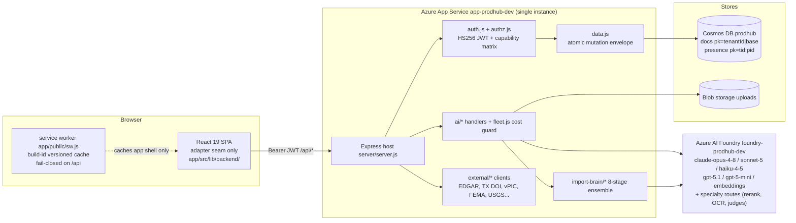
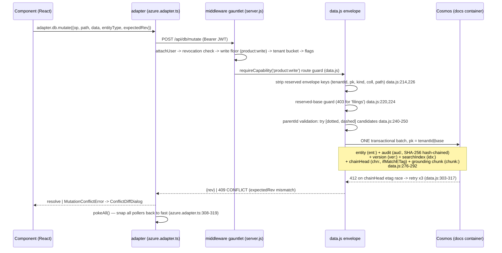

# ARCHITECTURE — Product Reinvention Hub (reverse-engineered at post-cleanse sha `d28c8a1`)

> Part of the `docs/reveng/` dossier (P-REVENG). Every factual claim carries a `file:line`
> reference into the tree at `d28c8a1` (branch lineage: `feat/import-concept-linker` + cleanse
> commits). Where something was verified by RUNNING it, the evidence is quoted inline.
> ASCII text; diagrams are mermaid.
>
> IMPORTANT TREE NOTE: at the time of writing, `origin/main` and this tree have DIVERGED
> (20 commits each way, verified via `git rev-list --count`). `origin/main` additionally
> carries the P3 Duck Creek XML export rebuild (`eab0c6d`) and the P4 history+integrity wave
> (`aa3eb5d`, merged at `d3deee9`) which are NOT described here. The concept-linker branch
> this dossier documents is NOT yet on `origin/main`.

## 1. What this is

A multi-tenant P&C insurance **product-definition platform**: product managers define
insurance products (coverages, forms, rules, rating algorithms) across 5 lines of business
(PH/PA/GL/IM/PR — `shared/src/insurance/lobRegistry.ts:430`), rate policies through a
deterministic evaluator (`shared/src/rating/evaluator.ts`), ingest carrier documents through
a multi-model AI "import brain" (`server/lib/import-brain/`), generate SERFF filing bundles
(`server/lib/serff.js`), and run grounded AI copilots over the portfolio.

**Monorepo shape** (pnpm; workspaces are ONLY `app` and `shared` — `pnpm-workspace.yaml:1-3`):

| Piece | What | Runtime |
|---|---|---|
| `app/` | React 19 / Vite SPA, single adapter seam | browser |
| `shared/` | pure-TS domain: types, rating, seed, fleet registry, ISO import mapper | bundled into both |
| `server/` | Express host: Cosmos + Foundry AI + Blob (NOT a pnpm workspace; own `npm install` — `azure-pipelines.yml:76-79`) | Azure App Service |
| `scripts/`, `tools/`, `tests/` | eval harnesses, gates, integration tests | dev/CI |

`functions/` (the retired Firebase implementation) was **removed by the cleanse**
(commit `52a0253` "remove functions/", archived to `hub-archive/2026-07-16` per
`CLEANSE_MANIFEST.md` in the main tree). Comments referencing `functions/src/...` in
server files (e.g. `server/lib/import-brain/stage6-reconcile.js:7`) are historical
port-provenance notes, not live imports.

## 2. Container view

One origin serves everything. The browser only ever talks to same-origin `/api/*`
(`app/src/lib/backend/azure.adapter.ts:39-77`); it never holds a data-store or model
credential (secrets are `process.env` reads in `server/lib/*` only).



Key sources: containers `docs` + `presence` (`server/lib/cosmos.js:14-15`); the
`resolveTenantStore()` SILO_READY seam for future dedicated-container tenants
(`server/lib/cosmos.js:27-32`); the fleet registry `shared/src/ai/fleet.ts` bundled to
`server/lib/fleet-shared.cjs` and consumed by `server/lib/fleet.js`.

## 3. The middleware gauntlet (every /api/* request, in order)

All in `server/server.js`:

1. `app.disable('x-powered-by')` — `server/server.js:58`
2. **compression with SSE bypass** — `server/server.js:61-65`: any `text/event-stream`
   response (or Accept header) skips compression so import/chat progress streams live.
3. `express.json({ limit: '25mb' })` — `server/server.js:66`
4. `auth.attachUser` — `server/server.js:67`: Bearer or `pf_session` cookie -> `req.user`;
   JWT revocation check (jti denylist in Cosmos, 5-min in-memory cache,
   `server/lib/auth.js:161-179`).
5. Per-tenant request telemetry (in-process, fire-on-finish) — `server/server.js:73-81`.
6. **Auth floor + default-deny write gate** — `server/server.js:100-119`:
   - unauthenticated non-public `/api/*` -> 401; public surface is
     `/api/health`, `/api/auth/otp/*`, `/api/auth/bootstrap`, `/api/auth/tenants`,
     `/api/homecheck/*` (`server/server.js:91-96`).
   - every non-GET requires `product:write` UNLESS whitelisted:
     `WRITE_EXEMPT_PREFIX = ['/api/auth/','/api/admin','/api/tenant-admin','/api/filing','/api/serff','/api/portal']`,
     `WRITE_EXEMPT_EXACT = ['/api/db/list','/api/db/presence/watch']` (read-shaped POSTs),
     and read-only `/api/ai/*` calls; `AI_WRITE = {unifiedImport, reindexProduct}` remain
     write-shaped (`server/server.js:100-102,111-114`).
7. **Per-tenant token bucket** — `server/server.js:127-144`: burst 120 / 2 rps sustained on
   AI, filing, and mutate paths -> 429. Layered on top of per-IP login limiters.
8. **Feature-flag enforcement** — `server/server.js:162-174`: path->flag map, 403
   `feature_disabled`; fail-open on infra error; import deliberately not flag-gated.
9. Route mounts (section 5), then static SPA + wildcard fallback
   (`server/server.js:296-322`), then the 4-arg error handler with honest 413/400
   pass-through and no stack leak (`server/server.js:328-346`).
10. `app.listen(PORT)` — `server/server.js:349` (default PORT 8080).

## 4. Request lifecycle — a governed write



Realtime is **smart polling**, not a change feed: `subscribe()` polls with 3.5s->30s
geometric backoff, tab-hidden pause, request coalescing, and stale-while-revalidate cache
(`app/src/lib/backend/azure.adapter.ts:110-306`). A 401 anywhere triggers full local
sign-out + cache clear + `CLEAR_ALL_CACHES` message to the service worker
(`azure.adapter.ts:60-61,139-146`).

Reads: `GET /api/db/get`, `POST /api/db/list` (MAX_LIST=6000, cursor pages of 500) — both
`product:read` (`server/lib/data.js`). Every query filters `c.tenantId = @tid` and the
partition key is `${tenantId}|${baseKey(path)}` (`server/lib/data.js:44`), so tenant
isolation is partition + filter + server-stamped envelope, never client-supplied.

## 5. Route mounting order (server/server.js:193-289)

| Order | Mount | Guard floor |
|---|---|---|
| 1 | `/api/admin` (`server/server.js:194`) | `requirePlatform` (SUPER_ADMIN/SUPPORT) |
| 2 | `/api/tenant-admin` (`:202`) | `member:manage` + same-tenant |
| 3 | `/api/db` (`:210`) | `product:read` / `product:write` per route |
| 4 | `/api/ai` (`:218`) | `ai:invoke` + tenant; import also `product:write` |
| 5 | `/api/news/image/:hash` (`:226`) | auth |
| 6 | `/api/storage` (`:234`) | EDITOR upload, 15 MB cap |
| 7 | `/api/serff/v1` (`:244`) | EDITOR |
| 8 | `/api/filing` (`:256`) | `filing:generate` |
| 9 | `/api/portal` (`:271`) | `portal:*` caps only (POLICYHOLDER plane) |
| 10 | `/api/homecheck/v1` (`:289`) | none — per-IP limited, structurally zero portfolio access |

Every mount is wrapped in try/catch so a failed module load logs a warning but the host
still boots (pattern at `server/server.js:194-289`). Full route-by-route inventory:
[API_SURFACE.md](API_SURFACE.md).

## 6. Identity + two-plane authorization (summary)

- Hand-rolled HS256 JWT: HMAC recomputed, token `alg` header ignored, timing-safe compare,
  `exp` enforced (`server/lib/auth.js:119-127`); 8h TTL, `jti` for revocation
  (`auth.js:112-117`); `pf_session` HttpOnly/Lax cookie fallback (`auth.js:135-159`).
- OTP is the real login: email domain allowlist -> tenant map -> 6-digit OTP -> JIT-provision
  VIEWER (`auth.js:283-356`); bootstrap SUPER_ADMIN accounts exist only behind
  `BOOTSTRAP_USERS_ENABLED` + env passwords (`auth.js:92-106`).
- Capabilities, not ranks, are authoritative: matrix at `server/lib/authz.js:41-65`
  (tenant plane VIEWER + 5 inquiry personas read-only+ai; EDITOR adds writes;
  TENANT_ADMIN adds member/audit; consumer plane POLICYHOLDER holds only `portal:*`;
  platform plane SUPPORT/SUPER_ADMIN). Cross-tenant is SUPER_ADMIN-only via the
  `X-Tenant-Id` break-glass (`auth.js:486-488`). Details + re-verified findings:
  [SECURITY_TENANCY.md](SECURITY_TENANCY.md).

## 7. Push = deploy pipeline (azure-pipelines.yml)

```mermaid
flowchart LR
  P["push to main"] --> N["NodeTool 20.x<br/>azure-pipelines.yml:45-48"]
  N --> I["pnpm install<br/>:50-54"]
  I --> GL["gitleaks secret scan<br/>:56-62"]
  GL --> TC["pnpm -r typecheck<br/>:64-65"]
  TC --> CAN["shared tests = rating CANARIES<br/>$1,528 / $1,002 / $2,635<br/>:67-68"]
  CAN --> B["pnpm --filter app build<br/>:70-71"]
  B --> BB["bundle-size budget gate<br/>scripts/check-bundle-budget.mjs :73-74"]
  BB --> HD["npm ci --omit=dev --prefix server<br/>:76-79"]
  HD --> AS["assemble artifact: server.js + lib + node_modules + app/dist->public/<br/>:81-94"]
  AS --> ZIP["zip + publish<br/>:96-109"]
  ZIP --> DEP["AzureWebApp@1 -> app-prodhub-dev<br/>NODE 20-lts, node server.js<br/>:111-120"]
```



Facts a zero-context agent must know:

- **The deploy gate is NOT the local gate.** The pipeline runs typecheck + `@pf/shared`
  tests (the canaries) + bundle budget ONLY — lint, app tests, server tests and e2e are
  intentionally skipped for speed (`azure-pipelines.yml:13-15`). The full gate
  (`pnpm typecheck && pnpm lint && pnpm test && pnpm build`, runnable as
  `node scripts/ops/cleanse/gate.mjs`) is a local/PR discipline.
- gitleaks is invoked with `--log-opts="--all"` (`azure-pipelines.yml:61`) — full-history
  *intent*, but Azure DevOps' default shallow fetch means the scan effectively sees the tip
  tree; operational experience recorded elsewhere shows "1 commits scanned". Treat it as a
  tip-tree gate.
- `pnpm build` alone does NOT run the bundle-budget check locally; the pipeline does
  (`azure-pipelines.yml:73-74`). Run `node scripts/check-bundle-budget.mjs` explicitly
  before pushing UI chunks.
- Deploys restart the single instance: **in-flight SSE dies** (import runs continue
  headless server-side and persist durable results — see INGESTION_PIPELINE.md section on
  run recovery), and all in-memory state resets (section 8).
- Build stamping: `app/vite.config.ts` derives `__BUILD_ID__` from the git commit, writes
  `dist/version.json`, stamps `sw.js` -> drives PWA cache eviction + the VersionWatcher
  reload toast (`app/src/components/VersionWatcher.tsx:1-74`).

## 8. Single-instance constraints (the dominant scaling ceiling)

All of the following live in per-process memory and are correct only at ONE instance:

| State | Where | Failure at 2+ instances / on restart |
|---|---|---|
| Per-tenant token buckets | `server/server.js:127-144` | limits multiply per instance; restart = reset |
| Global AI spend window (1h) | `server/lib/fleet.js:74-99` | cap becomes "per instance since last recycle" |
| OTP store (10-min TTL) | `server/lib/otp.js` | verify fails when issued on another instance |
| JWT revocation cache (5-min) | `server/lib/auth.js:161-179` | fresh instance honors revoked tokens until cache warm |
| Request telemetry maps | `server/server.js:73-81` | split-brain metrics |

Per-tenant monthly metering is the exception — persisted to Cosmos `tenantMeter` docs
(`server/lib/metering.js`), so it survives restarts. The remediation path (Cosmos-with-TTL
backing) is a known, accepted backlog item (see RISK_REGISTER.md, carried from
Platform_Review F4).

## 9. Verified by running

- **Full gate on this exact tree** — `node scripts/ops/cleanse/gate.mjs` (the script wraps
  `pnpm typecheck && pnpm lint && pnpm test && pnpm build`, `scripts/ops/cleanse/gate.mjs:7-12`).
  Result: see the evidence block below (filled at Phase-2 verify; the cleanse commits it sits
  on were themselves gated green per their commit messages).
- **Local boot** — `server/server.js` booted with dummy env (`AUTH_JWT_SECRET`, dummy
  Cosmos endpoint) and probed at `GET /api/health`. Result: see evidence block below.

```text
BOOT EVIDENCE (run 2026-07-16, this tree, Node 24, dummy env:
  AUTH_JWT_SECRET=dummy COSMOS_ENDPOINT=https://localhost:1 PORT=18711):
  GET /api/health -> {"status":"ok"}
  boot log: all 10 mounts logged —
    /api/admin, /api/tenant-admin, /api/db (Cosmos), /api/ai (Foundry, configured=false),
    /api/news/image, /api/storage, /api/serff/v1, /api/filing, /api/portal, /api/homecheck/v1
GATE EVIDENCE: see the "GATE SUMMARY" block quoted in TEST_MAP.md (run on this tree
  during the Phase-2 verify loop).
```

## 10. Reading order for a zero-context agent

1. `CLAUDE.md` (repo root) — binding invariants; break one and the PR is blocked.
2. This file, then [INGESTION_PIPELINE.md](INGESTION_PIPELINE.md) (the platform's centerpiece).
3. `server/lib/data.js` — the atomic envelope is the heart of every write.
4. `shared/src/types.ts` — the domain, with [DATA_MODEL_DELTA.md](DATA_MODEL_DELTA.md) as the doc-vs-code reconciliation.
5. `orchestration.md` (repo root) — multi-agent coordination rules, hazards, and the push/deploy log.
