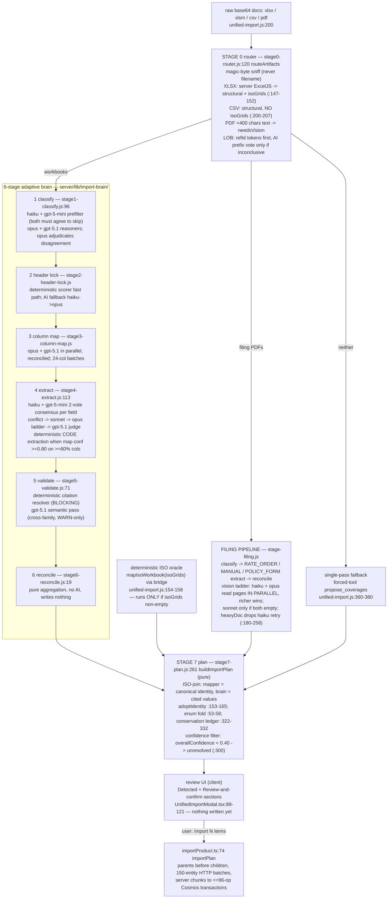

# INGESTION_PIPELINE — the import brain, concept linker, and both ingestion paths

> `docs/reveng/` dossier, tree `d28c8a1`. PRIOR ART: the import-brain diagnostic
> `artifacts/6_Documentation/REVERSE_ENGINEERING.md` (read-only pass on
> `feat/import-concept-linker`, in the untracked `artifacts/` library of the main checkout)
> already maps this subsystem at file:line depth. This doc does NOT redo that ground: it
> folds the diagnostic's confirmed material in WITH ATTRIBUTION (marked "[diagnostic]"),
> verifies a sample of its claims at THIS tree (section 11 — every sampled claim marked
> CONFIRMED-AT-HEAD or DRIFTED), and extends where the diagnostic stopped.
> The diagnostic ran on the same branch lineage as this tree (`feat/import-concept-linker`
> is NOT merged to `origin/main`; verified `git merge-base --is-ancestor` -> false), so its
> line numbers are current here unless marked DRIFTED.

## 1. Two paths, one front door [diagnostic, confirmed]

Both paths start at `app/src/import/UnifiedImportModal.tsx` and both **persist on the
client** through `adapter.db.mutate` — the server never writes the imported product.

- **Path 1 — client deterministic mapper** (`runImportXlsx`): browser ExcelJS
  (`app/src/lib/import/readWorkbook.ts:30-54`) -> `mapIsoWorkbook`
  (`shared/src/insurance/isoImport.ts:1990`) -> `importPlan`
  (`app/src/lib/import/importProduct.ts:74`) -> `adapter.db.mutate/mutateBatch`. No AI.
- **Path 2 — server import brain** (`runImport`): base64 docs -> `POST /api/ai/unifiedImport`
  (SSE, `server/lib/ai/unified-import.js:200`, requires `product:write`) -> stage 0 router ->
  6-stage AI brain -> deterministic ISO oracle join -> stage 7 plan -> `{t:'json', key:'bundle'}`
  over SSE -> same client `importPlan` persist.

The server runs the SAME `mapIsoWorkbook`/`conceptMatch` code as the browser via the
generated esbuild bridge `server/lib/import-brain-shared.cjs` (built by
`package.json` `build:import-brain` from `shared/src/import/brain-server-entry.ts`) —
not a reimplementation. Rebuild + commit the `.cjs` when `shared/src` changes.

## 2. Stage graph (owning file per stage)



Orchestrator for stages 1-6: `runAdaptiveImportBrain` (`server/lib/import-brain/index.js:55`),
which also emits the per-stage SSE events (section 8).

## 3. The deterministic concept linker + the fill-only AI overlay

The linker is the "what an analyst would resolve before any AI runs" layer, pure TS in
`shared/src/insurance/` (bundled to both browser and server):

- `isoImport.ts` — content-signature sheet routing (framework selected by counting real
  refId rows, `selectFrameworkSheet:466`), decoy/version-copy sheet skipping
  (`IGNORE_SHEET:444`, `DECOY_SHEET:447`, `VERSION_SUFFIX:449`), header-row alias scoring
  (`findHeaderRow:325`, first 20 rows, >=3 alias hits), column mapping with 0.5 fuzzy
  word-overlap fallback (`mapColumns:349-388`), stacked LD/RT table segmentation on marker
  rows (`parseLdTables:1308`, `parseRtTables:1379`), case-preserving docId mint
  (`dashId:311`).
- `coverageHierarchy.ts` — sub-coverage tree from three structural signals in precedence
  order: explicit sub-coverage field, refId segment-nesting, coverage-group name; orphans
  are PROMOTED to top level with an `orphan-promoted` warning, never dropped
  (`resolveCoverageHierarchy:85`).
- `conceptMatch.ts` — the concept linker proper: normalization pipeline (`norm/squish/
  stem/tokens:25-46`), domain code map BI/PD/CSL/UM/UIM (`COVERAGE_CODE_MAP:90-101`),
  abbreviation folds (`ABBREV_FOLD:66-75`), package-form links applied only when the
  file's own coverages reference the form (`PACKAGE_FORMS:110-116`), tiered
  coverage-name matching that returns `null` rather than guess (`matchCoverageByName:161`).

**The AI overlay contract** (endpoint `proposeMapping`, `server/lib/ai/index.js`): it is
**fill-only**. Provenance is a `LinkBasis` trichotomy stamped on every link
(`shared/src/types.ts:22`): `'given'` (verbatim in source) | `'derived'` (deterministic
concept match) | `'ai-proposed'`. The overlay may only extend the deterministic result —
every proposed refId must already exist in the deterministic model's id sets, and it can
never overwrite a `given`/`derived` link (`conceptMatch.ts:9-10` states the contract; the
sonnet proposer -> opus residual -> gpt-5.1 validator -> adversarial opus fallback chain is
the enforcement ladder). Signature-gating keeps GL/IM/PR imports **byte-identical** when a
workbook does not carry the un-keyed-reference-table signature that activates the linker.
Persisted linker fields (all optional, golden-invisible): `Rule.tableRefIds/
tableLinkBasis/resolvedCoverageRefId` (`types.ts:231-235`), `LDTable.kindHint/state/
coverageCodes/coverageRefIds/ruleRefIds/backLinkWas/mintedId/linkBasis`
(`types.ts:328-345`), `RatingStep.group*/ratePlaceholderRef` (`types.ts:270-279`),
`RatingProgram.ratingGroups` (`types.ts:300`).

CAVEAT (carried from the P-CLEANSE-era memory and the diagnostic's I.3): the overlay's
**live Foundry path has never been exercised end-to-end**; its behavior is code-verified
only. It is also NOT import-exempt from the cost guard (`server/lib/ai/index.js:36`
exempts only `unifiedImport`) — the diagnostic's A5 inconsistency, still true at HEAD.

## 4. Ensemble seams and why decorrelation matters

Design principle [diagnostic, confirmed]: wherever one model's output is checked, the
checker comes from a **different model family** (Anthropic vs OpenAI) so shared failure
modes cannot self-confirm.

| Seam | Primary | Check / escalation | Owning file |
|---|---|---|---|
| Stage-0 LOB assist | haiku | opus below confidence 0.6 | `stage0-router.js` |
| Stage-1 classify | opus + gpt-5.1 parallel reasoners; haiku + gpt-5-mini prefilter (both must agree to skip) | opus adjudicator on disagreement | `stage1-classify.js:96` |
| Stage-2 header | deterministic scorer | haiku, then opus | `stage2-header-lock.js` |
| Stage-3 column map | opus + gpt-5.1 parallel | reconcile pass | `stage3-column-map.js` |
| Stage-4 extract | haiku + gpt-5-mini (2 decorrelated votes/field) | sonnet -> opus ladder, then gpt-5.1 judge (must ground or answer "none") | `stage4-extract.js:113` |
| Stage-5 validate | deterministic citation resolver (BLOCKING) | gpt-5.1 semantic validator — deliberately non-Anthropic ("decorr. from BULK", `index.js:20`) | `stage5-validate.js:71` |
| Filing vision ladder | haiku + opus read PDF pages in parallel, richer result wins | sonnet only if both empty; `heavyDoc` drops haiku's empty-retry (saves a wasted whole-PDF re-read) | `stage-filing.js:180-258` |
| Concept-linker overlay | sonnet proposer (batch) | opus residual -> gpt-5.1 validator -> adversarial opus fallback | `server/lib/ai/index.js` (proposeMapping) |

Escalation machinery: `ESCALATION_LADDER = ['BULK_VERIFY','MID_REASONER','GROUNDED_CITED']`
(`server/lib/fleet-shared.cjs:145`); ladder walk with 404-rung skip and `onEscalation`
hook at `server/lib/import-brain/ai-call.js:199-221`; network retry (exponential backoff +
jitter on 408/429/5xx, Retry-After honored, 3 attempts, 120s timeout) at
`ai-call.js:47-69,129`. Real hand-offs emit the `brain:escalation` SSE event
(`unified-import.js:236-238`).

## 5. Grounding contract — where uncited items die IN CODE

- Workbook path: every stage-4 field must carry `{sheet, cell, verbatim}`; the stage-5
  **deterministic resolver** byte-compares strict fields (refId/number/parentId) against
  the authoritative grid and BLOCKS entities with invalid pointers
  (`stage5-validate.js:47-52,64-69` `blockEntity`).
- Filing path: citation-less items are filtered in the tool sanitizers —
  `...filter(c => c && c.name && c.citation)` (`stage-filing.js:204,221,251`), and the drop
  is TELEMETERED, not silent: `{t:'notice', kind:'citations-dropped'}`
  (`stage-filing.js:242-243`).
- Fallback path: "REQUIRED — proposals without a citation are discarded"
  (`unified-import.js:367` area, propose_coverages tool schema).
- Flag-not-invent: forced enums include `UNKNOWN`; `premiumGenerating: null` = "source
  silent" (`shared/src/types.ts:206`); refIds byte-for-byte, never model-minted; blank/TBD
  refIds -> `needsRefIdSynthesis=true` and a deterministic SYNTH mint downstream
  (`stage4-extract.js:165`, `stage7-plan.js:343,381` — `${prefix}.PROD.SYNTH001` /
  `${prefix}.PROG.SYNTH001`, prefix from the LOB registry, never from a model).
- Conservation: the plan carries ONE product and ONE rating program; every extra accepted
  entity of those kinds becomes a BLOCKING unresolved item with evidence, never a silent
  drop (`stage7-plan.js:322-332`). Placeholder-only rows route to unresolved
  (`PLACEHOLDER_RE`, `stage7-plan.js:267-271`).

## 6. Confidence math and conflict laddering

Constants (`server/lib/import-brain/constants.js:28-30`):
`CONFIDENCE_ACCEPT = 0.85`, `CONFIDENCE_REVIEW = 0.60`, `CONFIDENCE_DISCARD = 0.40`.

- Stage 4 runs two votes per field; `valuesAgree()` canonicalizes numerics (1,528 == 1528)
  and case (`stage4-extract.js:77-84`). Agreement boosts confidence; disagreement climbs
  the ladder ONCE per field, then the gpt-5.1 judge sees both candidates + source cells and
  picks only what grounds, or returns `"none"` -> importWarning + reviewFlag. Entity-kind
  disagreement is itself a conflict (reserved field `__kind`).
- Per-entity `overallConfidence` folds field confidences; stage 7 filters
  `< CONFIDENCE_DISCARD` to unresolved (`stage7-plan.js:300`); `reviewFlag` (low
  confidence, grounding failure, malformed output) feeds `rowsInReview`
  (`stage6-reconcile.js:29`) and the review UI's second section.
- The deterministic fast path (stage 4) activates when the locked column map has >=0.80
  confidence on >=60% of mapped columns AND the real grid is embedded: rows are extracted
  by CODE with AI cross-checks on 2 sample batches (`stage4-extract.js:41-43`).

## 7. Stage-7 join: identity vs values [diagnostic, confirmed + extended]

`buildImportPlan` (`stage7-plan.js:261`) treats the deterministic `isoPlan` as the
**canonical-identity oracle** (refId, docId, hierarchy, sibling order, state scopes,
formNumbers) and the brain as the **provenance source** (cited values, per-field
confidence). `adoptIdentity` (`stage7-plan.js:153-165`) overwrites the brain's docId with
the mapper's; joined entities carry `consensus:'iso-join'` (`:168`). Row-slice folding
(ledger F28): a formRule leftover whose refId already exists in the joined plan is folded
— array fields union, scalars gap-fill — instead of becoming a last-write-wins duplicate
(`stage7-plan.js:223-242`). Enum folding via `ENUM_FOLD` (`:53-58`).

## 8. SSE event protocol

Emitted at `server/lib/import-brain/index.js` (stage events) and
`server/lib/ai/unified-import.js` (run events):

| Event | Shape / where |
|---|---|
| stage progress | `{t:'tool', name:'brain:stage{N}:{name}', phase:'start'\|'end'\|'progress', summary}` (`index.js:34`) |
| `brain:input` | source metadata (`index.js:63`) |
| `brain:stage1..5` | per-stage payloads (classifiedSheets, headerLocks, columnMaps, {entityCount, flagged}, discrepancies) (`index.js:78-118`) |
| `brain:output` | summary counts (`index.js:126`) |
| `brain:spend` | `{spendUsd, calls, noCap, byDeployment}` (`index.js:137`) |
| `brain:escalation` | `{fromRole, toRole, deployment}` — only on a REAL ladder hand-off (`unified-import.js:236-238`) |
| `bundle` | the final ImportPlan bundle (`unified-import.js:195` area) |
| `run:id` / `run:persisted` | durable-run id + persistence receipt (F23) (`unified-import.js:213,218`) |
| `import:spend` | per-run spend telemetry (`unified-import.js:458`) |
| `token` | streaming tokens for the fallback path UI |
| notices / errors | `{t:'notice', level, kind, message}` / `{t:'error', message}` / `{t:'done'}` |
| heartbeat | raw `:hb\n\n` every 15s — Azure kills idle connections ~230s (`unified-import.js:224`) |

Client consumption: `app/src/import/unifiedImportClient.ts:97-138` (accumulates the
bundle, forwards every event to the opt-in AgentVisualizer, which renders ONLY live events
— no simulation, `app/src/import/AgentVisualizer.tsx:5-12`).

## 9. Parser limits (current, verified)

- Embed caps: `MAX_EMBED_ROWS = 2000`, `MAX_EMBED_COLS = 128` (exported from
  `shared/src/import/structure/modelBuilder` via `brain-server-entry.ts:14`). Rows past
  the cap ARE extracted via continuation windows; **columns past 128 are NOT extracted**
  (warned non-goal) — `stage0-router.js:289-292`. Wide state-banded matrices lose columns
  (Platform_Review E6 "wide-matrix recovery" remains open).
- Used-range bomb: bounded by `eachRow({includeEmpty:false})` on both paths
  (client `readWorkbook.ts:36-43`, server `workbook.js:107-114`) [diagnostic, confirmed:
  Property_RF "Rules Repository" reports 1,048,417 rows, real data ends at 1,609].
- Decompression: **unbounded** — 25 MB base64 bodies fully materialized by ExcelJS with no
  decompressed-size or cell-count ceiling (`workbook.js:87-96`); the zip-bomb DoS risk
  (Platform_Review F8/M2) is still open at HEAD.
- Timeouts: 120s per AI call, 3 attempts (`ai-call.js:47-69`); 300s vision-doc; the eval
  harness allows ~150 min per CORE stream (`scripts/import-eval.mts:54,336`).
- Batches: stage-3 24 cols; stage-4 20 rows (token-truncation -> recursive halving);
  stage-5 50 entities/call.
- Hidden sheets: excluded from AI extraction but FEED the deterministic ISO mapper
  (`stage0-router.js:154-157`).
- `.xls` (OLE2): still unrecognized — routes to `unknown` ("unrecognized container",
  `stage0-router.js:212-214`); the diagnostic's D5 said the PDF fallback was greedy —
  see section 11 (DRIFTED: it now lands in `unknown`, the safer outcome).

## 10. The docId minting map — CONFIRMED-AT-HEAD

I re-verified every site the diagnostic named, on this tree, by reading the lines:

| Site | Transform | `GL.COV.001` becomes | Status |
|---|---|---|---|
| client/mapper `dashId` — `shared/src/insurance/isoImport.ts:311` | `refId.replace(/\./g,'-')` case-preserving | `GL-COV-001` | **CONFIRMED-AT-HEAD** |
| server stage-7 `toDocId` — `server/lib/import-brain/stage7-plan.js:40-43` | `.toLowerCase().replace(/[^a-z0-9]+/g,'-')` | `gl-cov-001` | **CONFIRMED-AT-HEAD** |
| server fallback mint — `server/lib/ai/unified-import.js:374` | `.replace(/\./g,'-').toLowerCase()` | `gl-cov-001` | **CONFIRMED-AT-HEAD** |
| validator — `server/lib/data.js:240-250` | tries `[dotted, dashed]` candidates, **never lowercase** | — | **CONFIRMED-AT-HEAD** |
| masking join `adoptIdentity` — `stage7-plan.js:153-165` (`brainP.docId = isoP.docId ?? toDocId(isoP.refId)`) | ISO path adopts the case-preserving id | — | **CONFIRMED-AT-HEAD** |

Consequence [diagnostic C.1/C.2, mechanism confirmed at HEAD]: on any path where the ISO
oracle does not run — **CSV/text uploads (stage0 pushes CSV workbooks WITHOUT `isoGrids`,
`stage0-router.js:200-207`, vs the XLSX push which attaches them at `:152`; the oracle
gate is `Array.isArray(isoGrids) && isoGrids.length > 0`, `unified-import.js:154`) — and
for brain-only entities with no ISO counterpart**, children are minted lowercase while
`parentId` stays dotted-uppercase; the validator's two candidates both miss ->
`INVALID_PARENT` (HTTP 422) and the child is dropped. The live 422 reproduction remains
BY CONSTRUCTION, not observed (the diagnostic said so too) — this is the ranked-first
backlog item (BACKLOG_SEED.md item 1).

## 11. Diagnostic claim ledger (sampled at HEAD)

| # | Diagnostic claim | Status at d28c8a1 | Evidence |
|---|---|---|---|
| 1 | Three docId minters, two conventions; validator case-preserving only | **CONFIRMED-AT-HEAD** | table above |
| 2 | Refutation: multi-value cells are newline/semicolon-separated and `splitList` handles them, preserving form-number internal spaces | **CONFIRMED-AT-HEAD** | `isoImport.ts:166-168` split on `/[\n;,]+/` |
| 3 | Refutation: offset header rows handled | **CONFIRMED-AT-HEAD** | `findHeaderRow:325` scans first 20 rows; server `scoreHeaderCandidates` in stage 2 |
| 4 | Refutation: sentinel tokens handled | **CONFIRMED-AT-HEAD** | `PLACEHOLDER:146` + `clean():148` (mapper); `PLACEHOLDER_RE` `stage7-plan.js:267` (brain) |
| 5 | Refutation: stacked mini-tables segmented on marker rows | **CONFIRMED-AT-HEAD** | `parseLdTables:1308`, `parseRtTables:1379`, `detectReferenceTables:1587`; filing tables return SCHEMA + verbatim rowRegion, deterministic code parses rows (`stage-filing.js:95`) |
| 6 | Refutation: million-row used-range bounded | **CONFIRMED-AT-HEAD** | `readWorkbook.ts:36-43`, `workbook.js:107-114` |
| 7 | CSV pushed with no isoGrids -> oracle skipped | **CONFIRMED-AT-HEAD** (line moved within :200-207; CSV grids now normalize-parity via `extendTruncatedGrids` but still do NOT attach `isoGrids`) | `stage0-router.js:200-207` vs `:152`; `unified-import.js:154,287` |
| 8 | D5: `.xls` (OLE2) **misroutes to PDF vision** ("mediaType defaulting to application/pdf") | **DRIFTED (improved)** — an unrecognized container now routes to `unknown` with a warning, not to the filing/vision path | `stage0-router.js:212-214` |
| 9 | A5: `proposeMapping` not import-exempt from the cost ceiling | **CONFIRMED-AT-HEAD** | `server/lib/ai/index.js:36` exempts only `unifiedImport` |
| 10 | Stage-4 is ~90% of wall-clock; vision manuals re-read whole PDF per rung | **PARTIALLY DRIFTED** — the vision ladder now runs haiku+opus in parallel and `heavyDoc` drops haiku's empty-retry (commit `9372aa4`), so the "sequential rung re-reads" cost is reduced; page-range chunking (Platform_Review E2) is still NOT built | `stage-filing.js:180-258` |

**Drift list (complete):** claims 8 and 10 above are the only sampled drifts, both in the
direction of "already improved since the diagnostic". Everything else sampled is live.
The diagnostic's refutations (claims 2-6) are code defenses WITHOUT pinning tests in some
cases — they are recorded as LOCK CANDIDATES in [BACKLOG_SEED.md](BACKLOG_SEED.md).

## 12. Eval targets and the one live-visible gap

Harness: `scripts/import-eval.mts` — offline (default, re-parse + diff vs goldens, zero
model spend), `--live`, `--write-golden`, `--rescore`, `IMPORT_EVAL_RECOVER_RUN=<runId>`
(score a persisted bundle without re-buying the run). Gated metrics
(`scripts/lib/import-eval-metrics.mts`, locked by `tests/eval/import-eval-metrics.test.ts`):
F1 >= 0.95, numeric exact >= 0.98, citations = 1.0, fabricationExtraRate <= 0.02 live /
0.00 offline, parentResolutionRate == 1, parentEdgeRecall >= 0.98, formAttachmentRecall
>= 0.98. Latest committed results: offline 4/4 formats (GL/IM/PR/CORE) at F1 = 1.0, zero
fabrication.

**The GL `ldTableRefResolutionRate` 0.8 gap** — exact evidence,
`docs/audit/import_eval_results.json:89` onward:

```json
"ldTableRefResolutionRate": 0.8,   // ldRefWithRef 15, ldRefResolved 12
"sampleMisses": [
  {"kind":"rule","refId":"GL.RU.024","detail":"ldTableRef \"LDTable.122\" resolves to no extracted table"},
  {"kind":"rule","refId":"GL.RU.025","detail":"ldTableRef \"LDTable.123\" resolves to no extracted table"},
  {"kind":"rule","refId":"GL.RU.089","detail":"ldTableRef \"LDTable.058\" resolves to no extracted table"}
]
```

The metric is **report-only** today (`scripts/import-eval.mts:76,150`); root cause per
ledger PCM-A: stale numeric table refs in the SOURCE (a rule cites `LDTable.122` where the
real parsed table is `LDTABLE.119`); unresolvable refs are counted as
`danglingTableRefs`, never guessed — honest, but the 3 GL rules stay unlinked. Promoting
this to a gated metric + extending `matchRuleReferenceToTables` is Platform_Review E1,
still open at HEAD.

## 13. Failure-mode table

| What breaks | Where it surfaces | Current handling |
|---|---|---|
| CSV / brain-only child with dotted parentId, lowercase docId | client persist: HTTP 422 `INVALID_PARENT`, child silently absent from product | none — ranked item 1 in BACKLOG_SEED |
| Sheet named outside the mapper's regex list (e.g. SECURA "ISO TABLES") | `sheetsSkipped`; PR fidelity `rtTables=0, ldTables=0` (`docs/audit/fidelity/fidelity-pr.json`) | mapper is name-routed (`findSheet` `isoImport.ts:488`); server brain classifies by content, so path-2 recovers what path-1 loses [diagnostic D2] |
| >128 columns | `grid-truncated` warning; columns not extracted | warned non-goal (`stage0-router.js:289-292`) |
| Zip bomb / huge decompressed workbook | whole single-instance host | unguarded (`workbook.js:87-96`) — RISK_REGISTER |
| Idle SSE > ~230s on Azure | stream killed | `:hb` heartbeat every 15s |
| Deploy mid-run | `fetch: terminated` on client | run continues headless; durable result persisted; `IMPORT_EVAL_RECOVER_RUN` / `run:id` recovery (F23/F29) |
| Model rung missing in Foundry (e.g. sonnet 404) | escalation ladder | rung skipped, next rung tried (`ai-call.js:199-221`) |
| Uncited/ungrounded AI output | stage-5 resolver / filing sanitizers | blocked or dropped WITH notice (section 5) |
| Stale source table refs (LDTable.122) | eval `sampleMisses`; unlinked rules | dangling ref counted, never guessed (ledger PCM-A) |
| Placeholder/template rows | unresolved review lane | `PLACEHOLDER_RE` (`stage7-plan.js:267-271`) |
| Duplicate coverage refIds in source | kept-first + warning (`parseFramework:736`) | genuine source ambiguity, surfaced [diagnostic A3] |
| Blank template upload | EMPTY plan, zero fabrications | adversarial corpus locks this (hardening ledger) |

## 14. Run economics (pointer)

The CORE live run costs ~110 min / ~$70, ~90% of it stage-4 extraction; recovery-by-runId
means a severed run is recovered, not re-bought. Details in [PERF_COST.md](PERF_COST.md).
